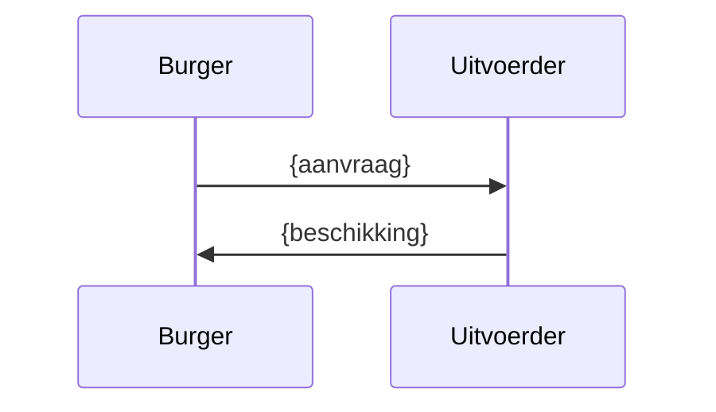

# {Titel} — cross-law diagram

*Mermaid-diagram dat een aspect van het corpus visualiseert. Kies het type dat past:
relatie-graph, cross-law-flow, procedure-lifecycle, of hook-leverancier.*

**Scope**: {welke wetten/artikelen} · **Datum**: {datum}

## Relatie-graph

```mermaid
graph TD
    {A}[{Wet A}]:::laag
    {B}[{Wet B}]:::laag
    {A} ==source==> {B}
    {A} -.grondslag.-> {B}
    {A} -->|overrides {output}| {B}
    {A} -.data.-> {B}
    classDef laag fill:#e8f4f8,stroke:#2a6ca8
```

**Legenda**: `==source==>` runtime data-call · `-.grondslag.->` legal_basis ·
`--overrides-->` betekenis-override · `-.data.->` impliciete data-dependency.

## Cross-law-flow (per scenario)

```mermaid
graph TD
    A[{startvraag}] --> B{ {beslis} }
    B -->|ja| C[{uitkomst}]
    B -->|nee| D[{andere uitkomst}]
```

## Procedure-lifecycle



## Toelichting

{Wat het diagram laat zien, welke YAML-elementen het weergeeft, en wat een lezer eruit
moet halen. Houd het diagram synchroon met de YAML's — bij wijziging: update of markeer
als verouderd.}
