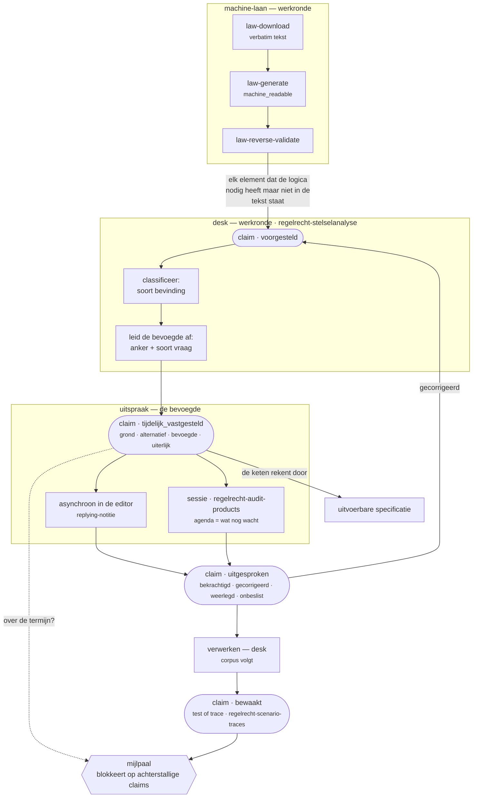

# Routing — de flow door een traject (canoniek)

Eén bron van waarheid voor hoe de skills samenhangen. Alle werk-skills verwijzen hierheen.
De kapstok — de cyclus met zijn vier momenten en de drie regels — staat in `../SKILL.md`; dit
blad tekent de flow en zegt wat er in welke richting stroomt.

## De flow

<!-- alt: Flow door een traject. Machine-laan: law-download → law-generate → law-reverse-validate, die claims in stand voorgesteld oplevert. Desk (regelrecht-stelselanalyse): classificeert het soort bevinding, leidt de bevoegde af, neemt claims over als tijdelijk vastgesteld; de keten rekent door. Uitspraak: de bevoegde spreekt asynchroon in de editor of in een sessie (regelrecht-audit-products) en zet de claim op uitgesproken. Verwerken: het corpus volgt; gecorrigeerd wordt een nieuw open punt. Mijlpaal: de poort blokkeert op achterstallige claims, anders wordt de claim bewaakt via regelrecht-scenario-traces. -->

Wat het diagram laat zien en de tabel in `../SKILL.md` niet: `gecorrigeerd` is geen eindpunt.
Het gaat terug naar het begin als een nieuw open punt — zo blijft de lus dicht, ook als de
bevoegde asynchroon sprak en er geen gesprek was.

## Elke skill bezit één overgang

| overgang | skill | actor |
|---|---|---|
| → `voorgesteld` | `law-reverse-validate` | model |
| → `tijdelijk_vastgesteld` | `regelrecht-stelselanalyse` | analist |
| → `uitgesproken` | editor (`replying`) · `regelrecht-audit-products` | de bevoegde |
| → `bewaakt` | `regelrecht-scenario-traces` | poort |

Geen skill kan twee stappen zetten. Dat is de actor-regel, niet als afspraak maar als gevolg
van wie welke skill draait.

## De router-taal: soort bevinding, en apart de bevoegde

Een bevinding krijgt een label dat zegt wat voor **soort** het is (definities in
`regelrecht-stelselanalyse/references/classification.md`). Het label bepaalt de actie. Wie
de bevinding mag **sluiten** is een tweede, onafhankelijke as — de trede — en die wordt
afgeleid, niet gekozen (zie `../SKILL.md`, *De escalatieladder ís de cyclus*).

| label | actie | landt in |
|---|---|---|
| **modellering-fout** | desk fixt de YAML | `modellering-fixes-plan` |
| **engine-limitatie** | desk trackt; engine-issue | `engine-limitaties` |
| **wetgevings-fout** | desk documenteert; de normsteller is bevoegd | `wetgevingsfouten-analyse` |
| **acceptabele untranslatable** | een claim met een bevoegde; rekent door als werkhypothese | de annotaties-sidecar |

De oude regel "feitelijk naar binnen, oordeel naar buiten" blijft waar, maar zegt nu iets
preciezers: een feitelijk defect sluit de desk zelf (trede 0–2); een oordeel wacht op een
uitspraak van de bevoegde (trede 3–4), asynchroon of in een sessie.

## Waar begin je

| situatie | start |
|---|---|
| geen corpus, of ruw | werkronde — `law-interpret` |
| corpus bestaat, ongevalideerd | werkronde — `regelrecht-stelselanalyse`: poorten, classificeren, claims overnemen |
| claims wachten op een uitspraak | de bevoegde in de editor; wat blijft liggen wordt de sessie-agenda |
| je mist domeinkennis of buy-in | een verkennende sessie, mag vroeg en zonder poort |
| na een uitspraak | werkronde — verwerken |
| mijlpaal in zicht | de poort, op een peildatum |

## De sessie — twee modi

- **Verkennend** — vroeg, zelfs op een ruwe scope-analyse. Domeinkennis ontginnen, praktijk
  ophalen, scope bekrachtigen. **Geen poort.**
- **Validerend** — de bevoegde spreekt zich uit over wat nog openstaat. **Poort:** schema
  valide, tests groen, modellering-fouten gefixt, en de resterende punten zijn oordeel — laat
  experts niet valideren wat onze eigen modelleerfout is.

## Wat stroomt welke kant op

**Werkronde → uitspraak**
- een corpus dat rekent, mét zijn werkhypothesen;
- de claims in `tijdelijk_vastgesteld`, elk met bevoegde en `uiterlijk` — dat is de agenda;
- de scope-analyse uit `cross-law-diagram` + `corpus-status`.

**Uitspraak → verwerken**
- `bekrachtigd` → de werkhypothese wordt lezing; een test of trace houdt haar vast;
- `gecorrigeerd` → nieuw open punt voor de desk, terug naar het begin;
- `weerlegd` → de invulling gaat eruit of wordt vervangen; het corpus volgt;
- `onbeslist_gelaten` (met reden) → blijft open, reist mee naar de volgende cyclus.

**Alles → mijlpaal**
- de poort telt: welke invullingen wijzen niet naar een claim, welke claims wachten nog, welke
  zijn over hun `uiterlijk` heen zonder uitstel met reden. Rood blokkeert; groen is een
  reductie op een peildatum.

## Gedeelde lagen

| laag | skill | gebruikt door |
|---|---|---|
| de vorm van een claim | `regelrecht-verantwoording` | elk moment |
| casuïstiek en ketens | `regelrecht-scenario-traces` | werkronde (`engine-tests`), sessie (`testcase-scenarios`), mijlpaal (`bewaakt`) |

Geen van beide is een fase. Je pakt ze zodra ze nodig zijn, in welke fase dan ook.
