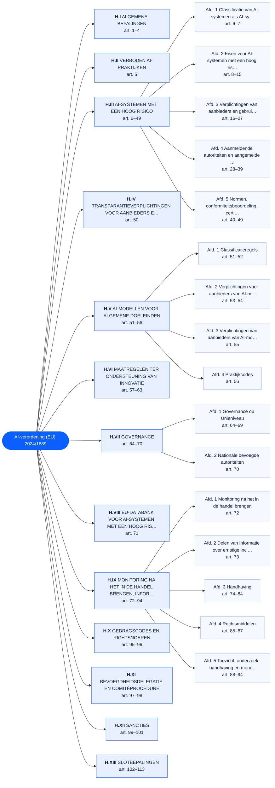
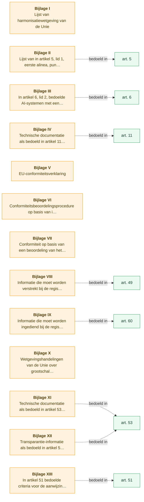

# AI-verordening (EU) 2024/1689 — interne structuur

Stelsel-graaf van de opbouw van de verordening, gegenereerd uit het corpus-bestand
[`2024-08-01.yaml`](./2024-08-01.yaml) (bron: EUR-Lex, authentieke NL-tekst).
113 artikelen in 13 hoofdstukken (16 afdelingen) + 13 bijlagen.

## Hoofdstukken en afdelingen

## Bijlagen en de artikelen waarop ze betrekking hebben

Bijlagen zijn in het corpus als pseudo-artikelen opgenomen (`number: 'Bijlage III'`),
omdat het schema (nog) geen aparte `annexes`-sectie kent. De stippellijnen tonen het
artikel dat naar de bijlage verwijst (afgeleid uit de bijlage-ondertitel).

