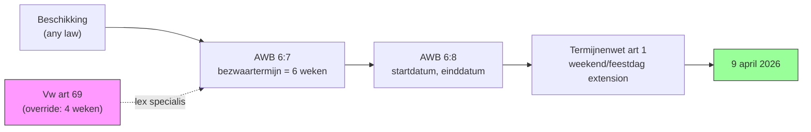
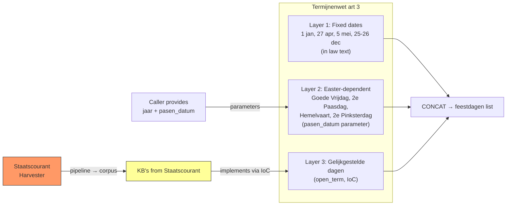
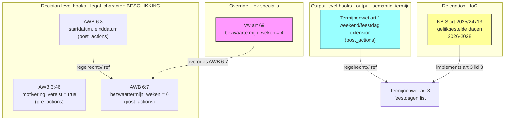
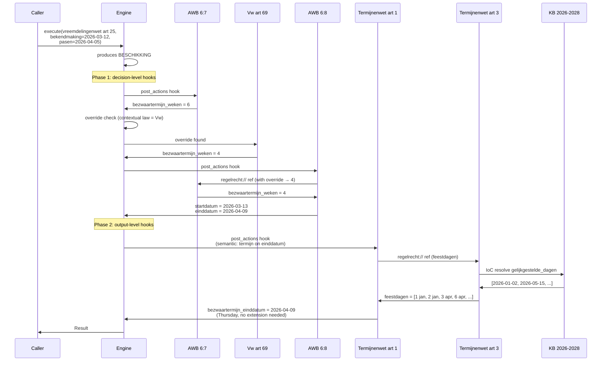

# RFC-011: Temporal Computation and Calendar-Aware Execution

**Status:** Draft
**Date:** 2026-03-19
**Authors:** Eelco Hotting

> **Note:** This RFC is under active research. It emerged from analyzing the complete bezwaartermijn calculation chain and identifies concepts needed for date-aware law execution. RFC-008 (hooks) and RFC-009 (overrides) are prerequisites.

## Context

The engine currently produces scalar results: numbers, booleans, strings. But a large class of legal questions produces *dates*. "When is my deadline for bezwaar?" is not answered by "6 weeks" — it is answered by "9 april 2026."

Computing that date requires a chain of four articles across three laws:



Each article does one thing. No bilateral coupling. The chain uses hooks (RFC-008), overrides (RFC-009), IoC (RFC-007), and cross-article references — all mechanisms already designed. But the engine lacks the *types and operations* to express this chain.

### The bezwaartermijn chain in detail

When a citizen receives a beschikking, the deadline for bezwaar is determined by:

1. **AWB 6:7** — "De termijn bedraagt zes weken." Sets the duration.
2. **AWB 6:8 lid 1** — "De termijn vangt aan met ingang van de dag na die waarop het besluit is bekendgemaakt." Computes the start and end date from the duration and the bekendmaking date.
3. **Algemene Termijnenwet artikel 1** — "Een termijn die op een zaterdag, zondag of algemeen erkende feestdag eindigt, wordt verlengd." Adjusts the end date for weekends and public holidays.
4. **Algemene Termijnenwet artikel 3** — Defines the public holidays (feestdagen), including fixed dates, Easter-dependent dates, and discretionary "gelijkgestelde dagen" from Koninklijke Besluiten.

A specific law may override step 1: the Vreemdelingenwet artikel 69 says "in afwijking van artikel 6:7 bedraagt de termijn vier weken" (RFC-009 override).

### What the engine cannot express today

- **Dates as values.** Parameters and outputs are numbers, booleans, or strings. There is no `type: date`.
- **Date arithmetic.** No operations for adding days/weeks to a date, constructing a date from components, or checking the day of the week.
- **Lists as values.** The feestdagen calendar is a list of dates. There is no `type: list`.
- **Semantic output categories.** The Termijnenwet hooks on "any termijn output", not on a specific decision type. The current hook filter (`applies_to`) only matches on `legal_character` and `decision_type`.
- **Trigger-parameterized hooks.** The Termijnenwet adjusts any termijn regardless of its name. Current hooks produce fixed, named outputs.

### Design principle

**Zero domain knowledge in the engine.** All legal and domain knowledge comes from law YAML files and parameters. The engine provides pure operations (date arithmetic, list manipulation). It does not know about Easter, Koningsdag, or feestdagen — these are all expressed in law or supplied as parameters.

## Decision

Introduce date types, date arithmetic operations, list types, semantic output annotations, and trigger-parameterized hooks. These additions enable the engine to compute concrete dates from legal rules without embedding domain knowledge.

### 1. Date as first-class type

Add `type: date` for parameters and outputs. Values are ISO 8601 format (`YYYY-MM-DD`).

```yaml
parameters:
  - name: bekendmaking_datum
    type: date
    required: true
output:
  - name: bezwaartermijn_einddatum
    type: date
```

The engine already has `calculation_date` for temporal filtering. This extends date-awareness to law-declared values.

### 2. Date arithmetic operations

All operations are pure functions. No domain knowledge.

| Operation | Input | Output | Example |
|-----------|-------|--------|---------|
| `DATE_ADD` | date + days/weeks | date | `2026-03-12 + 4 weeks → 2026-04-09` |
| `DATE` | year + month + day | date | `DATE(2026, 4, 27) → 2026-04-27` |
| `DAY_OF_WEEK` | date | number (0=mon..6=sun) | `DAY_OF_WEEK(2026-04-27) → 0` |
| `NEXT_WORKING_DAY` | date + list of dates | date | advances past weekends + listed dates |

`NEXT_WORKING_DAY` takes a date and a list of non-working dates. If the date is a Saturday, Sunday, or in the list, it advances to the next day that is none of those. The engine does not know what "feestdagen" are — it just skips dates in the provided list. Weekends (Saturday and Sunday) are implicit because the Termijnenwet always includes them (artikel 1).

### 3. List type and operations

Add `type: list` for outputs that are collections.

| Operation | Input | Output |
|-----------|-------|--------|
| `LIST` | items | list |
| `CONCAT` | multiple lists | merged list |

Needed for the feestdagen calendar. A law article can construct a list from computed items and merge lists from different sources.

### 4. Semantic type on outputs

Outputs get an optional `semantic` annotation alongside their data `type`:

```yaml
output:
  - name: bezwaartermijn_einddatum
    type: date
    semantic: termijn
```

Hooks can match on `output_semantic` — a new filter dimension independent of the decision-level filters:

```yaml
hooks:
  - hook_point: post_actions
    applies_to:
      output_semantic: termijn    # fires on ANY termijn output
```

| Filter | Level | Source |
|--------|-------|--------|
| `legal_character` | Decision | `produces` block |
| `decision_type` | Decision | `produces` block |
| `output_semantic` | Output | `output` declaration |

This is how the Termijnenwet hooks into any law that produces a termijn, regardless of whether the decision is a beschikking, a toekenning, or anything else.

### 5. Trigger-parameterized hooks

For generic hooks that operate on any matching output:

| Variable | Meaning |
|----------|---------|
| `$trigger_output` | The value of the output that matched the hook filter |
| `$trigger_output_name` | The name of that output (so the hook can replace it) |

When an article produces multiple outputs with `semantic: termijn`, the hook fires once per matching output. Each termijn is independently adjusted.

### 6. Feestdagen as harvested regulation

The feestdagen calendar in the Algemene Termijnenwet has three layers:



**Layer 1: Fixed dates** — Defined in the law text (art 3 lid 1). Modeled as `DATE` operations with the `jaar` parameter. Koningsdag has a Sunday-shift rule: when 27 april falls on Sunday, it is celebrated on Saturday 26 april. This is modeled as an `IF`/`DAY_OF_WEEK` expression in the law YAML — not as engine knowledge.

**Layer 2: Easter-dependent dates** — Goede Vrijdag, Tweede Paasdag, Hemelvaartsdag, Tweede Pinksterdag. All are fixed offsets from Easter Sunday. The engine receives `pasen_datum` as a parameter and computes offsets with `DATE_ADD`. The computus algorithm (how to determine Easter) is not in the engine — whoever calls the engine provides the date, same as `bekendmaking_datum`.

**Layer 3: Gelijkgestelde dagen** — Artikel 3 lid 3: "Wij kunnen bepaalde dagen voor de toepassing van deze wet met de in het eerste lid genoemde gelijkstellen." The Crown publishes Koninklijke Besluiten (KB's) in the Staatscourant, typically covering 2-3 years ahead (e.g., Stcrt. 2025, 24713 covers 2026-2028). These are discretionary government decisions — bridge days around holidays. Not algorithmically predictable.

This fits the existing architecture: `Staatscourant → Harvester → Pipeline → Corpus → Engine`. The KB's are modeled as regulations that `implement` Termijnenwet art 3's `open_term: gelijkgestelde_dagen` via IoC (RFC-007). Same pattern as BW5 art 42 with gemeente verordeningen.

### Interaction of mechanisms

The bezwaartermijn chain uses all four cross-law mechanisms working together:



### Full YAML example

#### AWB 6:7 — Duration

```yaml
# algemene_wet_bestuursrecht
- number: '6:7'
  text: |-
    De termijn voor het indienen van een bezwaar- of
    beroepschrift bedraagt zes weken.
  machine_readable:
    hooks:
      - hook_point: post_actions
        applies_to:
          legal_character: BESCHIKKING
    execution:
      output:
        - name: bezwaartermijn_weken
          type: number
          semantic: termijn
      actions:
        - output: bezwaartermijn_weken
          value: 6
```

#### AWB 6:8 — Start and end date

```yaml
- number: '6:8'
  text: |-
    1. De termijn vangt aan met ingang van de dag na die
    waarop het besluit op de voorgeschreven wijze is
    bekendgemaakt.
  machine_readable:
    hooks:
      - hook_point: post_actions
        applies_to:
          legal_character: BESCHIKKING
    execution:
      parameters:
        - name: bekendmaking_datum
          type: date
          required: true
      input:
        - name: bezwaartermijn_weken
          source: regelrecht://algemene_wet_bestuursrecht/bezwaartermijn_weken#value
      output:
        - name: bezwaartermijn_startdatum
          type: date
        - name: bezwaartermijn_einddatum
          type: date
          semantic: termijn
      actions:
        - output: bezwaartermijn_startdatum
          value:
            operation: DATE_ADD
            date: $bekendmaking_datum
            days: 1
        - output: bezwaartermijn_einddatum
          value:
            operation: DATE_ADD
            date: $bekendmaking_datum
            weeks: $bezwaartermijn_weken
```

#### Termijnenwet art 3 — Feestdagen

```yaml
# algemene_termijnenwet
- number: '3'
  text: |-
    1. Algemeen erkende feestdagen in de zin van deze wet zijn:
    de Nieuwjaarsdag, de Christelijke tweede Paas- en Pinksterdag,
    de beide Kerstdagen, de Hemelvaartsdag, de dag waarop de
    verjaardag van de Koning wordt gevierd en de vijfde mei.
    2. Voor de toepassing van deze wet wordt de Goede Vrijdag met
    de in het vorige lid genoemde dagen gelijkgesteld.
    3. Wij kunnen bepaalde dagen voor de toepassing van deze wet
    met de in het eerste lid genoemde gelijkstellen.
  machine_readable:
    open_terms:
      - id: gelijkgestelde_dagen
        type: list
        required: false
        delegated_to: kroon
        delegation_type: KONINKLIJK_BESLUIT
        legal_basis: artikel 3 lid 3 Algemene termijnenwet
        default:
          actions:
            - output: gelijkgestelde_dagen
              value: []

    execution:
      parameters:
        - name: jaar
          type: number
          required: true
        - name: pasen_datum
          type: date
          required: true
          description: Eerste Paasdag voor het betreffende jaar
      output:
        - name: feestdagen
          type: list
      actions:
        # Koningsdag: 27 april, shift to 26 if Sunday
        - output: koningsdag
          value:
            operation: IF
            when:
              operation: EQUALS
              subject:
                operation: DAY_OF_WEEK
                date: { operation: DATE, year: $jaar, month: 4, day: 27 }
              value: 6    # Sunday
            then: { operation: DATE, year: $jaar, month: 4, day: 26 }
            else: { operation: DATE, year: $jaar, month: 4, day: 27 }

        # Fixed dates (lid 1)
        - output: vaste_feestdagen
          value:
            operation: LIST
            items:
              - { operation: DATE, year: $jaar, month: 1, day: 1 }      # Nieuwjaarsdag
              - $koningsdag
              - { operation: DATE, year: $jaar, month: 5, day: 5 }      # Bevrijdingsdag
              - { operation: DATE, year: $jaar, month: 12, day: 25 }    # Eerste Kerstdag
              - { operation: DATE, year: $jaar, month: 12, day: 26 }    # Tweede Kerstdag

        # Easter-dependent dates (lid 1 + lid 2)
        - output: paas_feestdagen
          value:
            operation: LIST
            items:
              - { operation: DATE_ADD, date: $pasen_datum, days: -2 }   # Goede Vrijdag
              - { operation: DATE_ADD, date: $pasen_datum, days: 1 }    # Tweede Paasdag
              - { operation: DATE_ADD, date: $pasen_datum, days: 39 }   # Hemelvaartsdag
              - { operation: DATE_ADD, date: $pasen_datum, days: 50 }   # Tweede Pinksterdag

        # Merge all layers
        - output: feestdagen
          value:
            operation: CONCAT
            lists:
              - $vaste_feestdagen
              - $paas_feestdagen
              - $gelijkgestelde_dagen
```

#### KB gelijkgestelde dagen 2026-2028

```yaml
# kb_gelijkgestelde_dagen_2026_2028
- number: '1'
  text: |-
    Als feestdag in de zin van de Algemene termijnenwet worden
    aangewezen: 2 januari 2026, 15 mei 2026, 7 mei 2027,
    28 april 2028 en 26 mei 2028.
  machine_readable:
    implements:
      - law: algemene_termijnenwet
        article: '3'
        open_term: gelijkgestelde_dagen
    execution:
      output:
        - name: gelijkgestelde_dagen
          type: list
      actions:
        - output: gelijkgestelde_dagen
          value:
            operation: LIST
            items:
              - '2026-01-02'
              - '2026-05-15'
              - '2027-05-07'
              - '2028-04-28'
              - '2028-05-26'
```

#### Termijnenwet art 1 — Weekend/feestdag extension

```yaml
- number: '1'    # algemene_termijnenwet
  text: |-
    Een in een wet gestelde termijn die op een zaterdag, zondag
    of algemeen erkende feestdag eindigt, wordt verlengd tot en
    met de eerstvolgende dag die niet een zaterdag, zondag of
    algemeen erkende feestdag is.
  machine_readable:
    hooks:
      - hook_point: post_actions
        applies_to:
          output_semantic: termijn
    execution:
      input:
        - name: feestdagen
          source: regelrecht://algemene_termijnenwet/feestdagen#value
      output:
        - name: $trigger_output_name
          type: date
      actions:
        - output: $trigger_output_name
          value:
            operation: NEXT_WORKING_DAY
            date: $trigger_output
            non_working_days: $feestdagen
```

#### Vreemdelingenwet art 69 — Override

```yaml
# vreemdelingenwet
- number: '69'
  text: |-
    1. In afwijking van artikel 6:7 van de Algemene wet
       bestuursrecht bedraagt de termijn vier weken.
  machine_readable:
    overrides:
      - law: algemene_wet_bestuursrecht
        article: '6:7'
        output: bezwaartermijn_weken
    execution:
      output:
        - name: bezwaartermijn_weken
          type: number
      actions:
        - output: bezwaartermijn_weken
          value: 4
```

### Walk-through

Scenario: citizen applies for a verblijfsvergunning. Decision announced Thursday 12 March 2026. Easter 2026 falls on 5 April.



Final result:
- `bezwaartermijn_weken: 4` (overridden by Vreemdelingenwet art 69)
- `bezwaartermijn_startdatum: 2026-03-13`
- `bezwaartermijn_einddatum: 2026-04-09` (Thursday, no extension)
- `motivering_vereist: true` (AWB 3:46 pre_actions hook)

*"U kunt tot en met 9 april 2026 bezwaar maken (artikel 69 Vreemdelingenwet, in afwijking van artikel 6:7 Awb)"*

#### Scenario 2: Deadline falls on a gelijkgestelde dag

- `bekendmaking_datum: 2026-04-03` (Friday)
- Contextual law: Participatiewet (no override, 6 weken)
- `einddatum = 2026-04-03 + 6 weeks = 2026-05-15` (Friday)
- 15 mei 2026 is a gelijkgestelde dag (KB Stcrt. 2025, 24713)
- `NEXT_WORKING_DAY(2026-05-15, feestdagen)` → 15 mei in list → try 16 mei (Saturday) → weekend → try 17 mei (Sunday) → weekend → try 18 mei (Monday) → clear
- `bezwaartermijn_einddatum: 2026-05-18`

The harvested KB changes the legal outcome. Without it, the deadline would be Friday 15 May. With the KB, it extends to Monday 18 May.

## Why

### Benefits

The engine can compute concrete dates from legal rules. A citizen asking "when is my deadline?" gets "9 april 2026", not "6 weeks." This is the answer that matters in practice.

All four cross-law mechanisms (hooks, overrides, IoC, references) compose naturally. The override propagates through the reference chain: when AWB 6:8 references AWB 6:7, the Vreemdelingenwet override applies automatically. No special wiring.

Zero domain knowledge in the engine. Easter is a parameter. Koningsdag's Sunday shift is an IF expression in the law YAML. Feestdagen are harvested regulations. The engine provides pure operations; laws provide the knowledge.

The feestdagen architecture fits the existing pipeline. KB's from the Staatscourant are regulations harvested and processed like any other. The IoC pattern from RFC-007 handles the open_term delegation from Termijnenwet art 3 lid 3 to the Crown's KB's.

### Tradeoffs

**New types and operations.** The engine needs `date` and `list` types, plus `DATE_ADD`, `DATE`, `DAY_OF_WEEK`, `NEXT_WORKING_DAY`, `LIST`, `CONCAT`. This is a significant expansion of the operation set.

**Semantic output annotations.** Adding `semantic` to outputs introduces a new dimension to the schema. The set of valid semantic values needs to be defined (initially just `termijn`, but others may follow).

**Trigger-parameterized hooks.** `$trigger_output` and `$trigger_output_name` are a new concept. They make hooks more powerful but also more complex to reason about.

**Hook ordering.** The walk-through implies decision-level hooks fire before output-level hooks within the same hook point. This ordering needs to be specified explicitly.

**Feestdagen require Staatscourant harvesting.** The gelijkgestelde dagen from KB's are not algorithmically predictable. The system needs to harvest KB's from the Staatscourant — a new source type for the pipeline.

### Alternatives Considered

**Alternative 1: Dates computed outside the engine**
- The engine outputs "6 weeks" and a separate service computes the date.
- Rejected: the Algemene Termijnenwet is law. Its rules are as much legal computation as any other article the engine executes. Pushing date computation out means the engine cannot answer the question citizens actually ask.

**Alternative 2: Easter as engine knowledge (computus)**
- The engine embeds the computus algorithm and computes Easter internally.
- Rejected: violates the zero-domain-knowledge principle. The computus is not in Dutch statute law. The engine should receive Easter as a parameter, same as any other external fact.

**Alternative 3: Feestdagen as engine configuration**
- A configuration file or database table lists feestdagen per year.
- Rejected: feestdagen are defined in law (Termijnenwet art 3). The gelijkgestelde dagen come from KB's — they are regulations. Treating them as configuration hides the legal source and makes the system non-transparent.

**Alternative 4: Termijnenwet hooks on legal_character**
- The Termijnenwet hooks on `legal_character: BESCHIKKING` instead of `output_semantic: termijn`.
- Rejected: legally imprecise. The Termijnenwet applies to any statutory term, not just beschikkingen. A beslistermijn (AWB 4:13) on a non-beschikking process also gets weekend extension.

### Implementation Notes

- `type: date` maps to `chrono::NaiveDate` in Rust. Already available in the engine via the `chrono` crate (used for `calculation_date`).
- `type: list` maps to `Vec<Value>` in Rust. Needs a new `Value::List` variant.
- `DATE_ADD`, `DATE`, `DAY_OF_WEEK` are straightforward `chrono` operations.
- `NEXT_WORKING_DAY` is a loop: while the date is Saturday, Sunday, or in the non_working_days list, advance by one day. Pure, deterministic, bounded (max 9 consecutive non-working days in practice).
- `LIST` and `CONCAT` are standard collection operations.
- `semantic` on outputs is a new field in the schema's output declaration. Indexed by `RuleResolver` for hook matching.
- Trigger-parameterized hooks require the engine to bind `$trigger_output` and `$trigger_output_name` when firing a hook that matched on `output_semantic`. The hook executes once per matching output.
- Hook ordering within a hook point: decision-level filters (`legal_character`, `decision_type`) fire first, then output-level filters (`output_semantic`). This is implicit in the filter dimensions — output-level hooks need outputs to exist before they can match.
- The Staatscourant KB's for gelijkgestelde dagen need a new source type in the harvester. The KB's are published at [zoek.officielebekendmakingen.nl](https://zoek.officielebekendmakingen.nl) and follow a predictable pattern (search for "Algemene termijnenwet" in Staatscourant publications).

## References

- RFC-007: Inversion of Control for Delegated Legislation
- RFC-008: Execution Lifecycle Hooks
- RFC-009: Lex Specialis Overrides
- AWB artikel 6:7: https://wetten.overheid.nl/BWBR0005537/2024-01-01#Artikel6:7
- AWB artikel 6:8: https://wetten.overheid.nl/BWBR0005537/2024-01-01#Artikel6:8
- Algemene termijnenwet: https://wetten.overheid.nl/BWBR0002448
- Algemene termijnenwet artikel 3: https://maxius.nl/algemene-termijnenwet/artikel3/
- Vreemdelingenwet artikel 69: https://wetten.overheid.nl/BWBR0011823/2024-01-01#Artikel69
- KB gelijkgestelde dagen 2026-2028: https://zoek.officielebekendmakingen.nl/stcrt-2025-24713.html
- KB gelijkgestelde dagen 2023-2025: https://zoek.officielebekendmakingen.nl/stcrt-2022-7812.html
