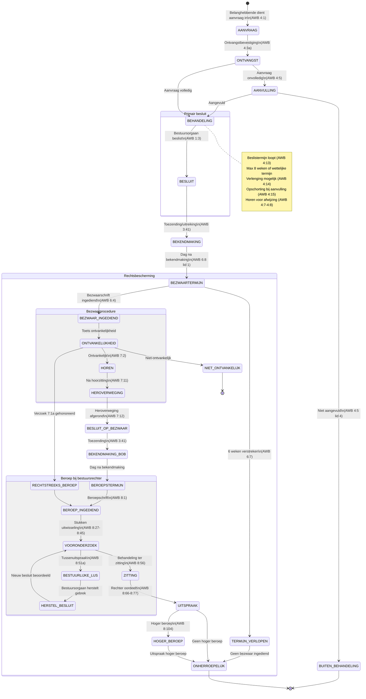
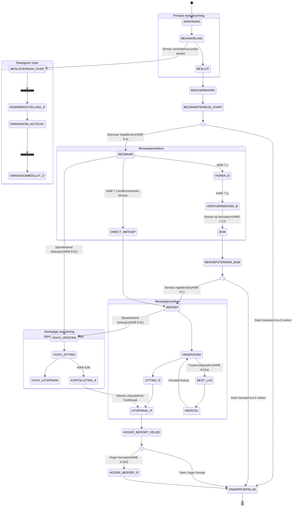
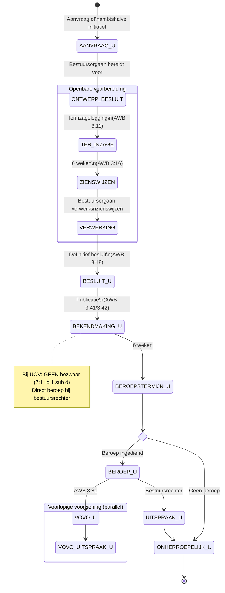
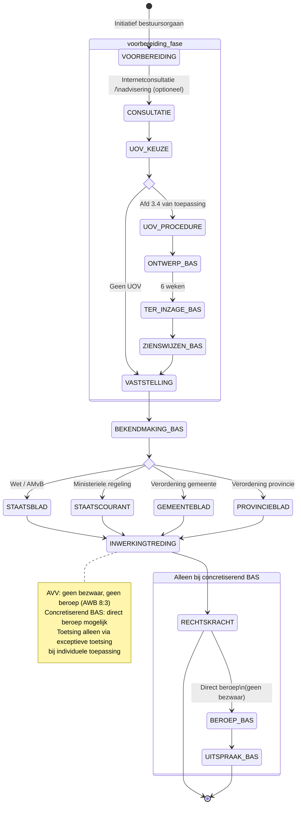

# RFC-012 Research: Parallel Stages in AWB Procedures

**Date:** 2026-03-21
**Purpose:** Research supporting RFC-012 (Lifecycle Stages for Administrative Decisions)

## Research Question

Is the AWB lifecycle for a beschikking strictly sequential, or do stages run in parallel? What are the different procedure types and how do their lifecycles differ?

---

## 1. Complete AWB Procedure Stages for a Beschikking

### 1.1 Primary Decision Phase (Primair Besluit)

| Stage | AWB Articles | Description |
|-------|-------------|-------------|
| **AANVRAAG** | 4:1-4:6 | Belanghebbende submits application. Must include name, address, date, indication of requested decision (4:2). |
| **ONTVANGSTBEVESTIGING** | 4:3a | Bestuursorgaan confirms receipt. |
| **AANVULLING** | 4:5 | If application is incomplete, bestuursorgaan gives opportunity to supplement. Can refuse to process if not supplemented. |
| **BEHANDELING** | 3:2, 4:7-4:12 | Investigation phase. Includes duty to hear applicant before rejection (4:7-4:8), advisory opinions (3:5-3:9). |
| **BESLISTERMIJN** | 4:13-4:15 | Decision must be made within statutory deadline, or within "reasonable period" (max 8 weeks). Can be extended with notification (4:14). Suspension possible when applicant must supplement (4:15). |
| **BESLUIT** | 1:3 | Bestuursorgaan takes the decision. Must include motivation (3:46-3:50). |
| **BEKENDMAKING** | 3:40-3:44 | Decision is communicated to applicant (by mail/delivery for beschikking). |

### 1.2 Dwangsom bij Niet-Tijdig Beslissen (Parallel Track)

| Stage | AWB Articles | Description |
|-------|-------------|-------------|
| **INGEBREKESTELLING** | 4:17 | If decision is late, applicant sends written notice of default. |
| **DWANGSOM_LOOPT** | 4:17 lid 1-3 | After 2 weeks from ingebrekestelling: dwangsom starts. EUR 23/day (days 1-14), EUR 35/day (days 15-28), EUR 45/day (days 29-42). Max 42 days. |
| **DWANGSOMBESLUIT** | 4:18 | Bestuursorgaan determines liability and amount within 2 weeks after last dwangsom day. This is itself a besluit, subject to bezwaar/beroep. |

This is a **parallel track**: the ingebrekestelling can be sent while BEHANDELING is still ongoing (once the beslistermijn has expired). The dwangsom runs concurrently with the ongoing decision procedure.

### 1.3 Bezwaar Phase (Rechtsbescherming)

| Stage | AWB Articles | Description |
|-------|-------------|-------------|
| **BEZWAARTERMIJN** | 6:7-6:8 | 6 weeks from day after bekendmaking. |
| **BEZWAAR_INGEDIEND** | 6:4-6:6 | Belanghebbende files bezwaarschrift with the bestuursorgaan. |
| **ONTVANKELIJKHEIDSTOETS** | 6:5-6:6 | Check: on time? Against a besluit? By belanghebbende? If manifestly inadmissible: can skip hearing (7:3 sub a). |
| **HOREN** | 7:2-7:9 | Hearing of bezwaarmaker and other belanghebbenden. Documents available 1 week before (7:4). Can be skipped in limited cases (7:3). |
| **HEROVERWEGING** | 7:11 | Full reconsideration of the original decision on its merits ("ex nunc"). |
| **BESLUIT_OP_BEZWAAR** | 7:12 | New decision replacing (or confirming) original. Must be motivated. Decision within 6 weeks (or 12 weeks with advisory committee, 7:10). |
| **BEKENDMAKING_BOB** | 3:41 | Besluit op bezwaar is communicated. Starts new beroepstermijn. |

### 1.4 Beroep Phase (Judicial Review)

| Stage | AWB Articles | Description |
|-------|-------------|-------------|
| **BEROEPSTERMIJN** | 6:7-6:8 | 6 weeks from day after bekendmaking of besluit op bezwaar. |
| **BEROEP_INGEDIEND** | 8:1 | Appeal filed with competent bestuursrechter. |
| **VOORONDERZOEK** | 8:27-8:45 | Court investigation: exchange of documents, possible expert opinion. |
| **ZITTING** | 8:56-8:65 | Court hearing. |
| **UITSPRAAK** | 8:66-8:77 | Court judgment: gegrond/ongegrond. Can annul decision, instruct new decision, or apply bestuurlijke lus. |

### 1.5 Hoger Beroep

| Stage | AWB Articles | Description |
|-------|-------------|-------------|
| **HOGER_BEROEP** | 8:104-8:108 | Appeal to Afdeling bestuursrechtspraak Raad van State, Centrale Raad van Beroep, or College van Beroep voor het Bedrijfsleven (depending on law area). 6 weeks. |

---

## 2. Parallel Tracks and Concurrent Stages

### 2.1 Voorlopige Voorziening (AWB 8:81-8:87) -- PARALLEL to bezwaar/beroep

The voorlopige voorziening is the most important parallel track. Key rules:

- **Connexiteitsvereiste** (8:81 lid 1): A voorlopige voorziening can only be requested if bezwaar or beroep has been filed (or simultaneously).
- **Runs parallel**: The voorlopige voorziening procedure runs concurrently with the bezwaar or beroep procedure. They are independent proceedings with the same judge.
- **Kortsluiting** (8:86): The voorzieningenrechter can, during the voorlopige voorziening hearing, immediately decide the main case (beroep) too. This collapses two parallel tracks into one.
- **Timing**: If bezwaar is decided before the voorlopige voorziening hearing, the request is converted to one connected to the subsequent beroep (8:81 lid 5).

**Conclusion for lifecycle model**: The voorlopige voorziening is a genuinely parallel track. It can be initiated at any point after bezwaar/beroep is filed and runs independently until resolved.

### 2.2 Ingebrekestelling/Dwangsom (AWB 4:17-4:20) -- PARALLEL to behandeling

- The dwangsom track activates when the beslistermijn expires without a decision.
- It runs **in parallel** with the ongoing behandeling -- the bestuursorgaan still has to decide, and the dwangsom accrues simultaneously.
- The dwangsombesluit (4:18) is itself a separate besluit with its own bezwaar/beroep lifecycle.

**Conclusion for lifecycle model**: The dwangsom is a parallel track triggered by a timeout on the primary decision. It produces its own sub-lifecycle.

### 2.3 Bestuurlijke Lus (AWB 8:51a-8:51d) -- PARALLEL to beroep

- During beroep, the court can issue a **tussenuitspraak** (interlocutory judgment) identifying a defect in the decision.
- The bestuursorgaan gets a deadline to repair the defect (by taking a new or amended decision).
- Meanwhile, the beroep procedure is **suspended** (not terminated).
- After repair (or failure to repair), the court resumes and issues the final uitspraak.

**Conclusion for lifecycle model**: The bestuurlijke lus is a loop within the beroep phase. The beroep is paused, a repair sub-process runs, and beroep resumes. It is sequential within beroep, not truly parallel.

### 2.4 Horen During Bezwaar -- Sequential, Not Parallel

The bezwaar procedure is internally sequential:
1. Ontvankelijkheidstoets
2. Stukken ter inzage (7:4, at least 1 week before hearing)
3. Horen (7:2)
4. Heroverweging (7:11)
5. Besluit op bezwaar (7:12)

The horen cannot happen while the heroverweging is ongoing -- the horen informs the heroverweging. However, the bestuursorgaan may conduct its own investigation concurrently with preparing for the hearing. The AWB does not prescribe a strict order between internal investigation and hearing, but the hearing must occur before the decision.

**Conclusion**: Within bezwaar, the stages are essentially sequential. The hearing and investigation may overlap in practice, but the hearing must precede the decision.

### 2.5 Bezwaar Filed During Original Decision Reconsideration

This does not happen. You cannot file bezwaar before the original besluit exists. The bezwaartermijn only starts after bekendmaking (6:8). A premature bezwaar is non-ontvankelijk, unless the besluit has been taken but not yet formally published (6:10).

### 2.6 AWB 6:19 -- Besluit Pending Bezwaar/Beroep

Article 6:19 addresses the situation where the bestuursorgaan takes a **new decision** (wijzigingsbesluit) while bezwaar or beroep against the original decision is still pending. The new decision is automatically included in the pending bezwaar/beroep procedure.

**Conclusion**: This is not parallelism of stages, but a mechanism for handling new decisions within an existing procedure track.

### 2.7 Rechtstreeks Beroep (AWB 7:1a) -- Skip Bezwaar

- The bezwaarmaker can request to skip bezwaar and go directly to beroep.
- The bestuursorgaan agrees if the case is suitable (typically: issues are clear, no factual disputes, parties have already exchanged views).
- If agreed, the bezwaarschrift is forwarded to the court as beroepschrift.

**Conclusion**: This is an alternative path (branch), not parallelism.

---

## 3. Uniforme Openbare Voorbereidingsprocedure (UOV, AWB Afdeling 3.4)

### When It Applies

The UOV applies when a specific law prescribes it, or when the bestuursorgaan voluntarily chooses to apply it (3:10). Common for: environmental permits, spatial planning decisions, complex infrastructure.

### UOV Lifecycle

| Stage | AWB Articles | Description |
|-------|-------------|-------------|
| **AANVRAAG** | 4:1 | Same as regular procedure. |
| **ONTWERP_BESLUIT** | 3:11 | Bestuursorgaan prepares draft decision and makes it available for inspection. |
| **TER_INZAGE** | 3:11-3:14 | Draft and supporting documents available for 6 weeks. Published in Staatscourant/gemeenteblad. |
| **ZIENSWIJZEN** | 3:15-3:17 | Anyone (not just belanghebbenden) can submit views during the 6-week period. Oral or written. |
| **BESLUIT** | 3:18 | Final decision, taking zienswijzen into account. Must respond to zienswijzen in motivation (3:46). |
| **BEKENDMAKING** | 3:41-3:44 | Decision published. |

### Key Difference from Regular Procedure

When the UOV applies, **bezwaar is excluded** (7:1 lid 1 sub d). The rechtsbescherming path goes directly to **beroep** (usually at Afdeling bestuursrechtspraak Raad van State for spatial/environmental cases).

The UOV replaces the "horen before rejection" phase (4:7-4:8) with a more elaborate public consultation (zienswijze) phase.

---

## 4. Besluit van Algemene Strekking (BAS) Lifecycle

A besluit van algemene strekking (e.g., verordening, beleidsregel, ministeriele regeling) has a fundamentally different lifecycle:

### BAS Lifecycle

| Stage | Articles | Description |
|-------|----------|-------------|
| **VOORBEREIDING** | Various | May include UOV (afdeling 3.4), consultation rounds, internet consultation, advisory bodies (e.g., Raad van State for wetten/AMvB). |
| **VASTSTELLING** | Organic law | Decision-making body adopts the regulation (gemeenteraad, minister, etc.). |
| **BEKENDMAKING** | 3:42 | Publication in official gazette: Staatscourant (ministeriele regelingen), Staatsblad (wetten/AMvB), gemeenteblad/provincieblad (decentraal). |
| **INWERKINGTREDING** | Various | Effective date, usually specified in the regulation itself or per KB. |

### Key Differences from Beschikking

1. **No aanvraag**: A BAS is not "applied for" by a belanghebbende (though citizens can petition).
2. **No bezwaar**: AWB 8:3 lid 1 sub a excludes bezwaar and beroep against algemeen verbindende voorschriften (AVVs). Against other BAS types (concretiserende besluiten van algemene strekking), beroep is possible.
3. **No individual bekendmaking**: Publication is in official gazettes, not individual notification.
4. **Rechtsbescherming via exceptieve toetsing**: AVVs can be challenged indirectly when applied in individual cases (via onverbindendverklaring).

### BAS Sub-types

| Sub-type | Bezwaar? | Beroep? | Example |
|----------|----------|---------|---------|
| Algemeen verbindend voorschrift (AVV) | No | No (8:3) | Wet, AMvB, verordening |
| Beleidsregel | No | No (8:3) | Beleidsregel toeslagen |
| Concretiserend BAS | No bezwaar | Yes (direct beroep) | Bestemmingsplan, verkeersbesluit |

---

## 5. Mermaid State Diagrams

### 5.1 Beschikking Lifecycle (Complete)

### 5.2 Parallel Tracks (Focused Diagram)

```mermaid
stateDiagram-v2
    state "Hoofdprocedure" as hoofd {
        direction LR
        BEHANDELING --> BESLUIT
        BESLUIT --> BEKENDMAKING
        BEKENDMAKING --> BEZWAAR
        BEZWAAR --> BESLUIT_OP_BEZWAAR
        BESLUIT_OP_BEZWAAR --> BEROEP
        BEROEP --> UITSPRAAK
    }

    state "Parallel: Dwangsom (AWB 4:17-4:20)" as dwangsom {
        direction LR
        BESLISTERMIJN_VERSTREKEN --> INGEBREKESTELLING
        INGEBREKESTELLING --> WACHTTIJD_2W: 2 weken wachten
        WACHTTIJD_2W --> DWANGSOM_LOOPT: EUR 23-45/dag
        DWANGSOM_LOOPT --> DWANGSOMBESLUIT: Max 42 dagen\nof besluit genomen
    }

    state "Parallel: Voorlopige Voorziening (AWB 8:81)" as vovo {
        direction LR
        VERZOEK_VOVO --> BEHANDELING_VOVO
        BEHANDELING_VOVO --> UITSPRAAK_VOVO
        BEHANDELING_VOVO --> KORTSLUITING: AWB 8:86\nOnmiddellijke uitspraak\nin hoofdzaak
    }

    state "Bestuurlijke Lus (AWB 8:51a)" as lus {
        direction LR
        TUSSENUITSPRAAK --> HERSTELTERMIJN
        HERSTELTERMIJN --> NIEUW_BESLUIT
        NIEUW_BESLUIT --> TERUG_NAAR_BEROEP
    }

    note right of hoofd
        Sequential main track
    end note

    note right of dwangsom
        Activates when beslistermijn expires
        Runs parallel to BEHANDELING
        Produces own beschikking lifecycle
    end note

    note right of vovo
        Activates after bezwaar or beroep filed
        Runs parallel to bezwaar/beroep
        Connexiteitsvereiste (8:81)
    end note

    note right of lus
        Activates during beroep
        Beroep is suspended (not parallel)
        Court resumes after repair
    end note
```

### 5.3 Beschikking Lifecycle with Parallel Tracks (Combined)

### 5.4 UOV Procedure (Afdeling 3.4)

### 5.5 Besluit van Algemene Strekking Lifecycle

---

## 6. Summary of Findings

### 6.1 The Main Lifecycle Is Sequential

The primary beschikking lifecycle (aanvraag -> behandeling -> besluit -> bekendmaking -> bezwaar -> beroep) is **strictly sequential**. Each stage depends on the completion of the previous stage. You cannot have bekendmaking before besluit, you cannot have bezwaar before bekendmaking, etc.

Within the bezwaar phase, the sub-stages (ontvankelijkheid -> horen -> heroverweging -> besluit op bezwaar) are also sequential.

### 6.2 Three Genuinely Parallel Tracks

Three mechanisms can run **in parallel** with the main lifecycle:

1. **Dwangsom bij niet-tijdig beslissen (AWB 4:17-4:20)**: Activated when the beslistermijn expires. Runs parallel to the ongoing behandeling. Produces its own sub-lifecycle (the dwangsombesluit is itself a beschikking).

2. **Voorlopige voorziening (AWB 8:81-8:87)**: Activated after bezwaar or beroep is filed. Runs parallel to the bezwaar/beroep procedure. Can collapse into the main track via kortsluiting (8:86).

3. **Besluit op bezwaar pending new decision (AWB 6:19)**: If the bestuursorgaan takes a new decision while bezwaar/beroep is pending, the new decision is incorporated into the pending procedure.

### 6.3 One Loop Within the Sequential Track

The **bestuurlijke lus (AWB 8:51a-8:51d)** is not a parallel track but a loop within the beroep phase. The court identifies a defect, gives the bestuursorgaan time to fix it, and then resumes. The beroep is suspended during repair.

### 6.4 Alternative Paths (Branches, Not Parallel)

Two mechanisms create **alternative paths** through the lifecycle:

1. **Rechtstreeks beroep (AWB 7:1a)**: Skips bezwaar entirely and goes directly to beroep. This is a branch, not parallelism.

2. **UOV (AWB afd. 3.4)**: Replaces the regular preparation phase with a public consultation procedure and eliminates bezwaar. Direct beroep after bekendmaking.

### 6.5 Implications for RFC-012

The current RFC-012 models the lifecycle as a linear sequence of stages. This is **mostly correct** for the main track. However, the model should account for:

1. **Parallel tracks** as separate lifecycles that can be spawned from the main lifecycle (dwangsom, voorlopige voorziening). These are not stages in the main lifecycle but concurrent processes with their own stages.

2. **Branching** at the bezwaar/beroep decision point (regular bezwaar vs. rechtstreeks beroep).

3. **The bestuurlijke lus** as a loop within the beroep stage (return to an earlier state for repair).

4. **Different lifecycle templates** for different procedure types:
   - `beschikking` -- regular procedure (aanvraag -> bezwaar -> beroep)
   - `beschikking_uov` -- with UOV (aanvraag -> zienswijze -> direct beroep)
   - `besluit_algemene_strekking` -- BAS (vaststelling -> publicatie -> inwerkingtreding)

5. **Nested lifecycles**: The besluit op bezwaar is itself a besluit that enters its own lifecycle (with its own bekendmaking, and possibility of beroep). RFC-012 already notes this in open question 2.

### 6.6 Recommendation for the Lifecycle Model

The lifecycle should be modeled as:

- **Sequential main track**: the stages in the `stages` array remain ordered and sequential.
- **Parallel tracks**: a new concept `parallel_tracks` that can be activated by conditions (e.g., `beslistermijn_verstreken` triggers the dwangsom track, `bezwaar_ingediend` enables voorlopige voorziening).
- **Branches**: the `stages` support conditional transitions (e.g., after BEKENDMAKING, go to either BEZWAAR or DIRECT_BEROEP based on procedure type or applicant choice).
- **Loops**: the bestuurlijke lus is a transition from within BEROEP back to a repair stage and then forward again.

This keeps the core model simple (sequential stages) while acknowledging the AWB's actual complexity where needed.

---

## Sources

- [PG Awb - Artikel 4:17 (dwangsom)](https://pgawb.nl/pg-awb-digitaal/hoofdstuk-4/4-1-bijzondere-bepalingen-over-besluiten/4-1-3-beslistermijn/4-1-3-2-dwangsom-bij-niet-tijdig-beslissen/artikel-417/)
- [PG Awb - Artikel 8:81 (voorlopige voorziening)](https://pgawb.nl/pg-awb-digitaal/hoofdstuk-8/8-3-voorlopige-voorziening-en-onmiddelijke-uitspraak-in-de-hoofdzaak/artikel-881/)
- [PG Awb - Artikel 8:86 (kortsluiting)](https://pgawb.nl/pg-awb-digitaal/hoofdstuk-8/8-3-voorlopige-voorziening-en-onmiddelijke-uitspraak-in-de-hoofdzaak/artikel-886/)
- [PG Awb - Bestuurlijke lus (8:51a-8:51d)](https://pgawb.nl/pg-awb-digitaal/hoofdstuk-8/8-2-behandeling-van-het-beroep/8-2-2a-bestuurlijke-lus/)
- [PG Awb - Afdeling 3.4 UOV](https://pgawb.nl/pg-awb-digitaal/hoofdstuk-3/3-4-uniforme-openbare-voorbereidingsprocedure/)
- [PG Awb - Artikel 7:1a (rechtstreeks beroep)](https://pgawb.nl/pg-awb-digitaal/hoofdstuk-7/7-1-bezwaar-voorafgaand-aan-beroep-bij-de-administratieve-rechter/artikel-71a/)
- [PG Awb - Artikel 7:11 (heroverweging)](https://pgawb.nl/pg-awb-digitaal/hoofdstuk-7/7-1-bijzondere-bepalingen-over-bezwaar/artikel-711/)
- [PG Awb - Artikel 3:42 (bekendmaking BAS)](https://pgawb.nl/pg-awb-digitaal/hoofdstuk-3/3-6-bekendmaking-en-mededeling/artikel-342/)
- [Rechtspraak bestuursrecht - Artikel 8:81 voorlopige voorziening](https://rechtspraakbestuursrecht.nl/artikel-881-awb-voorlopige-voorziening/)
- [Rechtspraak bestuursrecht - Artikel 7:2 horen](https://rechtspraakbestuursrecht.nl/artikel-72-awb-horen-bezwaar/)
- [Stibbe - FAQ bestuurlijke lus](https://www.stibbe.com/nl/publications-and-insights/faq-de-bestuurlijke-lus)
- [Stibbe - FAQ bezwaar- en beroepsprocedure duur](https://www.stibbe.com/publications-and-insights/faq-hoe-lang-duurt-een-bestuursrechtelijke-bezwaar-en-hoger)
- [Wikipedia - Bezwaarprocedure](https://nl.wikipedia.org/wiki/Bezwaarprocedure)
- [Wikipedia - Besluit (AWB)](https://nl.wikipedia.org/wiki/Besluit_(Algemene_wet_bestuursrecht))
- [BKHF - Beslistermijnen](https://www.bkhf.nl/binnen-welke-termijn-moet-de-overheid-beslissen/)
- [BKHF - AVV, BAS, beschikking](https://www.bkhf.nl/6-begrippen-avvs-besluiten-en-beschikkingen/)
- [Vijverberg - Rechtstreeks beroep](https://www.vijverbergadvocaten.nl/publicaties/rechtstreeks-beroep-bestuursrechter)
