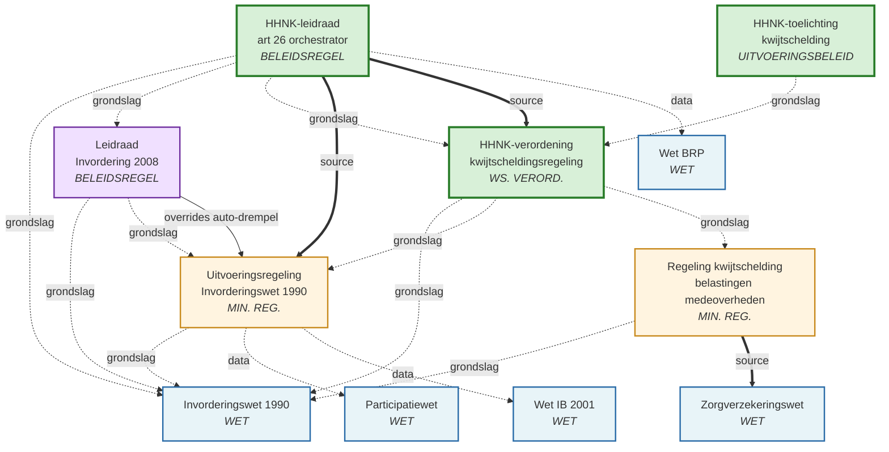

# HHNK-kwijtschelding — scope-analyse en wet-graph

*Te gebruiken in Deel 1 van de workshop 2026-04-23 (Scope bekrachtigen).
Open in Obsidian — de `mermaid`-graph en `[ ]`-checkboxes renderen native.*

**Casus**: Hoogheemraadschap Hollands Noorderkwartier, machine-leesbare
orchestrator voor kwijtschelding waterschapsbelastingen.

**Scope-manifest**: `cases/hhnk-kwijtschelding/scope.yaml` — 11 wetten.

---

## Samenvatting in één oogopslag



**Legenda**:
- `==source==>` = executie-tijd data-call (formule A haalt waarde uit wet B)
- `-.grondslag.->` = `legal_basis` (juridisch fundament, geen runtime-dep)
- `--overrides-->` = B verandert betekenis van A's output
- `-.data.->` = impliciete parameter-dependency (BRP, Pw leveren data, niet formules)

---

## De 11 wetten — tabel

| # | Law-id | Laag | Rol in keten | YAML |
|---|---|---|---|---|
| 1 | `invorderingswet_1990` | WET | **Grondslag** art 26 (bij ministeriële regeling regels voor kwijtschelding) | `nl/wet/invorderingswet_1990/2023-05-01.yaml` |
| 2 | `uitvoeringsregeling_invorderingswet_1990` | MIN. REG. | **Kern-berekening** — vermogen (art 12), betalingscap (art 13), kostennorm (art 16), hoogte (art 11) | `nl/ministeriele_regeling/uitvoeringsregeling_invorderingswet_1990/2026-01-01.yaml` |
| 3 | `leidraad_invordering_2008` | BELEIDSREGEL | Rijksbeleid invordering, **override** auto-drempel (€3 350) en WSNP-interpretatie | `nl/beleidsregel/leidraad_invordering_2008/2026-01-01.yaml` |
| 4 | `regeling_kwijtschelding_belastingen_medeoverheden` | MIN. REG. | **Lokale afwijkingen** — AOW-netto berekening, kostennorm-percentage (art 8), open_term voor lokale keuzes | `nl/ministeriele_regeling/regeling_kwijtschelding_belastingen_medeoverheden/2022-09-17.yaml` |
| 5 | `participatiewet` | WET | **Data-bron** bijstandsnormen (art 21-24), echtgenoot-definitie (art 3) | `nl/wet/participatiewet/2022-03-15.yaml` |
| 6 | `zorgverzekeringswet` | WET | **Data-bron** inkomensafhankelijke bijdrage art 41 (voor AOW-netto) | `nl/wet/zorgverzekeringswet/2025-01-01.yaml` |
| 7 | `wet_inkomstenbelasting_2001` | WET | **Data-bron** voorlopige teruggaaf + kinderkorting (voor URI art 14) | `nl/wet/wet_inkomstenbelasting_2001/2025-01-01.yaml` |
| 8 | `wet_basisregistratie_personen` | WET | **Data-bron** BSN, leeftijd, huishoudtype → `is_pensioengerechtigd`, `huishoudtype` | `nl/wet/wet_basisregistratie_personen/2025-02-12.yaml` |
| 9 | `kwijtscheldingsregeling_waterschapsbelastingen_hhnk` | WS. VERORD. | **HHNK scope-check** (art 1 belastingsoort_in_scope, art 5 ondernemer) | `nl/waterschaps_verordening/hhnk/kwijtscheldingsregeling_waterschapsbelastingen/2023-01-01.yaml` |
| 10 | `leidraad_invordering_waterschapsbelastingen_hhnk` | BELEIDSREGEL | **HHNK-orchestrator** art 26 (kan/hoogte, uitsluitingsgronden) | `nl/waterschaps_verordening/hhnk/leidraad_invordering_waterschapsbelastingen/2026-02-07.yaml` |
| 11 | `toelichting_kwijtschelding_waterschapsbelasting_hhnk` | UITVOERINGSBELEID | **HHNK-toelichting** (informatief, geen formules) | `nl/uitvoeringsbeleid/hhnk/toelichting_kwijtschelding_waterschapsbelasting/2026-01-01.yaml` |

---

## Runtime-afhankelijkheden (source-calls in machine_readable)

Wie roept wie aan bij executie van de HHNK-kwijtschelding:

```
[#10] HHNK-leidraad 26
  │
  ├── source → #9  HHNK-verordening 1           (belastingsoort_in_scope)
  ├── source → #9  HHNK-verordening 5           (ondernemer_komt_in_aanmerking)
  ├── source → #2  URI art 12                    (vermogen_bedrag)
  ├── source → #2  URI art 13                    (betalingscapaciteit)
  ├── source → #2  URI art 11                    (aanwendbare_betalingscapaciteit)
  └── source → #2  URI art 11                    (hoogte_kwijtschelding)

[#4] Regeling medeoverheden 3
  └── source → #6  Zorgverzekeringswet art 41   (inkomensafhankelijke_bijdrage_maand → voor AOW-netto)
```

**Niet-source, wel data-provider** (via parameters die de caller moet invullen):
- #8 BRP → `bsn`, `huishoudtype`, `is_pensioengerechtigd`
- #5 Pw → `bijstandsnorm_*` (nu nog SHORTCUT in URI art 16, niet actieve source)
- #7 Wet IB → voorlopige teruggaaf/kinderkorting (optioneel, via URI art 14)

---

## Juridische afhankelijkheden (`legal_basis`)

Wie berust juridisch op wie. Dit is **geen** runtime-dep, maar geeft aan dat
wijzigingen in de grondslag de gelding van de regel kunnen raken.

```
HHNK-leidraad 26            → IW 1990 art 26  +  Leidraad 2008 art 26  +  HHNK-verordening 1
HHNK-verordening            → IW 1990 art 26  +  URI  +  Regeling medeoverheden
HHNK-toelichting            → HHNK-verordening
Regeling medeoverheden      → IW 1990 art 26
URI 1990                    → IW 1990 art 26
Leidraad Invordering 2008   → IW 1990  +  URI 1990
```

Iedereen berust direct of transitief op **Invorderingswet 1990 art 26** — de
delegatie-basis voor alle kwijtscheldingsregels.

---

## Override-relaties

Slechts één formele override in de keten:

| Override op | Output | Door | Nieuwe waarde |
|---|---|---|---|
| URI art 12 auto-drempel (€2 269) | `auto_als_vermogen` | Leidraad Invordering 2008 art 26.2.3 | **€3 350** |

**Werking**: engine resolvert de override automatisch — wanneer HHNK-leidraad
via URI art 12 vermogen berekent, krijgt de auto-drempel de Leidraad-2008-waarde.
Lex-pro-cive: burger-gunstiger dan de URI-basis.

---

## Clusters — drie lagen

### Laag A — Rijk: grondslag (formeel juridisch)
`invorderingswet_1990`
Art 26 lid 1: *"Bij ministeriële regeling worden regels gegeven voor gehele of gedeeltelijke kwijtschelding van rijksbelastingen."*
→ Niet zelf machine-leesbaar (alleen als `legal_basis`-doel).

### Laag B — Rijk: uitwerking
- `uitvoeringsregeling_invorderingswet_1990` — de ministeriële regeling. **Waar de kern-berekening leeft** (vermogen, bc, 80%, hoogte).
- `regeling_kwijtschelding_belastingen_medeoverheden` — afwijkingen voor decentrale overheden.
- `leidraad_invordering_2008` — rijksbeleidsregel (override auto-drempel).

### Laag C — HHNK: lokale uitvoering
- `kwijtscheldingsregeling_waterschapsbelastingen_hhnk` — verordening met scope-keuzes (welke belastingsoorten, ondernemer-regels).
- `leidraad_invordering_waterschapsbelastingen_hhnk` — **de orchestrator**. Pakt scope uit C, kern-berekening uit B, plaatst 9-grond OR van uitsluitingen eraan (g₁ₐ/g₁ᵦ/g₁ᵧ + g₂..g₇; de g₁-splitsing is een **pre-workshop voorstel** 2026-04-22, nog te bekrachtigen door experts).
- `toelichting_kwijtschelding_waterschapsbelasting_hhnk` — tekstuele toelichting, geen logica.

### Laag D — Data-bronnen (rijkswetten als parameter-bron, geen formules-in-keten)
- `wet_basisregistratie_personen` — persoonsgegevens (BSN, leeftijd, huishoudtype).
- `participatiewet` — bijstandsnormen, echtgenoot-definitie (nu nog SHORTCUT in URI).
- `zorgverzekeringswet` — inkomensafhankelijke bijdrage (Zvw art 41).
- `wet_inkomstenbelasting_2001` — voorlopige teruggaaf.

---

## Analyse — wat is cruciaal om te snappen

1. **Drie lagen, één entry-point**: de HHNK-leidraad art 26 is de **enige** ingang
   voor een HHNK-kwijtscheldingsbeschikking. Alle andere wetten worden daar
   ingepakt via `source:`-calls of zijn caller-parameters.

2. **De kern-berekening leeft in Rijk-regeling**: 80%-regel,
   vermogen-compositie, betalingscap-prognose — allemaal in URI 1990.
   HHNK herhaalt die niet (na refactor 2026-04-22). "Dichtbij de tekst" principe.

3. **HHNK's eigen bijdrage is smal**: scope (welke belastingsoort telt, welke
   ondernemers), 9 uitsluitingsgronden als OR (g₁ gesplitst in g₁ₐ/g₁ᵦ/g₁ᵧ als **voorstel**, nog te valideren in workshop), en orchestrator-AND. Alle
   *bedragen* en *percentages* komen uit URI.

4. **Data-bronnen zijn nog niet volledig gekoppeld**: Pw-bijstandsnormen
   zijn SHORTCUT in URI art 16 (2023-bedragen hardcoded). BRP levert
   impliciet `huishoudtype` via caller. Zvw art 41 alleen geraakt via Regeling
   medeoverheden voor AOW-netto — niet voor de normpremie van 26.2.19.

5. **Formele override-werking is beperkt tot auto-drempel**. Alle andere
   "HHNK-specifieke" bedragen (zoals 2026 normpremie €47/€106) worden nu
   als HHNK-leidraad-eigen `definitions` gezet — géén override op URI.

6. **Legal_basis is transitief naar Iw 1990 art 26**: elke wijziging op
   die grondslag raakt direct alle 10 andere. Art 26 zelf wijzigt zelden,
   maar kan bij politieke keuze (schuldenaanpak) verspringen.

---

## Scope-beslispunten voor workshop Deel 1

De dependency-graph roept concrete keuzes op die HHNK-experts moeten bekrachtigen:

| # | Keuze | Opties | Implicatie |
|---|---|---|---|
| S1 | 11 wetten voldoende, of ontbreekt er iets (bv. uitspraken Hoge Raad, Zorgverzekeringswet-wijzigingen)? | compleet / aanvullen | Toevoegen = nieuwe YAML + koppeling |
| S2 | Laag D (BRP/Pw/Zvw/Wet IB) als **data-bron** acceptabel, of moeten bepaalde bedragen via `source:` naar Laag D komen i.p.v. caller-parameter? | caller / source | `source` = strakker, maar afhankelijk van volledigheid van Laag-D-YAMLs |
| S3 | Scope-check #9 (HHNK-verordening art 1): dekt scope van **alle HHNK-belastingsoorten** die kwijtschelding kunnen krijgen? | ja / aanvullen | Nieuwe belastingsoort = uitbreiding YAML + BDD-test |
| S4 | Ondernemers-pad (HHNK-leidraad 26.3): **in scope** of buiten (particulier-only)? | in / buiten | Als buiten: MR-logica vereenvoudigt, BDD-scenarios schrappen |
| S5 | HHNK-toelichting (#11) — alleen informatief, dus geen MR nodig? | ja / nee | Huidige status: geen MR-blokken, alleen tekst |
| S6 | Regeling medeoverheden #4 (AOW-netto via Zvw): **vast onderdeel** of vervangen door caller-parameter? | source / caller | Source = strakker; maar Zvw-tarieven wijzigen jaarlijks, governance-vraag |

- [ ] **S1** — 11 wetten compleet? Notitie: —
- [ ] **S2** — Laag D-wetten via source of via parameter? Notitie: —
- [ ] **S3** — Scope-check dekt alle belastingsoorten? Notitie: —
- [ ] **S4** — Ondernemers-pad in/uit? Notitie: —
- [ ] **S5** — Toelichting zonder MR akkoord? Notitie: —
- [ ] **S6** — Regeling medeoverheden source of parameter? Notitie: —

---

## Demo-timing voor workshop

**Bij framing (0:00–0:05)**: projecteer de `mermaid`-graph (Obsidian rendert native in preview).

**Bij scope (0:15–0:45)**: loop de 3 lagen door, één per vraag:
- Laag A+B (Rijk): *"Dit is vaste grond, niet discussie-punt."* → volgende
- Laag C (HHNK): *"Dit zijn jullie eigen regels."* → S3+S4+S5 hier
- Laag D (data): *"Dit is waar de getallen vandaan komen."* → S2+S6 hier

**Als expert vraagt "waar zit deze wet in"**: toon de tabel — welke laag,
welke rol, waar ligt de YAML. Dat brengt discussie op concreet niveau.
