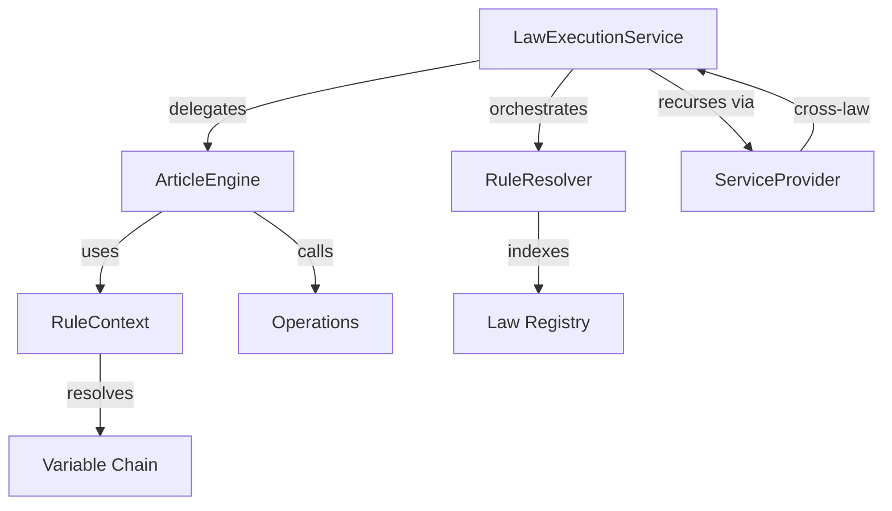
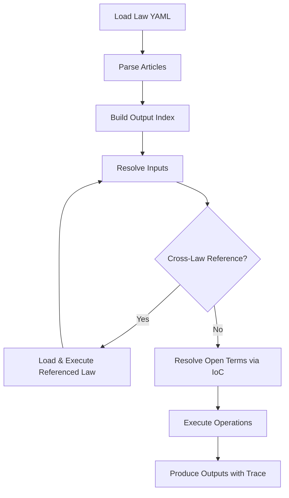

# Execution Engine

The execution engine is the core of RegelRecht: a deterministic Rust runtime that evaluates machine-readable Dutch law.

## Overview

- **Language**: Rust
- **Location**: `packages/engine/`
- **Targets**: Native (x86/ARM) and WebAssembly (browser/Node.js)
- **Key property**: Deterministic - same inputs always produce the same outputs

## Architecture

The engine has a layered architecture:



| Module | Purpose |
|--------|---------|
| `service.rs` | `LawExecutionService` - top-level API, cross-law orchestration |
| `engine.rs` | `ArticleEngine` - single article execution |
| `resolver.rs` | `RuleResolver` - law registry, output→article indexing, IoC lookup |
| `context.rs` | `RuleContext` - execution state, variable resolution with priority chain |
| `operations.rs` | 21 operation types (arithmetic, comparison, logical, conditional, date) |
| `uri.rs` | `regelrecht://` URI parsing for cross-law references |
| `trace.rs` | Execution tracing with box-drawing visualization |
| `priority.rs` | Lex superior / lex posterior resolution for competing implementations |
| `data_source.rs` | External data registry for non-law data lookups |
| `config.rs` | Security limits (max laws, YAML size, recursion depth) |

## How It Works



### Variable Resolution Priority

When the engine resolves a `$variable`, it checks these sources in order:

1. **Context variables** - `referencedate`, `referencedate.year`, etc.
2. **Local scope** - loop variables from `FOREACH`
3. **Outputs** - values calculated by previous actions in the same article
4. **Resolved inputs** - cached results from cross-law references
5. **Definitions** - article-level constants
6. **Parameters** - direct input parameters

## Multi-Output Evaluation

Articles can define multiple outputs (e.g., `heeft_recht_op_zorgtoeslag` and `hoogte_zorgtoeslag`). You can request several of them in one call.

### Privacy by Design

Callers must explicitly list the outputs they need. There's no "return all" mode. The engine returns requested outputs plus any causally-entailed outputs from hooks and overrides (a beschikking is legally indivisible — AWB consequences like motivering and bezwaartermijn cannot be stripped).

### Rust API

```rust
// Request multiple outputs
let result = service.evaluate_law(
    "zorgtoeslagwet",
    &["heeft_recht_op_zorgtoeslag", "hoogte_zorgtoeslag"],
    params,
    "2025-01-01",
)?;
// result.outputs contains the requested outputs + hook/override outputs
// result.output_provenance tags each output as Direct, Reactive, or Override

// Single-output convenience (equivalent to evaluate_law with one output)
let result = service.evaluate_law_output(
    "zorgtoeslagwet", "hoogte_zorgtoeslag", params, "2025-01-01",
)?;
```

If the requested outputs live in the same article, it runs once. Outputs from different articles trigger one execution per article, then merge.

### Output Provenance

Each output is tagged with how it was produced:

| Provenance | Meaning |
|------------|---------|
| `Direct` | Produced by the article's own actions |
| `Reactive` | Produced by a hook (e.g., AWB firing on BESCHIKKING) |
| `Override` | Produced by a lex specialis override (RFC-007) |

The `output_provenance` field appears in `ArticleResult`, WASM results, CLI output, and the Execution Receipt. It's omitted when empty (e.g., simple articles with no hooks).

### WASM API

```javascript
// Multiple outputs
const result = engine.executeMultiple(
    'zorgtoeslagwet',
    ['heeft_recht_op_zorgtoeslag', 'hoogte_zorgtoeslag'],
    { bsn: '999993653' },
    '2025-01-01'
);

// Single output (unchanged)
const result = engine.execute(
    'zorgtoeslagwet', 'hoogte_zorgtoeslag', params, '2025-01-01'
);
```

### CLI

```json
{
  "law_yaml": "...",
  "output_names": ["heeft_recht_op_zorgtoeslag", "hoogte_zorgtoeslag"],
  "params": { "bsn": "999993653" },
  "date": "2025-01-01"
}
```

The `output_name` (singular) field is still accepted for backwards compatibility.

## Operations

The engine supports 21 operations for expressing legal logic:

| Category | Operations |
|----------|-----------|
| **Comparison** | `EQUALS`, `NOT_EQUALS`, `GREATER_THAN`, `LESS_THAN`, `GREATER_THAN_OR_EQUAL`, `LESS_THAN_OR_EQUAL` |
| **Arithmetic** | `ADD`, `SUBTRACT`, `MULTIPLY`, `DIVIDE` |
| **Aggregate** | `MAX`, `MIN` |
| **Logical** | `AND`, `OR` |
| **Conditional** | `IF` (when/then/else), `SWITCH` (cases/default) |
| **Null checking** | `IS_NULL`, `NOT_NULL` |
| **Membership** | `IN`, `NOT_IN` |
| **Date** | `SUBTRACT_DATE` (with unit: days/months/years) |

See [RFC-004](/rfcs/rfc-004) for the full specification.

## Cross-Law Execution

Laws reference each other via `source` on input fields:

```yaml
input:
  - name: standaardpremie
    source:
      regulation: regeling_standaardpremie
      output: standaardpremie
      parameters:
        bsn: $bsn
```

The engine automatically loads the referenced law, executes it with the specified parameters, and caches the result. Circular references are detected and raise an error.

### Open Term Resolution (IoC)

Higher laws declare `open_terms` that lower regulations fill via `implements`. At execution time, the engine:

1. Indexes all `implements` declarations at law load time
2. Looks up implementations for each `open_term`
3. Filters by temporal validity (`calculation_date`) and scope (`gemeente_code`, etc.)
4. Resolves conflicts via **lex superior** (higher layer wins) then **lex posterior** (newer date wins)
5. Falls back to the `default` if no implementation found

See [RFC-003](/rfcs/rfc-003) for the full pattern.

## Execution Tracing

Every execution can produce a full trace tree showing how each value was computed:

```rust
let result = service.evaluate_law_with_trace(
    "zorgtoeslagwet",
    &["hoogte_zorgtoeslag"],
    params,
    "2025-01-01",
)?;

if let Some(trace) = result.trace {
    println!("{}", trace.render_box_drawing());
}
```

The trace includes: which articles were executed, which inputs were resolved (and from where), which operations ran, and the result of each step.

## WASM Usage

The engine compiles to WebAssembly for browser and Node.js execution.

### Browser

```javascript
import init, { WasmEngine } from 'regelrecht-engine';

await init();
const engine = new WasmEngine();

const lawId = engine.loadLaw(yamlString);
const result = engine.execute(
    lawId,
    'heeft_recht_op_zorgtoeslag',
    { BSN: '123456789', vermogen: 50000 },
    '2025-01-01'
);

console.log(result.outputs);
```

### Node.js

```javascript
import { initSync, WasmEngine } from 'regelrecht-engine';
import { readFileSync } from 'fs';

const wasmBuffer = readFileSync('./regelrecht_engine_bg.wasm');
initSync({ module: wasmBuffer });

const engine = new WasmEngine();
// Same API as browser
```

### WASM API

```typescript
engine.loadLaw(yaml: string): string
engine.execute(lawId, outputName, parameters, calculationDate): ExecuteResult
engine.executeWithTrace(lawId, outputName, parameters, calculationDate): ExecuteResultWithTrace
engine.executeMultiple(lawId, outputNames: string[], parameters, calculationDate): ExecuteResult
engine.executeMultipleWithTrace(lawId, outputNames: string[], parameters, calculationDate): ExecuteResultWithTrace
engine.registerDataSource(name, keyField, records): void
engine.clearDataSources(): void
engine.listLaws(): string[]
engine.getLawInfo(lawId): LawInfo
engine.hasLaw(lawId): boolean
engine.unloadLaw(lawId): boolean
engine.lawCount(): number
engine.version(): string
```

::: warning WASM Limitations
Open term resolution (`open_terms` / `implements` IoC pattern) is not yet available in the WASM build. Cross-law references work when all referenced laws are pre-loaded via `loadLaw()`.
:::

## Security Limits

The engine enforces compile-time security limits to prevent DoS:

| Limit | Value | Purpose |
|-------|-------|---------|
| `MAX_LOADED_LAWS` | 100 | Prevent memory exhaustion |
| `MAX_YAML_SIZE` | 1 MB | Prevent YAML bombs |
| `MAX_ARRAY_SIZE` | 1,000 | Prevent large array DoS |
| `MAX_RESOLUTION_DEPTH` | 50 | Internal reference nesting |
| `MAX_CROSS_LAW_DEPTH` | 20 | Cross-law reference nesting |
| `MAX_OPERATION_DEPTH` | 100 | Operation nesting |

## Execution Receipt

The engine can produce an Execution Receipt: a JSON document that captures everything needed to reproduce a specific execution result. The receipt includes `engine_version`, `schema_version`, and `regulation_hash` alongside the regular `ArticleResult` fields. This allows independent verification of past decisions.

Use `LawExecutionService.build_receipt()` to construct a receipt programmatically, or pass `--receipt` to the CLI (see below).

See [RFC-013](/rfcs/rfc-013) for the design rationale.

## CLI Tools

```bash
# Execute a law
cargo run --bin evaluate -- \
    corpus/regulation/nl/wet/zorgtoeslagwet/2025-01-01.yaml \
    heeft_recht_op_zorgtoeslag \
    --param bsn 999993653 \
    --param vermogen 50000

# Execute and output a full Execution Receipt as JSON
cargo run --bin evaluate -- \
    corpus/regulation/nl/wet/zorgtoeslagwet/2025-01-01.yaml \
    heeft_recht_op_zorgtoeslag \
    --param bsn 999993653 \
    --receipt

# Validate a YAML file against schema
cargo run --bin validate --features validate -- \
    corpus/regulation/nl/wet/zorgtoeslagwet/2025-01-01.yaml
```

## Performance

Benchmarks are available via:

```bash
just bench
```

Key benchmarks: URI parsing, variable resolution, operations, article evaluation, law loading, priority resolution, and end-to-end service execution.

## Further Reading

- [Law Format](/concepts/law-format) - structure of law YAML files
- [RFC-003: Inversion of Control](/rfcs/rfc-003) - open terms and delegation
- [RFC-004: Uniform Operations](/rfcs/rfc-004) - operation syntax
- [RFC-007: Cross-Law Execution](/rfcs/rfc-007) - hooks, overrides, and temporal computation
- [RFC-013: Execution Provenance](/rfcs/rfc-013) - reproducible execution and receipts
