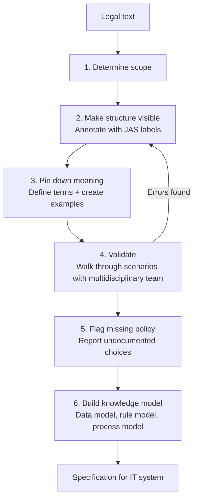
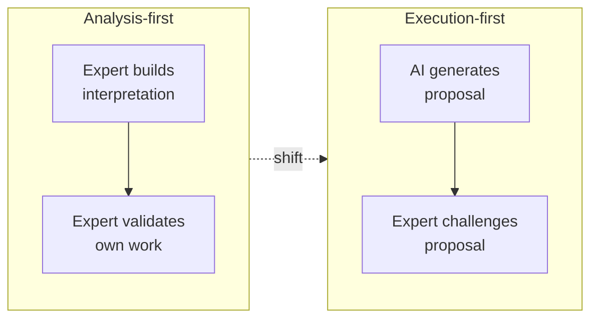
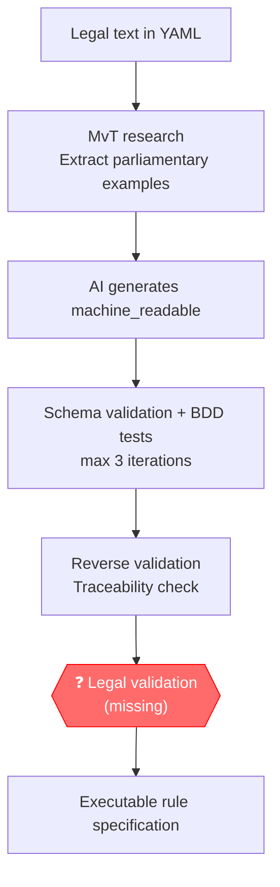
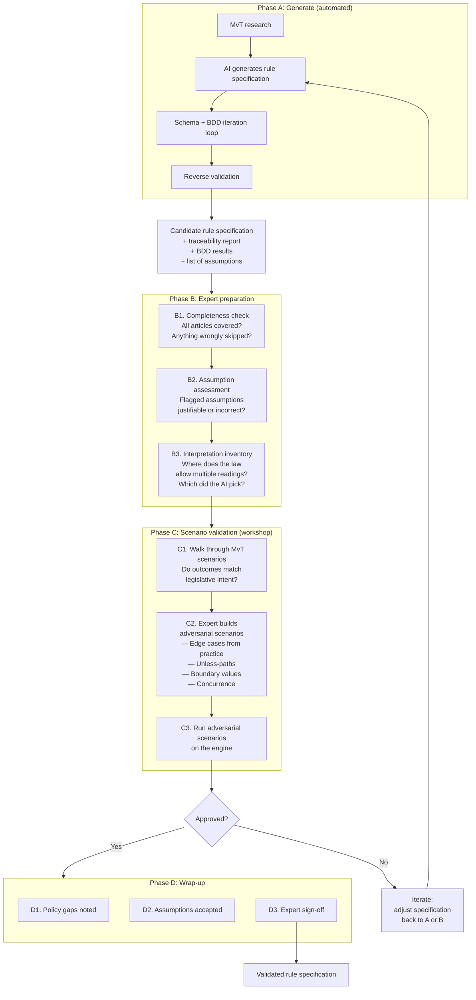
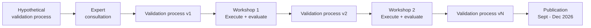

# RegelRecht Validation: From Analysis-First to Execution-First

## Problem statement

Turning law into working software is hard. For fifteen years, teams have worked in silos on methods, frameworks, and languages for formalizing legal rules. None of them scale.

This document traces the thread through those fifteen years, identifies the shift that RegelRecht makes, and proposes a validation method that fits the new way of working.

## Existing methods: an analysis-first tradition

### Wetsanalyse

Wetsanalyse is a legal analysis method developed in the practice of Dutch implementation agencies (Belastingdienst, UWV, DUO). The method is codified in the book *Wetsanalyse* (Ausems, Bulles & Lokin, 2021) and maintained by Lokin (Hooghiemstra & Partners) and Gort (ICTU).

The core of Wetsanalyse is the **Juridisch Analyseschema (JAS)**: a classification system of 13 element types that labels every formulation in legislation, from legal subject and legal relationship to derivation rule and condition.

The process has six steps:

Three characteristics define it:

1. **People do everything** — annotation, definition, modeling, and validation are all human work
2. **Validation checks your own work** — the multidisciplinary team reviews models it built itself
3. **Traceability is built in** — every element in the knowledge model points back to the source text in the law

The output is a knowledge model consisting of a data model (FBM/ER), rule model (DMN decision tables), and process model (BPMN). This model serves as the basis for building an IT system.

### Common ground across existing methods

Despite differences in terminology, existing methods follow the same pattern:

1. **Decomposition** — break the legal text into manageable units
2. **Identification** — recognize key concepts (who, what, when, what consequence)
3. **Interpretation** — explicitly record what the law means
4. **Modeling** — organize into data, rule, and process models
5. **Validation** — test against concrete scenarios and test cases
6. **Traceability** — trace every rule back to the source

All these methods are *analysis-first*: they start from the law and work toward a model or rule set. The translation is done entirely by people.

## RegelRecht: an execution ecosystem

RegelRecht is not just a method or a DSL. It is a broad execution ecosystem for making laws machine-executable. Three principles set it apart from the analysis-first tradition.

### Principle 1: Execution-first

Where existing methods share an analysis-first approach, RegelRecht aims to create a coherent system of machine-executable legislation. Laws interact across boundaries and citizens are not burdened with complexity.

The rule specification gets *single source of truth* status for how the law works. It is not an analysis layer that leads to a translation — the output of the analysis **is** the law in executable form.

### Principle 2: Transparent and simple

The execution-first starting point requires transparency: not just open source, but understandable to experts from different disciplines when they need to reach a joint decision on how laws work.

The core of the rule specification schema consists of simple logical operators that people can verify. No vendor lock-in, no convoluted stack of schemas.

### Principle 3: Scalable analysis

Existing methods laid the groundwork for dealing with the legal reality of machine-executability. That is an inherently interdisciplinary and intensive process.

Within the RegelRecht ecosystem, generative AI serves as a foundation: AI generates candidate rule specifications, and the analysis (or validation) runs against those candidates. This creates potential for faster and broader coverage.

## The shift: from building to challenging

AI changes the role of the legal expert:

| | Analysis-first | Execution-first |
|---|---|---|
| Who creates? | Human | AI |
| Who validates? | Same team | Legal expert |
| Cognitive task | Build + check | Challenge + judge |
| Traceability | Built in at creation | Checked after the fact |
| Interpretation choices | Explicitly documented | Implicit in AI output |
| Scale | Limited by human capacity | Limited by validation capacity |

The bottleneck moves from *creation* to *validation*. That makes validation the critical link.

### Risks of the shift

The shift introduces specific risks that do not exist in analysis-first:

- **Automation bias** — the tendency to accept AI output as correct
- **Anchoring** — the AI's proposal influences the expert's judgment
- **Blind spots** — the AI does not know what it does not know; neither does a reviewer who is not actively searching
- **Implicit interpretation choices** — where the law is ambiguous, the AI makes a choice without documenting it

## Problem identification: the missing link

The current RegelRecht ecosystem already has an automated pipeline:

The automated steps cover:
- **Structural correctness** — schema validation
- **Behavioral correctness** — BDD tests based on MvT examples
- **Traceability** — reverse validation checks whether every element points to the legal text

What is missing: a **structured process for legal experts to systematically assess the AI proposals**. This differs from the Wetsanalyse validation step (step 4), because:

1. The expert did not build the proposal — the mental model is absent
2. The AI does not document its interpretation choices — they must be uncovered
3. The scale demands an efficient process — not every law can take weeks

## Proposal: validation method in three phases

### Phase A: Generate (automated, existing)

This is the current pipeline. The AI generates a candidate rule specification and automated checks filter structural errors and untraceable elements. The output is not a finished product but a *proposal with documentation*:

- **Traceability report** — which elements are grounded in the legal text, which are assumptions
- **BDD results** — which MvT scenarios pass and fail
- **List of assumptions** — elements that do not follow directly from the text but are needed for execution

### Phase B: Expert preparation

The expert reviews the proposal *before* scenarios are run. This is the phase missing from the current pipeline and it draws on insights from Wetsanalyse:

**B1. Completeness check** — Are all articles covered? Did the AI skip articles that contain executable logic? This is analogous to the scope step (step 1) of Wetsanalyse, but after the fact: not "what will we analyze" but "has everything been analyzed."

**B2. Assumption assessment** — Reverse validation has flagged assumptions. The expert assesses each one: is this a defensible choice, or does it need to change? This addresses the risk of implicit interpretation choices.

**B3. Interpretation inventory** — Where does the law allow multiple readings? Which reading did the AI pick? Is it defensible? This is analogous to the meaning step (step 3) of Wetsanalyse, but reactive: not "what does this mean" but "is the AI's reading correct." This step counters automation bias.

### Phase C: Scenario validation (workshop)

The expert validates the *behavior* of the specification, not the YAML itself. This is the heart of the method:

**C1. Walk through MvT scenarios** — The engine runs scenarios from parliamentary documents. The expert checks whether outcomes match legislative intent.

**C2. Build adversarial scenarios** — This is where the expert is irreplaceable. The AI has no access to case law, implementation practice, or political context. The expert builds scenarios that stress-test the specification:
- Edge cases from practice and case law
- Exception paths ("unless" clauses)
- Boundary values (just above/below thresholds)
- Concurrence situations (interaction between laws)

**C3. Run adversarial scenarios** — The engine runs them. The expert checks the outcomes. Errors lead to iteration.

### Phase D: Wrap-up

Analogous to the policy-gap step (step 5) of Wetsanalyse:

- **Policy gaps** are noted — where the law underspecifies and a choice was made
- **Assumptions** are formally accepted or rejected
- **Expert sign-off** is recorded

## Design principles of the method

### The expert does not read YAML

The expert reviews *reports* and *outcomes*, not the specification itself. The automated pipeline delivers:
- A traceability report in readable form
- Scenario outcomes with references to legal articles
- A list of assumptions and interpretation choices

### Validation means challenging, not building

The difference with Wetsanalyse validation matters: the expert did not build the proposal and must actively search for errors. The method structures that search by explicitly asking for adversarial scenarios.

### MvT examples are ground truth

Worked examples from the Memorie van Toelichting represent the legislature's intent. If the engine produces a different result than the MvT example, the specification is wrong — not the example.

### The method is iterative

The method itself is developed via a Design Science Research approach:
1. Design a hypothetical validation process based on insights from Wetsanalyse and Human-GenAI interaction
2. Present it to experts from the legal domain
3. Run the process in workshops with real cases
4. Evaluate and iterate
5. Publish findings

## Comparison with Wetsanalyse

| Wetsanalyse step | RegelRecht equivalent | Difference |
|---|---|---|
| 1. Determine scope | Phase A: select law | Same |
| 2. Structure annotation (JAS) | AI generates machine_readable | Human → AI |
| 3. Pin down meaning | B3: Interpretation inventory | Proactive → reactive |
| 4. Validate with scenarios | C1–C3: Scenario validation | Own work → someone else's proposal |
| 5. Flag policy gaps | D1: Note policy gaps | Same |
| 6. Build knowledge model | Phase A: machine_readable YAML | Human → AI |

The method keeps the discipline of Wetsanalyse (traceability, scenarios, policy gaps) but adapts the execution to the reality that the expert *judges* rather than *builds*.

## Approach and planning

- **Consultation** with experts from the legal domain (Wetsanalyse) for the design of the validation method
- **Workshops** where the process is run on real cases and evaluated
- **Iteration** of the method based on findings (Design Science Research)
- **Publication** of findings: September–December 2026
