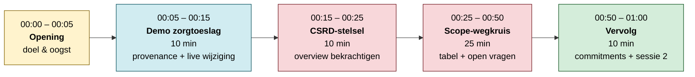
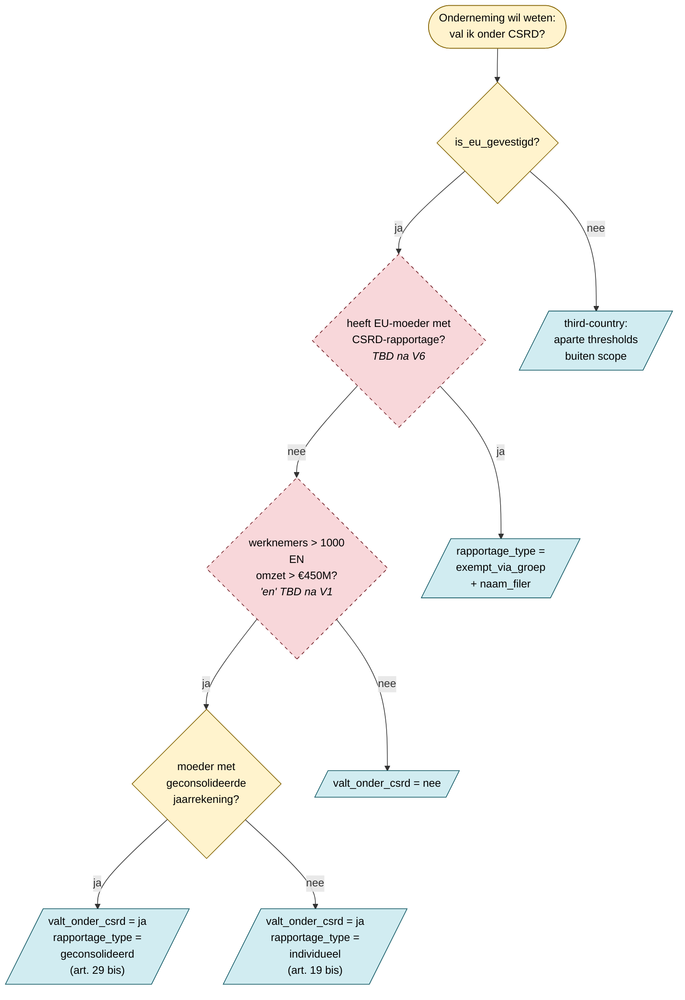

# Kick-off-sessie met jurist: regie-document

Werk-document voor de **eerste sessie** met de CSRD-jurist. Bouwt voort op
[jurist-input-2026-05-13.md](jurist-input-2026-05-13.md) en gebruikt
[scope-bepaling.md](scope-bepaling.md) als live werkblad.

| Aspect | Waarde |
|--------|--------|
| Duur | 60 min |
| Format | Online, screenshare |
| Aanwezig | Ravi (regelrecht), jurist CSRD-team |
| Voorbereiding jurist | `jurist-input-2026-05-13.md` + `scope-bepaling.md` lezen |
| Demo-target | Zorgtoeslagwet (bestaand, stabiel) |
| Primair doel | Scope-wegkruis bekrachtigen + open vragen 1, 2, 6 beantwoorden |

## Sessie-tijdlijn

## Blok 1: Opening (00:00 – 00:05)

**Doel:** alignment over wat we vandaag oogsten.

- Op scherm: `docs/csrd/README.md`: toon voortgangs-status (fase 0 + 1 ✅, fase 2 begint)
- Drie-zinnen-opening: *"Vandaag drie dingen: (1) ik laat in 10 min zien wat regelrecht doet zodat je een mentaal model hebt, (2) we lopen samen mijn lezing van CSRD-scope door, (3) jij beantwoordt drie vragen waarvan ik niet zeker ben."*
- Verwijs naar [oogst-sectie](#verwachte-oogst) onderaan zodat de jurist weet wat we aan het eind willen hebben

## Blok 2: Demo zorgtoeslagwet (00:05 – 00:15)

**Doel:** jurist heeft mentaal model van wat regelrecht is: niet meer, niet
minder. Geen CSRD-vergelijking nog.

**Belangrijk framing-punt:** zorgtoeslagwet *is* een wet (Wet op de
zorgtoeslag). De CSRD-regelhulp wordt geen wet: het wordt een *toepassing*
bovenop Richtlijn 2013/34 + 2022/2464. Net zoals Financieel CV een regelhulp
is bovenop een set sociale-zekerheidswetten. Belangrijk om consistent te
benoemen.

**Stappen op scherm:**

1. Open `editor.regelrecht.rijks.app` → zoek "zorgtoeslag"
2. Split-view openen: artikel-tekst links, machine_readable YAML rechts
3. Zeg: *"Een wet in regelrecht heeft twee leesvormen: de wettekst zoals een jurist die kent, en machine_readable zoals een engine 'm leest. Naast elkaar zodat ze 1-op-1 verifieerbaar zijn."*
4. Open scenario-paneel → vul fictief bsn / inkomen → execute
5. Toon execution-trace: *"elke voorwaarde is terug-traceerbaar naar lid en artikel"*
6. Wijzig één drempelwaarde in de YAML → her-execute → uitkomst slaat om
7. Brug: *"Voor CSRD willen we hetzelfde patroon. Maar het stelsel is anders georganiseerd: daarom eerst de stelsel-graph."*

**Time-cap:** hard op 10 min. Bij overrun: skip stap 6 en spring naar Blok 3.
Liever de scope-bepaling redden dan een uitgesponnen demo.

## Blok 3: CSRD-stelsel doorlopen (00:15 – 00:25)

**Doel:** bekrachtig of mijn lezing van het stelsel klopt.

**Op scherm:** `docs/csrd/stelsel-overview.md` mermaid.

**Doorloop:**

- *"Vier EU-blokken: 2013/34 (hoofd), 2022/2464 (CSRD-amendement), Omnibus 2026 (drempel-vereenvoudiging), 2023/2772 (ESRS-detail). Klopt deze indeling?"*
- *"Onder NL: Boek 2 BW + Wet implementatie CSRD. Voor de eerste slice laten we NL bewust links liggen: bekrachtig je dat?"*
- *"Eerste slice = de rode KERN-blok in de artikel-graph: `valt_onder_csrd`. Niet de ~1000 ESRS-datapunten."*
- Switch naar `scope-bepaling.md` mermaid → *"Dit is artikel-niveau: vier bron-artikelen leveren samen de uitkomst."*

**Verwachte uitkomst:** 2-3 min discussie over framing of nuances, daarna door.

## Blok 4: Scope-wegkruis + open vragen (00:25 – 00:50)

**Doel:** wegkruis-tabel ingevuld + open vragen 1, 2, 6 beantwoord.

**Op scherm:** `docs/csrd/scope-bepaling.md`: wegkruis-tabel sectie. Vul
live samen in.

**Werkwijze (25 min, time-boxed):**

| Min | Wat |
|-----|-----|
| 5 | Bron-artikelen: IN / UIT / TBD per rij |
| 5 | Parameters bekrachtigen (vooral `heeft_eu_moedermaatschappij_…`: TBD na V6) |
| 5 | Outputs bekrachtigen: `valt_onder_csrd`, `rapportage_type` enum, `ingangsdatum_eerste_boekjaar` |
| 10 | Open vragen in prioriteit-volgorde |

**Open vragen geprioriteerd:**

| # | Vraag | Status | Waarom prioriteit |
|---|-------|--------|--------------------|
| **V1** | Drempels "of" of "en"? | Blokkerend | Verandert de boolean-logica in machine_readable |
| **V2** | Peildatum n vs n−1? | Blokkerend | Bepaalt de semantiek van de input-parameter |
| **V6** | Artikel-grondslag voor exemption via geconsolideerde moeder | Blokkerend | Bepaalt of de vierde BDD-archetype "EuroTech Subsidiary" bestaat |
| V3 | Overlap geconsolideerd ↔ individueel | TBD sprint 2 | Edge-case, niet voor eerste slice |
| V4 | Omnibus apart modelleren? | TBD sprint 2 | Onderhouds-keuze, niet juridisch |
| V5 | NL-omzetting prioriteit | TBD sprint 3+ | Pas relevant voor productie |

**Hulpdiagram tijdens dit blok:** de beslisboom-mock-up hieronder. Toon hem
nadat de parameters/outputs zijn bekrachtigd: dan kun je live de boom
"groen" of "rood" maken op basis van de antwoorden.

## Blok 5: Vervolg (00:50 – 01:00)

**Doel:** concrete commitments + sessie 2 datum.

| Wie | Wat | Wanneer |
|-----|-----|---------|
| regelrecht-team | YAML voor 2013/34 + 2022/2464 (eerste slice) + `valt_onder_csrd` machine_readable | binnen 2 weken |
| regelrecht-team | 3 BDD-archetypen (NovaCorp, MidBV, GroupHolding), evt. 4e (EuroTech Subsidiary) | binnen 2 weken |
| jurist | Artikel-nummer voor exemption (V6) bevestigen | binnen 1 week |
| jurist | NL-omzetting prioriteit-besluit (V5) | sessie 2 |
| beiden | Sessie 2 plannen: review machine_readable + ESRS-scope-discussie | nu prikken |

## Beslisboom: `valt_onder_csrd`

De **business-bril** op de stelsel-graph: dezelfde artikelen, nu als beslis­
route vanuit ondernemer-perspectief. Geel = beslis-vraag, gestippeld =
TBD na open vragen, blauw = eindstand.

**Naast de uitkomst hangt:**
`ingangsdatum_eerste_boekjaar` = eerste boekjaar dat op of na 2027-01-01
begint (Richtlijn 2022/2464 art. 5 lid 2.b).

## Verwachte oogst

Na de sessie is er:

1. **Wegkruis-tabel** in `scope-bepaling.md` ingevuld: IN/UIT/TBD per rij
2. **Open vragen 1, 2, 6 beantwoord** (of duidelijk wie/wanneer)
3. **Vervolg-afspraak** met datum
4. **Begin van vertrouwen** dat regelrecht het CSRD-domein aankan

## Voorbereiding regelrecht-team (dag vóór sessie)

- [ ] Editor lokaal of preview testen met zorgtoeslag: execution-trace zichtbaar?
- [ ] `scope-bepaling.md` en `stelsel-overview.md` op aparte browser-tabs
- [ ] `README.md`-link in de meeting-uitnodiging plakken (zodat jurist het kan voorlezen)
- [ ] Notuleer-template open (kan ook gewoon `scope-bepaling.md` live editen)
- [ ] Backup: PDF-printout van beide mermaid-diagrammen voor als de editor niet werkt

## Risico's & mitigaties

| Risico | Mitigatie |
|--------|-----------|
| Demo glitcht (editor-url down, trace niet zichtbaar) | Screenshots van een werkende trace klaar hebben + PDF-printouts |
| Jurist heeft scope-bepaling.md niet gelezen | Eerste 3 min meer uitleg, daarna corten op Blok 3 |
| V6 (exemption) blijft onbeantwoord | Vooraf navragen of jurist het stuk in 2013/34 kan opzoeken; anders accepteren dat 4e archetype wacht |
| Discussie verzandt op ESRS-detail | Hard terug: *"ESRS is fase 5 in onze planning, vandaag scope"* |
| Tijd loopt uit op Blok 4 | Skip V3-V5; alleen V1+V2+V6 zijn blokkerend |

## Bijlagen

- [README.md](README.md): projectoverzicht
- [jurist-input-2026-05-13.md](jurist-input-2026-05-13.md): bron
- [stelsel-overview.md](stelsel-overview.md): stelsel-diagram (Blok 3)
- [scope-bepaling.md](scope-bepaling.md): werkblad (Blok 4)
- [product-positionering.md](product-positionering.md): context voor "wat wordt het product"
