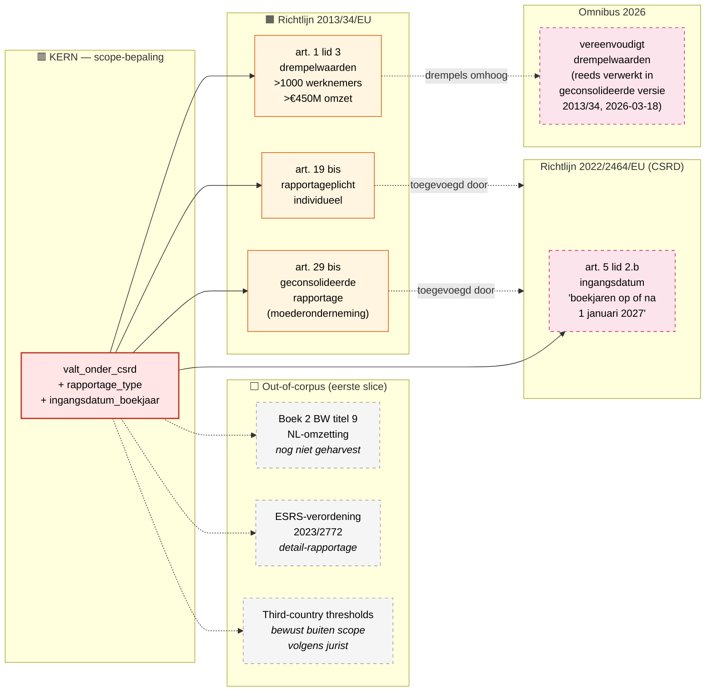

# Scope-bepaling CSRD — werkmateriaal voor jurist-sessie

Werkblad voor de scope-bepalings-sessie met de jurist. Hier is **alles
in scope**: elk artikel of stuk regelgeving dat de CSRD-rapportageplicht
raakt of zou kunnen raken. De jurist kruist samen weg wat de regelhulp
**niet** hoeft te modelleren.

> Lees eerst [stelsel-overview.md](stelsel-overview.md) — dat is het
> stelsel-plaatje als startpunt. Dit werkblad gaat één laag dieper, naar
> artikel-niveau.

## Eerste-laag focus: **valt_onder_csrd**

De juristen-input van [2026-05-13](jurist-input-2026-05-13.md) bakent
de **doelgroepbepaling** af als startpunt. Dat is exact het patroon dat
in Financieel CV werkte als eerste output (zie ook
`memory/cross_law_via_source_regulation.md`): bepaal eerst wie onder de
regeling valt, daarna pas wat hij of zij moet doen.

Eerste output: `valt_onder_csrd` — boolean met afgeleide attributen
`rapportage_type` (individueel/geconsolideerd) en
`ingangsdatum_eerste_boekjaar`.

## Artikel-niveau graph (eerste slice)

Beperkt tot de artikelen die de scope-bepaling raken. ESRS-standaarden
en sector-detail komen later.

## Wegkruis-tabel

Loop hieronder met de jurist door per node. 
Beslis: 
**IN** = blijft in
scope voor regelrecht-modellering, 
**UIT** = niet relevant voor deze
slice, 
**TBD** = nader bekijken.

### KERN (niet wegkruisbaar)

| Node | Reden in scope | Beslissing |
|------|----------------|------------|
| `valt_onder_csrd` | De eerste output van de regelhulp — bepaalt of een onderneming überhaupt onder CSRD valt | IN ✅ |

### Bron-artikelen (te bekrachtigen)

| Artikel | Wat | Beslissing |
|---------|-----|------------|
| Richtlijn 2013/34/EU art. 1 lid 3 | Drempelwaarden 1000 werknemers + €450M omzet (post-Omnibus) | __ |
| Richtlijn 2013/34/EU art. 19 bis | Rapportageplicht voor individuele ondernemingen | __ |
| Richtlijn 2013/34/EU art. 29 bis | Geconsolideerde rapportage voor moederondernemingen | __ |
| Exemption-grondslag — vermoedelijk een lid binnen art. 19 bis of art. 29 bis (te bekrachtigen) | **Exemption** — dochter is vrijgesteld als ze al wordt opgenomen in geconsolideerde rapportage van EU-moedermaatschappij. Zie [open vraag 6](#open-vragen-voor-de-jurist) | __ |
| Richtlijn 2022/2464/EU art. 5 lid 2.b | Ingangsdatum "boekjaren op of na 1 januari 2027" | __ |

### Out-of-corpus (eerste slice)

| Node | Reden uit scope | Beslissing |
|------|------------------|------------|
| Boek 2 BW titel 9 | NL-omzetting — relevant maar nog niet geharvest. Voor productie-tool wel modelleren | TBD |
| Wet implementatie CSRD | NL-implementatiewet — idem | TBD |
| ESRS-verordening 2023/2772 | Detail-rapportage-standaarden (~1000 datapunten) — niet voor scope-bepaling | UIT |
| Third-country thresholds | Niet-EU bedrijven — bewust buiten scope door jurist | UIT |
| RJ-uitingen | Interpretatie / beleid — bouwen pas als regelhulp uitvoeringsbeleid bevat | UIT (eerste slice) |
| AFM-richtsnoeren | Idem — toezicht-laag | UIT (eerste slice) |

### Parameters voor `valt_onder_csrd`

| Parameter | Type | Wie levert | Beslissing |
|-----------|------|-------------|------------|
| `aantal_werknemers` | integer | Werkgever-zelfreport / KVK / jaarrekening | JA |
| `netto_jaaromzet_euro` | amount | Jaarrekening (boekjaar n−1) | JA |
| `is_eu_gevestigd` | boolean | KvK-vestigingsadres | UIT (buiten scope) |
| `is_moedermaatschappij_geconsolideerd` | boolean | Jaarrekening: heeft geconsolideerde rekening? | TBD (niche uitkomst) |
| `boekjaar_start` | date | Werkgever-zelfreport | __ |
| `heeft_eu_moedermaatschappij_met_csrd_rapportage` *(TBD na open vraag 6)* | boolean | Werkgever / KVK groepsstructuur | TBD |

### Outputs

| Output | Type | Beslissing |
|--------|------|------------|
| `valt_onder_csrd` | boolean | __ |
| `rapportage_type` *(TBD na open vraag 6)* | enum [individueel, geconsolideerd, **exempt_via_groep**, geen] | __ |
| `ingangsdatum_eerste_boekjaar` | date | __ |
| `naam_filer` *(TBD na open vraag 6, alleen als exempt_via_groep)* | string | __ |

## Mogelijke prune-richtingen

Voorstellen om in het gesprek te toetsen:

1. **NL-omzetting (Boek 2 BW) eerst out-of-corpus** voor de eerste slice
   — werken zo veel mogelijk met EU-richtlijn als single source of
   truth. Pas modelleren bij productie-rijp.
2. **Omnibus als aparte wijzigingsrichtlijn modelleren — TBD**. De
   geconsolideerde versie 2013/34 (2026-03-18) bevat de Omnibus-
   wijzigingen al. Vraag: willen we de Omnibus-wijzigingsrichtlijn
   apart als YAML opnemen voor traceerbaarheid (vergelijkbaar met
   hoe LIV-afschaffing in Financieel CV werd gemodelleerd), of
   volstaat de geconsolideerde versie?
3. **ESRS-uitwerking pas in fase 5+** — bouw eerst de
   scope-bepaling-output, dan archetype-BDD's, dan pas ESRS-standaarden
   één voor één.
4. **Sector-specifieke ESRS volledig uit scope** tot de
   sector-agnostische standaarden klaar zijn.

## Volgende stap

De IN-rijen vormen de definitieve `regelrecht`-
scope voor de eerste CSRD-slice. 
UIT-rijen mogen weg of als
`untranslatable` worden gemarkeerd. 
TBD-rijen krijgen een vervolg-
vraag — bij voorkeur via mail of een tweede sessie.

## Open vragen

1. **Drempelwaarden — "of" of "en"?** De juristen-mail noemt
   ">1000 werknemers" én ">€450M omzet". Moeten **beide** worden
   gehaald (cumulatief), of is **één** voldoende (alternatief)? 
2. **Peildatum drempelwaarden** — gemeten over welk boekjaar? Het
   boekjaar dat moet worden gerapporteerd (n), of het voorafgaande
   boekjaar (n−1)? 
3. **Geconsolideerd vs. individueel — overlap?** Als een
   moederonderneming op geconsolideerde basis onder de thresholds valt,
   maar één van haar dochters individueel ook erover gaat — moet die
   dochter dan óók individueel rapporteren of valt ze onder de
   geconsolideerde rapportage? 
4. **Omnibus-traceerbaarheid** — willen we de wijziging-historie van de
   drempelwaarden zichtbaar in regelrecht (apart wijzigings-YAML), of
   volstaat de geconsolideerde versie?
5. **NL-omzetting prioriteit** — moet de regelhulp uiteindelijk
   verwijzen naar Boek 2 BW (NL-recht) of blijft EU-richtlijn de
   primaire bron? 
6. **Exemption door geconsolideerde rapportage moedermaatschappij**
   — bron PowerPoint slide 15 (juristen-bijlage 2026-05-13): scenario
   "EU-based holding" toont een EU HoldCo (Luxemburg, €1,4 bn omzet)
   en Entity C (Duitsland, €850M / 5k FTE) als `EXEMPT`. Beide zouden
   op eigen kracht ruim boven de CSRD-drempels uitkomen, maar zijn
   vrijgesteld omdat ze worden opgenomen in de geconsolideerde
   rapportage van moedermaatschappij EuroTech Group SE (NL, €2,5 bn
   / 12,5k FTE — "FILER").

   Concrete subvragen:
   - In welk artikel staat deze exemption? Vermoedelijk **een lid binnen
     art. 19 bis of art. 29 bis** van Richtlijn 2013/34/EU zelf (de
     CSRD-toegevoegde artikelen), óf in een aangrenzend nieuw artikel.
     Let op: art. 19a (zonder spatie) in 2013/34/EU dateert uit het
     NFRD-tijdperk (niet-financieel verslag) en is een ander artikel
     dan art. 19 bis (CSRD-toegevoegde duurzaamheidsrapportage).
     Bekrachtigen graag.
   - Wat zijn de voorwaarden voor vrijstelling? Vermoedelijk minstens:
     (a) moedermaatschappij is EU-gevestigd; (b) moedermaatschappij
     rapporteert CSRD-conform; (c) de dochter wordt daadwerkelijk
     geconsolideerd opgenomen; (d) mogelijk: dochter publiceert
     verwijzing naar geconsolideerde rapportage. Welke voorwaarden
     gelden exact?
   - Geldt dezelfde exemption voor **tussen-holdings** (sub-holding)
     die zelf weer dochters hebben? In de slide is EU HoldCo `EXEMPT`
     én bevat het Entity C die óók `EXEMPT` is — twee niveaus diep.
     Wat is de juridische grondslag voor cascading exemption?

   Modellerings-impact als bekrachtigd:
   - Extra output-waarde `rapportage_type = exempt_via_groep`
   - Extra output `naam_filer` (string) voor traceerbaarheid
   - Extra parameter `heeft_eu_moedermaatschappij_met_csrd_rapportage`
   - Vierde BDD-archetype "EuroTech Subsidiary" toegevoegd aan
     persona-set
