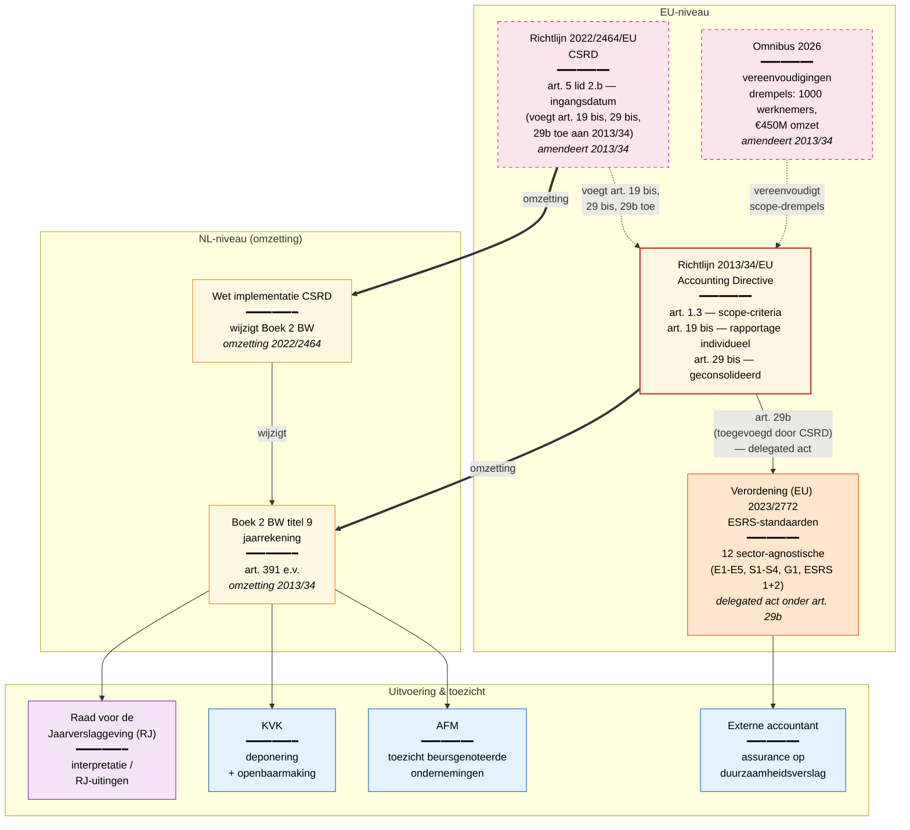

# CSRD — stelsel en grondslagen

Het **startpunt** voor de regelrecht-modellering van CSRD. Toont op welk
**regulatory_layer-niveau** de inhoudelijke regels staan en welke
organisaties uitvoering en toezicht doen. Verwerkt de juristen-input
van 2026-05-13 (zie [jurist-input-2026-05-13.md](jurist-input-2026-05-13.md)).

## Stelsel-diagram

**Legenda:**

- 🟥 **Richtlijn (rood)** — primaire EU-richtlijn (2013/34/EU)
- **Wijzigingsrichtlijn (roze, gestippeld)** — amendeert een eerdere richtlijn (CSRD 2022/2464 en Omnibus 2026 wijzigen beide 2013/34)
- 🟧 **Verordening (oranje)** — gedelegeerde Commissie-verordening (ESRS-standaarden)
- 🟨 **Wet (geel)** — Nederlandse omzettingswet
- 🟪 **Beleid (paars)** — interpretatieve uitingen (RJ)
- 🟦 **Uitvoeringsorganisatie (blauw)** — toezicht of administratieve afhandeling

**Lijntypes:**

- `══>` dikke pijl — omzetting (van EU naar NL) of toepassing (van wet naar uitvoerder)
- `-.->` gestippeld — amendement (wijzigingsrichtlijn)
- `-->` gewone pijl — afgeleide regelgeving of toepassings-relatie

## Welke regeling op welk niveau

| Niveau | Rol | Wat staat hier |
|--------|-----|----------------|
| **EU-richtlijn** (2013/34) | Hoofdregel | Scope-criteria, rapportage-verplichtingen, geconsolideerde rapportage |
| **EU-richtlijn (wijziging)** (2022/2464 CSRD, Omnibus 2026) | Amendement | Ingangsdata, drempelwaarde-aanpassingen, vereenvoudigingen |
| **EU-verordening (delegated act)** (2023/2772 ESRS) | Detaillering | Concrete rapportage-datapunten per standaard (~1000 totaal) |
| **NL-wet** (Boek 2 BW + Wet impl. CSRD) | Omzetting | Nederlandse uitwerking van EU-richtlijn — wat in NL geldend recht is |
| **Beleid** (RJ-uitingen) | Interpretatie | Hoe accountants/bedrijven de wet toepassen |
| **Uitvoering** (AFM, KVK, accountants) | Handhaving | Toezicht, deponering, assurance |

## Wat dit diagram laat zien voor het kick-off-gesprek

**Drie inzichten** die direct uit de structuur volgen:

1. **CSRD is geen op zichzelf staande wet** — het is een amendement op
   de Accounting Directive (2013/34/EU). Wie CSRD doorgrondt, leest
   noodzakelijk in 2013/34. Plus de geconsolideerde versie (datum
   2026-03-18) bevat de Omnibus-vereenvoudigingen al.

2. **De drempelwaarden zijn niet in de CSRD zelf gedefinieerd** —
   ze staan in 2013/34/EU art. 1 lid 3 en zijn door Omnibus 2026
   omhooggebracht naar 1000 werknemers en €450M omzet. Dit is precies
   een patroon van afschaffing/wijziging door latere wetswijziging.

3. **ESRS-standaarden zijn een aparte regulatory_layer** — niet de
   richtlijn maar een gedelegeerde Commissie-verordening (2023/2772).
   Dat onderscheid is belangrijk voor regelrecht-modellering: ESRS is
   geen "wet" maar `EU_VERORDENING` met andere wijzigingsritmes.

## Wat *niet* in dit diagram staat (bewust)

- **Niet-EU bedrijven** — third-country undertakings hebben aparte
  thresholds. Jurist heeft deze buiten beschouwing gelaten voor de
  eerste fase.
- **Sector-specifieke ESRS** — naast de 12 sector-agnostische
  standaarden komen er sector-specifieke (financiële instellingen,
  agri, mijnbouw, etc.). Niet voor de eerste slice.
- **NFRD-overgangsrecht** — de oude Non-Financial Reporting Directive
  (2014/95/EU) is door CSRD vervangen. Eventuele transitie-regelingen
  vallen buiten scope.
- **Sustainable Finance Disclosure Regulation (SFDR)** en
  **Taxonomieverordening** — buurregelingen die wel raakvlakken
  hebben (concept-definities zoals materialiteit), maar niet de scope
  van het CSRD-werk.

Zie [scope-bepaling.md](scope-bepaling.md) voor de wegkruis-tabel die
deze keuzes formaliseert met de jurist.
