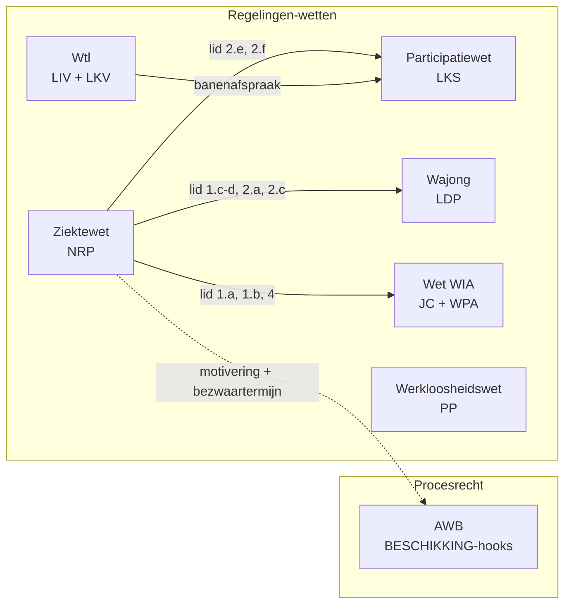

# Financieel CV — sessieoverzicht

Branch: `feat/financieel_cv_RVO`. Sessieduur: zes uur. Voor de demo op
dinsdag aan de jurist.

## Scope

Acht regelingen uit de regelhulp [Financieel
CV](https://regelhulpenvoorbedrijven.nl/financieelcv/), gericht op
werkgevers/werknemers met afstand tot de arbeidsmarkt. **Eén regeling
grondig, zeven illustratief.**

| Acroniem | Regeling                       | Status   | Wet                                                                                | BWB-ID       | Hoofdartikel    | Peildatum  |
|----------|--------------------------------|----------|------------------------------------------------------------------------------------|--------------|-----------------|------------|
| **NRP**  | **No-riskpolis**               | **full** | Ziektewet                                                                          | BWBR0001888  | 29b lid 1, 2, 4 | 2025-01-01 |
| LIV      | Lage-inkomensvoordeel          | skeleton | Wet tegemoetkomingen loondomein (Wtl)                                              | BWBR0037522  | 3.1             | 2024-01-01 |
| LKV      | Loonkostenvoordeel             | skeleton | Wet tegemoetkomingen loondomein (Wtl)                                              | BWBR0037522  | 2.1             | 2024-01-01 |
| LKS      | Loonkostensubsidie             | skeleton | Participatiewet                                                                    | BWBR0015703  | 10c             | 2025-01-01 |
| LDP      | Loondispensatie                | skeleton | Wet arbeidsongeschiktheidsvoorziening jonggehandicapten (Wajong)                   | BWBR0008657  | 2:20            | 2025-01-01 |
| JC       | Jobcoaching                    | skeleton | Wet werk en inkomen naar arbeidsvermogen (Wet WIA)                                 | BWBR0019057  | 35.1, 35.2.d    | 2025-01-01 |
| WPA      | Werkplekaanpassingen           | skeleton | Wet werk en inkomen naar arbeidsvermogen (Wet WIA)                                 | BWBR0019057  | 35.1, 35.2.c    | 2025-01-01 |
| PP       | Proefplaatsing                 | skeleton | Werkloosheidswet (WW)                                                              | BWBR0004045  | 76a.1           | 2024-01-01 |

### Toelichting op peildata

- **LIV** is per 2025-01-01 afgeschaft voor nieuwe dienstverbanden
  (Wet 36458). Peildatum 2024-01-01 voor Wtl gekozen zodat zowel LIV als
  LKV in beeld blijven voor de Financieel CV-graphdemo.
- **WW** harvest met 2025-01-01 faalde (geen versie beschikbaar op die
  datum); 2024-01-01 gebruikt — artikel 76a is sinds die datum niet
  inhoudelijk gewijzigd.
- **Pwet** 2025-01-01 nieuw geharvest naast bestaande 2022-03-15. Het
  oude bestand bevat machine_readable voor bijstand (art. 7, 8, 11, 18,
  21-24, 43, 69) en is ongemoeid gelaten.

## Hoofduitkomsten

| Regeling | Hoofduitkomsten                                                                |
|----------|--------------------------------------------------------------------------------|
| NRP      | `heeft_recht_op_no_risk_polis`, `duur_no_risk_polis_jaren`, `voldoet_aan_lid_{1,2,4}` |
| LIV      | `heeft_recht_op_liv`, `hoogte_liv_per_jaar` (skeleton: 0)                      |
| LKV      | `heeft_recht_op_lkv`, `categorie_lkv`, `hoogte_lkv_per_jaar` (skeleton: 0)     |
| LKS      | `heeft_recht_op_lks`, `loonwaarde_percentage` (skeleton: 0)                    |
| LDP      | `heeft_recht_op_loondispensatie`                                               |
| JC       | `heeft_recht_op_jobcoaching`                                                   |
| WPA      | `heeft_recht_op_werkplekaanpassing`                                            |
| PP       | `mag_proefplaatsing_aangaan`, `duur_proefplaatsing_weken` (=26)                |

## Cross-law structuur (graph)

De law dependency graph in de editor (zie commit `c7ded67`) leest
`articles[].machine_readable.execution.input[].source.regulation` en
toont een edge per cross-law referentie. De volgende edges ontstaan in
de huidige branch:

```
ziektewet (NRP)
  → wet_werk_en_inkomen_naar_arbeidsvermogen   (lid 1.a, 1.b, 4)
  → wet_arbeidsongeschiktheidsvoorziening_jonggehandicapten   (lid 1.c, 1.d, 2.a, 2.c)
  → participatiewet                            (lid 2.e, 2.f)

wet_tegemoetkomingen_loondomein (LIV, LKV)
  → participatiewet                            (LKV banenafspraak)

participatiewet (LKS)
  → participatiewet                            (intra-law: 10c gebruikt doelgroepstub uit art. 1)

wet_arbeidsongeschiktheidsvoorziening_jonggehandicapten (LDP)
  → wet_arbeidsongeschiktheidsvoorziening_jonggehandicapten (intra-law)

wet_werk_en_inkomen_naar_arbeidsvermogen (JC, WPA)
  → wet_werk_en_inkomen_naar_arbeidsvermogen (intra-law)

werkloosheidswet (PP)   — geen cross-law edge
```

Output-leaf-knopen die de graph rendert (filtert standaard
`wet_naam`, `bevoegd_gezag`, `datum_inwerkingtreding` weg):

- ziektewet: `heeft_recht_op_no_risk_polis`, `duur_no_risk_polis_jaren`,
  `voldoet_aan_lid_1`, `voldoet_aan_lid_2`, `voldoet_aan_lid_4`,
  `is_wia_uitkeringsgerechtigd`, `is_wia_min_35_arbeidsongeschikt`,
  `heeft_voortgezet_wia_recht`, `heeft_arbeidsbeperking_wia`,
  `is_wajong_gerechtigd`, `is_jonggehandicapt_schoolverlater`,
  `is_banenafspraak_doelgroep`, `is_pwet_loonkostensubsidie`,
  `is_beschut_werk`, `loonwaarde_lager_dan_minimumloon`
- wtl: `heeft_recht_op_liv`, `hoogte_liv_per_jaar`,
  `heeft_recht_op_lkv`, `categorie_lkv`, `hoogte_lkv_per_jaar`
- pwet (2025): doelgroepstub-outputs + `heeft_recht_op_lks`,
  `loonwaarde_percentage`
- wajong: `is_wajong_gerechtigd`, `is_jonggehandicapt_schoolverlater`,
  `heeft_recht_op_loondispensatie`
- wet_WIA: `is_wia_uitkeringsgerechtigd` e.a. + `heeft_recht_op_jobcoaching`,
  `heeft_recht_op_werkplekaanpassing`
- ww: `mag_proefplaatsing_aangaan`, `duur_proefplaatsing_weken`

### Overzichtsplaatje (alle 7 wetten samen)

De editor-graph laat steeds één wortel-wet zien met haar transitieve
dependencies. Voor een totaalbeeld van alle Financieel CV-regelingen:



Solide pijlen = cross-law data dependencies (input.source.regulation),
gestippeld = AWB-hook (fires automatisch op elke BESCHIKKING).

NB: WW (PP) staat los — geen cross-law dependencies.
JC/WPA en LDP gebruiken intra-law sources (zelfde wet, doelgroepstub).

### Visualisatie tijdens demo

Start de editor lokaal en navigeer naar de law dependency graph view:

```bash
just dev
# editor: http://localhost:3000
```

Vereist `GITHUB_TOKEN` (read:packages-scope) in keychain
(`security add-generic-password -a "$USER" -s github-packages-read -w "$GITHUB_TOKEN"`)
of `.env` voor het ophalen van de private `@minbzk/storybook`-package.

Kies in de editor een Ziektewet-context met peildatum 2025-01-01;
de graph toont vanuit `ziektewet` drie cross-law edges naar wet WIA,
Wajong en Participatiewet. Per skeleton zijn de hoofduitkomsten als
output-leaves zichtbaar onder de bijbehorende wet-knoop.

> Pas de graph-code zelf niet aan tenzij er een duidelijke bug is.
> Aanpassingen aan YAML hebben prioriteit; documenteer eventuele
> bugs als open punt in dit document.

## Untranslatables (Ziektewet 29b)

Drie geaccepteerde untranslatables (engine voert door, jurist moet
beoordelen):

1. **Vijfjaarstermijn bij onderbroken dienstverbanden** (lid 1.b 4°,
   lid 1.c, lid 1.d). Wettekst is niet eenduidig over teleffect bij
   opvolgende dienstverbanden binnen vijf jaar.
2. **Lid 2-duur als 'onbeperkt'**. Voor doelgroepen Wajong, Wsw,
   banenafspraak en beschut werk kent het artikel geen vaste duur. In
   de YAML als 0 gemodelleerd; semantisch verschilt dat van een
   eindige duur.
3. **Samenloop met LKV / LKS / LDP**. Artikel 29b regelt de
   cumulatie niet expliciet.

## Open vragen voor de jurist (dinsdag)

1. NRP-vijfjaarstermijn — geldt die per dienstverband of per persoon?
2. Wajong: oude (BWBR0008657) vs nieuwe Wajong (Wet vereenvoudiging
   Wajong 2021) — voor LDP (artikel 2:20) geldt het oude regime; voor
   NRP-doelgroepbepaling beide?
3. WPA: artikel 35 Wet WIA dekt ook vervoersvoorzieningen,
   intermediaire activiteiten (dovenondersteuning) en overige
   voorzieningen. Wat valt onder "WPA" in de regelhulp Financieel CV?
4. PP-termijn (max 6 maanden, lid 1) — afgerond als 26 weken; correct?
   Of beter als 6 maanden in `months`-eenheid modelleren?
5. Cumulatie van NRP, LKV, LKS en LDP bij dezelfde dienstbetrekking —
   welke gelden tegelijk, en welke sluiten elkaar uit?
6. LIV is afgeschaft per 2025-01-01. Hoort die nog in de regelhulp?
   Voor de demo nu peildatum 2024-01-01 voor Wtl.
7. Doelgroepvaststelling banenafspraak (Pwet 7 lid 1 a) — verzonken
   in UWV-doelgroepregister. Hoe gemodelleerd te krijgen?
8. Wsw is buiten scope gehouden (BWBR0008903 niet geharvest). Wel
   relevant voor NRP lid 2 b/d.

## Bestanden

| Pad                                                                               | Inhoud                                                |
|-----------------------------------------------------------------------------------|-------------------------------------------------------|
| `corpus/regulation/nl/wet/ziektewet/2025-01-01.yaml`                              | NRP (volledig) + ongemoeide artikelen                 |
| `corpus/regulation/nl/wet/wet_tegemoetkomingen_loondomein/2024-01-01.yaml`        | LIV + LKV (skeleton)                                  |
| `corpus/regulation/nl/wet/participatiewet/2025-01-01.yaml`                        | LKS (skeleton) + doelgroepstub voor NRP/LKV           |
| `corpus/regulation/nl/wet/wet_arbeidsongeschiktheidsvoorziening_jonggehandicapten/2025-01-01.yaml` | LDP (skeleton) + doelgroepstub voor NRP |
| `corpus/regulation/nl/wet/wet_werk_en_inkomen_naar_arbeidsvermogen/2025-01-01.yaml` | JC + WPA (skeleton) + doelgroepstub voor NRP        |
| `corpus/regulation/nl/wet/werkloosheidswet/2024-01-01.yaml`                       | PP (skeleton)                                         |
| `features/no_risk_polis.feature`                                                  | Drie BDD-scenarios voor NRP                           |
| `docs/financieel-cv/persona-traces/`                                              | Twee traces (WIA-uitkering, banenafspraak)            |
| `PLAN.md`                                                                         | Sessieplan + tijdsbudget                              |

## Quality checks

- `just format` — groen
- `just lint` — groen
- `just validate` — groen (alle YAMLs schema v0.5.1)
- `just test` — groen
- `just bdd` — 56/56 scenarios (351/351 steps)

`just check` faalt op `admin-test` omdat dat Docker (testcontainers) vereist;
geen regressie van deze sessie.

## Niet-gedaan

- **Editor-screenshot** van de graph view: vereist `GITHUB_TOKEN` met
  `read:packages` scope voor de private `@minbzk/storybook`-package
  (zie `frontend/package.json`). De gebruiker draait `just dev` zelf
  voor de demo; deze README beschrijft wat de graph behoort te tonen.
- **Wet sociale werkvoorziening** (BWBR0008903) niet geharvest;
  Wsw-doelgroep (NRP lid 2 b/d) afgehandeld als parameter
  `is_wsw_werknemer` op artikel-niveau in zowel Ziektewet als Wajong.
- **Volledige uitwerking** van de zeven illustratieve regelingen.
  Skeleton-status is per ontwerp.
