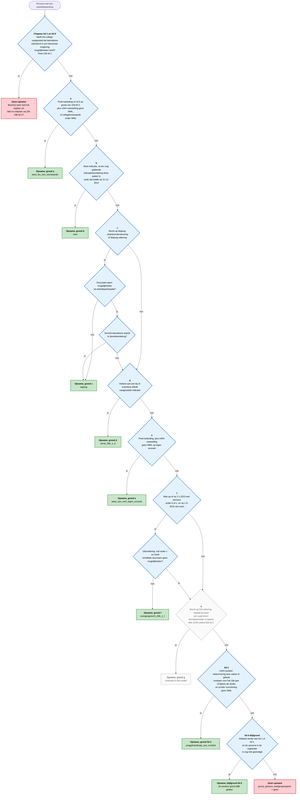
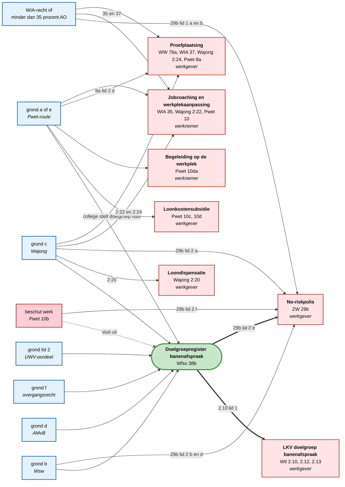
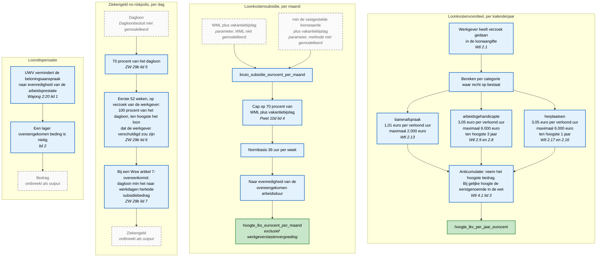

# Beslisboom: van persoon naar grond, recht en bedrag

Drie bomen. De eerste bepaalt of iemand in het doelgroepregister banenafspraak
komt en op welke grond. De tweede leidt van die grond naar de rechten. De derde
rekent die rechten om naar een bedrag.

Onderbouwing per stap staat in
[`doelgroepregister-categorieen.md`](doelgroepregister-categorieen.md).
Peildatums: Wfsv 2026-07-01, Wtl 2026-01-01, overige wetten 2026-07-01.

De volgorde van boom 1 is de IF-volgorde die het model hanteert in
`grond_opname_doelgroepregister`: a, b, c, d, e, f, lid 2, en pas daarna de
blijfgrond van lid 6. De eerst passende grond wint, ook als meer gronden van
toepassing zijn.

## Boom 1: Opname in het doelgroepregister banenafspraak

Bron ook als los bestand: [`beslisboom-doelgroepregister.mmd`](beslisboom-doelgroepregister.mmd).

### Dezelfde boom als tabel

| Stap | Vraag | Ja | Nee |
|---|---|---|---|
| 0 | Chapeau: uitsluitend beschut werk vastgesteld door het college (Pwet 10b lid 1)? | Geen opname; einde | Naar stap a |
| a | Pwet-toeleiding of LKS 10d lid 2, plus UWV-vaststelling geen WML, of collegeloonwaarde onder WML? | Opname, grond a | Naar b |
| b | Wsw-indicatie of geldige oude indicatiebeschikking? | Opname, grond b | Naar c |
| c | Recht op Wajong-arbeidsondersteuning of -uitkering? | Naar c1 | Naar d |
| c1 | Duurzaam geen mogelijkheden tot arbeidsparticipatie? | Naar c2 | Opname, grond c |
| c2 | Verricht betrokkene arbeid in dienstbetrekking? | Opname, grond c | Naar d |
| d | Voldoet aan de AMvB-indicatie van 38b lid 1 d? | Opname, grond d | Naar e |
| e | Pwet-toeleiding plus UWV-vaststelling geen WML op eigen verzoek? | Opname, grond e | Naar f |
| f | Op of na 1-1-2013 persoon onder b of c, en op 1-5-2015 niet meer? | Naar f1 | Naar g |
| f1 | Viel onder c en heeft inmiddels duurzaam geen mogelijkheden? | Naar g | Opname, grond f |
| g | IVA-recht met experimentele loondispensatie (SUWI 82a)? | Opname, grond g — **ontbreekt in het model** | Naar lid 2 |
| lid 2 | UWV-oordeel jonggehandicapt met voorziening? | Opname, grond lid 2 | Naar lid 6 |
| lid 6 | Voldeed eerder aan lid 1 of 2, en registratie nog niet geëindigd? | Opname, blijfgrond | Geen opname |

## Boom 2: Van grond naar recht

De registratie zelf opent twee deuren. De overige instrumenten hangen aan de
grond eronder.

### Wat de registerstatus alleen oplevert

| Recht | Toetst op de registratie | Toetst op de grond eronder |
|---|---|---|
| LKV doelgroep banenafspraak | ja, Wtl 2.10 lid 1 | nee |
| No-riskpolis | ja, ZW 29b lid 2 e | ook, via lid 1 en lid 2 a, b, d en f |
| Loonkostensubsidie | nee | ja, Pwet 10c en 10d |
| Begeleiding op de werkplek | nee | ja, Pwet 10da |
| Loondispensatie | nee | ja, Wajong 2:20 |
| Jobcoaching en werkplekaanpassing | nee | ja, WIA 35, Wajong 2:22, Pwet 10 |
| Proefplaatsing | nee | ja, WW 76a, WIA 37, Wajong 2:24, Pwet 8a |

Een regelhulp die uitsluitend "u staat in het doelgroepregister" weet, kan
daarom twee instrumenten bepalen en vijf niet.

## Boom 3: Van recht naar bedrag

### Waar de boom vastloopt

| Knooppunt | Ontbreekt | Gevolg |
|---|---|---|
| WML plus vakantiebijslag | Wet minimumloon met artikel 15 en de indexerings-AMvB | De hele LKS-berekening rust op een handmatig ingevoerd bedrag |
| Loonwaarde | Besluit loonkostensubsidie Participatiewet | De methode achter het getal is onbekend |
| Dagloon | Dagloonbesluit werknemersverzekeringen | Ziekengeld, WIA- en WW-uitkering leveren geen bedrag |
| Evenredige vermindering | Besluit loondispensatie Wajong | Loondispensatie levert een recht en geen bedrag |

Alle vier staan als tekst in het corpus en hebben geen `machine_readable`-blok.

## Gebruik in de juristsessie

Boom 1 is de toets waar de jurist het over gaat hebben: onderdeel g ontbreekt,
de AMvB onder onderdeel d bestaat in het model niet, en de volgorde a tot en
met lid 2 bepaalt welke grond in de beschikking komt te staan wanneer meer
gronden van toepassing zijn. Die volgorde volgt uit de modellering en staat
niet als zodanig in de wet.

Boom 2 is de toets op de verwachting van de gebruiker: wie in het register
staat, heeft daarmee nog geen loonkostensubsidie, geen loondispensatie en geen
jobcoach.

Boom 3 is de toets op wat de regelhulp vandaag kan tonen: twee van de zeven
bedragen zijn te berekenen, vier knooppunten ontbreken.
