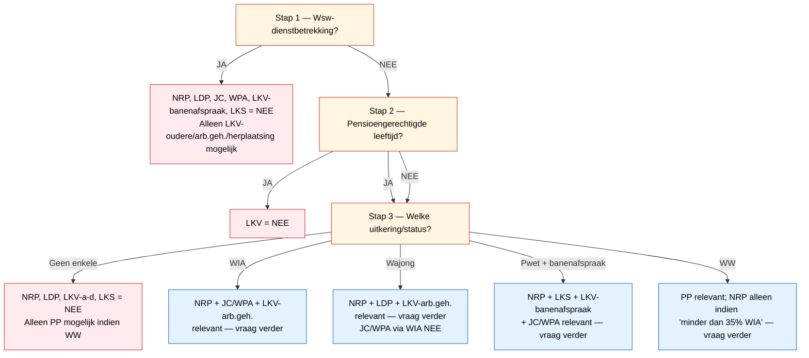

# Dataminimalisatie in de Financieel CV-regelhulp

Werkmateriaal voor jurist + DPO + UX-design. Hoe ontwerpen we de
regelhulp zo dat we **alleen vragen wat strikt nodig is**, en hoe
detecteren we zo snel mogelijk dat een regeling niet van toepassing
is — zodat verdere vragen onnodig worden?

Drie redenen waarom dit ertoe doet:

1. **AVG art. 5 lid 1.c** — minimale gegevensverwerking is een
   wettelijke verplichting, geen wenselijke best practice.
2. **AVG art. 9** — doelgroep-status (Wajong, WIA, Pwet, beschut werk)
   onthult medische/sociale beperking. Dat is bijzondere
   persoonsgegevens. Werkgevers mogen dit niet zomaar vragen.
3. **UX** — een wizard met 30+ vragen heeft een drop-off rate die
   het hele instrument waardeloos maakt.

## Wat we nu (in de BDD-scenarios) doen

Onze Sadee- en Koen-scenarios geven steeds **alle** parameters mee
ook al heeft de engine ze niet allemaal nodig om een uitkomst te
bepalen. Concreet:

| Output | Aantal parameters in scenario | Strikt nodig voor JA | Strikt nodig voor NEE |
|--------|-------------------------------|------------------------|-------------------------|
| NRP | 12 | 1 doelgroep-status op `true` | alle 9 doelgroep-statussen op `false` |
| LDP | 5 | 4 (Wajong + arbeidsprestatie + aanvraag + niet-Wsw) | 1 (Wajong = false → klaar) |
| JC + WPA | 7 | 5 (basisvoorwaarden + geen-uitsluiting + aanvraag) | 1 (Wsw = true → klaar, of geen beperking → klaar) |
| LKV | 7 | 4 (1 categorie + niet-pensioen + aanvraag + uren) | 1 (pensioen = true → klaar) |
| PP | 5 | 5 (alle voorwaarden) | 1 (geen WW → klaar) |
| LKS | 7 | 5 (alle voorwaarden + loon-data) | 1 (geen doelgroep LKS → klaar) |

**Asymmetrie:** een NEE-uitkomst is bijna altijd met **één parameter**
te bewijzen. Een JA-uitkomst vereist verifieerbare grondslagen op
meerdere assen.

Daarbij: de engine resolved op dit moment **alle parameters** —
zichtbaar in `trace_output/` waar `Compute OR(...) = True` toch alle
inputs apart `Resolving from PARAMETERS` laat zien, geen lazy
shortcut. Dataminimalisatie zit dus **niet** in de engine maar zou in
een laag ervóór moeten zitten (de vragenboom-UX).

## Per output: minimaal-NEE pad

De snelste manier om een output uit te sluiten — dat is wat de wizard
als eerste moet vaststellen, want het scheelt downstream vragen.

### NRP — Ziektewet art. 29b

Geen knock-out met één enkele parameter mogelijk; vereist
*disjunctief* uitsluiten van alle 9 doelgroep-statussen
(lid 1: WIA/jonggehandicapt + lid 2: Wajong/Wsw/banenafspraak/Pwet+LKS/beschut werk + lid 4: voortgezet WIA).

Pragmatische shortcut: vraag eerst **"heeft werknemer een
uitkering of doelgroep-indicatie?"** Bij algeheel NEE: alle 9 op
`false` → NRP direct uitgesloten.

### LDP — Wajong art. 2:20

`heeft_recht_op_arbeidsondersteuning_wajong = false` → **direct NEE**.
Dat is één vraag.

### JC + WPA — WIA art. 35

Vier alternatieve knock-outs (één is genoeg):
- `heeft_structurele_functionele_beperking = false`
- `is_wsw_werknemer = true`
- `heeft_recht_op_arbeidsondersteuning_wajong = true` (Wajong-uitsluiting lid 4.a)
- `pwet_college_draagt_zorg_uitsluiting = true` (Pwet-uitsluiting lid 4.b)

### LKV — Wtl art. 2.1

Drie alternatieve knock-outs:
- `heeft_pensioengerechtigde_leeftijd_bereikt = true`
- `heeft_loonaangifte_verzoek_ingediend = false`
- alle 4 categorieën (oudere/arbeidsgehandicapt/herplaatsing/banenafspraak) op `false`

### PP — WW art. 76a

`heeft_recht_op_ww_uitkering = false` → **direct NEE**. Eén vraag.

### LKS — Pwet art. 10c+10d

Twee alternatieve knock-outs:
- `behoort_tot_doelgroep_lks = false`
- `is_wsw_dienstbetrekking = true`

## Gedeelde knock-outs (cross-output)

Eén vraag, meerdere outputs uitgesloten:

| Parameter | Sluit deze outputs uit als waarde | Aantal outputs |
|-----------|-------------------------------------|-----------------|
| `is_wsw_werknemer = true` | NRP (deels), LDP, JC, WPA, LKV (banenafspraak), LKS | 5-6 |
| Geen enkele doelgroep-status | NRP, LDP, LKV (a-d), LKS | 4 |
| `heeft_pensioengerechtigde_leeftijd_bereikt = true` | LKV | 1 (na LIV-afschaffing) |
| `heeft_recht_op_ww_uitkering = false` | PP | 1 |
| `is_wajong_gerechtigd = true` | JC + WPA (via WIA 35 lid 4.a) | 2 (maar +LDP/NRP positief) |

**Conclusie**: één vroege Wsw-vraag scheelt 5-6 outputs. Eén
vroege doelgroep-vraag scheelt 4. Dat zijn dus de twee
goedkoopste knock-outs.

## Voorgestelde decision tree (vragenboom)



In drie vragen heb je voor de meeste werknemers al 50-80% van de
mogelijke outputs uitgesloten of bevestigd als relevant. Pas daarna
ga je per relevante output de specifieke rekenwerk-parameters
opvragen (verloonde uren, loonwaarde, aanvraagdatum).

## Source-of-truth: wie hoort wát te leveren?

Dataminimalisatie gaat ook over **welke partij** de gegevens levert.
De werkgever hoeft niet alles te weten — sterker: voor doelgroep-data
**mág** hij dat AVG-technisch vaak niet eens.

| Parametersoort | Voorbeelden | Wie weet dit echt? | Hoe ophalen |
|----------------|-------------|---------------------|--------------|
| Werknemer-eigen status | Wajong, WIA, beschut werk, banenafspraak | UWV (uitkering), gemeente (Pwet), doelgroepregister | **Doelgroepverklaring** (UWV/gemeente afgeeft op werknemer-toestemming) of **SUWInet-machtiging** |
| Loonwaardevaststelling | `loonwaarde_eurocent_per_maand`, `arbeidsprestatie_duidelijk_minder_dan_minimumloon` | UWV / gemeente loonwaarde-bepaling op werkplek | Externe vaststelling, niet zelfreport |
| Werkgever-administratie | `verloonde_uren`, `jaarloon_eurocent`, loonaangifte-verzoek | Werkgever | Loonaangifte / werkgever-zelfreport |
| Werknemer-feiten | Geboortedatum (→ pensioenleeftijd, leeftijd LKV-oudere) | Werknemer | Werkgever uit personeelsadministratie |
| Aanvragen | `aanvraag_loondispensatie_ingediend`, `heeft_loonaangifte_verzoek_ingediend` | Werkgever | Werkgever-zelfreport |

**De kerngedachte**: voor doelgroep-statussen wordt nu een booleaanse
parameter ingevoerd; in productie zou de regelhulp moeten weten dat
deze via een **doelgroepverklaring** (een verifiable claim met
UWV/gemeente als signing authority) komt. Werkgever ziet alleen
"banenafspraak-doelgroep: ja, geldig tot Y" — niet de onderliggende
uitkering-soort.

Dit is precies wat Wtl art. 2.3 en 2.7 al expliciet kennen voor LKV:
de doelgroepverklaring is de wettelijke implementatie van
dataminimalisatie. Onze regelhulp gebruikt deze nog niet — een
fundamentele gap.

## Engine-implicaties

Twee architectuur-keuzes om expliciet te maken:

### 1. Lazy parameter-evaluation: ja of nee?

De engine resolved nu alle parameters om **provenance** en
**explainability** te bieden. Lazy stoppen breekt dat: bij een
short-circuit OR weet je niet welke gronden niet werden getoetst.

Optie A — engine wordt lazy: kortere paden, minder data-vraag, maar
provenance is minder rijk.
Optie B — engine blijft eager, **wizard-laag** boven engine doet de
data-minimalisatie: vraag alleen parameters die de engine zou kunnen
gebruiken voor een nog-niet-bepaalde uitkomst.

Onze voorkeur (te toetsen met architecten): **optie B**. Houd de
engine deterministisch en volledig, laat de wizard de mensentegen-
vragen scheiden van de engine-evaluatie.

### 2. Doelgroepverklaring als nieuwe parameter-soort

In plaats van:
```yaml
- name: is_wajong_gerechtigd
  type: boolean
```

zouden we willen:
```yaml
- name: doelgroep_categorie
  type: enum
  values: [oudere, arbeidsgehandicapt, banenafspraak, herplaatsing, geen]
  source:
    type: verifiable_claim
    signing_authority: UWV
    valid_until: required
```

Dat is verifiable-claims-territorium — past niet in het huidige
schema. **RFC-waardig.**

## Concrete vervolgstappen

1. **Validatie met DPO + jurist**: klopt de premise dat werkgever AVG-
   technisch geen recht heeft op onderliggende doelgroep-data zonder
   doelgroepverklaring?
2. **BDD-stress-test**: schrijf nieuwe BDD-scenarios die *minimaal*
   parameters meegeven en kijken of de engine correct NEE-uitkomst
   geeft (bewijst of de engine vandaag al lazy is — vermoedelijk
   niet, maar moet getoetst).
3. **RFC opstellen**: "Verifiable claims als parameter-bron" — als
   patroon voor doelgroepverklaring, BSN-machtiging, gemeente-
   loonwaardevaststelling.
4. **Wizard-decision-tree implementeren**: de bovenstaande mermaid
   omzetten in een runtime-vragenflow in de Financieel CV-frontend.

## Open vragen

- **Hoe groot is de spanning tussen privacy en transparantie?** Sommige
  werkgevers willen graag *meer* weten dan strikt nodig (over
  risico-inschatting). Streng-minimaal kan paradoxaal minder
  geaccepteerd zijn dan opt-in onthulling.
- **Hoe ondersteunt regelrecht-engine "weet niet"-state?** Als een
  parameter niet wordt opgevraagd (lazy of consent ontbreekt),
  moet de engine een output kunnen leveren als "onbeslist met deze
  data" in plaats van te falen of stilzwijgend `false` aan te nemen.
- **Welke peildatum geldt voor doelgroepverklaring?** Een verklaring
  is doorgaans 5 jaar geldig. Hoe modelleert regelrecht een
  "geldigheid-tot"-validity in een parameter?

Use-case voor de jurist-sessie: ga deze tabel rij voor rij langs en
beslis per parameter — werkgever-zelfreport, gemachtigde resolutie,
of buiten scope van de regelhulp (en dan via reguliere UWV-procedure).
