# Scope-bepaling Financieel CV — werkmateriaal voor jurist-sessie

Dit document is een **werkblad** voor de scope-bepalings-sessie met de
jurist. Anders dan `stelsel-overview.md` (regulatory-layer-perspectief)
en `README.md` (geïmplementeerde dependencies) is hier **alles in scope**:
elk wettelijk artikel of stuk lagere regelgeving dat de zeven Financieel
CV-outputs raakt of zou kunnen raken, ook als wij het nog niet hebben
geharvest of gemodelleerd.

**Werkwijze:** loop de twee diagrammen door, kruis per node aan in de
[wegkruis-tabel](#wegkruis-tabel) of de jurist hem in/uit scope acht.
"Out of scope" betekent: de regelhulp Financieel CV hoeft hier geen
rekening mee te houden in de uitvoeringslogica, ook niet als dekking
voor edge cases.

> **Stand:** bijgewerkt 2026-06-25 tegen de corpus op branch
> `feat/financieel_cv_RVO`. Wijzigingen sinds de eerste opzet: LIV is
> afgeschaft per 2025-01-01 (alleen nog in scope voor peildatum 2024),
> Vreemdelingenwet 2000 is inmiddels geharvest, en de model-kwaliteit is
> gevalideerd — zie [Validatie-signalen voor scope](#validatie-signalen-voor-scope).

## Legenda

| Categorie | Kleur | Betekenis |
|-----------|-------|-----------|
| **KERN**  | 🟥 rood | Output-artikel uit een van de zeven Financieel CV-regelingen — niet wegkruisbaar |
| **BRON**  | 🟦 blauw | Doelgroepvaststelling (cross-law `source.regulation` of duplicate parameter) |
| **LAGER** | 🟧 oranje | AMvB / Ministeriële regeling / Beleidsregel onder een wet |
| **DEFINITIE** | 🟪 paars | Wet die alleen begrip levert (definitie of leeftijdsgrens) of als uitsluitingsgrond |
| **PROCES** | 🟨 geel | Procesrecht + uitvoeringsgrondslag (AWB, Wet SUWI) |
| **OUT-OF-CORPUS** | ⬜ wit | Wettelijk genoemd maar niet geharvest in `corpus/regulation/` |

---

## 1. Stelsel-niveau graph

Hoog-niveau. Toont welke **regelingen, wetten en onderliggende
regelgeving** de zeven outputs raken, gegroepeerd naar functie. Edges
representeren juridische afhankelijkheid (definitie, doelgroep,
delegatie, uitsluiting).

```mermaid
flowchart LR
  classDef kern fill:#ffe5e5,stroke:#c0392b,stroke-width:2px,color:#000;
  classDef bron fill:#e3f2fd,stroke:#1565c0,color:#000;
  classDef lager fill:#ffe6cc,stroke:#d35400,color:#000;
  classDef def fill:#f3e5f5,stroke:#7b1fa2,color:#000;
  classDef proces fill:#fffacd,stroke:#b58900,color:#000;
  classDef ooc fill:#f5f5f5,stroke:#999,stroke-dasharray:5 5,color:#000;

  subgraph KERN["🟥 KERN — 7 Financieel CV-outputs"]
    direction LR
    NRP["NRP<br/>Ziektewet 29b"]:::kern
    PP["PP<br/>WW 76a"]:::kern
    LDP["LDP<br/>Wajong 2:20"]:::kern
    JCWPA["JC + WPA<br/>WIA 35 + 36"]:::kern
    LIV["LIV<br/>Wtl 3.1 + 3.2<br/><i>afgeschaft 2025-01-01</i>"]:::kern
    LKV["LKV<br/>Wtl 2.1 + 2.5/9/13/17"]:::kern
    LKS["LKS<br/>Pwet 10c + 10d"]:::kern
  end

  subgraph BRON["🟦 BRON — doelgroepvaststelling"]
    direction LR
    WIA1["Wet WIA art. 1<br/>+ art. 23 wachttijd"]:::bron
    WAJ1["Wajong art. 1a"]:::bron
    PW6["Pwet art. 6 + 7<br/>(definities, college)"]:::bron
    PW10b["Pwet art. 10b<br/>(beschut werk)"]:::bron
    ZW1["Ziektewet art. 1<br/>(definities)"]:::bron
    WW1["WW art. 16-19<br/>(WW-recht)"]:::bron
  end

  subgraph LAGER["🟧 LAGER — onderliggende regelgeving"]
    direction LR
    REI["Reïntegratiebesluit<br/>BWBR0018394 (AMvB)<br/>onder WIA 35.5"]:::lager
    MRLIV["Regeling LIV<br/>(uurloongrenzen)<br/>onder Wtl 3.1.4"]:::lager
    MRWGL["Regeling werkgevers-<br/>lastenvergoeding<br/>onder Pwet 10d.4"]:::lager
    BRLDP["UWV-Beleidsregels<br/>Loondispensatie<br/>onder Wajong 2:20"]:::lager
    MRPP["MR uitvoering PP<br/>(geen actuele)<br/>onder WW 76a.5"]:::lager
    DOELGV["Doelgroepverklaring<br/>UWV-procedure<br/>Wtl 2.3 / 2.7"]:::lager
  end

  subgraph DEF["🟪 DEFINITIE / UITSLUITING"]
    direction LR
    WSW["Wsw<br/>BWBR0008903<br/><i>uitsluiting NRP, LDP, LKV, JC/WPA</i>"]:::ooc
    AOW7A["AOW art. 7a<br/>pensioengerechtigde leeftijd<br/><i>uitsluiting LIV, LKV</i>"]:::def
    BW629["BW Boek 7 art. 629<br/>loondoorbetaling bij ziekte<br/><i>NRP-trigger</i>"]:::def
    VW["Vreemdelingenwet 2000<br/>BWBR0011823<br/><i>'vreemdeling' Ziektewet 1.1.d</i>"]:::def
    WAJ230["Wajong art. 2:30<br/><i>uitsluiting volledig+duurzaam ao</i>"]:::def
    WHA["Wet harmonisatie 2015<br/>kst-34194-3<br/><i>MvT-bron NRP lid 2</i>"]:::ooc
  end

  subgraph PROCES["🟨 PROCES & UITVOERING"]
    direction LR
    AWB["AWB art. 3:46 + 6:7<br/>BWBR0005537<br/><i>BESCHIKKING-hooks</i>"]:::proces
    SUWI["Wet SUWI<br/>BWBR0013060<br/><i>UWV-grondslag</i>"]:::proces
    UWV["UWV<br/>NRP, JC, WPA, LDP, PP"]:::proces
    BD["Belastingdienst<br/>LIV, LKV"]:::proces
    GEM["Gemeente (college)<br/>LKS"]:::proces
  end

  %% KERN → BRON (doelgroepafbakening)
  NRP --> WIA1
  NRP --> WAJ1
  NRP --> PW6
  NRP --> PW10b
  NRP --> ZW1
  PP --> WW1
  LDP --> WAJ1
  JCWPA --> WIA1
  LKV --> PW6
  LKS --> PW6
  LIV --> ZW1

  %% KERN → LAGER (delegatie / open_term)
  JCWPA --> REI
  LIV --> MRLIV
  LKS --> MRWGL
  LDP --> BRLDP
  PP --> MRPP
  LKV --> DOELGV

  %% KERN → DEFINITIE / UITSLUITING
  NRP -.-> WSW
  LDP -.-> WSW
  LKV -.-> WSW
  JCWPA -.-> WSW
  LIV -.-> AOW7A
  LKV -.-> AOW7A
  NRP -.-> BW629
  NRP -.-> VW
  LDP -.-> WAJ230
  NRP -.-> WHA

  %% Procesrecht
  NRP -. AWB-hook .-> AWB
  PP -. AWB-hook .-> AWB
  LDP -. AWB-hook .-> AWB
  JCWPA -. AWB-hook .-> AWB
  LKS -. AWB-hook .-> AWB
  LIV -. AWB-hook .-> AWB
  LKV -. AWB-hook .-> AWB

  %% Uitvoering
  NRP --> UWV
  PP --> UWV
  LDP --> UWV
  JCWPA --> UWV
  LIV --> BD
  LKV --> BD
  LKS --> GEM
  UWV -.-> SUWI
```



---

## 2. Artikel-niveau graph

Detail-niveau. Per Financieel CV-output toont alle artikel-nummers
die in de wettekst óf in `machine_readable` worden geraakt — inclusief
artikelen die nu niet zijn gemodelleerd ("alles in scope"). De jurist
kruist samen weg.

> Tip: rendert het beste in een grote tab of in
> [mermaid.live](https://mermaid.live).

```mermaid
flowchart LR
  classDef kern fill:#ffe5e5,stroke:#c0392b,stroke-width:2px,color:#000;
  classDef impl fill:#e3f2fd,stroke:#1565c0,color:#000;
  classDef pending fill:#fff9e6,stroke:#b58900,color:#000;
  classDef ooc fill:#f5f5f5,stroke:#999,stroke-dasharray:5 5,color:#000;

  %% ─── NRP — Ziektewet ─────────────────────────────────────
  subgraph ZW["Ziektewet — BWBR0001888"]
    ZW_29b["29b lid 1, 2, 4<br/>(NRP)"]:::kern
    ZW_29b_5["29b lid 5/6<br/>ziekengeldhoogte 70/100%"]:::pending
    ZW_29b_8["29b lid 8<br/>Wsw-uitsluiting"]:::pending
    ZW_1["1.1 definities<br/>(vreemdeling, eigenrisicodrager)"]:::impl
    ZW_29 ["29 ziekengeld"]:::pending
  end

  %% ─── PP — WW ─────────────────────────────────────────────
  subgraph WW["Werkloosheidswet — BWBR0004045"]
    WW_76a["76a lid 1-4<br/>(PP)"]:::kern
    WW_76a4["76a lid 4<br/>ziekte-onderbreking"]:::pending
    WW_76a5["76a lid 5<br/>MR-grondslag"]:::pending
    WW_16_19["16-19 WW-recht"]:::pending
  end

  %% ─── LDP — Wajong ────────────────────────────────────────
  subgraph WAJ["Wajong — BWBR0008657"]
    WAJ_220["2:20 lid 1, 2<br/>(LDP)"]:::kern
    WAJ_230["2:30 lid 1, 2<br/>uitsluiting volledig+duurzaam ao"]:::pending
    WAJ_1a["1a Wajong-status"]:::impl
    WAJ_2_20_5["2:20 lid 5+<br/>nadere uitwerking"]:::pending
  end

  %% ─── JC + WPA — Wet WIA ──────────────────────────────────
  subgraph WIA["Wet WIA — BWBR0019057"]
    WIA_35["35 lid 1, 2.c, 2.d, 4<br/>(JC + WPA)"]:::kern
    WIA_35_2ab["35 lid 2.a, 2.b<br/>vervoer + intermediaire act."]:::pending
    WIA_36["36<br/>werkgever-WPA-subsidie"]:::pending
    WIA_1["1 definities"]:::impl
    WIA_23["23 wachttijd"]:::pending
    WIA_24_25["24, 25<br/>WIA-uitkering"]:::pending
  end

  %% ─── LIV + LKV — Wtl ─────────────────────────────────────
  subgraph WTL["Wtl — BWBR0037522"]
    WTL_31["3.1 + 3.2<br/>(LIV — afgeschaft 2025)"]:::kern
    WTL_21["2.1 + 2.5/9/13/17<br/>(LKV)"]:::kern
    WTL_22["2.2 lid 2.a, b<br/>uitsluitingen LKV-oudere"]:::pending
    WTL_26["2.6 lid 3<br/>uitsluitingen LKV-arb.geh."]:::pending
    WTL_210["2.10 lid 2<br/>uitsluitingen LKV-banenafsp."]:::pending
    WTL_214["2.14 lid 2<br/>uitsluitingen LKV-herplaats."]:::pending
    WTL_28_212_216["2.4 / 2.8 / 2.12 / 2.16<br/>looptijd-limieten"]:::pending
    WTL_3_24_28["2.3 / 2.7<br/>doelgroepverklaring"]:::pending
    WTL_413["4.1.3<br/>cumulatieregels LIV/LKV"]:::pending
  end

  %% ─── LKS — Pwet ──────────────────────────────────────────
  subgraph PWET["Participatiewet — BWBR0015703"]
    PW_10c["10c + 10d.1-4<br/>(LKS)"]:::kern
    PW_10d_5_12["10d lid 5-12<br/>50%-regel, herwaardering,<br/>samenloopverbod, beslistermijn"]:::pending
    PW_10b["10b<br/>beschut werk (uitsluiting)"]:::pending
    PW_6["6 definities (loonwaarde)"]:::impl
    PW_7["7 college-bevoegdheid"]:::pending
  end

  %% ─── Lagere regelgeving ─────────────────────────────────
  subgraph LAGER["Onderliggende regelgeving"]
    REI["Reïntegratiebesluit<br/>(AMvB onder WIA 35.5)"]:::pending
    MRLIV["Regeling LIV<br/>uurloongrenzen"]:::pending
    MRWGL["MR werkgeverslasten-<br/>vergoeding 10d.4"]:::pending
    BRLDP["UWV-Beleidsregels<br/>Loondispensatie"]:::pending
  end

  %% ─── Cross-cutting / out-of-corpus ──────────────────────
  subgraph EXT["Cross-cutting / out-of-corpus"]
    WSW["Wsw<br/>BWBR0008903"]:::ooc
    AOW7A["AOW 7a<br/>pensioenleeftijd"]:::ooc
    BW629["BW Boek 7 629<br/>loondoorbetaling"]:::ooc
    VW2000["Vreemdelingenwet 2000<br/>BWBR0011823<br/>(geharvest)"]:::impl
    SUWI["Wet SUWI<br/>BWBR0013060"]:::ooc
    AWB346["AWB 3:46 motivering"]:::ooc
    AWB67["AWB 6:7 bezwaartermijn"]:::ooc
    HARM["Wet harmonisatie 2015<br/>(MvT-bron NRP)"]:::ooc
  end

  %% ─── Edges ─────────────────────────────────────────────
  %% NRP edges
  ZW_29b --> ZW_1
  ZW_29b --> ZW_29
  ZW_29b -.-> ZW_29b_5
  ZW_29b -.-> ZW_29b_8
  ZW_29b --> WIA_1
  ZW_29b --> WIA_23
  ZW_29b --> WIA_24_25
  ZW_29b --> WAJ_1a
  ZW_29b --> PW_6
  ZW_29b --> PW_10b
  ZW_29b -.-> BW629
  ZW_29b -.-> WSW
  ZW_29b -.-> VW2000
  ZW_29b -.-> HARM

  %% PP edges
  WW_76a --> WW_16_19
  WW_76a -.-> WW_76a4
  WW_76a -.-> WW_76a5

  %% LDP edges
  WAJ_220 --> WAJ_1a
  WAJ_220 -.-> WAJ_230
  WAJ_220 -.-> WAJ_2_20_5
  WAJ_220 -.-> BRLDP
  WAJ_220 -.-> WSW

  %% JC+WPA edges
  WIA_35 --> WIA_1
  WIA_35 -.-> WIA_35_2ab
  WIA_35 -.-> WIA_36
  WIA_35 -.-> REI
  WIA_35 -.-> WSW
  WIA_35 --> PW_7

  %% LIV edges
  WTL_31 -.-> MRLIV
  WTL_31 -.-> AOW7A
  WTL_31 -.-> WTL_413

  %% LKV edges
  WTL_21 -.-> WTL_22
  WTL_21 -.-> WTL_26
  WTL_21 -.-> WTL_210
  WTL_21 -.-> WTL_214
  WTL_21 -.-> WTL_28_212_216
  WTL_21 -.-> WTL_3_24_28
  WTL_21 -.-> AOW7A
  WTL_21 -.-> WSW
  WTL_21 -.-> WTL_413

  %% LKS edges
  PW_10c --> PW_6
  PW_10c --> PW_7
  PW_10c -.-> PW_10b
  PW_10c -.-> PW_10d_5_12
  PW_10c -.-> MRWGL

  %% Procesrecht — alle outputs produceren BESCHIKKING
  ZW_29b -. BESCHIKKING .-> AWB346
  ZW_29b -. BESCHIKKING .-> AWB67
  WW_76a -. BESCHIKKING .-> AWB346
  WAJ_220 -. BESCHIKKING .-> AWB346
  WIA_35 -. BESCHIKKING .-> AWB346
  WTL_31 -. BESCHIKKING .-> AWB346
  WTL_21 -. BESCHIKKING .-> AWB346
  PW_10c -. BESCHIKKING .-> AWB346

  %% Uitvoeringsgrondslag
  WIA_35 -.-> SUWI
  ZW_29b -.-> SUWI
  WW_76a -.-> SUWI
  WAJ_220 -.-> SUWI
```

**Lijntypes:**

- `──>` solide pijl: directe juridische verwijzing in de wettekst zelf
  (in een `references:` blok of `[ref]`-link)
- `-.->`  gestippelde pijl: indirecte koppeling — uitsluitingsgrond,
  delegatie naar lagere regelgeving, AWB-procedurehook, of aanverwante
  norm waarvan de relevantie beoordeling vraagt

---

## Wegkruis-tabel

Loop hieronder met de jurist door per node. Beslis: **IN** = blijft in
scope, **UIT** = niet relevant voor de regelhulp Financieel CV,
**TBD** = nader bekijken / kamervragen.

### KERN (niet wegkruisbaar)

| Node | Wet/artikel | Reden in scope | Beslissing |
|------|-------------|----------------|------------|
| NRP | Ziektewet 29b | Output `heeft_recht_op_no_risk_polis` | IN ✅ |
| PP | WW 76a | Output `mag_proefplaatsing_aangaan` | IN ✅ |
| LDP | Wajong 2:20 | Output `heeft_recht_op_loondispensatie` | IN ✅ |
| JC + WPA | WIA 35 | Outputs `heeft_recht_op_jobcoaching/werkplekaanpassing` | IN ✅ |
| LIV | Wtl 3.1 + 3.2 | Output `heeft_recht_op_liv` — **afgeschaft per 2025-01-01**; alleen in scope voor peildatum 2024 | IN (2024) / UIT (2025+) |
| LKV | Wtl 2.1 + 2.5/9/13/17 | Output `heeft_recht_op_lkv`. NB bedrag oudere werknemer per 2025 verlaagd naar €1,35/uur, max €2.600/jr (art. 2.5) | IN ✅ |
| LKS | Pwet 10c + 10d | Output `heeft_recht_op_lks` | IN ✅ |

### BRON — doelgroepvaststelling

| Node | Wet/artikel | Reden in scope | Beslissing |
|------|-------------|----------------|------------|
| WIA art. 1 | Definities WIA-status | Doelgroep NRP, JC, WPA | __ |
| WIA art. 23 | Wachttijd | Lid 4 NRP "voortgezet WIA-recht" | __ |
| WIA art. 24, 25 | WIA-uitkering | Lid 1.a NRP `is_wia_uitkeringsgerechtigd` | __ |
| Wajong art. 1a | Wajong-status | Doelgroep NRP, LDP | __ |
| Pwet art. 6 | Definities (loonwaarde) | LKV banenafspraak + LKS | __ |
| Pwet art. 7 | College-bevoegdheid | Verleningstap LKS, JC/WPA-uitsluiting | __ |
| Pwet art. 10b | Beschut werk | Doelgroep NRP lid 2.f, uitsluiting LKV | __ |
| Ziektewet art. 1 | Definities | Eigenrisicodrager-context, vreemdeling-toets | __ |
| WW art. 16-19 | WW-recht | Lid 1 PP `heeft_recht_op_ww_uitkering` | __ |

### LAGER — onderliggende regelgeving

| Node | Status | Beslissing |
|------|--------|------------|
| Reïntegratiebesluit (BWBR0018394, AMvB onder WIA 35.5) | Niet geharvest, `open_term` placeholder | __ |
| Regeling LIV (uurloongrenzen) onder Wtl 3.1.4 | Niet geharvest, hardcoded literals | __ |
| Regeling werkgeverslastenvergoeding onder Pwet 10d.4 | Niet geharvest, `open_term` placeholder | __ |
| UWV-Beleidsregels Loondispensatie onder Wajong 2:20 | Niet geharvest, `open_term: dispensatiepercentage` | __ |
| MR uitvoering PP onder WW 76a.5 | Geen actuele MR — placeholder in YAML | __ |
| Doelgroepverklaring (UWV-procedure, Wtl 2.3 / 2.7) | Niet geharvest, untranslatable | __ |

### DEFINITIE / UITSLUITING

| Node | Effect op scope | Beslissing |
|------|-----------------|------------|
| Wsw (BWBR0008903) | Uitsluiting NRP lid 2.b/d, LDP, LKV-cat-b, JC/WPA | __ |
| AOW art. 7a | Pensioenleeftijd: uitsluiting LIV, LKV (alle 4 cat.) | __ |
| BW Boek 7 art. 629 | Loondoorbetaling werkgever; trigger NRP | __ |
| Vreemdelingenwet 2000 | "Vreemdeling" Ziektewet 1.1.d — **inmiddels geharvest** (BWBR0011823) | __ |
| Wajong art. 2:30 | Uitsluiting volledig + duurzaam ao voor LDP | __ |
| Wet harmonisatie 2015 (kst-34194-3) | MvT-bron NRP — geen normatieve werking | __ |

### Niet-gemodelleerde leden binnen geharveste wetten

| Node | Wet/artikel | Reden in scope | Beslissing |
|------|-------------|----------------|------------|
| Ziektewet 29b lid 5/6 | Ziekengeldhoogte 70/100% van dagloon | Hoort dit bij regelhulp of bij UWV-rekening? | __ |
| Ziektewet 29b lid 8 | Wsw-uitsluiting (al langs Wsw-toets) | __ |
| WW 76a lid 4 | Ziekte-onderbrekingsregel | Untranslatable in YAML | __ |
| WW 76a lid 5 | MR-grondslag (geen actuele MR) | __ |
| Wajong art. 2:30 | Uitsluiting volledig + duurzaam ao | Niet gemodelleerd | __ |
| Wajong 2:20 lid 5+ | Nadere lid-uitwerkingen | __ |
| WIA art. 35 lid 2.a, 2.b | Vervoer + intermediaire activiteiten | Buiten JC + WPA-scope demo | __ |
| WIA art. 36 | Werkgever-WPA-subsidie | Geharvest, niet gemodelleerd | __ |
| Wtl art. 2.2/6/10/14 lid 2 | Uitsluitingen LKV per categorie | Pensioen nu deels gemodelleerd; Wsw + 12-mnd untranslatable | __ |
| Wtl art. 2.4/8/12/16 | LKV looptijd-limieten (max 3 jr / 1 jr) | Niet gemodelleerd | __ |
| Wtl art. 4.1.3 | Cumulatieregels LIV/LKV | Niet gemodelleerd | __ |
| Pwet art. 10d lid 5-12 | 50%-regel, herwaardering, **samenloopverbod (lid 9)**, beslistermijn | Lid 9 hard exclusiegrond | __ |

### PROCES & UITVOERING

| Node | Effect | Beslissing |
|------|--------|------------|
| AWB art. 3:46 | Motiveringsplicht op alle BESCHIKKINGEN | __ |
| AWB art. 6:7 | Bezwaartermijn 6 weken | __ |
| Wet SUWI (BWBR0013060) | UWV-grondslag voor NRP, PP, LDP, JC, WPA | __ |
| UWV (uitvoering) | Beslisser voor NRP, JC, WPA, LDP, PP | IN ✅ |
| Belastingdienst | Aggregatie LIV, LKV via loonaangifte | IN ✅ |
| Gemeente / college B&W | Verlening LKS | IN ✅ |

---

## Validatie-signalen voor scope

Model-kwaliteitsbevindingen uit een desk-validatie (reverse-validate,
reference/concept-hygiene, letter-fidelity, version-drift). Ze zijn hier
opgenomen omdat ze de **scope-discussie raken**: ze laten zien waar het
corpus onvolledig of verkeerd verankerd is, of waar een doelgroep-grond
ontbreekt. Geen van deze bevindingen is een wetgevings-fout — het zijn
modellering- of engine-laag-punten.

> **Herkomst:** de deterministische bevindingen (MISPLACED/DANGLING) zijn
> bevestigd tegen de RvO-corpus (`script/cross-law-integriteit.py`). De
> diepere LLM-bevindingen zijn afgeleid op een demo-snapshot van dit
> stelsel; bevestig ze tegen de actuele RvO-YAML voordat je ze als fix
> oppakt.

### Bevestigd op RvO-corpus (deterministisch)

| Signaal | Locatie | Scope-implicatie | Klasse |
|---------|---------|------------------|--------|
| **MISPLACED binding** — `is_doelgroep_banenafspraak` heeft `source:` onder `parameters:` i.p.v. `input:` → de cross-law binding naar Wfsv wordt stil genegeerd en vuurt nooit | Wtl art. 2.1 | LKV-banenafspraak leunt feitelijk op een directe parameter, niet op de Wfsv-doelgroep. Raakt BRON-keuze Pwet/Wfsv | modellering-fout |
| **Geen** ziektewet→WIA dangling | Ziektewet 29b.1 | Op RvO bestáát de WIA-wet in corpus; de dangling uit de demo-run **vervalt** hier | n.v.t. (opgelost) |

### Te bevestigen tegen RvO (uit demo-snapshot)

| Signaal | Regeling | Scope-implicatie |
|---------|----------|------------------|
| **Wfsv 38b.6-omissie** — kernoutput `behoort_tot_doelgroepregister_banenafspraak` mist de registratie-blijfgrond (38b.6) | BRON banenafspraak | False-negative op doelgroep → propageert naar LKV en NRP. Hoge prioriteit; raakt of 38b.6 in scope moet |
| **Ziektewet 29b lid 2.e** als losse OR-triggers terwijl de letter een **conjunctie** is (toeleiding **én** WML-vaststelling) | NRP | No-risk polis nu te ruim; vraagt of de WML-loonwaarde-conjunct in scope hoort |
| **Register-proxy** — banenafspraak-register (Wfsv 38b) gebruikt als volledige kwalificatie i.p.v. deel van de volle Wtl 2.10-status | LKV | Part/whole-conflatie; jurist-vraag of register als proxy acceptabel is |
| **Kapstok-verankering** — `machine_readable` hangt op chapeau-/definitie-artikelen (Wtl 2.1, Pwet 10c, Wajong 1:1) i.p.v. de dragende norm | meerdere | Geen uitkomst-effect, wél herleidbaarheid; raakt op welk artikel scope-beslissingen landen |
| **AOW-laag ontbreekt** — pensioenleeftijd als brute boolean | LIV/LKV | Bevestigt AOW 7a als bewuste OOC/untranslatable (zie DEFINITIE-tabel) |

## Mogelijke prune-richtingen

Voorstellen om in het gesprek te toetsen — geen vaste keuzes:

1. **Procesrecht uitsluiten?** AWB art. 3:46 / 6:7 zijn universeel
   voor elke BESCHIKKING. Eventueel als generieke "AWB-laag" buiten
   het scope-document, niet per regeling apart.
2. **Ziekengeldhoogte (NRP lid 5/6) UIT scope.** Dat is UWV-rekening,
   niet eligibility. De regelhulp vertelt wel of NRP geldt, niet hoe
   hoog ziekengeld is.
3. **WIA art. 23 (wachttijd) UIT?** Wij gebruiken alleen `is_wia_uitkeringsgerechtigd`
   als boolean — UWV bepaalt zelf of wachttijd is voldaan.
4. **Wet harmonisatie 2015 UIT** — alleen MvT-bron, geen normatieve
   werking. Hoort in `mvt-referenties.md`, niet in scope-graph.
5. **Onderliggende regelgeving (AMvB/MR/Beleidsregel) IN of TBD?** Als
   de regelhulp alleen "gaat het om recht?" beantwoordt, kunnen
   uurloongrenzen LIV / dispensatie-% LDP / werkgeverslasten LKS
   `open_term` blijven en hoeft de tekst van de MR niet in corpus.
6. **BW Boek 7 art. 629 IN?** NRP wordt operationeel pas relevant als
   werkgever loondoorbetaling start. Maar dat is feitelijke
   voorwaarde, niet juridische — TBD.

## Volgende stap

Na de sessie: deze tabel is je werkverslag. De IN-rijen vormen de
definitieve `regelrecht`-scope. UIT-rijen mogen verdwijnen uit corpus
en/of als untranslatable worden gemarkeerd. TBD-rijen krijgen een
issue / open vraag in `mvt-referenties.md`.
