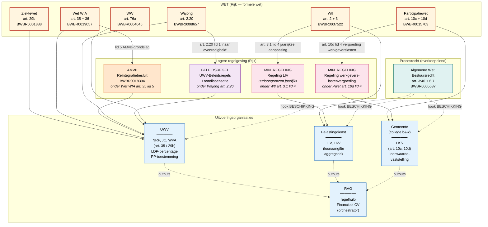

# Financieel CV — stelsel en grondslagen

Voor de kick-off met het regelhulp Financieel CV-team. In de stijl van
het HHNK-kwijtschelding-stelsel (workshop 2026-04-23): per Financieel
CV-regeling laten zien op welk **regulatory_layer-niveau** de
inhoudelijke regels staan, en welke organisatie de uitvoering doet.

## Lezing van het diagram

**Verticaal stelsel (Nederlandse rechtsleer):**

1. **Wet** — door de Staten-Generaal vastgestelde formele wet. Hier
   staan de inhoudelijke aanspraken (recht op NRP, hoogte LKS-formule,
   etc.). Rood-omrand.

2. **AMvB / Min. regeling / Beleidsregel** — gedelegeerde regelgeving
   die door de wet wordt opgeroepen via `open_term`-clausules ("bij
   ministeriële regeling", "bij of krachtens algemene maatregel van
   bestuur", "naar evenredigheid"). In onze YAML's gemodelleerd als
   `open_terms` met `delegation_type` en `legal_basis`.

3. **Uitvoeringsorganisaties** — de partijen die de regeling
   feitelijk toepassen op individuele cases (UWV, Belastingdienst,
   gemeente). Geen wetgever — wel beslissingsdragers. Output =
   beschikking.

4. **Regelhulp / orchestrator** — RVO bouwt geen nieuwe juridische
   regels, maar bevraagt de 8 onderliggende regelingen voor één
   werkgever-werknemer-scenario. Modelleerbaar als
   `regulatory_layer: UITVOERINGSBELEID`.

5. **Procesrecht (AWB)** — niet een aparte regeling maar een
   procedurele schil rond elke beschikking. In onze YAML's via
   `hooks` op `legal_character: BESCHIKKING`.

## Welke regeling op welk niveau

| Regeling | Inhoud zit in | Lagere regelgeving | Wie voert uit |
|----------|---------------|---------------------|---------------|
| **NRP**  | Ziektewet 29b lid 1, 2, 4 | (geen — directe wet)  | UWV |
| **PP**   | WW 76a lid 1-4            | Lid 5 — open MR (geen actuele) | UWV |
| **LIV**  | Wtl 3.1 + 3.2             | Regeling LIV (uurloongrenzen) | Belastingdienst |
| **LKV**  | Wtl 2.1 + categorieën     | (bedragen direct in wet)        | Belastingdienst |
| **LKS**  | Pwet 10c + 10d            | Min. regeling werkgeverslasten (10d.4) | Gemeente |
| **LDP**  | Wajong 2:20 lid 1 + 2     | UWV-Beleidsregels loondispensatie | UWV |
| **JC**   | Wet WIA 35 lid 1, 2.d, 4  | Reïntegratiebesluit (AMvB) | UWV |
| **WPA**  | Wet WIA 35 lid 1, 2.c, 4 + 36 | Reïntegratiebesluit (AMvB) | UWV |

## Open delegaties (`open_term`-blokken in YAML)

Per regeling welke gedelegeerde regelgeving door onze
machine_readable als `open_term` is opgeroepen, en wat de wet daar
zegt:

- **PP — `nadere_regels_uitvoering_proefplaatsing`** (WW 76a lid 5):
  "Bij ministeriële regeling kunnen nadere regels worden gesteld
  omtrent de uitvoering van het eerste tot en met vierde lid." Geen
  actuele regeling bekend — placeholder in YAML.
- **LIV — `liv_uurloongrenzen_per_jaar`** (Wtl 3.1 lid 4): "Bij het
  begin van het kalenderjaar worden de bedragen ... bij regeling van
  Onze Minister ... gewijzigd." Hardgecodeerd voor 2024 als literals
  (1433, 1491, 49, 96000), met open_term-placeholder voor toekomstige
  jaaroverzichten.
- **LKS — `werkgeverslastenvergoeding_eurocent`** (Pwet 10d lid 4):
  "vermeerderd met een bij ministeriële regeling vastgestelde
  vergoeding voor werkgeverslasten". Niet uitgewerkt in deze YAML.
- **LDP — `dispensatiepercentage`** (Wajong 2:20 lid 1, BR-niveau):
  "vermindert het UWV ... naar evenredigheid". Het percentage zelf is
  uitvoeringsbeleid van UWV, niet uit de wet af te leiden.
- **JC + WPA — `nadere_regels_voorzieningen_artikel_35`** (Wet WIA
  art. 35 lid 5): "Bij of krachtens algemene maatregel van bestuur
  kunnen nadere regels worden gesteld." Verwijst naar
  Reïntegratiebesluit (BWBR0018394), nog niet als
  `implements`-relatie geharvest.

## Wat dit diagram laat zien voor de kick-off

1. **Het stelsel is verstrengeld over zes wetten + AWB.** Dat is de
   reden dat één regelhulp (RVO) bestaansrecht heeft: anders moet de
   werkgever bij elke uitvoeringsorganisatie apart aankloppen.
2. **De delegatie loopt via vier regulatory_layers.** Onze YAML's
   modelleren dat correct via `open_term` (top-down) en — waar
   gewenst — `implements` (bottom-up).
3. **Drie verschillende uitvoeringsorganisaties** dekken de 8
   regelingen. Voor de regelhulp betekent dat: drie verschillende
   sleutels, drie verschillende formats, drie verschillende
   beslistermijnen.
4. **AWB is universeel.** Elke beschikking erft motiveringsplicht +
   bezwaartermijn. Voor de regelhulp betekent dat: één
   bezwaarsjabloon volstaat in eerste instantie, AWB-hooks in onze
   YAML's vangen dit automatisch op.
