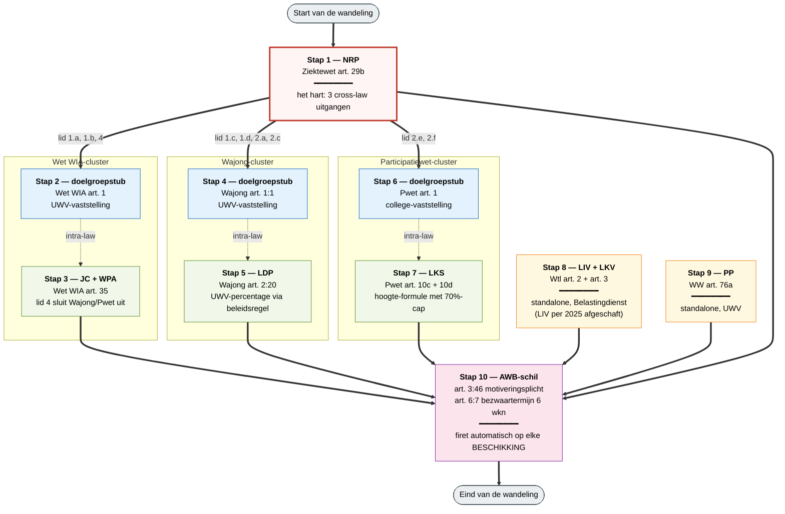
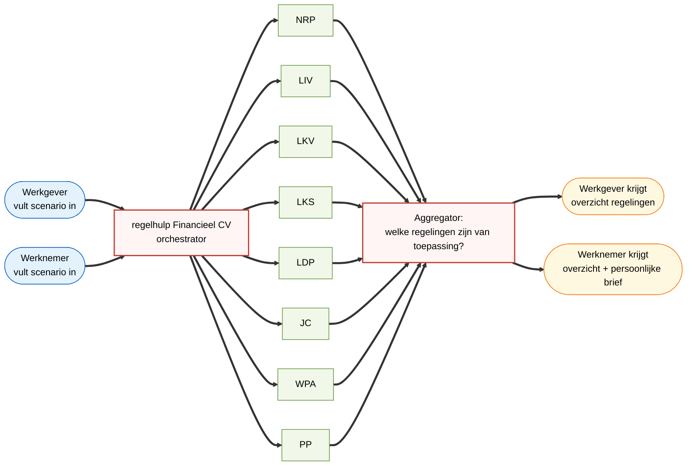

# Wandelpad door de Financieel CV-wetten

Educatieve route door de zes wetten plus AWB. **Niet** de runtime-flow
van de regelhulp (die is parallel/fan-out) maar een statische tour
voor uitleg: meest verbonden eerst, dan steeds verder de buitenring in.

## Lezing van het diagram

**Kleurcodering:**

- 🟥 *hub* (rood, dik kader) — NRP als meest verbonden regeling, het natuurlijke startpunt
- 🟦 *stub* (blauw) — doelgroepvaststelling, pass-through naar UWV/college
- 🟩 *regeling* (groen) — uitwerking-artikel binnen een cluster
- 🟨 *alone* (geel) — regeling zonder cross-law verbindingen
- 🟪 *proces* (paars) — procesrechtelijke schil

**Lijntypen:**

- ════ dikke pijl — cross-law `input.source.regulation` (echte verwijzing naar andere wet)
- ╶╶╶╶ gestippeld — intra-law (binnen dezelfde wet, niet expliciet via source)

**Drie clusters zichtbaar:**

1. **De WIA/Wajong/Pwet-cluster** — drie wetten die elk twee rollen vervullen: doelgroepstub voor NRP én eigen regeling-uitwerking. NRP is hier de orchestrator.
2. **Wtl-cluster** — twee fiscale tegemoetkomingen, geen externe afhankelijkheden, Belastingdienst voert uit.
3. **WW-monade** — alleen PP, geen connecties, UWV voert uit.

Plus AWB als procedurele schil over alles.

## Niet hetzelfde als de runtime-flow

Dit diagram laat zien **hoe je het stelsel uitlegt**, niet **hoe de regelhulp werkt**. De regelhulp Financieel CV doet een fan-out: één invoerformulier, acht parallelle bevragingen, één overzicht terug. **Twee soorten gebruikers** kunnen de regelhulp gebruiken — werkgever en werknemer — met een licht andere uitkomst (de werknemer krijgt naast het overzicht ook een persoonlijke brief). Die runtime-flow ziet eruit als:

Voor de **werkgever** is de vraag: "Als ik deze persoon aanneem, op
welke regelingen krijg ik aanspraak?" Voor de **werknemer**: "Bij een
toekomstige werkgever, welke financiële voordelen kan ik bieden?" De
8 onderliggende regelingen blijven hetzelfde, alleen de presentatie
en de aanvullende brief verschillen.

Use-case in de workshop: eerst de wandeling tonen ("dit is hoe het stelsel zit"), daarna de fan-out ("zo werkt de regelhulp er bovenop, voor beide gebruikersgroepen"). Dat scheidt het juridisch begrip van het uitvoeringsbeleid.
