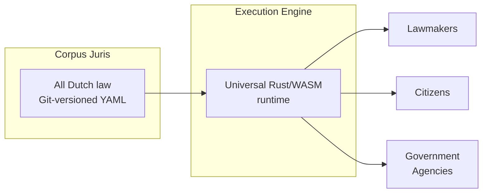

# What is RegelRecht?

RegelRecht is an open-source platform for making Dutch legislation machine-readable and executable. Lawmakers draft in it, government agencies run it, and citizens can inspect how decisions about them are made.

## The Problem

Dutch law is published as natural language text. When government agencies need to implement legislation in IT systems, they manually translate legal rules into software. Each agency writes its own interpretation of the same law. Nobody can check whether those implementations match what Parliament intended. Citizens cannot see how decisions about them are made. And there is no way to test whether the software actually follows the law.

## The Vision

RegelRecht takes a different approach: encode each law once in a structured format, and run it through a single execution engine. The specification *is* the law. One engine runs it the same way everywhere: in the editor for lawmakers, in the browser for citizens, and in government backends for official decisions.

### Architecture

1. **Corpus Juris**: a git-versioned repository containing all Dutch laws in machine-readable YAML format. Laws are organized by type and versioned by effective date.

2. **Execution Engine**: a deterministic Rust engine that evaluates laws given inputs. It compiles to both native code and WebAssembly, running identically in every context.

## Key Concepts

### Cross-Law References

Dutch laws reference each other extensively. The Wet op de zorgtoeslag references the Zorgverzekeringswet, the AWIR, and the BRP. The engine resolves these dependencies automatically - if law A depends on a value computed by law B, the engine executes both.

### Inversion of Control

Higher laws (e.g., a *wet*) can declare **open terms** that lower regulations (e.g., a *ministeriële regeling*) fill in. This mirrors the legal delegation hierarchy. Lower regulations register themselves via `implements` - just as they do in statute books with *"Gelet op artikel 4 van de Wet op de zorgtoeslag"*.

### Execution-First Validation

Rather than having humans analyze law and build specifications (analysis-first), RegelRecht uses AI to generate candidate specifications, then has legal experts **validate and challenge** them. Test scenarios are derived from the **Memorie van Toelichting** - the explanatory memorandum containing the legislature's intended examples.

### Federated Corpus

Legislation is decentralized: municipalities, provinces, and water boards produce their own regulations. The corpus supports **federated sources** - each authority maintains their own regulations in their own Git repository, while the engine discovers and loads them via a registry.

### Administrative Procedures

Individual decisions (*beschikkingen*) are not instant computations - they are administrative law processes spanning stages over time (application → review → decision → notification → objection). The AWB lifecycle is modeled as data in YAML, not hardcoded in the engine.

## Design Principles

| Principle | What It Means |
|-----------|--------------|
| **Zero domain knowledge** | No hardcoded holidays, tax rates, or special cases. Everything comes from law YAML. |
| **Identical execution** | Browser, backend, editor — same inputs, same result. |
| **Version control as governance** | Git history captures legislative evolution. Branches are proposals, merges are publication. |
| **Traceability** | Every computed value points back to a specific article and paragraph. |
| **Open by default** | Law, tooling, decisions — all publicly auditable. |

## Next Steps

- [Getting Started](./getting-started) - set up your development environment
- [Law Format](/concepts/law-format) - understand the YAML law format
- [Architecture](./architecture) - system design and components
- [RFCs](/rfcs/) - all design decisions
