<!-- Generated by packages/arch-extract (`just arch-generate`). Do not edit by hand. -->

Zooming into the containers, each crate's top-level modules are its components. This is the system-wide overview; the per-crate pages drill into a single crate's full module tree and types.

## Components

```mermaid
C4Component
    title RegelRecht — Components (top-level modules)
    Container_Boundary(admin, "admin") {
        Component(admin__config, "config", "module")
        Component(admin__corpus_handlers, "corpus_handlers", "module")
        Component(admin__error, "error", "module")
        Component(admin__handlers, "handlers", "module")
        Component(admin__metrics, "metrics", "module")
        Component(admin__middleware, "middleware", "module")
        Component(admin__models, "models", "module")
        Component(admin__state, "state", "module")
    }
    Container_Boundary(auth, "auth") {
        Component(auth__config, "config", "module", "Shared OIDC configuration, loaded from environment variables.")
        Component(auth__handlers, "handlers", "module")
        Component(auth__middleware, "middleware", "module")
        Component(auth__oidc, "oidc", "module")
        Component(auth__test_utils, "test_utils", "module", "Test-only helpers for seeding authenticated sessions in middleware tests.")
    }
    Container_Boundary(corpus, "corpus") {
        Component(corpus__annotation_schema, "annotation_schema", "module", "Note (annotation) YAML schema validation.")
        Component(corpus__auth, "auth", "module")
        Component(corpus__backend, "backend", "module")
        Component(corpus__client, "client", "module")
        Component(corpus__config, "config", "module")
        Component(corpus__dto, "dto", "module", "Shared DTOs and helpers for corpus list endpoints.")
        Component(corpus__error, "error", "module")
        Component(corpus__github, "github", "module", "GitHub API client for fetching regulation files from remote repositories.")
        Component(corpus__github_api_backend, "github_api_backend", "module", "API-only [`RepoBackend`] implementation against the GitHub REST API.")
        Component(corpus__models, "models", "module")
        Component(corpus__pr_client, "pr_client", "module", "GitHub Pull Request API client.")
        Component(corpus__registry, "registry", "module")
        Component(corpus__repo_access, "repo_access", "module", "Pre-flight checks for a GitHub repository before we commit a traject")
        Component(corpus__source_map, "source_map", "module")
        Component(corpus__timing, "timing", "module", "Request-scoped phase timing.")
        Component(corpus__validation, "validation", "module")
    }
    Container_Boundary(editor_api, "editor-api") {
        Component(editor_api__accounts, "accounts", "module", "Account upsert layer.")
        Component(editor_api__config, "config", "module")
        Component(editor_api__corpus_handlers, "corpus_handlers", "module")
        Component(editor_api__crypto, "crypto", "module", "Authenticated encryption for secrets that leave the server.")
        Component(editor_api__favorites, "favorites", "module")
        Component(editor_api__feature_flags, "feature_flags", "module")
        Component(editor_api__github_oauth, "github_oauth", "module", "Per-user GitHub OAuth link flow (spike).")
        Component(editor_api__harvest_proxy, "harvest_proxy", "module")
        Component(editor_api__middleware, "middleware", "module")
        Component(editor_api__state, "state", "module")
        Component(editor_api__task_requests, "task_requests", "module", "Enrich-op-aanvraag: een gebruiker laat een wet uit zijn traject verrijken.")
        Component(editor_api__tasks_api, "tasks_api", "module", "Taken-API: de persoonlijke taken van de ingelogde gebruiker.")
        Component(editor_api__traject_corpus, "traject_corpus", "module", "Per-traject corpus state.")
        Component(editor_api__trajects, "trajects", "module", "Traject CRUD endpoints.")
        Component(editor_api__user_notes, "user_notes", "module", "Persoonlijke notities: private per-user notes on a law.")
        Component(editor_api__user_settings, "user_settings", "module")
    }
    Container_Boundary(engine, "engine") {
        Component(engine__annotation, "annotation", "module", "Stand-off note resolution (RFC-005, RFC-018).")
        Component(engine__article, "article", "module", "Article-based law loading (engine side).")
        Component(engine__config, "config", "module", "Configuration constants for the RegelRecht engine")
        Component(engine__context, "context", "module", "Execution context for article evaluation")
        Component(engine__data_source, "data_source", "module", "Data source registry for external data resolution")
        Component(engine__engine, "engine", "module", "Article execution engine")
        Component(engine__error, "error", "module", "Error types for the RegelRecht engine")
        Component(engine__operations, "operations", "module", "Operation execution for the RegelRecht engine")
        Component(engine__priority, "priority", "module", "Priority resolution for competing implementations.")
        Component(engine__receipt, "receipt", "module", "Execution Receipt (RFC-013)")
        Component(engine__resolver, "resolver", "module", "Rule resolver for cross-law lookups")
        Component(engine__schema, "schema", "module", "Embedded JSON Schemas + version detection, shared by the `validate` binary")
        Component(engine__service, "service", "module", "Service layer for cross-law resolution")
        Component(engine__telemetry, "telemetry", "module", "OpenTelemetry integration for the RegelRecht engine.")
        Component(engine__trace, "trace", "module", "Execution tracing for audit trails and debugging")
        Component(engine__types, "types", "module", "Engine runtime types.")
        Component(engine__units, "units", "module", "Unit-of-measurement model and algebra (RFC-023).")
        Component(engine__uri, "uri", "module", "URI parsing for regelrecht:// URIs and file path references")
        Component(engine__wasm, "wasm", "module", "WASM bindings for the RegelRecht engine")
    }
    Container_Boundary(harvester, "harvester") {
        Component(harvester__cli, "cli", "module", "Command-line interface for the harvester.")
        Component(harvester__config, "config", "module", "Configuration constants and validation functions for the harvester.")
        Component(harvester__content, "content", "module", "Content (consolidated legal text) file downloading.")
        Component(harvester__cvdr, "cvdr", "module", "CVDR (Centrale Voorziening Decentrale Regelgeving) harvester module.")
        Component(harvester__error, "error", "module", "Error types for the harvester.")
        Component(harvester__harvester, "harvester", "module", "Main harvester service that ties all components together.")
        Component(harvester__http, "http", "module", "HTTP client wrapper for downloading from BWB repository.")
        Component(harvester__manifest, "manifest", "module", "BWB manifest parsing for consolidation date resolution.")
        Component(harvester__registry, "registry", "module", "Element registry system for extensible XML parsing.")
        Component(harvester__source, "source", "module", "Strategy trait for downloading laws from different sources.")
        Component(harvester__splitting, "splitting", "module", "Article splitting system for Dutch law documents.")
        Component(harvester__types, "types", "module", "Core data types for the harvester.")
        Component(harvester__wti, "wti", "module", "WTI (Wetstechnische Informatie) metadata file parsing.")
        Component(harvester__xml, "xml", "module", "XML utilities for parsing Dutch law content.")
        Component(harvester__yaml, "yaml", "module", "YAML output generation for law files.")
    }
    Container_Boundary(law_model, "law-model") {
        Component(law_model__header, "header", "module", "Tolerant, line-based extraction of a law's header fields.")
        Component(law_model__model, "model", "module", "Article-based law document model.")
        Component(law_model__value, "value", "module", "Core law-model value types shared across the workspace.")
    }
    Container_Boundary(pipeline, "pipeline") {
        Component(pipeline__api, "api", "module")
        Component(pipeline__api_state, "api_state", "module")
        Component(pipeline__config, "config", "module")
        Component(pipeline__db, "db", "module")
        Component(pipeline__document_convert, "document_convert", "module", "Document-convert jobs: turn an uploaded document of any format into a clean")
        Component(pipeline__enrich, "enrich", "module")
        Component(pipeline__error, "error", "module")
        Component(pipeline__feature_flags, "feature_flags", "module")
        Component(pipeline__harvest, "harvest", "module")
        Component(pipeline__harvest_request, "harvest_request", "module", "Canonical 'request a harvest' entry point.")
        Component(pipeline__health, "health", "module", "Health endpoint helper shared by worker binaries.")
        Component(pipeline__job_queue, "job_queue", "module")
        Component(pipeline__law_convert, "law_convert", "module", "Law-convert jobs: turn an uploaded PDF/Word document into a harvested")
        Component(pipeline__law_status, "law_status", "module")
        Component(pipeline__models, "models", "module")
        Component(pipeline__tasks, "tasks", "module", "Persoonlijke review-taken voor async jobs.")
        Component(pipeline__test_utils, "test_utils", "module", "Test helpers exposed via the `test-utils` Cargo feature.")
        Component(pipeline__traject_harvest, "traject_harvest", "module", "Traject-scoped harvest (taak-flow): haal een wet uit BWB op voor één")
        Component(pipeline__untranslatables, "untranslatables", "module", "Persistence for RFC-012 'untranslatables' captured during enrichment.")
        Component(pipeline__worker, "worker", "module")
    }
    Container_Boundary(shared, "shared") {
        Component(shared__regulatory_layer, "regulatory_layer", "module", "Canonical regulatory layer types for Dutch law.")
        Component(shared__telemetry, "telemetry", "module", "Shared telemetry helpers for regelrecht binaries.")
    }
    Container_Boundary(tui, "tui") {
        Component(tui__app, "app", "module")
        Component(tui__backend, "backend", "module")
        Component(tui__components, "components", "module")
        Component(tui__event, "event", "module")
        Component(tui__ui, "ui", "module")
        Component(tui__views, "views", "module")
    }
```

