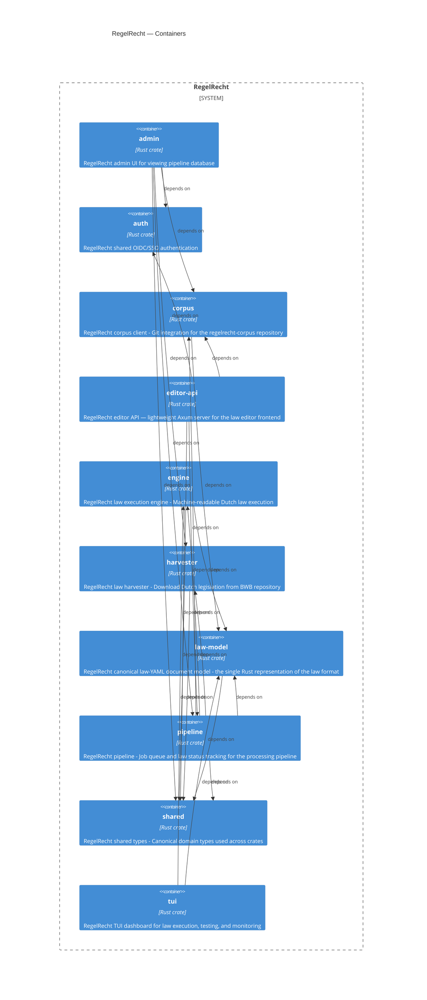

<!-- Generated by packages/arch-extract (`just arch-generate`). Do not edit by hand. -->

Zooming into the system, each crate is a container. Arrows are normal (non-dev, non-build) path dependencies between workspace members, which yields the production layer graph `shared` → `law-model`/`auth` → `engine`/`harvester`/`corpus` → `pipeline` → `admin`/`editor-api`/`tui`.

## Containers

