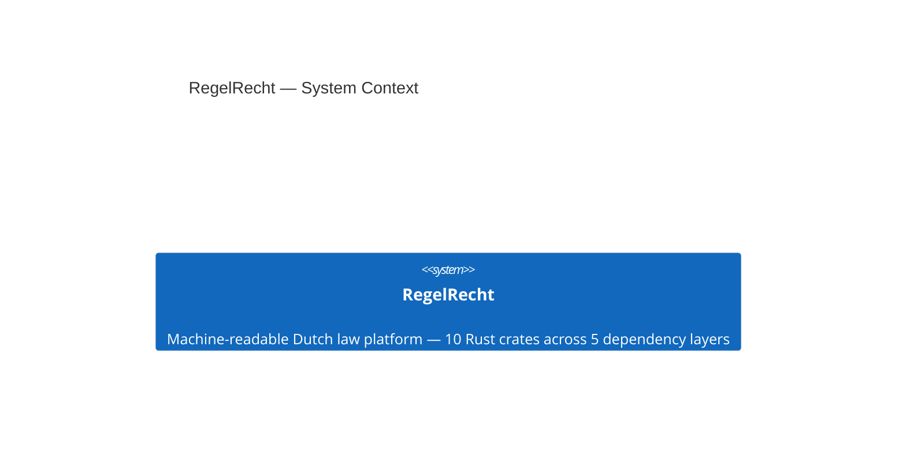

<!-- Generated by packages/arch-extract (`just arch-generate`). Do not edit by hand. -->

At the highest level RegelRecht is one system: a set of Rust crates that together turn machine-readable Dutch law into an executable, auditable platform. External actors (citizens, agencies, the BWB source) sit outside the code-derived model and so are not shown here.

## System context

