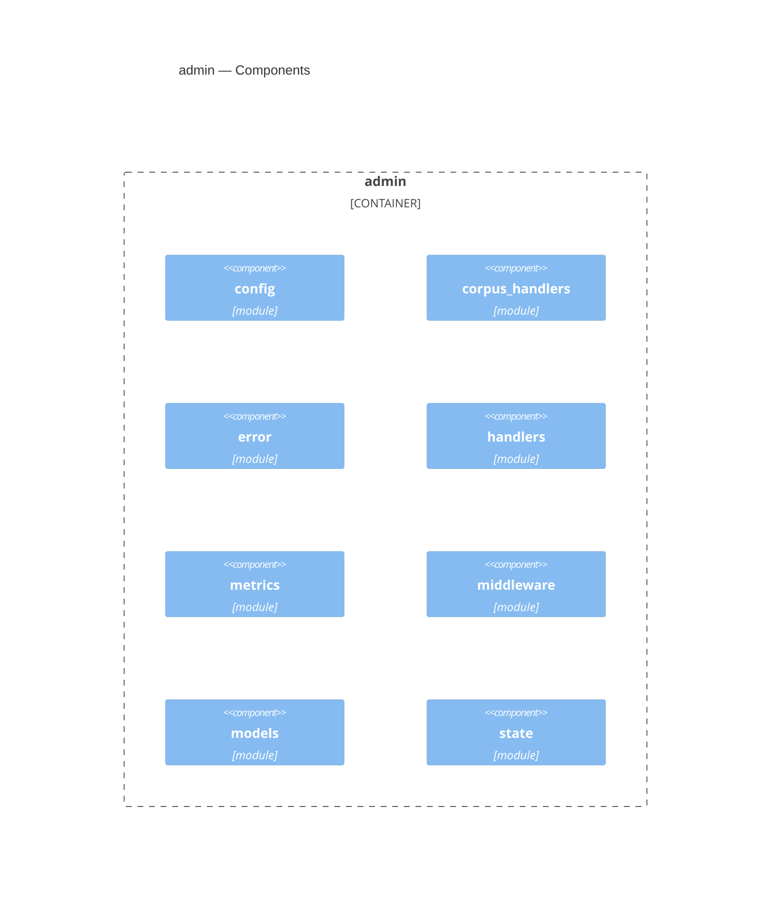

<!-- Generated by packages/arch-extract (`just arch-generate`). Do not edit by hand. -->

RegelRecht admin UI for viewing pipeline database

Source: `packages/admin`

## Dependencies

- [auth](/architecture/crates/auth)
- [corpus](/architecture/crates/corpus)
- [harvester](/architecture/crates/harvester)
- [pipeline](/architecture/crates/pipeline)
- [shared](/architecture/crates/shared)

## Dependents

No other workspace crate depends on this crate.

## Components

## Types

| Type | Kind | Description |
| --- | --- | --- |
| `AppConfig` | struct |  |
| `CorpusLawEntry` | struct | A law entry with source provenance. |
| `ApiError` | enum | Typed API errors for admin handlers. |
| `ErrorBody` | struct | Structured API error response body. |
| `CreateEnrichBody` | struct |  |
| `CreateEnrichResponse` | struct |  |
| `CreateJobBody` | struct |  |
| `CreateJobResponse` | struct |  |
| `DailyCounts` | struct | Per-day counts for one job type: jobs created that day (`added`) and jobs |
| `DailyEntry` | struct | One Europe/Amsterdam calendar day (`YYYY-MM-DD`) in the 14-day window. |
| `DashboardStats` | struct |  |
| `DeleteJobsRequest` | struct |  |
| `DeleteJobsResponse` | struct |  |
| `ExecutedBlock` | struct |  |
| `JobSummary` | struct |  |
| `JobsBlock` | struct |  |
| `JobsQuery` | struct |  |
| `JobsSummaryQuery` | struct |  |
| `LawEntriesQuery` | struct |  |
| `PlatformInfo` | struct |  |
| `RecentFailure` | struct | One failed job for the "recent failures" list, with its failure reason. |
| `StatusCounts` | struct | Job counts per status. The four fields are the full `job_status` enum; an |
| `TypeCounts` | struct | Job counts per type. The two fields are the full `job_type` enum. |
| `TypeStatus` | struct | Per-type breakdown of the status counts. |
| `UntranslatablesQuery` | struct |  |
| `WindowCounts` | struct | Count of jobs "executed" in a time window, split by type. A job's effective |
| `CachedMetrics` | struct | Cached response: the encoded Prometheus text and when it was generated. |
| `FailedByType` | struct | Failed job counts split by job type. |
| `MetricsSnapshot` | struct | Raw metrics data fetched from the database. |
| `StatusLabel` | struct |  |
| `PaginatedResponse` | struct |  |
| `Untranslatable` | struct | A captured untranslatable (RFC-012) as returned by the harvester API. Unlike |
| `AppState` | struct |  |
| `CorpusState` | struct | State for the corpus subsystem. |
