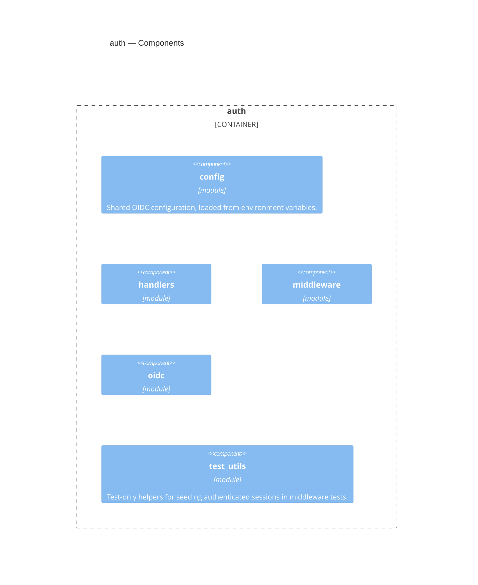

<!-- Generated by packages/arch-extract (`just arch-generate`). Do not edit by hand. -->

RegelRecht shared OIDC/SSO authentication

Source: `packages/auth`

## Dependencies

This crate depends on no other workspace crate.

## Dependents

- [admin](/architecture/crates/admin)
- [editor-api](/architecture/crates/editor-api)

## Components

## Types

| Type | Kind | Description |
| --- | --- | --- |
| `OidcAppState` | trait | Trait implemented by each service's `AppState` to provide OIDC context |
| `OidcConfig` | struct |  |
| `AuthStatus` | struct |  |
| `CallbackQuery` | struct |  |
| `JwtPayload` | struct |  |
| `LoginQuery` | struct |  |
| `PersonInfo` | struct |  |
| `RealmAccess` | struct |  |
| `RefreshOutcome` | enum | Result of a refresh attempt, decoupled from the oauth2/HTTP types so the |
| `RoleCheck` | enum | Outcome of a session-based role check. Independent of any HTTP error type |
| `DiscoveryResult` | struct |  |
| `SeedQuery` | struct | Query string for the `/seed` helper route. A comma-separated list of |
