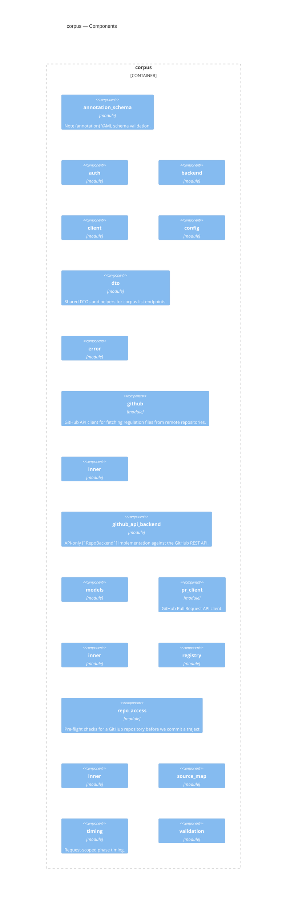

<!-- Generated by packages/arch-extract (`just arch-generate`). Do not edit by hand. -->

RegelRecht corpus client - Git integration for the regelrecht-corpus repository

Source: `packages/corpus`

## Dependencies

- [law-model](/architecture/crates/law-model)

## Dependents

- [admin](/architecture/crates/admin)
- [editor-api](/architecture/crates/editor-api)
- [pipeline](/architecture/crates/pipeline)

## Components

## Types

| Type | Kind | Description |
| --- | --- | --- |
| `AppendOutcome` | enum | Outcome of preparing an append-only write of `new_notes` onto a sidecar. |
| `NoteTargetError` | enum | Why a note's `target.source` is not an acceptable reference to the law |
| `RegelrechtRef` | enum | A parsed `regelrecht://...` URI. Annotations can target laws |
| `AuthConfig` | struct | Auth configuration for a corpus source, loaded from `corpus-auth.yaml`. |
| `CredentialResolver` | struct | The one entry point for answering "which server token do we use for this |
| `SourceAuth` | struct | Auth entry for a single source. |
| `TokenContext` | struct | What to resolve a token *for*. Constructed via [`TokenContext::for_source`] |
| `TokenDecision` | struct | Outcome of a token lookup: the token (if any) plus where it came from. |
| `TokenOrigin` | enum | Where a resolved server token came from. Makes the strict-vs-legacy |
| `EditorUser` | struct | Identifies the human editor behind a write — surfaced as a |
| `FileEntry` | struct | A file entry returned by list operations. |
| `GitBackend` | struct | Backend that reads/writes to a local git checkout and commits/pushes on persist. |
| `LocalBackend` | struct | Backend that reads/writes directly to the local filesystem. |
| `PersistOutcome` | struct | Result of a [`RepoBackend::persist`] call. |
| `PrInfo` | struct | Identifies a PR opened or updated as part of a [`RepoBackend::persist`] |
| `RecursiveFileEntry` | struct | Entry returned by recursive list operations. Carries the path |
| `RepoBackend` | trait | Abstraction over different corpus storage backends. |
| `SessionGitBackend` | struct | Backend used by the editor write-back path (RFC-010 phase 6). |
| `WriteContext` | struct | Metadata for a write operation (used as commit message for git backends). |
| `CorpusClient` | struct |  |
| `CorpusConfig` | struct |  |
| `PaginationParams` | struct | Pagination query parameters. |
| `SourceSummary` | struct | Summary of a corpus source returned by `GET /api/sources`. |
| `CorpusError` | enum |  |
| `Committer` | struct | Commit identity used on Contents/Git Data API writes. Both |
| `CompareFile` | struct |  |
| `CompareResponse` | struct | Compare-API response for `GET /repos/{repo}/compare/{base}...{head}`. |
| `ContentsItem` | struct | Raw shape of the Contents API response for a single path. Used both |
| `DirectoryEntry` | struct | Single entry returned by a Contents API directory listing. Only the |
| `FetchResult` | enum | Result of fetching a GitHub source. |
| `FetchedFile` | struct | A fetched file from GitHub. |
| `GitHubFetcher` | struct | GitHub fetcher with ETag caching and rate limit awareness. |
| `PutContent` | struct |  |
| `PutResponse` | struct | Subset of the Contents-API PUT response we care about. The full |
| `RefObject` | struct |  |
| `RefResponse` | struct | Refs-API response for `GET /git/ref/heads/{branch}`. We only need |
| `TreeEntry` | struct |  |
| `TreeFile` | struct | A YAML file discovered via the Trees API: its repo-relative path |
| `TreeResponse` | struct | GitHub API response for the Trees endpoint. |
| `GitHubApiBackend` | struct |  |
| `Inner` | struct | Mutable state guarded by the backend's mutex. The fetcher lives here |
| `PendingOp` | enum |  |
| `PendingWrite` | struct | Pending change buffered between `write_file`/`delete_file` and |
| `GitHubSource` | struct | Configuration for a GitHub repository source. |
| `LocalSource` | struct | Configuration for a local filesystem source. |
| `RegistryManifest` | struct | Top-level corpus registry manifest. |
| `Scope` | struct | Jurisdictional scope definition. |
| `Source` | struct | A corpus source definition. |
| `SourceType` | enum | Source type discriminator with configuration. |
| `CreatePrBody` | struct |  |
| `PrResponse` | struct |  |
| `PullRequestClient` | struct | Hand-rolled GitHub Pulls API client. |
| `UpdatePrBody` | struct |  |
| `CorpusRegistry` | struct | Corpus registry that manages source definitions. |
| `ScanTokenOverride` | struct | Per-call token override for the index scan of exactly **one** source. |
| `SourceIndexFailure` | struct | A source that failed to enumerate during |
| `RepoAccessError` | enum | Distinct failure modes for repo access validation. The editor-api |
| `RepoInfo` | struct | Information we glean from a successful validation call. The |
| `RepoPermissions` | struct |  |
| `RepoResponse` | struct | Minimal subset of the `/repos/{owner}/{repo}` response we care |
| `CollectedOutput` | struct | A collected output with the parameters required by its article's execution block. |
| `ConflictResolution` | struct | Record of a conflict that was resolved by priority. |
| `LawAction` | struct |  |
| `LawArticle` | struct |  |
| `LawDoc` | struct |  |
| `LawExec` | struct |  |
| `LawImplements` | struct | One `machine_readable.implements` entry — the IoC link from a lower |
| `LawMr` | struct |  |
| `LawOutput` | struct | An output entry from `execution.output`. |
| `LawParam` | struct | A parameter entry from `execution.parameters`. |
| `LoadedLaw` | struct | A loaded law with its source provenance. |
| `SourceMap` | struct | Aggregates laws from multiple sources with priority-based conflict resolution. |
| `Recorder` | struct | Collects the phase durations recorded during a single request. |
| `ScopeWarning` | struct | A validation warning for a law outside its source's scope. |
