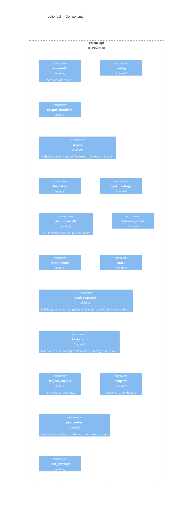

<!-- Generated by packages/arch-extract (`just arch-generate`). Do not edit by hand. -->

RegelRecht editor API — lightweight Axum server for the law editor frontend

Source: `packages/editor-api`

## Dependencies

- [auth](/architecture/crates/auth)
- [corpus](/architecture/crates/corpus)
- [pipeline](/architecture/crates/pipeline)
- [shared](/architecture/crates/shared)

## Dependents

No other workspace crate depends on this crate.

## Components

## Types

| Type | Kind | Description |
| --- | --- | --- |
| `AccountRecord` | struct |  |
| `AppConfig` | struct |  |
| `CorpusLawEntry` | struct | A law entry with source provenance. |
| `EditorWriteTarget` | struct | Resolved write target for editor saves: a backend lock + the file |
| `LawOutputEntry` | struct | An output entry from a law's machine_readable.execution.output. |
| `LawParamEntry` | struct | A parameter required by the execution block that declares an output. |
| `PromoteFile` | struct | One file collected from a seed source for a promote, addressed by its |
| `PromoteResponse` | struct | Response body of a promote: how many files were copied and, when the |
| `ReadScope` | enum | Read-time scope for the corpus endpoints. Either the per-traject |
| `ReloadRequest` | struct |  |
| `ReloadResponse` | struct |  |
| `ResolvedBackend` | struct | Resolved backend information for a law (read-path only). |
| `SaveDocumentResponse` | struct |  |
| `SavePrInfo` | struct |  |
| `SaveResponse` | struct | Response body for a successful save. |
| `ScenarioEntry` | struct | A scenario file entry. |
| `TrajectDocumentList` | struct |  |
| `TrajectDocumentListEntry` | struct |  |
| `TrajectJobList` | struct |  |
| `TrajectLawWrite` | struct | Resolved write routing for a law in a traject: the law's index |
| `TrajectScope` | struct | Traject-scoped read state: the per-traject corpus plus the outcome of |
| `UploadDocumentResponse` | struct |  |
| `UploadLawResponse` | struct |  |
| `TokenCipher` | struct | Sealing/opening helper bound to one application key. |
| `UpdateFlag` | struct |  |
| `CallbackQuery` | struct |  |
| `ExchangedToken` | struct | Minimal shape we consume from GitHub's token endpoint. No `refresh_token`: |
| `GithubOAuth` | struct | Configuration + secrets for the GitHub OAuth App. Present in [`AppState`] |
| `GithubStatus` | struct |  |
| `GithubUser` | struct |  |
| `LoginQuery` | struct |  |
| `OAuthState` | struct | State carried through GitHub: the CSRF token (checked against the session on |
| `TokenEndpointResponse` | struct |  |
| `UserTokenCookie` | struct | Plaintext of the sealed cookie: the token plus the metadata `status` and |
| `AppState` | struct |  |
| `BackendEntry` | struct | A registered backend along with its writability flag, captured at init |
| `CorpusState` | struct | State for the corpus subsystem. |
| `EnrichRequestResponse` | struct |  |
| `TrajectHarvestRequest` | struct |  |
| `TrajectHarvestResponse` | struct |  |
| `ResolveAction` | enum |  |
| `ResolveRequest` | struct |  |
| `ResultFile` | struct |  |
| `TaskDetailResponse` | struct |  |
| `TaskListResponse` | struct |  |
| `BoundedCache` | struct | Lazily-fetched per-snapshot values with a FIFO size cap, keyed by a |
| `CachedCorpus` | struct | A built traject corpus plus the instant its index snapshot was |
| `ChangedLawsCache` | struct | Cached result of [`TrajectCorpus::changed_law_ids`] with the instant it |
| `ImplementorsResult` | struct | Result of [`TrajectCorpus::implementors_of`]: the implementing law ids |
| `ImplementsIndex` | struct | Per-snapshot forward index: each law's parsed `implements` list, plus |
| `ResetOnDrop` | struct | RAII reset for a single-flight `AtomicBool` held by a spawned task: |
| `ScenarioListEntry` | struct | One scenario file in a law's cached listing: the filename plus the law |
| `TrajectCorpus` | struct | Resolved corpus state for a single traject, plus per-source write |
| `TrajectCorpusCache` | struct | Lazy registry of per-traject corpora, mirroring the |
| `TrajectCorpusError` | enum |  |
| `TrajectSlot` | struct | Per-traject cache slot. `state` holds the current snapshot (None until |
| `TrajectSourceRow` | struct | DB row mirror for `traject_corpus_sources`. `gh_base_branch` is kept |
| `AddMemberRequest` | struct |  |
| `AddMemberResponse` | struct |  |
| `CreateTrajectRequest` | struct |  |
| `SeedSource` | struct | Flattened snapshot of a [`regelrecht_corpus::models::Source`] used to |
| `TrajectDetail` | struct |  |
| `TrajectInvite` | struct |  |
| `TrajectMember` | struct |  |
| `TrajectSourceDto` | struct |  |
| `TrajectSummary` | struct |  |
| `UpdateMemberRequest` | struct |  |
| `UpdateTrajectRequest` | struct |  |
| `WritableTarget` | struct | Resolved writable-own source coordinates for the create handler. |
| `NoteBody` | struct |  |
| `NoteRequest` | struct | Request body for creating or updating a note. `format` and |
| `NoteTarget` | struct |  |
| `UserNote` | struct | A personal note in W3C Web Annotation shape (RFC-005), so clients can |
| `SetBody` | struct |  |
