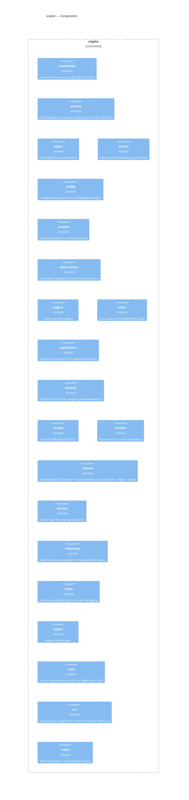

<!-- Generated by packages/arch-extract (`just arch-generate`). Do not edit by hand. -->

RegelRecht law execution engine - Machine-readable Dutch law execution

Source: `packages/engine`

## Dependencies

- [law-model](/architecture/crates/law-model)
- [shared](/architecture/crates/shared)

## Dependents

- [pipeline](/architecture/crates/pipeline)
- [tui](/architecture/crates/tui)

## Components

## Types

| Type | Kind | Description |
| --- | --- | --- |
| `EvaluateRequest` | struct |  |
| `EvaluateResponse` | struct |  |
| `HintWire` | struct | Wire format of a `regelrecht:hint` as it appears in YAML/JSON. |
| `MatchResult` | struct | The outcome of resolving a [`TextQuoteSelector`]. |
| `MatchStatus` | enum | Whether a selector could be located, and how unambiguously. |
| `RefinedBy` | struct |  |
| `SelectorHint` | struct | Performance hint: where to look first. |
| `TextMatch` | struct | A single located span in the law text. |
| `TextQuoteSelector` | struct | A W3C Web Annotation `TextQuoteSelector`. |
| `LawLoad` | trait | Engine-side loading of an [`ArticleBasedLaw`] from YAML, with the security |
| `RuleContext` | struct | Execution context for article evaluation. |
| `DataSource` | trait | Trait for data source implementations. |
| `DataSourceMatch` | struct | Result of a successful data source query. |
| `DataSourceRegistry` | struct | Registry for data sources with priority-based resolution. |
| `DictDataSource` | struct | Dictionary-based data source with key-based lookup. |
| `ArticleEngine` | struct | Executes a single article's machine_readable.execution section. |
| `ArticleResult` | struct | Result of article execution |
| `OutputProvenance` | enum | Provenance of an output value: how it was produced during execution. |
| `EngineError` | enum | Main error type for engine operations |
| `ExternalError` | enum | External-safe error type that sanitizes internal details. |
| `RoundMode` | enum | Rounding direction. |
| `ValueResolver` | trait | Trait for resolving variable references ($var) during operation execution. |
| `Candidate` | struct | A candidate implementation with its source law and article number. |
| `AcceptedValue` | struct | A value accepted from another organisation's engine (RFC-009). |
| `EngineConfig` | struct | Engine startup configuration that affects execution behavior. |
| `EngineIdentity` | struct | Engine identity for multi-org execution (RFC-009). |
| `ExecutionReceipt` | struct | Top-level execution receipt (RFC-013). |
| `LoadedRegulation` | struct | A regulation that was loaded during execution. |
| `ReceiptExecution` | struct | Execution parameters and context. |
| `ReceiptProvenance` | struct | Which engine and regulation produced the result. |
| `ReceiptResults` | struct | Execution outputs and optional trace. |
| `ReceiptScope` | struct | Which regulations were loaded during execution. |
| `ReceiptSource` | struct | A corpus source that was loaded. |
| `ScopeEntry` | struct | An active jurisdiction scope. |
| `HookEntry` | struct | A hook index entry linking a hook declaration to the law and article that defined it. |
| `LawArticleRef` | struct | A reference to a law article, used in implements and overrides indexes. |
| `RuleResolver` | struct | Resolves cross-law references and provides law registry functionality. |
| `SelectionReason` | enum | Why a law version could not be selected for a reference date. |
| `CacheEntry` | struct | Context for tracking cross-law resolution state. |
| `ExecutionOutcome` | enum | Outcome of a stage-aware execution step. |
| `LawExecutionService` | struct | High-level service for executing laws with automatic cross-law resolution. |
| `LawInfo` | struct | Metadata about a loaded law. |
| `ResolutionContext` | struct | Uses a scoped push/pop pattern for the visited set to avoid |
| `ServiceProvider` | trait | Trait for resolving cross-law references. |
| `StageState` | struct | State of a decision progressing through an AWB-defined procedure lifecycle (RFC-008). |
| `TraceGuard` | struct | RAII guard that pops a trace node when dropped. |
| `OtelGuard` | struct | Guard that shuts down the OTel provider on drop. |
| `BuildingNode` | struct | A node being built, with timing information. |
| `PathNode` | struct | A node in the execution trace tree. |
| `ScopeColumn` | enum | One indentation column in the box-drawing trace (4 chars wide). |
| `TraceBuilder` | struct | Builder for constructing execution traces using a stack-based approach. |
| `Connectivity` | enum | Engine connectivity mode — whether this engine resolves cross-law references. |
| `LegalStatus` | enum | Legal status of execution results. |
| `PathNodeType` | enum | Node type in execution trace |
| `ResolveType` | enum | Resolve type for variable resolution |
| `UntranslatableMode` | enum | How the engine handles articles with `untranslatables` annotations (RFC-012). |
| `AlgebraOp` | enum | The class of operation, for unit-algebra purposes. |
| `Dimension` | enum | The dimension a unit belongs to. Two units are dimension-compatible for |
| `SymbolUnits` | struct | Per-article table mapping symbol name → declared unit. |
| `Unit` | enum | A unit of measurement. `Unknown` means "no declared unit" and never errors. |
| `UnitFinding` | struct | A finding from static unit-checking. |
| `ReferenceType` | enum | Reference type indicating where the reference points |
| `RegelrechtUri` | struct | Parsed regelrecht:// URI or reference |
| `RegelrechtUriBuilder` | struct | Builder for constructing regelrecht:// URIs in a type-safe way |
| `WasmEngine` | struct | WASM-compatible law execution engine with cross-law resolution. |
| `WasmExecuteResult` | struct | Serializable result for execute() |
| `WasmExecuteResultWithTrace` | struct | Serializable result for executeWithTrace() |
| `WasmLawInfo` | struct | Serializable law info for get_law_info() |
