<!-- Generated by packages/arch-extract (`just arch-generate`). Do not edit by hand. -->

RegelRecht law harvester - Download Dutch legislation from BWB repository

Source: `packages/harvester`

## Dependencies

- [shared](/architecture/crates/shared)

## Dependents

- [admin](/architecture/crates/admin)
- [pipeline](/architecture/crates/pipeline)

## Components

```mermaid
C4Component
    title harvester — Components
    Container_Boundary(harvester, "harvester") {
        Component(harvester__cli, "cli", "module", "Command-line interface for the harvester.")
        Component(harvester__config, "config", "module", "Configuration constants and validation functions for the harvester.")
        Component(harvester__content, "content", "module", "Content (consolidated legal text) file downloading.")
        Component(harvester__cvdr, "cvdr", "module", "CVDR (Centrale Voorziening Decentrale Regelgeving) harvester module.")
        Component(harvester__cvdr__content, "content", "module", "CVDR XML content downloading.")
        Component(harvester__cvdr__manifest, "manifest", "module", "CVDR manifest parsing for version resolution.")
        Component(harvester__cvdr__parse, "parse", "module", "CVDR XML parsing into Article structs.")
        Component(harvester__cvdr__search, "search", "module", "SRU search API for CVDR metadata retrieval.")
        Component(harvester__error, "error", "module", "Error types for the harvester.")
        Component(harvester__harvester, "harvester", "module", "Main harvester service that ties all components together.")
        Component(harvester__http, "http", "module", "HTTP client wrapper for downloading from BWB repository.")
        Component(harvester__manifest, "manifest", "module", "BWB manifest parsing for consolidation date resolution.")
        Component(harvester__registry, "registry", "module", "Element registry system for extensible XML parsing.")
        Component(harvester__registry__config, "config", "module", "Registry configuration for Dutch law content parsing.")
        Component(harvester__registry__core, "core", "module", "Element registry for mapping tag names to handlers.")
        Component(harvester__registry__engine, "engine", "module", "Parse engine that orchestrates element parsing using the registry.")
        Component(harvester__registry__handler, "handler", "module", "Element handler trait definition.")
        Component(harvester__registry__handlers, "handlers", "module", "Element handlers for Dutch law XML.")
        Component(harvester__registry__handlers__inline, "inline", "module", "Inline element handlers for text-level elements.")
        Component(harvester__registry__handlers__preamble, "preamble", "module", "Preamble element handlers for law introductions.")
        Component(harvester__registry__handlers__structural, "structural", "module", "Structural element handlers for container elements.")
        Component(harvester__registry__types, "types", "module", "Types for the element registry system.")
        Component(harvester__source, "source", "module", "Strategy trait for downloading laws from different sources.")
        Component(harvester__splitting, "splitting", "module", "Article splitting system for Dutch law documents.")
        Component(harvester__splitting__config, "config", "module", "Configuration for Dutch law hierarchy.")
        Component(harvester__splitting__engine, "engine", "module", "Split engine that orchestrates article splitting using the hierarchy registry.")
        Component(harvester__splitting__registry, "registry", "module", "Hierarchy registry for article splitting.")
        Component(harvester__splitting__strategy, "strategy", "module", "Splitting strategies for article extraction.")
        Component(harvester__splitting__types, "types", "module", "Types for the article splitting system.")
        Component(harvester__types, "types", "module", "Core data types for the harvester.")
        Component(harvester__wti, "wti", "module", "WTI (Wetstechnische Informatie) metadata file parsing.")
        Component(harvester__xml, "xml", "module", "XML utilities for parsing Dutch law content.")
        Component(harvester__xml__utils, "utils", "module", "XML utility functions for navigating and extracting data from DOM trees.")
        Component(harvester__yaml, "yaml", "module", "YAML output generation for law files.")
        Component(harvester__yaml__text, "text", "module", "Text wrapping and normalization utilities for YAML output.")
        Component(harvester__yaml__writer, "writer", "module", "YAML writer for law files.")
    }
```

## Types

| Type | Kind | Description |
| --- | --- | --- |
| `Cli` | struct | RegelRecht Harvester - Download Dutch legislation from BWB and CVDR repositories. |
| `Commands` | enum |  |
| `CvdrVersion` | struct | A resolved CVDR version from the manifest. |
| `ParsedCvdrContent` | struct | Parsed content from CVDR XML. |
| `CvdrMetadata` | struct | Metadata extracted from CVDR SRU search results. |
| `HarvesterError` | enum | Main error type for the harvester library. |
| `NoTextReason` | enum | Why a BWB *work* has no consolidated text available to harvest. |
| `ParsedContent` | struct | Parsed content from XML. |
| `BwbManifest` | struct | Parsed BWB manifest containing available consolidations. |
| `Consolidation` | struct | A single consolidation expression from the manifest. |
| `ElementRegistry` | struct | Registry mapping element names to handlers. |
| `ParseEngine` | struct | Engine that orchestrates element parsing using the registry. |
| `ElementHandler` | trait | Trait for element handlers. |
| `AlHandler` | struct | Handler for `<al>` (paragraph/alinea) elements. |
| `ExtrefHandler` | struct | Handler for `<extref>` (external reference) elements. |
| `IntrefHandler` | struct | Handler for `<intref>` (internal reference) elements. |
| `NadrukHandler` | struct | Handler for `<nadruk>` (emphasis) elements. |
| `RedactieHandler` | struct | Handler for `<redactie>` (editorial note) elements. |
| `AanhefHandler` | struct | Handler for `<aanhef>` (preamble) elements. |
| `AfkondigingHandler` | struct | Handler for `<afkondiging>` (proclamation) elements. |
| `ConsideransAlHandler` | struct | Handler for `<considerans.al>` (consideration paragraph) elements. |
| `ConsideransHandler` | struct | Handler for `<considerans>` (considerations) elements. |
| `WijHandler` | struct | Handler for `<wij>` (royal "We") elements. |
| `LiHandler` | struct | Handler for `<li>` (list item) elements. |
| `LiNrHandler` | struct | Handler for `<li.nr>` (list item number) elements. |
| `LidHandler` | struct | Handler for `<lid>` (paragraph/subdivision) elements. |
| `LidnrHandler` | struct | Handler for `<lidnr>` (paragraph number) elements. |
| `LijstHandler` | struct | Handler for `<lijst>` (list) elements. |
| `PassthroughHandler` | struct | Handler that extracts text from element and all children. |
| `SkipHandler` | struct | Handler that skips elements (returns empty text). |
| `ElementType` | enum | Classification of element types for processing strategy. |
| `ParseContext` | struct | Context passed through parsing operations. |
| `ParseResult` | struct | Result from parsing an element. |
| `ReferenceCollector` | struct | Collector for reference-style links during parsing. |
| `BwbSource` | struct | BWB (Basiswettenbestand) source for national laws. |
| `CvdrSource` | struct | CVDR (Centrale Voorziening Decentrale Regelgeving) source for decentral regulations. |
| `LawSource` | trait | Strategy trait for downloading laws from different sources. |
| `LawSourceType` | enum | Enum identifying the law source type. |
| `SplitEngine` | struct | Engine for splitting articles using hierarchy schema. |
| `HierarchyRegistry` | struct | Registry of element specifications for the hierarchy. |
| `LeafSplitStrategy` | struct | Strategy that splits at leaf nodes (deepest split points). |
| `SplitStrategy` | trait | Trait for configurable splitting strategies. |
| `ArticleComponent` | struct | Represents a lowest-level component of an article. |
| `ElementSpec` | struct | Declarative specification of an element in the hierarchy. |
| `SplitContext` | struct | Context for splitting operations. |
| `Article` | struct | A single article from a law. |
| `Law` | struct | Complete law with metadata and articles. |
| `LawMetadata` | struct | Metadata extracted from WTI file or CVDR SRU search. |
| `Preamble` | struct | Preamble (aanhef) section of a law. |
| `Reference` | struct | A reference to another article or law. |
| `WtiParseResult` | struct | Parsed WTI metadata including any warnings encountered. |
| `BijlageContext` | struct | Information about a bijlage (appendix) ancestor. |
| `TextStyle` | enum | Block scalar style for a multi-line text field in the emitted YAML. |
| `YamlArticle` | struct | Article representation for YAML serialization. |
| `YamlLaw` | struct | Full law representation for YAML serialization. |
| `YamlPreamble` | struct | Preamble representation for YAML serialization. |
