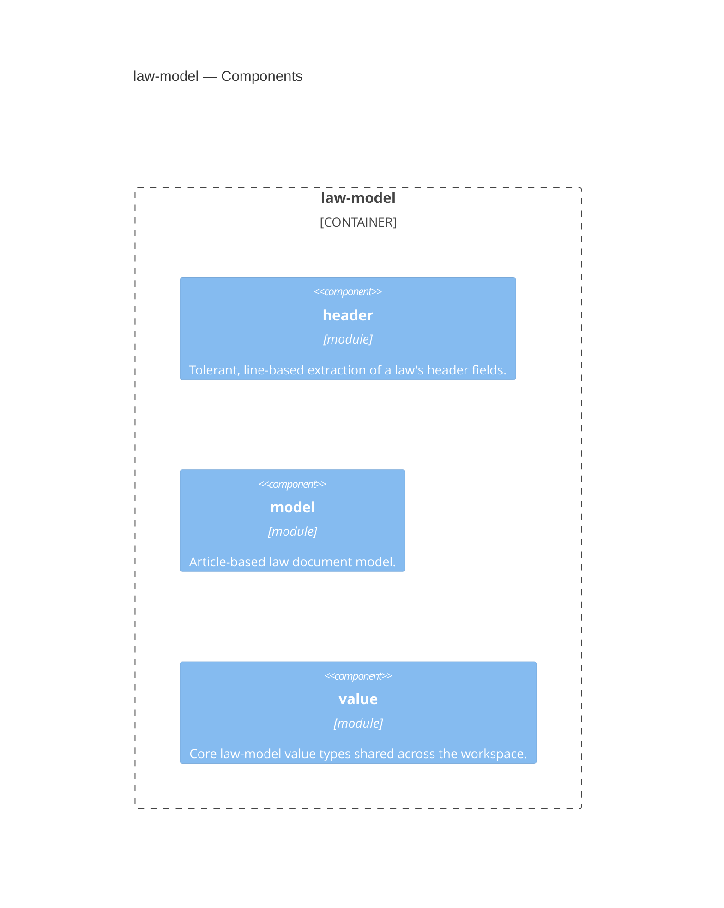

<!-- Generated by packages/arch-extract (`just arch-generate`). Do not edit by hand. -->

RegelRecht canonical law-YAML document model - the single Rust representation of the law format

Source: `packages/law-model`

## Dependencies

- [shared](/architecture/crates/shared)

## Dependents

- [corpus](/architecture/crates/corpus)
- [engine](/architecture/crates/engine)
- [pipeline](/architecture/crates/pipeline)
- [tui](/architecture/crates/tui)

## Components

## Types

| Type | Kind | Description |
| --- | --- | --- |
| `LawHeader` | struct | A law's top-level header fields, extracted tolerantly from raw YAML text. |
| `Action` | struct | Action definition in execution spec |
| `ActionOperation` | enum | Represents an operation within an action. |
| `ActionValue` | enum | Represents a value in an action - can be a literal, variable reference, or nested operation. |
| `Article` | struct | Represents a single article in a law |
| `ArticleBasedLaw` | struct | Represents an article-based law document |
| `Case` | struct | A single case in an IF operation (cases/default syntax) |
| `CompetentAuthority` | enum | Represents a competent authority - can be a simple string or a structured object |
| `Definition` | enum | Definition value in definitions section. |
| `Execution` | struct | Execution specification within machine_readable section |
| `HookDeclaration` | struct | Declaration that an article fires as a hook on matching lifecycle events (RFC-007) |
| `HookFilter` | struct | Filter that determines when a hook fires |
| `HookPoint` | enum | Lifecycle point at which a hook fires |
| `ImplementsDeclaration` | struct | Declares that this article fills an open term from a higher-level law. |
| `Input` | struct | Input definition in execution spec |
| `LegalBasis` | struct | Legal basis reference to another law |
| `MachineReadable` | struct | Machine-readable section of an article |
| `OpenTerm` | struct | Open term declared by an article — a value that can or must be filled by |
| `OpenTermDefault` | struct | Default execution block for an open term (used when no implementing regulation exists) |
| `Output` | struct | Output definition in execution spec |
| `OverrideDeclaration` | struct | Declaration that an article overrides another article's output (RFC-007, lex specialis) |
| `Parameter` | struct | Parameter definition in execution spec |
| `ProcedureAppliesTo` | struct | Filter for which legal character a procedure applies to |
| `ProcedureDefinition` | struct | A procedure definition — an AWB-defined lifecycle for a legal character (RFC-008) |
| `Produces` | struct | Produces specification for execution. |
| `Source` | struct | Source specification for input fields |
| `Stage` | struct | A stage in an AWB-defined procedure lifecycle (RFC-008) |
| `StageRequirement` | struct | A required input for a procedure stage |
| `TypeSpec` | struct | Type specification for input/output/definition fields. |
| `UntranslatableEntry` | struct | A legal construct that cannot be expressed with the engine's current operation set (RFC-012) |
| `Operation` | enum | Operation types supported by the engine |
| `ParameterType` | enum | Parameter type specification |
| `Value` | enum | Represents any value in the engine (similar to Python's Any) |
| `ValueVisitor` | struct |  |
