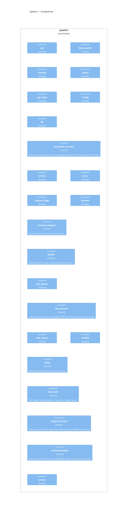

<!-- Generated by packages/arch-extract (`just arch-generate`). Do not edit by hand. -->

RegelRecht pipeline - Job queue and law status tracking for the processing pipeline

Source: `packages/pipeline`

## Dependencies

- [corpus](/architecture/crates/corpus)
- [engine](/architecture/crates/engine)
- [harvester](/architecture/crates/harvester)
- [law-model](/architecture/crates/law-model)
- [shared](/architecture/crates/shared)

## Dependents

- [admin](/architecture/crates/admin)
- [editor-api](/architecture/crates/editor-api)

## Components

## Types

| Type | Kind | Description |
| --- | --- | --- |
| `BwbSearchResult` | struct |  |
| `SearchParams` | struct |  |
| `HarvestBatchRequest` | struct |  |
| `HarvestBatchResponse` | struct |  |
| `HarvestRequest` | struct |  |
| `HarvestResponse` | struct |  |
| `HarvestStatusEntry` | struct |  |
| `HarvestStatusQuery` | struct |  |
| `HarvestStatusResponse` | struct |  |
| `ApiState` | struct | Shared state for the pipeline REST API. |
| `PipelineConfig` | struct |  |
| `WorkerConfig` | struct |  |
| `DeterministicTool` | enum | The deterministic command-line converter that handles a given extension. |
| `DocumentConvertPayload` | struct | Payload carried by a `document_convert` job. The raw bytes live in |
| `DocumentConverter` | trait | Abstraction over the actual document→markdown conversion so the orchestration |
| `LlmDocumentConverter` | struct | Production converter: prompts the LLM agent to figure out and perform the |
| `TrajectJobView` | struct | A trimmed view of a `document_convert` job for the werkdocumenten status UI. |
| `Upload` | struct | An uploaded document loaded from `document_uploads`. |
| `BaseAction` | enum | Outcome of comparing a target law's base version against the enrichment's |
| `CapturedUntranslatable` | struct | A single untranslatable captured from an enriched article, flattened for |
| `ChunkPlan` | enum | The article window one enrich run must process, decided by the worker (not |
| `ChunkReport` | struct | Proof-of-review for one enrichment chunk, written by the agent into the |
| `EnrichConfig` | struct | Configuration for enrichment execution. |
| `EnrichCorpus` | struct | Result of preparing the per-job enrichment checkout: the client plus the |
| `EnrichPayload` | struct | Payload for an enrich job, stored as JSON in the job queue. |
| `EnrichResult` | struct | Result of a successful enrichment execution. |
| `EnrichmentMetadata` | struct | Metadata written alongside the enriched law YAML as `.enrichment.yaml`. |
| `EnrichmentResultEnvelope` | struct | The `.enrichment-result.yaml` result envelope written next to an enriched |
| `LlmProvider` | enum | Supported LLM providers for enrichment. |
| `LlmRunner` | trait | Trait abstracting the LLM invocation so `execute_enrich` can be tested |
| `ProcessLlmRunner` | struct | Default runner that spawns a real CLI process. |
| `RelatedLegislation` | struct | A related-legislation reference returned by the enrichment agent in the |
| `SkippedArticle` | struct | One deliberately-skipped article in a [`ChunkReport`]. |
| `PipelineError` | enum |  |
| `HarvestFiles` | struct | The files a harvest writes to disk, split by their role in the commit. |
| `HarvestPayload` | struct | Payload for a harvest job, stored as JSON in the job queue. |
| `HarvestResult` | struct | Result of a successful harvest execution. |
| `LawStatusFile` | struct | Status file written alongside the law YAML. |
| `HarvestRequestOptions` | struct | Options for a harvest request. `Default` gives the standard pipeline |
| `HarvestRequestOutcome` | enum | Outcome of a harvest request. Designed so each HTTP layer can map it onto |
| `CreateJobRequest` | struct |  |
| `ReapedJob` | struct | Een door de reaper geraakte job. `status` is de NIEUWE status: `Pending` |
| `EnrichChainContext` | struct | Context for chaining a task-flow enrich job onto the job that produced a |
| `GeneratedLaw` | struct | A validated, freshly-generated base law. |
| `LawConvertPayload` | struct | Payload carried by a `law_convert` job. The raw bytes live in |
| `LawStructurer` | trait | Abstraction over the LLM structuring step so the orchestration can be |
| `LlmLawStructurer` | struct | Production structurer: the enrich LLM subprocess. Shell-toegang is |
| `ValidatedLawMeta` | struct | Metadata extracted from a validated base-law YAML. Also consumed by |
| `FeatureFlag` | struct |  |
| `Job` | struct |  |
| `JobStatus` | enum |  |
| `JobType` | enum |  |
| `LawEntry` | struct |  |
| `LawStatusValue` | enum |  |
| `Priority` | struct |  |
| `Untranslatable` | struct | A single untranslatable construct captured during enrichment (RFC-012), |
| `BlobKind` | enum |  |
| `JobBlob` | struct |  |
| `NewTask` | struct |  |
| `RunningTaskJob` | struct | Eén lopende taak-flow-job voor de "Bezig"-sectie: een enrich-, |
| `Task` | struct |  |
| `TaskStatus` | enum |  |
| `TaskType` | enum | Taaktype als TEXT + CHECK i.p.v. PG-enum: een nieuw type is een |
| `TestDb` | struct | Postgres testcontainer with the pipeline schema applied and seed rows |
| `TrajectHarvestPayload` | struct | Payload van een `traject_harvest`-job. Spiegel van |
| `JobOutcome` | enum | Outcome of attempting to process a single job, used to drive the |
| `RelatedResolution` | enum | Outcome of resolving a single [`RelatedLegislation`] entry to a BWB id. |
