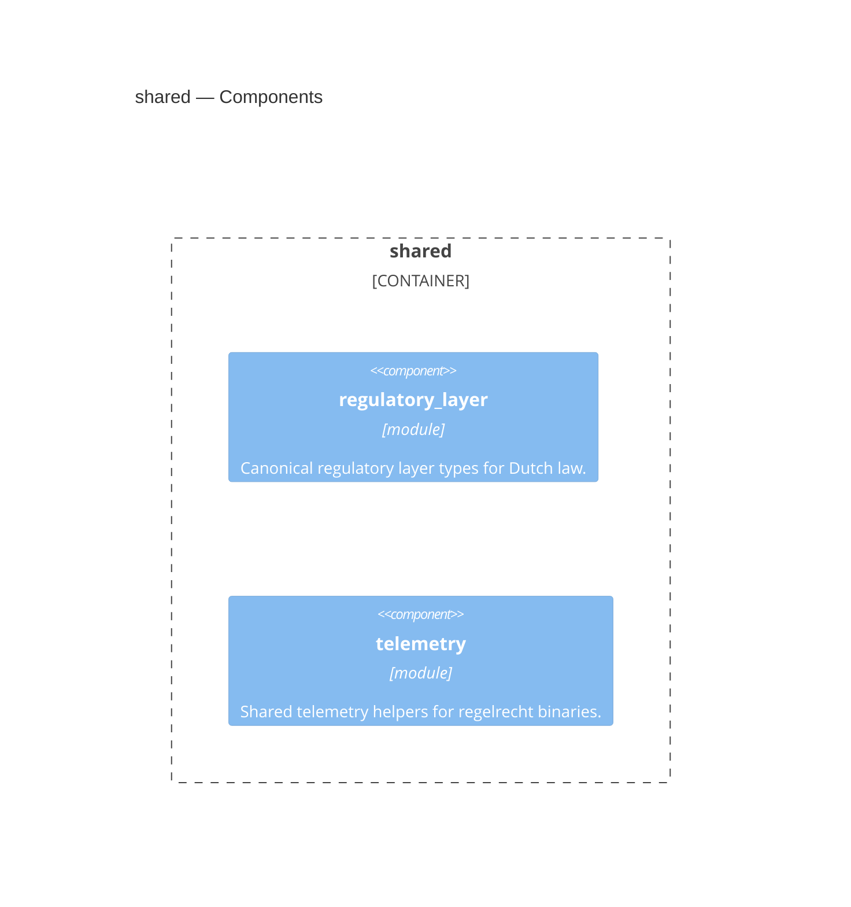

<!-- Generated by packages/arch-extract (`just arch-generate`). Do not edit by hand. -->

RegelRecht shared types - Canonical domain types used across crates

Source: `packages/shared`

## Dependencies

This crate depends on no other workspace crate.

## Dependents

- [admin](/architecture/crates/admin)
- [editor-api](/architecture/crates/editor-api)
- [engine](/architecture/crates/engine)
- [harvester](/architecture/crates/harvester)
- [law-model](/architecture/crates/law-model)
- [pipeline](/architecture/crates/pipeline)

## Components

## Types

| Type | Kind | Description |
| --- | --- | --- |
| `RegulatoryLayer` | enum | Types of regulatory documents in Dutch law. |
