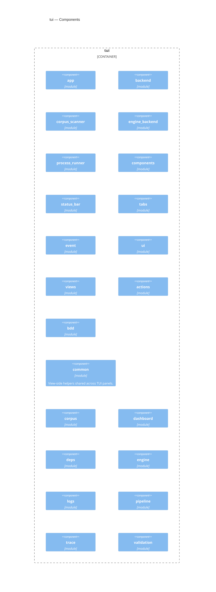

<!-- Generated by packages/arch-extract (`just arch-generate`). Do not edit by hand. -->

RegelRecht TUI dashboard for law execution, testing, and monitoring

Source: `packages/tui`

## Dependencies

- [engine](/architecture/crates/engine)
- [law-model](/architecture/crates/law-model)

## Dependents

No other workspace crate depends on this crate.

## Components

## Types

| Type | Kind | Description |
| --- | --- | --- |
| `App` | struct |  |
| `Tab` | enum |  |
| `CorpusNode` | struct |  |
| `EngineCommand` | enum | Commands sent to the engine thread. |
| `EngineHandle` | struct | Handle to communicate with the engine thread. |
| `EngineResponse` | enum | Responses from the engine thread. |
| `ProcessMessage` | struct |  |
| `ProcessMessageKind` | enum |  |
| `ProcessRunner` | struct |  |
| `ActionCommand` | struct |  |
| `ActionsView` | struct |  |
| `OutputLine` | struct |  |
| `BddView` | struct |  |
| `FeatureEntry` | struct |  |
| `Focus` | enum |  |
| `OutputLine` | struct |  |
| `CorpusView` | struct |  |
| `Focus` | enum |  |
| `DashboardStats` | struct |  |
| `DashboardView` | struct |  |
| `DepNode` | struct |  |
| `DepsView` | struct |  |
| `EngineView` | struct |  |
| `Focus` | enum |  |
| `ParamEntry` | struct |  |
| `LogLevel` | enum |  |
| `LogsView` | struct |  |
| `PipelineView` | struct |  |
| `FlatNode` | struct | A flattened trace node for rendering. |
| `TraceView` | struct |  |
| `FileStatus` | enum |  |
| `ValidationFile` | struct |  |
| `ValidationView` | struct |  |
