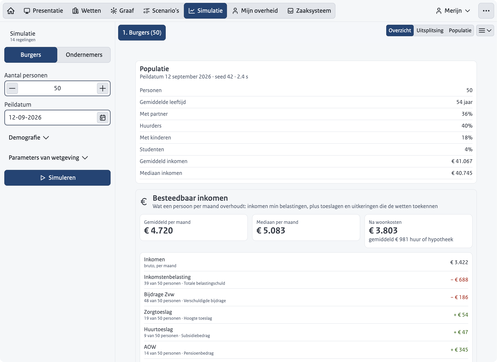

The demo shows in one workspace what RegelRecht does: the machine-readable law, the dependencies between laws, the scenarios that test a law, and the execution for one person on a portal and in a case system. It succeeds the separate `poc-machine-law` repository.

## Overview

- **Language**: Vue 3 / Vite, `@nldd/design-system`
- **Location**: `frontend-demo/`
- **Corpus**: `corpus/demo/`
- **Production URL**: `demo.regelrecht.rijks.app` (ZAD component `demo`; see [Deployment](/operations/deployment))
- **Interface languages**: Dutch (the source), English under `/en/` and Frisian under `/fy/`. The Frisian translation has not yet been reviewed by a Frisian speaker. The law texts themselves stay Dutch in every language, because a translation of the text in force has no legal standing.

## What it does

The workspace opens on a landing page (the house icon) with a short explanation, a button that starts the presentation, and a QR code that points at the demo itself, so someone in the audience can follow along on a phone. After it come seven tabs, in the order of a presentation. The labels below are the English ones, with the Dutch in parentheses.

1. **Presentation** (*Presentatie*): the slide deck in Rijkshuisstijl blue. The intro is shown full screen; after that the deck sits on the left as a rail, and each slide opens the tab it is about, switches persona and points at what the presenter means. The slides are content (`demo-config.yaml`), not code. Esc closes the deck and leaves the demo where it is; Shift+P opens it from anywhere.
2. **Laws** (*Wetten*): the machine-readable law as a collapsible YAML tree, prepared per story (`expanded_paths` in `demo-config.yaml`: a path opens itself and everything above it, the rest stays closed; `folded_paths` names nodes on such a path that start closed for the presenter to open, with what lies below them already prepared). Every `source.regulation` is a link that opens the referenced law; a back button retraces the references followed. The list of all laws, grouped per organization, is a side panel that is closed by default.
3. **Graph** (*Graaf*): per law its sources, its inputs from other laws and its outputs, with lines to the law that supplies them, the persona's values on them, and one color per organization. The profile picks the laws of its story (`graph_laws`), and the graph shows those laws plus everything directly attached to them. The layout of the whole corpus is fixed, so "All" (*Alles*) adds laws without moving anything. Selecting a law colors the lines it reads from green and the lines along which other laws read it red.
4. **Scenarios** (*Scenario's*): the Gherkin scenarios per law. In Dutch the steps are rendered as Dutch sentences; English and Frisian show the canonical English steps, which is what the `.feature` files contain. "Run" (*Uitvoeren*) executes a scenario in the browser against the engine and opens the full execution trace, in which each law has its own color and a bar steps from one law to the next.
5. **Simulation** (*Simulatie*): a generated population of citizens or businesses (size, age and income distribution, business type, seed) is run through every regulation of that portal. The result shows who qualifies and for how much, broken down by age, income, partner, business type or size, and for citizens the disposable income per month: income minus taxes, plus allowances and benefits. Which outputs count, and whether per month or per year, is set in `simulation.disposable_income`. Constants from the laws (thresholds, percentages) can be changed per run, and so can those of the regulations the laws rely on, such as the standard premium (*standaardpremie*) that a ministerial regulation fills in for the zorgtoeslag. A run is named after what it changed and a variant gets its own color; runs sit side by side for comparison, which opens with the disposable income per run, and export as CSV or JSON.

   

6. **My government** (*Mijn overheid*, or *Mijn onderneming* for a business; the label comes from `portal_tab_label` in `demo-config.yaml`): the portal of the active persona. Each regulation is computed live. Under "Data used" (*Gebruikte gegevens*) the portal shows where each piece of data comes from, and each one can be corrected. A regulation that ends in a *beschikking* (an individual administrative decision) is applied for from the portal, in a panel that follows the flow of the POC: the law computes with what the government already knows and asks, one question at a time, only for what no register holds (the rent, the location of a café terrace). It recomputes after each answer, lets the applicant check the outcome and the data used, and shows the status after submission. Once the decision has been announced, the panel shows the date until which an objection (*bezwaar*) is possible. That date comes from the Awb itself (articles 6:7 and 6:8), not from the screen. The portal never jumps to the case system, which belongs to the other side of the counter.

   

7. **Case system** (*Zaaksysteem*): the case handler's side, per executing organization. It has a board with cases to assess, cases to announce and cases that have been announced, the regulations the organization executes, the engine's recalculation next to the result applied for, citizen corrections awaiting review, granting or refusing, announcing, and objection. Announcing is a separate action, because the Awb treats the decision (article 1:3) and its announcement (article 3:41) as two moments, and only the second starts the objection period. By default the demo announces a decision as soon as it is taken ("Announce decisions straight away" in the menu); switching that off brings the announcement back as a step of its own.

The toolbar switches the profile (Merijn, a citizen; Claudia, a business owner). With the authorizations feature on, "Acting for" offers the people or businesses the active profile may act for, when the law gives more than one option. The menu then holds four groups:

- **Features**: switches for features that are off or on per profile in `demo-config.yaml` (authorizations, reporting a change, harmonization, approving corrections immediately), plus "Review every application by hand" and "Announce decisions straight away" (on by default). A switched flag overrides the profile until "Back to the profile" resets it.
- **Language**: Dutch, English or Frisian.
- **Appearance**: the color scheme.
- **Demo**: full screen, and resetting the demo.

## How it works

The demo corpus in `corpus/demo/` holds the laws migrated from the POC (`regulation/nl/`, schema v0.5.8 and v0.5.9, with `source: {}` for external data), their scenarios (`**/scenarios/*.feature`, in the canonical grammar), `bindings.yaml` (which register table and column feeds which `source: {}` input), `profiles.yaml` (the fictitious personas), `demo-config.yaml` and `services.yaml`. `tools/` holds the one-off migration and conversion scripts.

Everything the demo computes happens in the browser; the one exception is the optional "why" explanation below. The engine runs as WebAssembly in the browser, the same engine as in the editor. At build time the demo corpus is copied to `public/data`. Persona data (`profiles.yaml`) is materialized per law into records through `bindings.yaml` and registered with the engine as a law-scoped data source; approved citizen corrections are layered on top as a second source with a higher priority. Applications, corrections and settings live in `localStorage`, so a page refresh during a presentation loses nothing.

An application for a *beschikking* passes through the phases the Awb gives it (RFC-007, RFC-008). In each phase the engine fires the hooks that belong to it and reports which piece of data it still lacks; the demo supplies it at the moment it exists, and stores the state with the case. That is how the objection period arrives as a date from the law, and how a special law that departs from article 6:7 is taken into account without extra code.

### The "why" explanation

A portal tile can explain its outcome in plain language, as the "waarom?" link in `poc-machine-law` did. A language model writes the explanation from the engine's trace and the outcome as the tile shows it, in the language the demo is set to. The sheet that shows it says it was written by a language model and that the calculation stands where the two differ.

The feature is off until the presenter unlocks it with a password under Demo in the menu. The password is kept in `localStorage` under its own key (`rr-demo-why-password`), so resetting the demo leaves it in place. The server checks it on every request; the browser only passes it on.

The model runs through the Claude Code CLI, in a small Node server (`frontend-demo/server/why.mjs`) that nginx reaches on `127.0.0.1:7401` inside the same container. A subscription token from `claude setup-token` only works through that CLI, which is why this is a server and not a call from the browser. The server gives the CLI no tools and no settings, allows three explanations at a time, and stops the model when the visitor closes the sheet. It does not lock out after wrong guesses, because a lockout shared by every caller would let one script keep the presenter out; instead it refuses to start with a password shorter than 16 characters.

Without a server behind `/api/why` the app does not show the feature at all: no menu item, no button. That is the case for a plain `just demo` and for a deployment without the variables below.

| Variable | Purpose |
|----------|---------|
| `DEMO_WHY_PASSWORD` | The password that unlocks the button, at least 16 characters. Without it the server does not start |
| `CLAUDE_CODE_OAUTH_TOKEN` | Token for the Claude Code CLI (from `claude setup-token`) |
| `ANTHROPIC_API_KEY` | Alternative to the token: a Console key, billed per call |
| `DEMO_WHY_MODEL` | Model alias for the CLI, default `sonnet` |

## The recorded walkthrough

Next to the live presentation there is a recorded one at `/rondleiding` (`/en/tour`), for people who go through the demo without a presenter. The home page and the Presentation tab only offer it when the build carries a recording.

The walkthrough is not a video of the demo. It is the presenter's voice, and while it plays the demo itself does what the presenter did: the deck changes slides and opens tabs, and buttons are clicked and text is typed, letter by letter at the recorded pace, in the live app. A cursor moves to each click a moment before it happens. The deck is the same rail as in the zelfstandig mode of the presentation, with playback controls in its footer, the presenter's face in a circle under the slide, and the frequently asked questions that have come up so far. Pausing hands the demo to the viewer, who can click around; playing again restores the recorded state of that moment and goes on.

The controls are design-system buttons in the deck's footer: play and pause, previous and next chapter (one chapter per slide), a chapter menu, and a menu with playback speed, captions, the presenter bubble, a transcript per chapter, and the way out. The keys are Space to pause, the arrows for chapters and Escape to leave a question; there are no single-letter shortcuts (WCAG 2.1.4). The controls follow the viewer's language; the demo under them runs in Dutch for the length of the walkthrough, because the voice names its Dutch labels and the replay finds what to click by them, and a note next to the controls says so. If the media fail to load, the page says there is no walkthrough instead of waiting. While the walkthrough plays these keys belong to the player, also when the replay left focus in a field it typed into. A question appears in the rail when the presenter mentions it; its answer has its own address (`/rondleiding/<id>`), and leaving it resumes the main line where the viewer was. While an answer plays, every slide carries the question as its title.

Answers come in two kinds. A judgement (how open norms are handled, what the legal status of a translation is) is the presenter on camera: a recorded take on a slide without a tab, where the face is shown large next to the question. A let-me-show-you answer is a scripted chapter in the generated voice, with the demo clicking along; it can open with a recorded sentence on camera. Both are segments, as in the main line.

How the replay holds up:

- **Finding elements.** A click is stored as a description of the element, not a position: per scope (the document, then each shadow root of a design-system component on the way) the element's tag and what names it to a person, such as its text, label or link. The replay looks that up in the live page. Links are stored without their origin, and when an exact match fails, numbers in labels ("Wetten, 79") are ignored. A recording made at one window width replays at another; this was checked between 1100 and 1920 pixels wide, with the rail next to the demo (`src/walkthrough/locator.js`).
- **Waiting.** An element that is not there yet, because a tab is still loading or the engine is computing, is waited for, and the voice pauses with it.
- **The date.** While a replay runs, `Date` answers with the moment of the recording plus the time into it (`clock.js`), so amounts and deadlines are those of the recording day.
- **Jumping.** Every chapter carries the demo state as it was when its slide came up. A jump restores that state, mounts the tabs fresh and replays the chapter's actions up to the target, fast.
- **The viewer's own session.** The replay drives the same store, but does not write it to `localStorage`, and leaving the walkthrough puts the viewer's own state back.

A replay can still break when the demo changes: a button that is renamed or removed is no longer found. The replay then goes to the right tab itself (it also records the route of every navigation), but a click inside the tab is lost. Record the affected chapter again; a take can start at any slide.

On a screen narrower than 1024 pixels the demo and the rail do not fit side by side, and the page plays the recording of the window as a video instead, with its captions.

The player's layer over the demo (the bubble, the cursor and its ripple, the captions) is custom CSS in `src/walkthrough/Replay*.vue`, because the design system has no video or pointer components. The cursor and the captions are placed in the browser's top layer, so they stay visible over a sheet or dialog the replay opens.

A sheet that opens on the left (the law list on the Laws tab, an `nldd-sheet` with `placement="left"`) is placed by the design system against the window edge, which with the deck as a rail is behind the slides. Until the design system has a hook for that edge, `src/presentation/sheetOffset.js` adds a rule to those components' shadow roots that moves the sheet, and its slide-in, to the edge of the demo while the rail is on screen. It depends on internal class names; `sheetOffset.test.js` fails when they change. This also applies to the live presentation in zelfstandig mode.

### Recording

```bash
just walkthrough record   # the demo on :7400 in Chrome, with the recorder panel
```

The recorder is a panel in the top left corner, present only in the dev server and only with `?record` in the address; the production bundle does not contain it, and the deployed site's `Permissions-Policy` blocks the microphone and camera anyway. A take is recorded the way it is played back: in Dutch, with the deck as a rail next to the demo. It records on one clock:

- the microphone (echo cancellation, noise suppression and automatic gain off);
- the webcam, optionally;
- the actions (`capture.js`): clicks, typing with its value after every keystroke, selects and checkboxes, Enter and Escape, scrolling, and the deck's slide changes and the routes;
- the whole window as video, for phones and for the shareable MP4.

What is typed is recorded, because the replay has to type it again. It is demo input with fictitious personas, said aloud in the same take. The state of the demo is stored with every slide change, which is what a jump restores and what lets one chapter be recorded again from its own starting point.

During a take the panel leaves the screen and the tab title starts with "● REC". Shift+X marks a slip (say the sentence again from its start), Shift+R stops. Chunks stream to the Vite dev server, which writes them to `.walkthrough/takes/<take>/`; a crash loses seconds, not the take. The endpoint that writes them exists only under `just walkthrough record`, accepts only requests from the machine itself, and limits their size. Record in Chrome or Edge, which can capture their own tab without asking for a window.

### Post-processing

`script/walkthrough/` is a small Python project, run through `uv`:

```bash
just walkthrough prepare     # last take: extract, clean the voice, transcribe, correct, draft cuts
just walkthrough transcript  # the spoken text per slide
just walkthrough build       # walkthrough.yaml to voice, video, captions and timeline.json
just walkthrough export      # a shareable MP4 per track
just walkthrough status      # which takes exist and how far each one is processed
just walkthrough check       # how a take sounds, in numbers, with a verdict per line
just walkthrough script      # a draft script per slide of a take, for the generated voice
just walkthrough voices      # the voices on the ElevenLabs account
just walkthrough publish     # the media into a GitHub release (asks first)
just walkthrough test        # the tests of the cut and caption arithmetic
```

The voice is denoised with DeepFilterNet, filtered below 80 Hz, de-essed and compressed; loudness is normalized to -16 LUFS over the finished track, so every chapter is equally loud. WhisperX (Whisper large-v3 with a Dutch wav2vec2 aligner) gives every word a timestamp; the `glossary` from `walkthrough.yaml` goes into its prompt as a sentence, because Whisper copies the prompt's style and a bare list gave a transcript without full stops. Whisper still mishears policy vocabulary ("machine uit voorwaarde formaat", "bc-nummer" for the `bsn` on screen), so `prepare` has a language model read the transcript next: headless Claude Code (`claude -p`) gets the glossary, the slide texts, the labels of what was clicked and stills of the app taken from the recording (at every route change, every click and every six seconds) as context, and returns the same speech with the mishearings fixed, not rewritten. That text goes to `corrected.txt` in the take's folder and is matched back onto Whisper's timing letter by letter, so a corrected word keeps the time of the word it replaces. A correction that changes more than a fifth of the words is refused. To correct by hand, edit `corrected.txt`; `just walkthrough correct <take>` runs the check again. `prepare` then proposes cuts: long silences shortened, unless the presenter acted in them, and the sentence before each Shift+X. The proposal is a draft. The cuts that count are the ones in `corpus/demo/walkthrough/walkthrough.yaml`, which also lists the takes that make up the walkthrough, slide texts that replace the recorded ones, and the questions with the take of their answer and the moment they appear. DeepFilterNet, WhisperX and OpenCV (for finding the face in the webcam picture) each run in their own `uv` environment and are downloaded on first use; ffmpeg has to be installed.

`build` cuts every piece on whole frames, so the voice cannot drift from the picture over many cuts, and refuses a cut through typing. An action inside a cut is not dropped but moved to the cut, so the demo still ends up in the presenter's state. The timeline, the captions and `walkthrough.yaml` are in git under `corpus/demo/walkthrough/`; the media are not, because a re-recorded chapter would leave megabytes in the history for good. They are assets of the GitHub release named in `timeline.json`. The Docker build fetches them with `scripts/fetch-walkthrough-media.mjs` and refuses a file whose checksum differs. nginx serves them from `/walkthrough/` with a one-year cache, which is safe because a new recording means new file names.

### Generated chapters

A chapter can also be spoken from a script instead of a recording. The script is text with markers, in `corpus/demo/walkthrough/script/<name>.yaml`, next to a silent take that holds the clicks and typing for it:

```yaml
slide: 5
take: 2026-10-03T10-00-00
lines:
  - Hier ziet u de wet op de zorgtoeslag, zoals een computer hem leest.
  - Ik open [1] de lijst met wetten en zoek [2] de huurtoeslag.
```

`[n]` is where the n-th beat of the take starts: a run of actions without a pause longer than 1.2 seconds, such as a click and the typing after it. Navigation the deck does on its own is not a beat. Every beat has to appear in the script once. The voice is generated per line, with the time of every character; the actions land on the word after their marker, keep their recorded pace, and when a beat takes longer than the words around it the next line waits. The captions come from the script text, so they are exact. A walkthrough can mix both: in `walkthrough.yaml` a segment is either `take:` (recorded) or `script:` (generated), and the usual case is a recorded opening with the presenter's face, followed by generated chapters.

The voice is set in `walkthrough.yaml`:

```yaml
voice:
  provider: elevenlabs          # or `say`: the Mac's own voice, to try a script out
  voice_id: <the cloned voice>
  model: eleven_multilingual_v2
  say_as:                       # how a word is pronounced, not how it is written
    Awb: A-W-B
```

`elevenlabs` reads the API key from `ELEVENLABS_API_KEY` or from `.walkthrough/.env`, which is not in git. Generated lines are cached by a hash of their text and voice settings, so a rebuild only pays for lines that changed. Where a track contains generated speech, the player says so next to its controls ("De stem in de hoofdstukken is gegenereerd met AI"), as the AI Act asks of generated speech that can pass for a person. The webcam bubble shows only during the recorded parts at the start (`cam.until`).

A track with generated chapters has no recording of the window, so a phone gets a message instead of the video, and `walkthrough export` skips it; an MP4 of such a track has to be recorded from the replay itself, which is not built yet.

### From recording to release

The route for a new walkthrough, or for a chapter recorded again:

1. **Voice clone, once.** Record yourself giving the talk two or three times, freely and microphone only (QuickTime, high quality); that is the training audio. Create a Professional Voice Clone from it at ElevenLabs, put the API key in `.walkthrough/.env` with `read -s KEY && echo "ELEVENLABS_API_KEY=$KEY" >> .walkthrough/.env`, and find the clone's id with `just walkthrough voices`. It goes in `walkthrough.yaml` under `voice.voice_id`, with `provider: elevenlabs`.
2. **Record.** `just walkthrough record`. The opening as a take with the camera on. Then every chapter as a take: talk and click as in a presentation. The answers to questions that are a judgement as takes on a slide without a tab, camera on; the ones that show something as takes with talking and clicking.
3. **Process.** `just walkthrough prepare <take>` for every take: clean voice, corrected transcript, draft cuts. `just walkthrough check <take>` then says whether the take is usable: loudness, clipping, background noise, speaking pace and the actions in the log, each with a verdict. Run it right after a take, so a bad one is done again while everything is still set up.
4. **Scripts.** `just walkthrough script <take>` for every take whose chapters the generated voice will speak. It writes a script per slide in `corpus/demo/walkthrough/script/`: the sentences that were said, with a marker where each action began. Correct the sentences where needed; the markers stay.
5. **Compose.** In `walkthrough.yaml`: the opening as a `take:` segment (with its cuts), the chapters as `script:` segments, the questions with their segments and the moment they are offered, and slide texts that should read differently. Then `just walkthrough build` and watch it with `just dev-demo` at `/rondleiding`.
6. **Publish.** `just walkthrough publish walkthrough-<date>` uploads the media to a GitHub release (it asks first; a release is public) and writes the tag into `timeline.json`. Commit `corpus/demo/walkthrough/`; the Docker build fetches the media from the release.

When the demo changes and a chapter no longer replays, record that chapter again (step 2 to 4 for one take) and point its `script:` segment at the new script. A text correction is a change to the script and a new build; only the changed lines are generated again.

## Running locally

```bash
just demo              # builds the WASM engine, starts Vite on :7400 and opens the browser
just dev-demo          # the same, without opening the browser
just demo-why          # the "why" backend on :7401, with your own Claude login; password "lokaal-demo-wachtwoord"
```

Vite forwards `/api/why` to `just demo-why`, so run the two side by side to try the explanation.

Checking, outside the browser:

```bash
just demo-check        # laws, Awb parity, service map, scenarios, frontend tests, WASM and build
just bdd-demo          # the scenarios only (plus the Awb lifecycle test)
just validate-demo     # the laws only (schema and type check)
```

## Further reading

- [Deployment](/operations/deployment)
