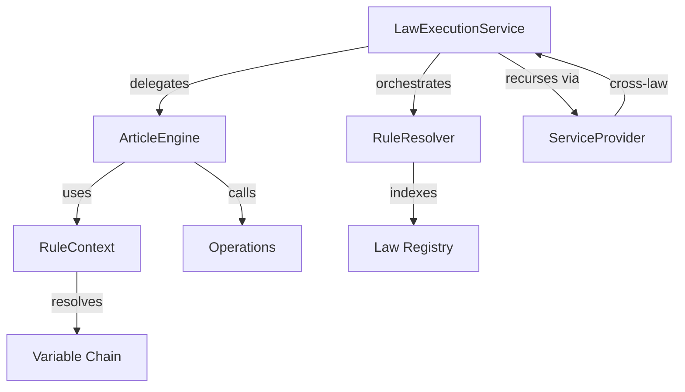
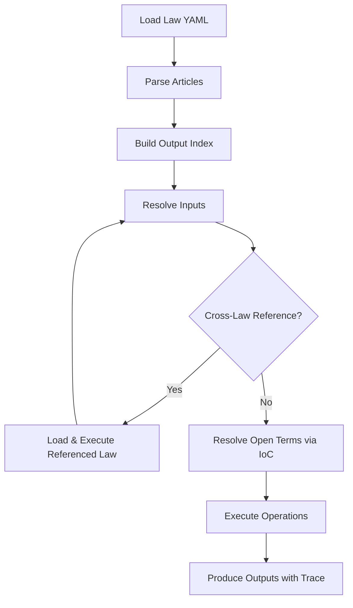

The execution engine is the core of RegelRecht: a deterministic Rust runtime that evaluates machine-readable Dutch law.

## Overview

- **Language**: Rust
- **Location**: `packages/engine/`
- **Targets**: Native (x86/ARM) and WebAssembly (browser/Node.js)
- **Key property**: Deterministic - same inputs always produce the same outputs

## Architecture

The engine has a layered architecture:



| Module | Purpose |
|--------|---------|
| `service.rs` | `LawExecutionService` - top-level API, cross-law orchestration |
| `engine.rs` | `ArticleEngine` - single article execution |
| `resolver.rs` | `RuleResolver` - law registry, output→article indexing, IoC lookup |
| `context.rs` | `RuleContext` - execution state, variable resolution with priority chain |
| `operations.rs` | Executes the schema operations and the engine-only aliases listed under [Operations](#operations); the `Operation` enum itself is defined in the Law Model crate (`packages/law-model/src/value.rs`) |
| `uri.rs` | `regelrecht://` URI parsing for cross-law references |
| `trace.rs` | Execution tracing with box-drawing visualization |
| `priority.rs` | Lex superior / lex posterior resolution for competing implementations |
| `data_source.rs` | External data registry for non-law data lookups |
| `typecheck.rs` | Static type and nullability check of a law against its own declarations (RFC-036, RFC-037), run on every law load, so also by `just validate` and the editor |
| `units.rs` | Unit-of-measurement model and algebra (RFC-023), shared by the static check and the runtime |
| `load_check.rs` | Load-time checks the schema cannot express, such as refusing a law that writes the Unknown sentinel into its own literals |
| `receipt.rs` | The Execution Receipt envelope (RFC-013) |
| `annotation/` | Stand-off note resolution: anchors a note to law text by quote, with fuzzy matching (RFC-005, RFC-018) |
| `telemetry.rs` | OpenTelemetry export of the engine's tracing events; compiled only with the `otel` feature |
| `config.rs` | Security limits and the list of supported schema versions (see [Security Limits](#security-limits)) |

The types a law file deserializes into are not defined in the engine. They live in the [Law Model](./law-model) crate, which `article.rs` re-exports and loads under the security limits.

## How It Works



### Variable Resolution Priority

When the engine resolves a `$variable`, it checks these sources in order:

1. **Context variables** - `referencedate`, `referencedate.year`, etc.
2. **Local scope** - loop variables from `FOREACH`
3. **Outputs** - values calculated by previous actions in the same article
4. **Resolved inputs** - cached results from cross-law references
5. **Definitions** - article-level constants
6. **Parameters** - direct input parameters

## Multi-Output Evaluation

Articles can define multiple outputs (e.g., `heeft_recht_op_zorgtoeslag` and `hoogte_zorgtoeslag`). You can request several of them in one call.

### Which outputs come back

Callers name the outputs they need, and there is no "run the whole law" mode: the engine executes only the articles that produce those outputs. It does not filter what those articles produce, though. The result holds every output of each executed article, including outputs the caller did not ask for, plus the outputs that hooks and overrides add to them. A beschikking is legally indivisible (Awb 1:3), so consequences such as the motivering and the bezwaartermijn are never stripped from it. A receipt records which outputs were actually requested in `requested_outputs`, next to the full set that came back.

If a requested output is missing because the law itself excludes it (a `voids` in schema v0.7.0), the call fails with an error that quotes the excluding article, instead of returning success with the output silently absent.

### Rust API

```rust
// Request multiple outputs
let result = service.evaluate_law(
    "wet_op_de_zorgtoeslag",
    &["heeft_recht_op_zorgtoeslag", "hoogte_zorgtoeslag"],
    params,
    "2025-01-01",
)?;
// result.outputs holds every output of the executed articles, plus hook/override outputs
// result.output_provenance tags each output as Direct, Reactive, or Override

// Single-output convenience (equivalent to evaluate_law with one output)
let result = service.evaluate_law_output(
    "wet_op_de_zorgtoeslag", "hoogte_zorgtoeslag", params, "2025-01-01",
)?;
```

If the requested outputs live in the same article, it runs once. Outputs from different articles trigger one execution per article, then merge.

### Output Provenance

Each output is tagged with how it was produced:

| Provenance | Meaning |
|------------|---------|
| `Direct` | Produced by the article's own actions |
| `Reactive` | Produced by a hook (e.g., Awb firing on BESCHIKKING) |
| `Override` | Produced by a lex specialis override (RFC-007) |

The `output_provenance` field appears in `ArticleResult`, WASM results, CLI output, and the Execution Receipt. It's omitted when empty (e.g., simple articles with no hooks).

### WASM API

```javascript
// Multiple outputs
const result = engine.executeMultiple(
    'wet_op_de_zorgtoeslag',
    ['heeft_recht_op_zorgtoeslag', 'hoogte_zorgtoeslag'],
    { bsn: '999993653' },
    '2025-01-01'
);

// Single output (unchanged)
const result = engine.execute(
    'wet_op_de_zorgtoeslag', 'hoogte_zorgtoeslag', params, '2025-01-01'
);
```

### CLI

The `evaluate` binary takes the same request as JSON on stdin, with `output_names` as a list. See [CLI Tools](#cli-tools) for the request format and a worked example.

## Operations

The operation set is defined by the schema. The [Schema Reference](/reference/schema#operations) lists every operation with its fields and examples, generated from the released schema so it cannot fall behind it; this page does not repeat the list. [RFC-004](/rfcs/rfc-004) is the design, and `FOREACH` has its own page in [Collections](/concepts/collections).

Negation is expressed by wrapping a positive operation in `NOT`: `NOT` around `EQUALS` for "not equal", `NOT` around `IN` for "not in". A null check is `EQUALS` against `value: null` (wrap it in `NOT` for "is not null"). For backward compatibility the engine also accepts the aliases `NOT_EQUALS`, `IS_NULL`, `NOT_NULL`, and `NOT_IN`, but these are **not** part of the schema: YAML using them executes correctly yet fails schema validation, so new laws should use the `NOT` / `EQUALS null` forms instead.

## Cross-Law Execution

Laws reference each other via `source` on input fields:

```yaml
input:
  - name: standaardpremie
    source:
      regulation: regeling_standaardpremie
      output: standaardpremie
      parameters:
        bsn: $bsn
```

The engine automatically loads the referenced law, executes it with the specified parameters, and caches the result. Circular references are detected and raise an error.

### Open Term Resolution (IoC)

Higher laws declare `open_terms` that lower regulations fill via `implements`. At execution time, the engine:

1. Indexes all `implements` declarations at law load time
2. Looks up implementations for each `open_term`
3. Filters by temporal validity (`calculation_date`) and scope (`gemeente_code`, etc.)
4. Resolves conflicts via **lex superior** (higher layer wins) then **lex posterior** (newer date wins)
5. Falls back to the `default` if no implementation found

See [RFC-003](/rfcs/rfc-003) for the full pattern.

### Delegation refusals

An `open_terms` entry says which regulatory layer the term is delegated to (`delegation_type`). A regulation on another layer that declares it `implements` the term is refused: it does not fill the term, however recent it is. The engine does not drop such a refusal quietly. Every refusal met anywhere in the execution chain is listed in `delegation_refusals` on the Rust result and on the receipt (not yet in the WASM results), with the declaring law and article, the open term, the required layer, and the refused regulation with its own layer. A refusal is a defect in the corpus, not a property of the case, and recording it lets a citizen contesting the decision see that a filling was offered and why it did not count.

## Execution Tracing

Every execution can produce a full trace tree showing how each value was computed:

```rust
let result = service.evaluate_law_with_trace(
    "wet_op_de_zorgtoeslag",
    &["hoogte_zorgtoeslag"],
    params,
    "2025-01-01",
)?;

if let Some(trace) = result.trace {
    println!("{}", trace.render_box_drawing());
}
```

The trace includes: which articles were executed, which inputs were resolved (and from where), which operations ran, and the result of each step.

The box drawing is a presentation. The machine-readable form is a JSON document carrying a `trace_version`, specified by `schema/trace/v1/trace-schema.json` ([RFC-039](/rfcs/rfc-039)); the WASM `*WithTrace` calls return that document under `trace`, with the box drawing next to it in `trace_text`. The trace schema is versioned apart from the law schema, because a trace shape and a law shape change for different reasons.

## WASM Usage

The engine compiles to WebAssembly for browser and Node.js execution.

### Browser

```javascript
import init, { WasmEngine } from 'regelrecht-engine';

await init();
const engine = new WasmEngine();

const lawId = engine.loadLaw(yamlString);
const result = engine.execute(
    lawId,
    'heeft_recht_op_zorgtoeslag',
    { BSN: '123456789', vermogen: 50000 },
    '2025-01-01'
);

console.log(result.outputs);
```

### Node.js

```javascript
import { initSync, WasmEngine } from 'regelrecht-engine';
import { readFileSync } from 'fs';

const wasmBuffer = readFileSync('./regelrecht_engine_bg.wasm');
initSync({ module: wasmBuffer });

const engine = new WasmEngine();
// Same API as browser
```

### WASM API

The exported methods are the `#[wasm_bindgen(js_name = ...)]` functions on `WasmEngine` in `packages/engine/src/wasm.rs`. That file is the reference, and the `.d.ts` that `wasm-pack` generates next to the build carries the same list with types. Besides loading laws and the `execute` family shown above, it covers staged execution for Awb procedures (`executeStage`), data sources (`registerDataSource`, `registerDataSourceForLaw` for a source scoped to one law, `removeDataSource`, `clearDataSources`), bookkeeping (`listLaws`, `getLawInfo`, `hasLaw`, `unloadLaw`, `lawCount`, `version`) and note resolution (`resolveNote`, `resolveNotes`).

> **Loading laws in WASM.** The WASM build wraps the same `LawExecutionService` as the native build, so cross-law references and open term resolution (the `open_terms` / `implements` IoC pattern) both work. There is no filesystem in the browser, so every law the execution reaches has to be pre-loaded with `loadLaw()` first. The [demo](/components/demo) runs the whole zorgtoeslag chain, open terms included, entirely in the browser.

## Security Limits

The engine enforces fixed limits, set in `packages/engine/src/config.rs`, so that a hostile or broken law file cannot exhaust memory or the stack:

| Limit | Value | Purpose |
|-------|-------|---------|
| `MAX_LOADED_LAWS` | 100 | Prevent memory exhaustion |
| `MAX_YAML_SIZE` | 1 MB | Prevent YAML bombs |
| `MAX_ARRAY_SIZE` | 1,000 | Prevent large array DoS |
| `MAX_CROSS_LAW_DEPTH` | 20 | One shared budget for cross-law and internal article-reference hops in a resolution chain |
| `MAX_OPERATION_DEPTH` | 100 | Operation nesting |
| `MAX_PROPERTY_DEPTH` | 32 | Dot-notation property access such as `$a.b.c` |

Three more bound the fuzzy search that anchors a note to law text. The sliding-window match is cubic in the quote length and runs synchronously in the browser, so `MAX_FUZZY_QUOTE_CHARS` (120), `MAX_FUZZY_SCAN_CHARS` (250,000 characters of law text per resolve) and `MAX_FUZZY_SCORED_WINDOWS` (10,000) cap it. A search that hits one of them reports the note as `Skipped` rather than as not found, which keeps "not searched" apart from "not there".

`SUPPORTED_SCHEMAS` lists the schema versions this engine build accepts. A law whose `$schema` names a version outside that list is refused at load time, with an error that lists the supported versions. A law without `$schema` is not checked against the list.

## Execution Receipt

The engine can produce an Execution Receipt: a JSON document that captures everything needed to reproduce a specific execution result. The receipt includes `engine_version`, `schema_version`, and `regulation_hash` alongside the regular `ArticleResult` fields. This allows independent verification of past decisions.

A receipt is opt-in. An ordinary evaluation returns an `ArticleResult`, not a receipt: call `LawExecutionService::build_receipt_with_outputs()` on the result to construct one, or pass `--receipt` to the CLI (see below). The WASM build has no receipt call. What a receipt holds today, and what is still planned, is on [Execution Provenance](/concepts/execution-provenance).

See [RFC-013](/rfcs/rfc-013) for the design rationale.

## CLI Tools

`evaluate` reads one request as JSON on stdin and writes the result as JSON on stdout. The request carries each law as YAML text, not as a path:

| Field | Meaning |
|-------|---------|
| `law_yaml` | The full YAML of the law to evaluate |
| `output_names` | The outputs to compute, a non-empty list; the older single `output_name` is still accepted |
| `params` | Parameters as a JSON object |
| `date` | Calculation date, `YYYY-MM-DD` |
| `extra_laws` | Optional list of further law YAMLs, loaded for cross-law references and open terms |

Two flags change the run. `--untranslatable=<mode>` sets how the engine treats markings (`error`, `propagate`, `warn` or `ignore`; see [Markings](/concepts/markings)), and `--receipt` prints an Execution Receipt instead of the plain result. The binary loads only the laws in the request, so every law the execution reaches has to be in `law_yaml` or `extra_laws`. `jq` builds the request conveniently:

```bash
cd packages/engine

# Article 4 of the Wet op de zorgtoeslag reads the standaardpremie through an
# open term, filled by the Regeling standaardpremie passed in extra_laws.
jq -n \
  --rawfile law ../../corpus/regulation/nl/wet/wet_op_de_zorgtoeslag/2025-01-01.yaml \
  --rawfile regeling ../../corpus/regulation/nl/ministeriele_regeling/regeling_standaardpremie/2025-01-01.yaml \
  '{law_yaml: $law, extra_laws: [$regeling], output_names: ["standaardpremie"], params: {}, date: "2025-01-01"}' \
  > /tmp/request.json

cargo run -q --bin evaluate < /tmp/request.json
# {"outputs":{"standaardpremie":211200},"resolved_inputs":{},"article_number":"4",
#  "law_id":"wet_op_de_zorgtoeslag","engine_version":"0.3.0","schema_version":"v0.5.8",...}

# The same request, printed as an Execution Receipt
cargo run -q --bin evaluate -- --receipt --untranslatable=warn < /tmp/request.json
```

On failure the binary prints `{"error": "...", "engine_version": "..."}` and exits with status 1.

Schema validation has its own recipe, run from the repository root:

```bash
just validate corpus/regulation/nl/wet/wet_op_de_zorgtoeslag/2025-01-01.yaml
```

## Performance

Benchmarks are available via:

```bash
just bench
```

Key benchmarks: URI parsing, variable resolution, operations, article evaluation, law loading, priority resolution, and end-to-end service execution.

## Further reading

- [Law Format](/concepts/law-format) - structure of law YAML files
- [RFC-003: Inversion of Control](/rfcs/rfc-003) - open terms and delegation
- [RFC-004: Uniform Operations](/rfcs/rfc-004) - operation syntax
- [RFC-007: Cross-Law Execution](/rfcs/rfc-007) - hooks, overrides, and temporal computation
- [RFC-013: Execution Provenance](/rfcs/rfc-013) - reproducible execution and receipts
