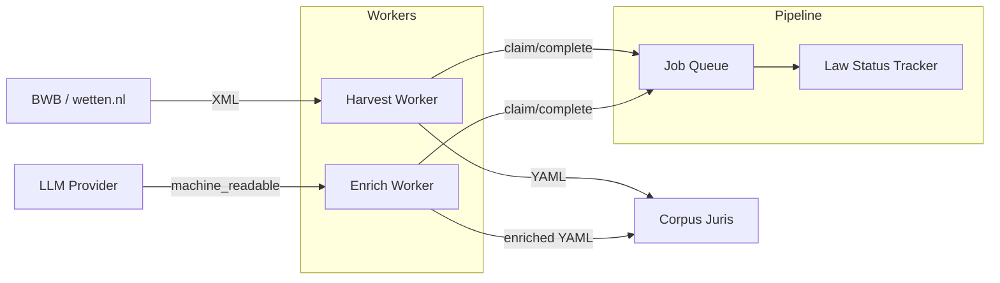
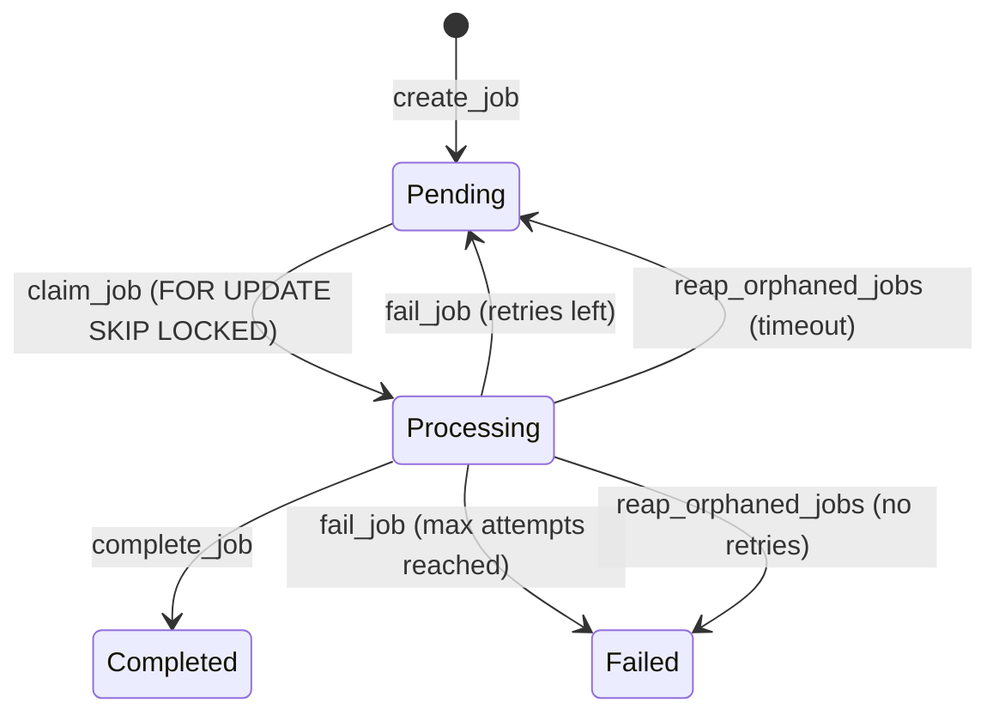
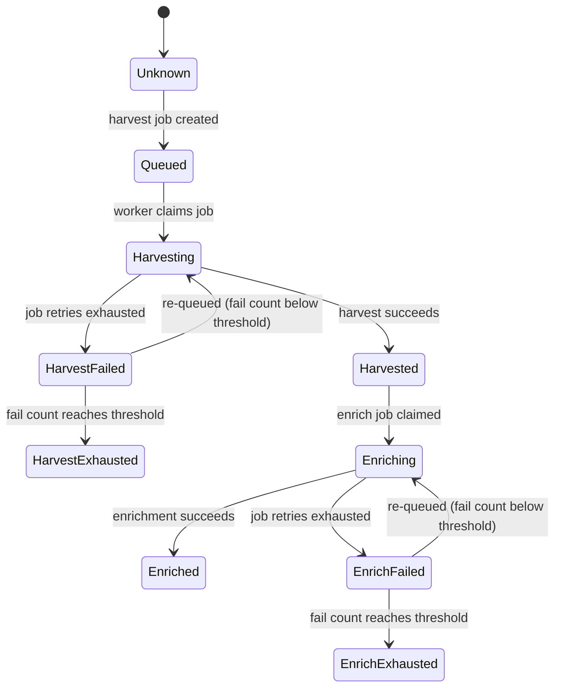

The pipeline is a PostgreSQL-backed job queue and law status tracking system that orchestrates the law processing workflow.

## Overview

- **Language**: Rust
- **Location**: `packages/pipeline/`
- **Database**: PostgreSQL
- **Key feature**: Reliable concurrent job processing with `FOR UPDATE SKIP LOCKED`

## Architecture

The pipeline coordinates two processing stages: **harvesting** (downloading laws from wetten.nl) and **enrichment** (adding machine-readable logic via LLM).



## Modules

| Module | Purpose |
|--------|---------|
| `job_queue.rs` | Job creation, claiming (`FOR UPDATE SKIP LOCKED`), completion, failure with auto-retry |
| `law_status.rs` | Per-law status tracking through 10 states |
| `harvest.rs` | Harvest execution - download XML from BWB, convert to YAML |
| `enrich.rs` | Enrichment execution - call LLM to add `machine_readable` sections |
| `worker.rs` | Polling loops for harvest and enrich workers |
| `models.rs` | Data types: `Job`, `LawEntry`, `JobType`, `JobStatus`, `LawStatusValue`, `Priority` |
| `config.rs` | Configuration from environment variables |
| `db.rs` | Connection pool creation and migration runner |
| `error.rs` | Error types (`PipelineError`) |

## Job Lifecycle



Workers claim jobs atomically using PostgreSQL's `FOR UPDATE SKIP LOCKED` - multiple workers can safely process jobs concurrently without blocking each other.

### Automatic Retries

When a job fails and has attempts remaining (`attempts < max_attempts`), it returns to `Pending` for retry. Default `max_attempts` is 3.

### Orphan Reaping

Jobs stuck in `Processing` beyond the orphan timeout (default: 30 minutes) are reset to `Pending` or marked `Failed`, handling crashed workers gracefully.

## Law Status Tracking

Each law in the corpus progresses through processing states:



## Harvest Worker

The harvest worker:
1. Polls the queue for pending harvest jobs
2. Downloads law XML from BWB (wetten.nl)
3. Converts XML to YAML via the harvester library
4. Writes YAML to the corpus
5. Auto-creates enrich jobs for each configured LLM provider
6. Creates follow-up harvest jobs for referenced laws (respects depth limit of 1000)

## Enrich Worker

The enrich worker:
1. Polls the queue for pending enrich jobs
2. Spawns an LLM CLI process to generate `machine_readable` sections
3. Tracks progress via `.enrichment-progress.json` (polled every 10s)
4. Computes coverage score (the stored `law_entries.coverage_score` is the cumulative fraction of articles with `machine_readable`; the per-run delta rides in the job result)
5. Creates per-provider branches (e.g., `enrich/opencode`)

### Chunked enrichment of large laws

One LLM session cannot enrich a large law (hundreds of articles) within the
session/RSS limits. With `ENRICH_MAX_ARTICLES_PER_RUN = N` (default 15, `0`
disables chunking) each enrich run processes at most N articles, in document
order, from a **worker-owned cursor**:

- The cursor (`enrich_cursor` + `enrich_cursor_path`) persists in the
  `.enrichment.yaml` on the `enrich/{provider}` branch. It only applies when
  recorded for the same YAML path and within bounds; otherwise it resets to 0
  (covers new law versions and legacy metadata).
- Each successful chunk commits and pushes its own result — a failing later
  chunk never loses earlier chunks.
- While the law is not finished (`law_complete = false`), its status stays
  `enriching` and a continuation job is created **in the same database
  transaction** as the job completion (respecting the unique active-enrich-job
  index), so there is never a law in `enriching` without an active/pending job.
- MvT research runs only in the first chunk (cursor 0); reverse validation is
  limited to the articles of the chunk. A chunk may legitimately add zero
  `machine_readable` sections when the agent records a `chunk_report` in
  `.enrichment-result.yaml` that references at least one article of the
  chunk's window; a chunk without any output (or with an empty/unrelated
  report) fails retryable (never terminal).
- Termination is guaranteed in `ceil(articles_total / N)` successful runs,
  independent of LLM behavior; the last chunk marks the law `enriched`.
- Task-flow enrichments (`deliver=task`) always run whole-law (chunking off).

### LLM Providers

The LLM provider is configurable via `LLM_PROVIDER` (default: `opencode`). Provider-specific paths and models are set via environment variables (e.g., `OPENCODE_PATH`, `OPENCODE_MODEL`).

The LLM subprocess runs with a stripped environment (allowlisted vars only) for security.

## Configuration

| Variable | Default | Purpose |
|----------|---------|---------|
| `DATABASE_URL` | required | PostgreSQL connection string |
| `DATABASE_MAX_CONNECTIONS` | 5 | Connection pool size |
| `REGULATION_REPO_PATH` | `./regulation-repo` | Output directory |
| `WORKER_POLL_INTERVAL_SECS` | 5 | Queue poll interval |
| `WORKER_MAX_POLL_INTERVAL_SECS` | 60 | Max backoff interval |
| `WORKER_JOB_TIMEOUT_SECS` | 1200 (20 min) | Job execution timeout |
| `WORKER_ORPHAN_TIMEOUT_SECS` | 1800 (30 min) | Orphan detection timeout |
| `LLM_PROVIDER` | `opencode` | LLM provider selection |
| `LLM_TIMEOUT_SECS` | 600 (10 min) | LLM execution timeout |
| `ENRICH_MAX_ARTICLES_PER_RUN` | 15 | Max articles per enrich run (chunked enrichment); `0` disables chunking |

## Database Schema

Two tables with PostgreSQL enums:

**`jobs`** - Job queue with retry tracking, priority ordering, and JSONB payload/result/progress columns. Partial index `WHERE status = 'pending'` for efficient claiming.

**`law_entries`** - Per-law status tracking with foreign keys to harvest/enrich jobs and a coverage score (0.0–1.0).

Migrations run automatically at startup using an advisory lock for coordination.

## Testing

```bash
just pipeline-test               # Unit tests (no Docker)
just pipeline-integration-test   # Integration tests (Docker + testcontainers)
```

Integration tests use `testcontainers` to spin up ephemeral PostgreSQL instances - no local database setup required.

## Further Reading

- [Harvester](./harvester) - the BWB law downloader used by harvest jobs
- [Architecture](/guide/architecture) - where the pipeline fits in the system
