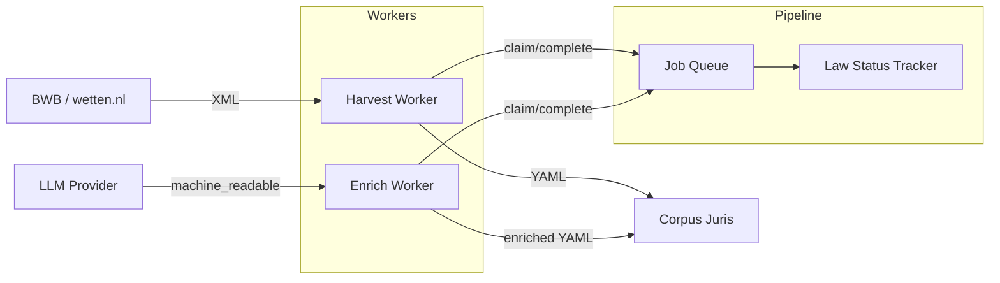
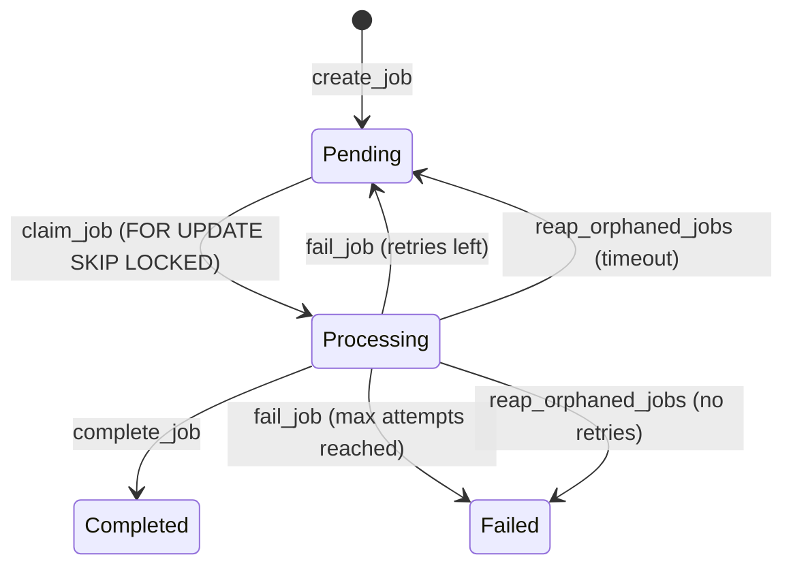
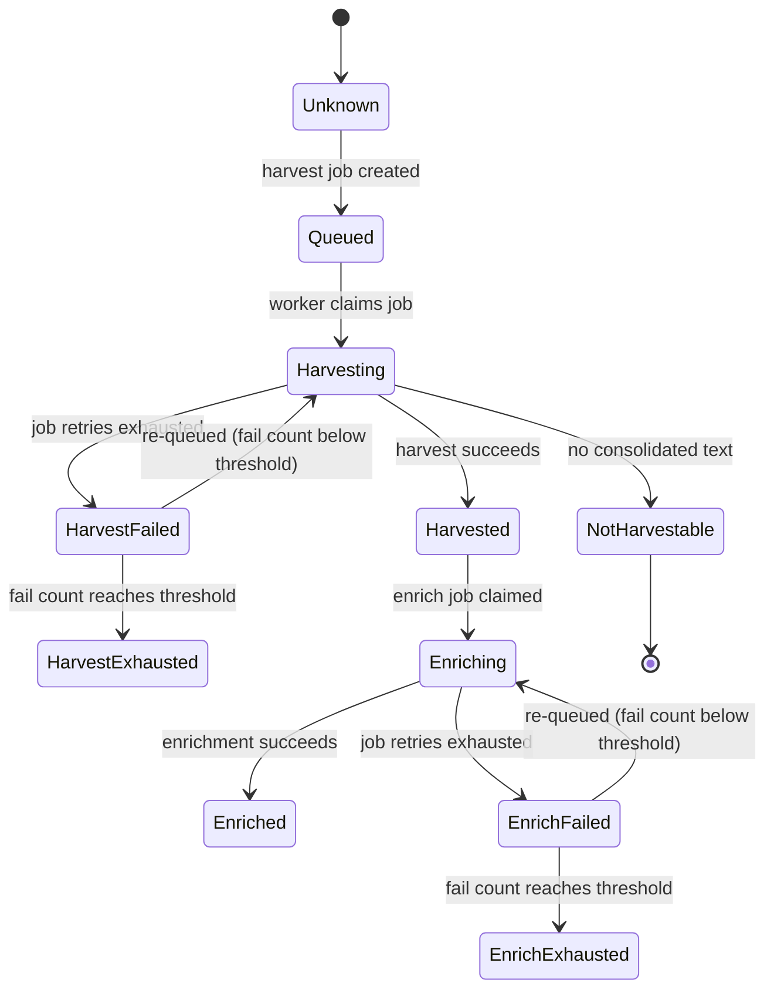

The pipeline is a PostgreSQL-backed job queue and law status tracking system that orchestrates the law processing workflow.

## Overview

- **Language**: Rust
- **Location**: `packages/pipeline/`
- **Database**: PostgreSQL
- **Key feature**: Reliable concurrent job processing with `FOR UPDATE SKIP LOCKED`

## Architecture

The pipeline coordinates two processing stages: **harvesting** (downloading laws from wetten.nl) and **enrichment** (adding machine-readable logic via LLM).


```mermaid
flowchart LR
    subgraph Pipeline
        Q[Job Queue]
        S[Law Status Tracker]
    end
    subgraph Workers
        HW[Harvest Worker]
        EW[Enrich Worker]
    end
    BWB[BWB / wetten.nl] -->|XML| HW
    HW -->|YAML| Corpus[Corpus Juris]
    HW -->|claim/complete| Q
    EW -->|claim/complete| Q
    Q --> S
    LLM[LLM Provider] -->|machine_readable| EW
    EW -->|enriched YAML| Corpus
```

## Modules

| Module | Purpose |
|--------|---------|
| `job_queue.rs` | Job creation, claiming (`FOR UPDATE SKIP LOCKED`), completion, failure with auto-retry |
| `law_status.rs` | Per-law status tracking through 11 states |
| `harvest.rs` | Harvest execution: download XML from BWB, convert to YAML |
| `harvest_request.rs` | The one entry point for "request a harvest", shared by the pipeline API and the admin API |
| `traject_harvest.rs` | Harvest of a law for one traject, delivered as a review task instead of written to the corpus |
| `enrich.rs` | Enrichment execution: call the LLM to add `machine_readable` sections |
| `enrich_v2/` | The model-free parts of enrichment: checks, capability plan, reference graph, closing pass |
| `document_convert.rs` | Uploaded document (docx, PDF and others) to a markdown werkdocument |
| `law_convert.rs` | Uploaded PDF or Word document to a base-law YAML, followed by a task-flow enrich |
| `law_migrate.rs` | Lift a law file to schema v0.7.0 |
| `markings.rs`, `untranslatables.rs` | Persist the markings and untranslatables the enrichment agent reports |
| `tasks.rs` | Personal review tasks that tie a finished job to the account that requested it |
| `feature_flags.rs` | Read and write the shared `feature_flags` table |
| `worker.rs` | Polling loops for the harvest and enrich workers |
| `health.rs` | The small HTTP health endpoint inside each worker |
| `api/` | Handlers of the `pipeline-api` service |
| `models.rs` | Data types: `Job`, `LawEntry`, `JobType`, `JobStatus`, `LawStatusValue`, `Priority` |
| `config.rs` | Configuration from environment variables |
| `db.rs` | Connection pool creation and migration runner |
| `error.rs` | Error types (`PipelineError`) |

## Binaries

| Binary | Source | What it is |
|--------|--------|------------|
| `regelrecht-harvest-worker` | `src/bin/harvest_worker.rs` | Claims `harvest` and `traject_harvest` jobs |
| `regelrecht-enrich-worker` | `src/bin/enrich_worker.rs` | Claims `enrich`, `document_convert` and `law_convert` jobs, which share the LLM CLI environment and the hourly budget |
| `regelrecht-pipeline-api` | `src/bin/pipeline_api.rs` | Internal HTTP service, see [Pipeline API](#pipeline-api) |
| `law-check` | `src/bin/law_check.rs` | Runs the deterministic enrichment checks over law files, without database, git or model. Exits 1 on schema errors; `--strict` fails on every finding; `--corpus` adds the cross-law binding check |
| `law-source` | `src/bin/law_source.rs` | Compares a law file's text with the official BWB toestand. Exits 1 when an article drifts, is missing or is fabricated. `--rewrite` replaces the text with the official one and keeps `machine_readable` per article |
| `law-migrate` | `src/bin/law_migrate.rs` | Lifts law files to schema v0.7.0 and validates the result. A required field it cannot fill is reported, never guessed; it writes only with `--write` |
| `enrich-once` | `src/bin/enrich_once.rs` | Runs the real enrichment loop against a directory on disk, without database or git, so a worker change can be tried on one law locally |

Run the four tools from `packages/` with
`cargo run -p regelrecht-pipeline --bin <name> -- <args>`. The usage of each is
in the doc comment at the top of its source file.

## Job Lifecycle


```mermaid
stateDiagram-v2
    [*] --> Pending: create_job
    Pending --> Processing: claim_job (FOR UPDATE SKIP LOCKED)
    Processing --> Completed: complete_job
    Processing --> Pending: fail_job (retries left)
    Processing --> Failed: fail_job (max attempts reached)
    Processing --> Pending: reap_orphaned_jobs (timeout)
    Processing --> Failed: reap_orphaned_jobs (no retries)
```

Workers claim jobs atomically using PostgreSQL's `FOR UPDATE SKIP LOCKED`, so multiple workers can safely process jobs concurrently without blocking each other.

### Automatic Retries

When a job fails and has attempts remaining (`attempts < max_attempts`), it returns to `Pending` for retry. Default `max_attempts` is 3.

### Orphan Reaping

Jobs stuck in `Processing` beyond the orphan timeout (default: 30 minutes) are reset to `Pending` or marked `Failed`, which is how a crashed worker is handled.

## Law Status Tracking

Each law in the corpus progresses through processing states:


```mermaid
stateDiagram-v2
    [*] --> Unknown
    Unknown --> Queued: harvest job created
    Queued --> Harvesting: worker claims job
    Harvesting --> Harvested: harvest succeeds
    Harvesting --> HarvestFailed: job retries exhausted
    HarvestFailed --> Harvesting: re-queued (fail count below threshold)
    HarvestFailed --> HarvestExhausted: fail count reaches threshold
    Harvested --> Enriching: enrich job claimed
    Enriching --> Enriched: enrichment succeeds
    Enriching --> EnrichFailed: job retries exhausted
    EnrichFailed --> Enriching: re-queued (fail count below threshold)
    EnrichFailed --> EnrichExhausted: fail count reaches threshold
    Harvesting --> NotHarvestable: no consolidated text
    NotHarvestable --> [*]
```

`NotHarvestable` is the terminal one. A work can have no consolidated text to
harvest because it was withdrawn, is not yet in force, or has only been
announced. The skip reason is uniform, so the status is a single value and the
precise reason and date go into the harvest job's result. The job is completed
rather than failed, so it is never retried; a future law can be re-harvested by
hand once its text appears.

## Pipeline API

Besides the workers, the crate builds one HTTP service, `pipeline-api` (`src/bin/pipeline_api.rs`, image `regelrecht-pipeline-api`). It has no public address and no authentication of its own. The editor API forwards `/api/harvest/*` to it (see `PIPELINE_API_URL` on [Editor API](./editor-api)) and does the auth checks in front of it.

| Route | Purpose |
|-------|---------|
| `POST /harvest` | Create a harvest job for one law |
| `POST /harvest/batch` | Create harvest jobs for several laws |
| `GET /harvest/status` | Job and law status |
| `GET /harvest/search` | Search BWB for a law to harvest |
| `GET /health` | Liveness |

## Harvest Worker

The harvest worker:
1. Polls the queue for pending harvest jobs
2. Downloads law XML from BWB (wetten.nl)
3. Converts XML to YAML via the harvester library
4. Writes YAML to the corpus
5. Creates enrich jobs for each LLM provider, but only when `ENRICH_AUTO_ENQUEUE` is on (it is off by default) and the law is not `enrich_exhausted`
6. Creates follow-up harvest jobs for the laws the harvested text references

Two mechanisms pull in further laws, each with its own limit:

- **References in the text.** Step 6 follows the external references the
  harvester finds in the XML. A follow-up job carries its parent's depth plus
  one, and the chain stops at `MAX_HARVEST_DEPTH` (1000, in `harvest.rs`). That
  constant guards against runaway recursion and is not a tuning knob; the chain
  normally ends because every referenced law is already harvested or queued.
- **Related legislation from enrichment.** After an enrich job, the related
  legislation the agent reports (delegated regelingen, cross-law sources, legal
  bases the harvester misses) is harvested only while the enrich job's depth is
  below `RELATED_HARVEST_MAX_DEPTH` (default 2). This is the limit that bounds
  how far one enrichment can grow the corpus.

## Enrich Worker

The enrich worker:
1. Polls the queue for pending enrich jobs, within the hourly budget (`ENRICH_HOURLY_LIMIT`)
2. Spawns an LLM CLI process to generate `machine_readable` sections
3. Tracks progress via `.enrichment-progress.json` (polled every 10s)
4. Computes coverage score (the stored `law_entries.coverage_score` is the cumulative fraction of articles with `machine_readable`; the per-run delta rides in the job result)
5. Pushes the result to a per-provider branch (`enrich/` followed by the provider name, `opencode` or `claude`) for review

The hourly budget fails closed. Without `ENRICH_HOURLY_LIMIT`, or with `0`, the
worker enriches nothing, so a forgotten variable cannot spend a subscription on
the whole corpus. The cap counts runs for the worker's own `LLM_PROVIDER` per
clock hour (Europe/Amsterdam), and because it is counted in the `jobs` table it
survives a restart.

### Large laws and agent sessions

A large law does not fit in one agent session. The worker splits it into
windows of at most `ENRICH_MAX_ARTICLES_PER_RUN` articles (default 15) and owns
the cursor itself: it lives in `.enrichment.yaml` on the `enrich/{provider}`
branch, each chunk pushes its own result, and the next chunk is queued in the
same transaction that completes the current one. A law of N articles is done in
at most `ceil(N / 15)` successful runs, whatever the model does. Task-flow
enrichments (`deliver: task`) always take the whole law.

Within one window, `ENRICH_SESSION_REUSE` decides how the translation pass and
the feedback rounds of the gates share an agent session: all of them (`window`,
the default), only the schema repair (`repair`), or none (`off`). It applies to
the claude provider and never crosses a window. Token use and cost of every
call land in the job result (`agent_calls`, `usage`), which is how the modes are
compared; `enrich-once --session-reuse` prints the same table locally.

The reasoning behind both, including why a window follows document order rather
than "the next articles without `machine_readable`", is in the doc comments on
`plan_chunk` and `SessionReuse` in `enrich.rs`.

### LLM Providers

`LLM_PROVIDER` selects `opencode` (the default) or `claude`. The binary and model
come from `OPENCODE_PATH` / `OPENCODE_MODEL` or `CLAUDE_PATH` / `CLAUDE_MODEL`,
with `LLM_PATH` and `LLM_MODEL` as the fallback for either.

The LLM subprocess runs with a stripped environment (allowlisted vars only) for security.

## Configuration

### Database and workers

| Variable | Default | Purpose |
|----------|---------|---------|
| `DATABASE_URL` | required | PostgreSQL connection string; `DATABASE_SERVER_FULL` is read as fallback |
| `DATABASE_MAX_CONNECTIONS` | 5 | Connection pool size |
| `REGULATION_REPO_PATH` | `./regulation-repo` | Local checkout the workers write to |
| `REGULATION_OUTPUT_BASE` | `regulation/nl` | Directory inside that checkout where harvested laws land |
| `WORKER_POLL_INTERVAL_SECS` | 5 | Queue poll interval |
| `WORKER_MAX_POLL_INTERVAL_SECS` | 60 | Max backoff interval |
| `WORKER_JOB_TIMEOUT_SECS` | 1200 (20 min) | Job execution timeout |
| `WORKER_ORPHAN_TIMEOUT_SECS` | 1800 (30 min) | Orphan detection timeout |
| `WORKER_MAX_CONSECUTIVE_RESOURCE_FAILURES` | 5 | Consecutive fork or out-of-memory failures after which the worker exits, so the platform restarts it with a clean process table |
| `EXHAUSTED_THRESHOLD` | 10 | Consecutive failures after which a law becomes `harvest_exhausted` or `enrich_exhausted` |
| `RELATED_HARVEST_MAX_DEPTH` | 2 | Depth up to which related legislation from enrichment is harvested |
| `HEALTH_PORT` | 8000 | Port of the worker's health endpoint |
| `PORT` | 8000 | Listen port of `pipeline-api` |

The corpus checkout is configured by the [corpus library](./corpus)
(`packages/corpus/src/config.rs`). Without `CORPUS_REPO_URL` the workers run
without one.

| Variable | Default | Purpose |
|----------|---------|---------|
| `CORPUS_REPO_URL` | none | Corpus repository to clone and push to |
| `CORPUS_REPO_PATH` | `/tmp/corpus-repo` | Where the clone lives |
| `CORPUS_BRANCH` | derived | Branch to use; a preview deployment derives its own from `HOSTNAME` / `DEPLOYMENT_NAME` |
| `CORPUS_GIT_TOKEN` | none | Token for the central corpus repository only, never for a traject repository |
| `CORPUS_GIT_AUTHOR_NAME`, `CORPUS_GIT_AUTHOR_EMAIL` | `regelrecht-harvester`, `noreply@minbzk.nl` | Commit author |

### Enrichment

| Variable | Default | Purpose |
|----------|---------|---------|
| `ENRICH_HOURLY_LIMIT` | 0 (paused) | Enrich runs per clock hour for this worker's provider; must be set for the worker to enrich at all |
| `ENRICH_NIGHT_MULTIPLIER` | 1 | Multiplier on the hourly limit between 00:00 and 08:00 (Europe/Amsterdam) |
| `ENRICH_AUTO_ENQUEUE` | off | `true` (or `1`, `yes`, `on`) makes a completed harvest queue enrich jobs; otherwise enrichment is requested explicitly through `POST /api/enrich-jobs` on the [Harvester Admin](./admin) API |
| `LLM_PROVIDER` | `opencode` | `opencode` or `claude` |
| `LLM_PATH`, `LLM_MODEL` | none | Fallback binary and model for either provider |
| `OPENCODE_PATH`, `OPENCODE_MODEL` | `opencode`, provider default | Binary and model for opencode |
| `CLAUDE_PATH`, `CLAUDE_MODEL` | `claude`, provider default | Binary and model for claude |
| `LLM_EFFORT` | none | Reasoning effort passed to the provider (`claude --effort`) |
| `LLM_TIMEOUT_SECS` | 600 (10 min) | Ceiling per agent call |
| `CLAUDE_CODE_OAUTH_TOKEN` | none | Subscription token for the claude provider; several comma-separated tokens are rotated over time |
| `SKILLS_DIR` | `/opt/skills` | Skills baked into the image, linked into the checkout when the directory exists |
| `ENRICH_MAX_ARTICLES_PER_RUN` | 15 | Max articles per enrich run (chunked enrichment); `0` disables chunking |
| `ENRICH_FEEDBACK_ROUNDS` | 1 | Feedback rounds per gate; `2` or `checks=2,marking=3` |
| `ENRICH_SESSION_REUSE` | `window` | Session sharing within one window: `window`, `repair` or `off` |
| `ENRICH_STEPS` | every step | Which steps of the chain to run, e.g. `reconcile` for the closing pass alone |
| `ENRICH_WINDOW_MODE` | `entries` | What a window is: `entries` counts entries, `layers` uses the dependency layers of RFC-033 |
| `ENRICH_WINDOW_CONCURRENCY` | 1 | Windows run side by side, each in its own copy of the checkout and its own agent session |
| `ENRICH_CONTEXT_BRIEF` | on | `0` withholds the context brief the worker writes beside the law |
| `ENRICH_MAX_RSS_MB` | 3500 | Memory ceiling for the agent subprocess |
| `CODE_COMMIT` | empty | Commit of the running image, recorded in the enrichment metadata |

`LLM_TIMEOUT_SECS` is a ceiling per agent call, and one run makes several: a
translation pass, a feedback round per gate, the closing pass and the final
schema gate. The worker lowers it when the job budget cannot hold that many,
so raising `LLM_TIMEOUT_SECS` without raising `WORKER_JOB_TIMEOUT_SECS` buys
nothing.

## Database Schema

The pipeline crate owns the migrations (`packages/pipeline/migrations/`) for the
whole platform database, so the editor API's tables (accounts, trajects, notes,
settings, feature flags) are created here too. The two the pipeline itself runs
on:

**`jobs`** - Job queue with retry tracking, priority ordering, and JSONB payload/result/progress columns. Partial index `WHERE status = 'pending'` for efficient claiming.

**`law_entries`** - Per-law status tracking with foreign keys to harvest/enrich jobs and a coverage score (0.0–1.0).

Next to those, `tasks` and `job_blobs` carry review tasks and their payloads,
and `markings` and `untranslatables` hold what enrichment reported.

Migrations run automatically at startup using an advisory lock for coordination.

## Testing

```bash
just pipeline-test               # Unit tests (no Docker)
just pipeline-integration-test   # Integration tests (Docker + testcontainers)
```

Integration tests use `testcontainers` to spin up ephemeral PostgreSQL instances; no local database setup is required.

## Further reading

- [Harvester](./harvester) - the BWB law downloader used by harvest jobs
- [Architecture](/guide/architecture) - where the pipeline fits in the system
