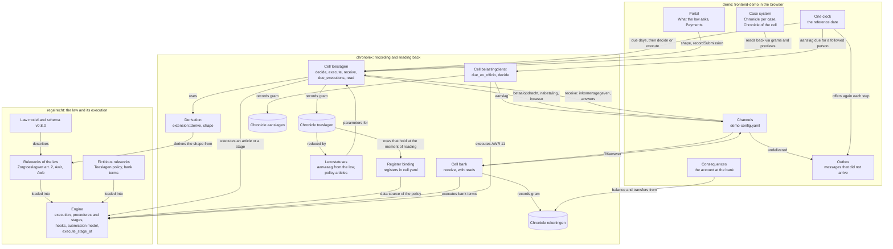
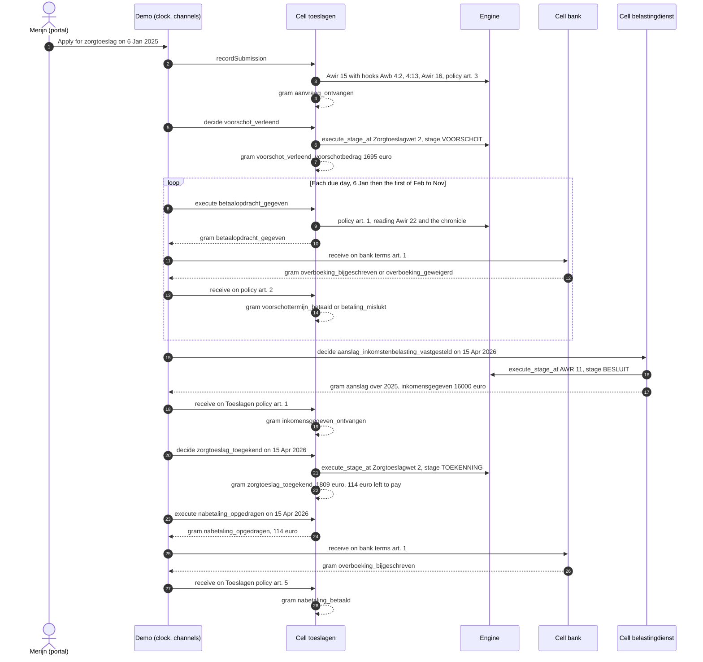

The demo follows one zorgtoeslag case from the application to the final settlement, and records every legal fact on the way in a chronicle (*kroniek*), as the chronolexography position paper describes it and [RFC-022](/rfcs/rfc-022) maps it onto RegelRecht. This page explains how that works: which components take part, where the law in the law format ends and the recording begins, how the configuration files depend on each other, and what happens in Merijn's case step by step.

The [Demo](/components/demo) page describes the screens. This page describes the machinery behind the Chronicle on a case, the payments on the portal, the Lexostatuses view and the Consequences screen.

## Scope and status

This is a proof of concept, built in three pull requests: PR #1679 (the application as a fact in a chronicle, with a compact cell), PR #1683 (the application and the decision in the portal and the case system) and PR #1689 (the whole process: voorschot, installments, a bank, the aanslag of the Belastingdienst, and the settlement with its nabetaling or terugvordering). The design note `packages/cel/ONTWERP-proces-zorgtoeslag.md` records the decisions and where each one comes from.

Keep its limits in mind.

- **It is not the law in force as Toeslagen executes it.** The Algemene wet inkomensafhankelijke regelingen (Awir) is modeled for the articles the process needs (8, 14, 15, 16, 19, 22, 24, 26, 26a and 28 in the demo corpus), and each of those leaves parts out; the comments in the rulework say which. The Algemene wet inzake rijksbelastingen (AWR) is in the demo corpus for article 11 (the aanslag) and the articles on the inkomensgegeven (21, 21c, 21e). The zorgtoeslag is an annual amount; Zorgtoeslagwet article 2 lid 5 (entitlement per calendar month) is not modeled.
- **Some ruleworks are fictitious.** No published policy of the Dienst Toeslagen says how high an installment is, when a nabetaling is paid, how a terugvordering is collected or how Toeslagen reads its own chronicle; no published planning says on which day the inspecteur sets an aanslag; and the bank is made up. The verzamelinkomen in an aanslag is a given of the demo, not a computation under the Wet IB 2001. These ruleworks say so in their name and in every article text (`FICTIEF`), and the policy that reads the chronicle is marked as an assumption (*aanname*) made on behalf of the Dienst Toeslagen.
- **The cell is the compact core of the chronolex work on the branch poc/chronolex.** It has no forms, no HTTP and no transport of its own. The decisions this work rests on are recorded in RFC-045 (reading a chronicle back as policy of the holder), RFC-046 (the application), RFC-047 (the cell's interface comes from the law), RFC-048 (origin), RFC-049 (the law says what arises) and RFC-050 (a case over time).

## Components and their boundaries

Three zones take part. **regelrecht** is the law in the law format and the engine that executes it. **chronolex** is the cell: it decides which facts arise, records them as grams, and reads them back. **demo** is the browser application around both: one clock, a portal, a case system, and the transport between cells.



All three cells and the engine run in the browser as one WebAssembly module, `regelrecht_cel`: the crate `packages/cel` built with its `wasm` feature, which exports the engine (`WasmEngine`) next to the cell (`WasmCell`). The page keeps the grams in `localStorage` and hands them back to `WasmCell` when it starts.

What each zone does, in the order a fact passes through them:

- The **engine** executes. It knows procedures and their stages (RFC-008), fires hooks (RFC-007), builds the model of a submission (which articles take part in an application and what each asks), and runs a single stage of a procedure on a fresh state with `execute_stage_at`. It records nothing and keeps no state between calls.
- The **cell** decides what is recorded. It derives the shape of every gram from the law (`extension::derive` and `shape` in `packages/cel/src`), executes the article or the stage through the engine, checks the guards (references, `until`, `once_per`, the order of time), and appends the gram to its chronicle. It reads back what a decision asks of the application from that application, as the law describes it, and everything else with an article in the policy of the holder, which the engine executes over the chronicle as a data source. `Cell::lexostatuses` describes both kinds and `Cell::read_lexostatus` reads either by name, with the grams the values came from; the "Lexostatuses" view in the case system shows them.
- The **demo** decides when. It holds the clock, asks the cell which days an installment is due, takes a decision when its moment has come, and carries a gram from one cell to the other along the configured channels. It knows no event, field or article by name; those come from the configuration and the law.

## Where regelrecht stops and chronolex begins

The law says, in its own words, what arises. The cell decides how that is recorded. A rulework of the law contains no chronolex vocabulary: no event names, no gram types, no `extensions.chronolex` block. The cell reads the following keys and derives the recording from them.

| The law says (key in the rulework) | Where in the zorgtoeslag process | What the cell derives |
|---|---|---|
| `produces.submission: {kind: AANVRAAG}` | Awir 15: the belanghebbende applies for a tegemoetkoming | A gram of type `submission`, subtype `aanvraag`, stage `AANVRAAG`. Its fields are the parameters with origin `BELANGHEBBENDE` or `KANAAL` |
| A hook with `applies_to.submission`, narrowed with `decided_by` or `established_by` | Awb 4:2 and 4:13 on every application for a beschikking; Awir 16 and the fictitious policy article 3 on the application of Awir 15 | The hook extends the application: what it asks of the applicant becomes a field of the same gram |
| `produces.moment` | Awb 4:13 lid 1: the decision period runs from receipt | `effective_at` of the application is the moment of receipt, with Awb 4:13 lid 1 as its legal basis |
| `produces.legal_character: BESCHIKKING` with `decides_on` and `procedure_id` | Zorgtoeslagwet 2 decides on the application of Awir 15, in the procedure `tegemoetkoming` of the Awir | One decretogram per stage that `is: BESLUIT` (VOORSCHOT and TOEKENNING), each referring to the application as `on_application`, its fields the outputs of the article and of the hooks at that stage |
| `produces.legal_character: BESCHIKKING` without `decides_on` | AWR 11: the inspecteur sets the aanslag; nobody applies for it | A decretogram at each decision stage of its procedure (here the Awb's BESLUIT), referring to nothing: a decision ex officio |
| A stage's `requires` with exactly one date | `dagtekening_voorschot`, `dagtekening_toekenning`, `dagtekening_terugvordering`, `besluit_datum` of the aanslag | `dated_by`: the cell fills that parameter with the day the decision is taken |
| `origin` with `rol: TIJDVAK` | `aangevraagd_berekeningsjaar` (Awir 15 lid 1) on the application; `berekeningsjaar` (Awir 16, 19 and 26, grondslag Awir 15 lid 5) on the decisions | The period the application asks for, and the `period` of each decision. A period of `unit: year` means the version of the law in force on 1 January of that year |
| `specifies` on a parameter | Not used here; the NAPP corpus uses it for a lex specialis of Awb 4:2 | One field with two legal bases |

The engine's law model (`packages/law-model/src/model.rs`) reads `moment` and `specifies`. Schema v0.8.0 accepts them but does not describe them yet; a proposal for the schema is still to be written.

The test for a key, from the design discussion of 7 October 2026: can you explain it to a jurist without the words gram, chronicle (*kroniek*), cell (*cel*) or chronolex? If you can, it is law and may stand in the rulework. If you cannot, it is implementation and belongs in the stream, in the policy of the holder, or in the code. `produces.submission` passes: "here an application arises". An event name such as `aanvraag_ontvangen` does not, so it lives in the stream.

Three places carry recording vocabulary, all outside the law itself.

- **The fictitious executing policies** (`fictief_beleid_termijnbedrag_voorschot` articles 1 and 2, `fictief_beleid_toekenning_toeslagen` articles 1, 4, 5, 7 and 8, `fictieve_bankvoorwaarden` articles 1 and 2) carry an explicit `produces.extensions.chronolex` block. A payment is neither an application nor a decision, and the law format has no word yet for "an execution arises here" (open in the design note). The block says what the derivation cannot: `type: executogram`, `executed_on` (the parameter for the day, `once_per: month`, `day: 1`), `record_when` (the boolean output that says whether a gram arises), `until` (the stage that ends it), `refers_to` (by stage or by article), `identified_by` (the parameter that identifies a received message, such as the bank's betaalkenmerk) and `fields`. An explicit block always wins over the derivation. The cell refuses a receipt (`record_when` without `executed_on`) that has neither a required `refers_to` nor `identified_by`, because it could not recognise a message delivered twice. `identified_by` names a parameter with `required: true`, not an output of the article, and a message without that value is refused.
- **The stream of the Belastingdienst** names the parameter that gives the year of an aanslag (`period: {parameter: belastingjaar, unit: year}`). The law says the period of a decision with the origin role `TIJDVAK`, and schema v0.8.0 allows that role only for a period the applicant chooses (`waarde: BELANGHEBBENDE`). Nobody applies for an aanslag, so for a decision ex officio the stream says it. The cell refuses it on a decision whose law names a period, or on a decision taken on a submission.
- **The names of the policy articles that read the chronicle back.** Each article of `fictief_beleid_kroniek_toeslagen` carries an `endpoint` (`voorschot`, `uitbetaald`, ...), which the cell uses as the name of the lexostatus. `endpoint` is an existing key of the law format ("named endpoint for this article"); nothing else reads it.

The engine has one point of contact with the chronicle, and it is an ordinary one: a register. `fictief_beleid_kroniek_toeslagen` has an input `grams` with `source: {}`, like any input from a register. Only `registers:` in the cell configuration says that this input is the chronicle `toeslagen`; the policy names no system.

## How the configuration fits together

The demo reads everything below from `corpus/demo`. The main corpus has its own versions of the Awir and the Zorgtoeslagwet (`wet_op_de_zorgtoeslag`), which the cell's own tests in `packages/cel/tests/zorgtoeslag.rs` use; `packages/cel/tests/demo_corpus.rs` runs the same process on the demo corpus.

| File or section | What it says | Who reads it | What changes when you edit it |
|---|---|---|---|
| `corpus/demo/regulation/nl/zorgtoeslagwet/TOESLAGEN-2025-01-01.yaml`, article 2 | The amount, and that it is a beschikking on the application of Awir 15 in the procedure `tegemoetkoming` | Engine; the cell derives the decisions from it | The fields of both decisions, and whether the process exists at all. The 2024 version has no `decides_on` and no procedure, so it does not take part |
| `corpus/demo/regulation/nl/algemene_wet_inkomensafhankelijke_regelingen/` (2025 and 2026) | The procedure `tegemoetkoming` with its stages (AANVRAAG, VOORSCHOT, VOORSCHOT_BEKENDMAKING, TOEKENNING, TOEKENNING_BEKENDMAKING); articles 8, 14, 15, 16, 19, 22, 24 and 26a | Engine; the cell for the shape of the application and the stages | The fields of the application, which stages are decisions, the dates a decision is dated by, the months with an installment, the settlement |
| `corpus/demo/regulation/nl/algemene_wet_bestuursrecht/artikel_1_1_bestuursorgaan/AWB-1994-01-01.yaml` | Awb 3:46, 4:2, 4:13, 6:7 and 6:8 as hooks | Engine | What every application asks (4:2), the moment of receipt (4:13), and the objection period on each decision |
| `fictief_beleid_termijnbedrag_voorschot` (Dienst Toeslagen, fictitious) | Article 1: the amount of an installment and the payment order. Article 2: the bank's answer. Article 3: the account number on the application. Article 4: the voorschot for a following year is granted on 1 November before it | Engine and cell (explicit chronolex block) | When and how much is ordered, what counts as paid, and the account field on the application form |
| `fictief_beleid_kroniek_toeslagen` (Dienst Toeslagen, fictitious, *aanname*) | Article 1: the voorschot that holds for a berekeningsjaar. Article 2: the account from the application. Article 3: what is still outstanding for a berekeningsjaar after a refusal. Article 3a: what the bank credited on the voorschot for a berekeningsjaar (Awir 24 lid 2). Article 4: the expected income, from the application, also for a following year. Article 5: the latest inkomensgegeven over the berekeningsjaar for the BSN of the application, with the day of the aanslag. Article 6: the toekenning over the year (what is left to pay, what to recover, its dagtekening). Article 7: what of a nabetaling was ordered and not refused. Article 8: the terugvordering over the year and what of it was collected | Engine, over the chronicle as a register | What a decision or an execution reads from the chronicle |
| `fictief_beleid_toekenning_toeslagen` (Dienst Toeslagen, fictitious) | Article 1: an inkomensgegeven received from the inspecteur. Article 2: at the toekenning, the toetsingsinkomen is that inkomensgegeven (a hook before the decision at stage TOEKENNING). Article 3: the toekenning on the day of the aanslag, once the inkomensgegeven is there. Articles 4 and 5: the nabetaling and the bank's answer. Article 6: the terugvordering on the day of the toekenning, if it leaves something to recover. Articles 7 and 8: the incasso and the bank's answer | Engine and cell (explicit chronolex block on 1, 4, 5, 7 and 8) | What the toekenning rests on, when it and the terugvordering are taken, and what is paid out or collected |
| `fictieve_bankvoorwaarden` (fictitious bank) | Article 1: a transfer is credited on the execution date unless the account is unknown or blocked. Article 2: an incasso is debited unless the account is unknown or blocked or the balance is too low | Engine and the bank cell | Whether the bank credits, debits or refuses |
| `fictief_beleid_kroniek_bank` (fictitious bank) | Article 1: what the bank credited to an account minus what it debited, read from its chronicle | Engine, over the chronicle `rekeningen` as a register | The balance an incasso is checked against |
| `corpus/demo/regulation/nl/algemene_wet_inzake_rijksbelastingen/` | AWR 11: the aanslag, a beschikking ex officio over a calendar year, with the verzamelinkomen and the inkomensgegeven (AWR 21 onder e, 21c lid 4). Articles 21, 21c and 21e as text | Engine; the Belastingdienst cell derives the decision from it | The fields of the aanslag |
| `fictief_beleid_aanslagregeling` (Belastingdienst, fictitious) | Article 1: the day the inspecteur sets the aanslag over a year, from the planning | Engine and the Belastingdienst cell (`decided_on`) | When the aanslag of each year is due |
| `corpus/demo/cells/toeslagen/cell.yaml` | The recording actor (`belastingdienst_toeslagen`, Awir 14 lid 1), its streams, and `registers` | Cell | Which chronicle the policy reads as `grams` |
| `corpus/demo/cells/toeslagen/streams/` | Per event its name, the article that establishes it, the `stage` where an article decides twice, `reads` (a policy, or one article of a policy), and `decided_on` (the policy article that gives the day of a decision) | Cell | Event names in the chronicle, where a decision or an execution gets its parameters, and when the voorschot for a following year, the toekenning and the terugvordering are due |
| `corpus/demo/cells/bank/` | Cell `bank`, actor `fictieve_bank`, chronicle `rekeningen`, two events on bank terms article 1 and two on article 2 (which `reads` the bank's chronicle policy), and `registers` for that policy | Cell | The bank's chronicle |
| `corpus/demo/cells/belastingdienst/` | Cell `belastingdienst`, actor `inspecteur`, chronicle `aanslagen`, the event `aanslag_inkomstenbelasting_vastgesteld` on AWR 11 with `decided_on` and the stream's `period` | Cell | The chronicle of aanslagen |
| `corpus/demo/bindings.yaml`, `fictieve_bankvoorwaarden` | `rekening_geblokkeerd` and `beginsaldo` come from the BANK table `rekeningen`; no row means null | Demo (materializer), then engine | Whether the bank knows the account, and its opening balance |
| `corpus/demo/bindings.yaml`, `algemene_wet_inzake_rijksbelastingen` and `fictief_beleid_aanslagregeling` | `aanslaggegevens` and `planning` are the rows of the BELASTINGDIENST table `aanslagen_inkomstenbelasting` for the BSN | Demo (materializer), then engine | The verzamelinkomen and the day of each aanslag |
| `demo-config.yaml`, `profiles.merijn.application` | What Merijn fills in, per field the law asks; `$bsn`, `$reference_date` and `$reference_year` are filled in by the demo | Demo | The application. A field the law does not ask is refused by the cell |
| `demo-config.yaml`, `dossier` | Parameters with origin `DOSSIER` the cell does not read from its chronicle, in the shape of a binding. Empty now: the date of the aanslag comes from the chronicle | Demo | Nothing in the zorgtoeslag process |
| `demo-config.yaml`, `ex_officio` | Per decision a cell takes ex officio its cell, its event and its subject (`bsn: $bsn`) | Demo | For whom the Belastingdienst sets aanslagen: the person of each open case with an application in a chronicle, nobody else |
| `demo-config.yaml`, `received` | Per cell the lexostatus that says what was paid on a case (`toeslagen: uitbetaald`) | Demo | "Received so far" on the portal; the demo adds nothing up itself |
| `demo-config.yaml`, `channels` | Which gram of which cell goes to which article of which cell, which field fills which parameter (`$id`, `$period` and `$input.<name>` besides a field), and which reference the answer gets | Demo | The transport between the Belastingdienst, Toeslagen and the bank |
| `demo-config.yaml`, `consequences` | Per party outside government its cell and how the demo shows it; for the bank (`view: account`) which table and fields make up the account, including `debited`; a field may be a list of names, the first a gram has counts | Demo | The Consequences screen |
| `profiles.yaml`, Merijn's `BANK` and `BELASTINGDIENST` | The account `NL00TEST0123456789` with its opening balance and `geblokkeerd`; per year the day of the aanslag and the verzamelinkomen it sets (`aanslagen_inkomstenbelasting`, read only by the Belastingdienst cell); box 1 income for every other law | Demo, through `bindings.yaml` | The aanslag and so the toekenning, a blocked account |

Two dependencies are easy to miss. The policy that reads the chronicle is valid from 1 January 2024, so that an installment paid in December before the year can read the voorschot (own choice). The installment policy is valid from 2025 and applies the law of the year the voorschot concerns, so installments exist for 2025 and later.

## Lexostatuses

A lexostatus is what a cell derives from its own chronicle on a given moment, to be able to take a decision. It is not a stored state. The chronicle holds only grams, and the cell computes a lexostatus anew each time it is asked, from the grams that hold at that moment. Read it at an earlier moment and you get what the cell knew then.

### The law sets the interface, the cell the implementation

In chronolexography as the paper describes it, a cell owns its reduction: how it reads its chronicle back is its own business. Regelrecht deviates from that on purpose, because it aims to execute the law. The law determines the *interface* of a cell: which values, by name and type, the cell must be able to supply. Those are the parameters of the articles that take part in a decision, with their `origin`. How the cell reduces its chronicle to those values is the *implementation*, and each cell decides that for itself.

Regelrecht offers one way to implement it, in the law format, so a jurist can read and test it. In order of preference:

1. **Derived from the law.** What the law already declares needs no reduction of its own. A decision on an application asks values the application carries; the law declares both, so the cell reads them from the application.
2. **An article in the holder's policy**, where the law does not say it. The article reads the chronicle as a register and carries its own legal basis, or is marked as an assumption (*aanname*).
3. **Cell configuration**, as a last resort. The zorgtoeslag cell has none: the configuration language it used for `aanvraag` and `uitbetaald` was removed in October 2026.

A cell may implement the interface differently; another system that supplies the same values with the same names and types fits the same decisions.

### The lexostatuses of Toeslagen

| Lexostatus | Gives | Laid down in | Read by |
|---|---|---|---|
| `aanvraag` | `bsn` (text), `aangevraagd_berekeningsjaar` (number), `datum_ontvangst` (date) | the law: Awir 15 with the hooks on the application (Awb 4:2, 4:13) | `voorschot_verleend`, `zorgtoeslag_toegekend` |
| `voorschot` | `voorschotbedrag` (amount in eurocent), `dagtekening_voorschot` (date) | `fictief_beleid_kroniek_toeslagen` article 1 | `betaalopdracht_gegeven` |
| `rekening` | `rekeningnummer` (text) | article 2 | the payment order, the nabetaling, the incasso |
| `achterstand` | `achterstallig_bedrag` (amount in eurocent) | article 3 | `betaalopdracht_gegeven` |
| `uitbetaald` | `uitbetaalde_voorschotten` (amount in eurocent) | article 3a, Awir 24 lid 2 | `zorgtoeslag_toegekend` |
| `schatting_inkomen` | `vermoedelijk_toetsingsinkomen` (amount in eurocent) | article 4 | `voorschot_verleend` |
| `inkomensgegeven` | `inkomensgegeven`, `datum_vaststelling_aanslag` | article 5 | `zorgtoeslag_toegekend` |
| `toekenning` | `nog_uit_te_betalen`, `terug_te_vorderen` | article 6 | the terugvordering, the nabetaling |
| `nabetaling` | `opgedragen_nabetaling` | article 7 | `nabetaling_opgedragen` |
| `terugvordering` | `terugvorderingsbedrag`, `dagtekening_terugvordering`, `ingevorderd_bedrag` | article 8 | `incasso_opgedragen` |

What a lexostatus gives is what the events that read it ask of it: the parameters of the stage a decision is taken at, or of the article an execution executes. An auxiliary output of a policy article, such as `laatste_voorschot`, is part of the article but not of what it gives.

### The application, from the law

A decision on an application (`produces.decides_on`) reads from that application every value it asks and the application carries, without a `reads` in its stream. The fields of the application are what the law declares: the parameters with origin `BELANGHEBBENDE` or `KANAAL` of Awir 15 and of the hooks on it. The moment of receipt counts as `datum_ontvangst`: a date parameter of Awir 15 whose `origin` rests on Awb 4:13 lid 1, the provision the hook's `produces.moment` rests on. The cell reads the latest gram of the application of the case that holds at the moment of reading.

A value a policy article the decision reads also gives is read from that article: `vermoedelijk_toetsingsinkomen` is in the application, and article 4 says how Toeslagen reads it for a following year. The period of the decision (`berekeningsjaar`) is the cell's to give, never the application's.

For Merijn's application of 6 January 2025, `aanvraag` gives:

| Value | Asked by (interface) | How the cell derives it (implementation) | Legal basis | Merijn |
|---|---|---|---|---|
| `aangevraagd_berekeningsjaar` | Awir 16 at the voorschot | filled in on the application | Awir 15 lid 1 | 2025 |
| `bsn` | Zorgtoeslagwet 2, at the voorschot and the toekenning | filled in on the application | Awir 13 | 999100001 |
| `datum_ontvangst` | Awir 16 at the voorschot; the 2026 version of Awir 19 at the toekenning too | the day the application came in (`effective_at` of the gram) | Awb 4:13 lid 1 | 6 January 2025 |

Each value carries its provenance, and the decision records it with the gram under `inputs`, so the chronicle shows where every input came from: `{source: lexostatus, lexostatus: aanvraag, article: algemene_wet_inkomensafhankelijke_regelingen#15, gram: <id>}` for the application, `{source: lexostatus, lexostatus: uitbetaald, register: fictief_beleid_kroniek_toeslagen#kroniek, article: fictief_beleid_kroniek_toeslagen#3a}` for a policy article.

### Per berekeningsjaar

Since a decision concerns one berekeningsjaar (see [The next year](#the-next-year)), a policy article can be read per year: it declares the parameter `berekeningsjaar`, and the cell passes the year of the decision it is about to take. The toekenning over 2025 sets off only what was paid on 2025.

### How to ask

In the browser, through the WASM module:

```js
const reading = cell.readLexostatus(engine, 'uitbetaald', { root, berekeningsjaar: 2025 }, '2026-04-15T12:00:00+02:00');
// { values: { uitbetaalde_voorschotten: { value: 169500, provenance: { source: 'lexostatus', lexostatus: 'uitbetaald', … } } },
//   grams: ['…', '…'] }
```

`root` is the id of the application gram the case started with, and the moment is RFC 3339, not a date: the cell reads what holds at that instant. `cell.lexostatuses(engine, '2025-03-01')` describes every lexostatus of the cell: its kind (`submission` or `policy`), the provision its shape is laid down in, the values it gives with their type and unit (`fields`), and the events that read it. For the application the grams of a reading are the application gram; for a policy article they are the grams of the case in the register, because the engine does not say which rows an article used. In Rust the same calls are `Cell::read_lexostatus(&service, name, &inputs, as_of)`, returning a `Reading` with `values` and `grams`, and `Cell::lexostatuses(&service, day)`.

### Where to see it

In the case system, "Lexostatuses" next to "Cases" and "Chronicle" opens with one line on what a lexostatus is, then shows each lexostatus in its own card. The heading says what it is and its name ("Wat er in de aanvraag staat · lexostatus `aanvraag`"), with which events it gives which values. The card shows its shape as a small schema (`{ bsn: tekst, aangevraagd_berekeningsjaar: getal, datum_ontvangst: datum }`) and the article it is laid down in, then per value which article asks for it (the interface), how the cell derives it (the implementation) and its legal basis. Below that, per case and per berekeningsjaar, the values on the reference date, each with the grams it was read from. "Show technical details" shows the name, the readers, the inputs and the register. The [Demo](/components/demo) page describes the view.

## Merijn's case, step by step

Merijn is the default persona: a self-employed home carer, single, with two young children. The case below starts with the reference date set to 6 January 2025 under Demo in the menu, with the default settings (applications are not reviewed by hand, decisions are announced straight away). The amounts come from running the demo cells on the demo corpus with Merijn's data; the demo shows the same. The fictitious aanslag over 2025 sets a verzamelinkomen of € 16.000 and the one over 2026 € 32.000, against the € 22.000 Merijn expects in his application, so the case shows a nabetaling in one year and a terugvordering in the next.

### One case over time



Every gram in the chronicle `toeslagen` of this case, apart from the bank's grams in `rekeningen`:

| Moment | Gram (event) | Type and stage | Established by | Refers to | Key fields |
|---|---|---|---|---|---|
| 6 Jan 2025 | `aanvraag_ontvangen` | submission (`aanvraag`), AANVRAAG | Awir 15 | | BSN, berekeningsjaar 2025, expected income € 22.000, account, requested decision Zorgtoeslagwet 2 |
| 6 Jan 2025 | `voorschot_verleend` | decretogram, VOORSCHOT | Zorgtoeslagwet 2 | `on_application` | voorschotbedrag € 1.695, toetsingsinkomen € 22.000, objection period 6 weeks |
| 6 Jan, 1 Feb to 1 Nov 2025 | `betaalopdracht_gegeven` (11×) | executogram | policy art. 1 | `voorschot` | € 154,09; the eleventh € 154,10 |
| same moments | `voorschottermijn_betaald` (11×) | executogram | policy art. 2 | `betaalopdracht` | `betaald_bedrag` |
| 15 Apr 2025 | `inkomensgegeven_ontvangen` | executogram | Toeslagen policy art. 1 | | the aanslag over 2024 (€ 24.150); no case reads it |
| 15 Apr 2026 | `inkomensgegeven_ontvangen` | executogram | Toeslagen policy art. 1 | | the aanslag over 2025: inkomensgegeven € 16.000, set on 15 April 2026 |
| 15 Apr 2026 | `zorgtoeslag_toegekend` | decretogram, TOEKENNING | Zorgtoeslagwet 2 | `on_application` | toetsingsinkomen € 16.000, toegekend € 1.809, nog uit te betalen € 114, terug te vorderen € 0 |
| 15 Apr 2026 | `nabetaling_opgedragen`, `nabetaling_betaald` | executogram | Toeslagen policy art. 4 and 5 | `toekenning`, `betaalopdracht` | € 114 |

#### The application

On "My government", the zorgtoeslag tile opens the application panel. Under "What the law asks" it lists the fields of the application with the article that asks each one: the cell executes Awir 15 with an empty application, and the engine fires the hooks that apply to it and yields with the model of the submission (`WasmCell.shape`). Awb 4:2 asks the name, address, date and signature, and the decision requested; the cell fills in the requested decision itself (Zorgtoeslagwet 2, origin role `GEVRAAGD_BESLUIT`). Awir 15 asks the BSN and the berekeningsjaar. Awir 16 asks the income Merijn expects. The fictitious policy article 3 asks the account. The values come from `profiles.merijn.application` in `demo-config.yaml`.

On submission the cell records `aanvraag_ontvangen` (`recordSubmission`). Its `effective_at` is the moment of receipt, with Awb 4:13 lid 1 as legal basis; its `legal_basis` lists every provision a field rests on.

#### The voorschot

Because applications are not reviewed by hand, the demo decides at once. The case lifecycle moves through the procedure of the Awir with the engine's `execute_stage`, which carries outputs from stage to stage; the cell takes the decision with `execute_stage_at`, which runs exactly the stage VOORSCHOT on a fresh state. The event `voorschot_verleend` reads its parameters from the application (the lexostatus `aanvraag`) and the expected income from policy article 4. The stage requires `dagtekening_voorschot`, which the cell fills with the day. At this stage Awir 16 fires twice: before the article it replaces the toetsingsinkomen with the expected € 22.000, after it the voorschotbedrag is the tegemoetkoming rounded to whole euros by Awir 14 (€ 1.694,88 becomes € 1.695). Awb 3:46 and 6:7 fire as well, because VOORSCHOT `is: BESLUIT`.

The decision concerns 2025 (the parameter with role `TIJDVAK`), so the cell applies the versions in force on 1 January 2025, whatever the day it decides. The demo then announces the decision (stage VOORSCHOT_BEKENDMAKING, Awb 6:8), which gives this decision its own objection period.

#### The installments and the bank

Awir 22 is a rule per month: given the dagtekening of the voorschot and a month, it says whether an installment falls in that month and whether it is the first or the last. A voorschot dated in January is paid in installments from the month of dagtekening through November, eleven in all. Article 22 says nothing about the amount. The fictitious policy article 1 does: the voorschot in equal parts, rounded down to whole cents, with the remainder in the last installment (€ 154,09 ten times, € 154,10 once). A voorschot dated later in the year also pays the months already passed in one amount with the first installment (Awir 22 lid 4).

Which days to ask, the cell says with `due_executions`: per month the day the policy gives (`day: 1`), or the first day an installment may arise if that is later. For Merijn the first is 6 January, the day of the voorschot. On each day the cell executes policy article 1 (`execute`). That article reads what it needs through `fictief_beleid_kroniek_toeslagen`: the voorschot that holds (article 1), the account (article 2) and what is still outstanding (article 3). The policy picks the latest voorschot as the highest `sequence`, because the law format has no LAST. A gram arises only when `opdracht_wordt_gegeven` is true; in December there is none.

The payment order goes to the bank over the first channel. The bank cell executes its terms with the order's fields (`WasmCell.receive`) and records `overboeking_bijgeschreven` or `overboeking_geweigerd`. The answer goes back over the second channel to policy article 2, and Toeslagen records `voorschottermijn_betaald` or `betaling_mislukt`, referring to the order. Only what the bank credited counts as paid: the lexostatus `uitbetaald` (policy article 3a) sums `betaald_bedrag`.

A message holds from the moment of the gram it carries. When the clock passes several months in one step, the bank's answer to an order of a skipped month therefore lies before the order of the next month, and that order reads the answer. A message that does not arrive goes into the outbox in the demo state, with its error on the case. The demo offers it again on every clock step and on load; a message delivered that way holds from the moment it arrives. The case shows the error for as long as the message is in the outbox. Each cell records one answer per message, so offering it again cannot credit or record anything twice: Toeslagen refuses a second answer to the same order (the reference `betaalopdracht`), and the bank a second transfer with the same betaalkenmerk (`identified_by` in its terms). Both refusals carry the error kind `answered`, which the outbox counts as delivered. Channels that loop are an error in the configuration, not in the delivery: the message that started the loop stays in the outbox, marked as a loop, and is not offered again while the channels stay the same, so the case keeps showing the error. Once the channels change, it is offered again, or dropped when its channel is gone.

With `geblokkeerd: true` in Merijn's `BANK` data, the bank refuses every transfer ("rekening geblokkeerd"). The refused amount stays open and goes along with the next payment order (`meegenomen_achterstand`), also in a month without an installment, until the toekenning. An account the bank does not know is refused as "rekening onbekend".

On the portal, the application shows "Received so far" from the lexostatus `uitbetaald`, and the Consequences screen shows the balance (opening balance plus what the bank credited) and the transfers from the chronicle `rekeningen`.

#### The aanslag

The toekenning waits for the aanslag inkomstenbelasting over 2025, and the aanslag is a decision of its own, in the cell of the Belastingdienst. AWR 11 lid 1 is a beschikking without `decides_on`: the inspecteur sets it ex officio, so the cell derives a decretogram that refers to nothing. Its year is the parameter the stream names (`belastingjaar`), and its day the one `fictief_beleid_aanslagregeling` article 1 gives from the inspecteur's planning: 15 April 2026 for 2025 in Merijn's data. The stream names whom the aanslag concerns (`subject: [bsn]`). `Cell::due_ex_officio` gives, per subject, the first year without an aanslag that the planning gives a day for, and its day. It asks every year without one, from the first aanslag about that person (or, before any, from the year before the current one: an own choice) through the current year, so a year passed over while a later one was set is asked again; a stream can fix the first year with `first_period`, which the demo does not. A `first_period` after the current year asks nothing until that year comes; a range of more than 50 years is an error rather than an empty answer. The cell refuses an aanslag before its day or without one, and a second one over the same year about the same BSN, whatever else is given.

The demo asks it only for the person of an open case with an application in a chronicle (`ex_officio` in `demo-config.yaml`), at every step of the clock and before the cases. For Merijn the first year is the one before the reference date he applied on, so the cell also sets the aanslag over 2024 on 15 April 2025. The aanslag over 2025 carries the verzamelinkomen the inspecteur sets (a given of the demo, € 16.000) and, because there is an aanslag, the inkomensgegeven (AWR 21 onder e, 1°, and 21c lid 4). Awb 3:46 and 6:7 hook onto it as onto every besluit.

A channel carries it to Toeslagen: the kenmerk of the aanslag, the BSN (`$input.bsn`), the year (`$period`), the inkomensgegeven and the day. Toeslagen records `inkomensgegeven_ontvangen` (policy article 1, `identified_by` the kenmerk, so a message delivered twice is recorded once).

#### The toekenning and the settlement

`fictief_beleid_kroniek_toeslagen` article 5 reads the latest inkomensgegeven over the berekeningsjaar for the BSN of the application, with the day of the aanslag. Policy article 3 (`decided_on` of the toekenning) gives that day; without an inkomensgegeven it gives none and the toekenning is not taken. On 15 April 2026 the toekenning over 2025 reads `aanvraag`, `uitbetaald` and article 5. The day goes to Awir 19 (`datum_vaststelling_aanslag`, origin `REGISTER`: a temporal characteristic of the inkomensgegeven, AWR 21e lid 1). The inkomensgegeven goes to policy article 2, a hook before the decision at stage TOEKENNING that makes the toetsingsinkomen (Awir 8 lid 1) the inkomensgegeven the inspecteur provided: € 16.000, not the € 24.150 the registers know (`box1`, which every other law in the demo still reads).

At this stage the hooks of the Awir do the settlement:

- Awir 19 gives the latest date of the toekenning: six months after the assessment, 15 October 2026.
- Awir 24 sets off what was paid (€ 1.695) against the toegekende tegemoetkoming (€ 1.809). Payment and recovery are two outcomes: € 114 left to pay, nothing to recover. The latest payment date is four weeks after the dagtekening, 13 May 2026.
- Awir 26a leaves an amount of at most € 118 (the 2025 text) unrecovered.

The same day Toeslagen orders the nabetaling (policy article 4, an executogram that refers to the toekenning): what is left to pay, minus what was ordered before and not refused (article 7 of the chronicle policy), to the account from the application. Its fields are those of a payment order, so it goes to the bank on bank terms article 1 over its own channel. The bank's answer to a transfer is offered to two articles at Toeslagen: the one for installments and the one for the nabetaling (policy article 5). The article for installments answers no gram of policy article 4 and refuses with the error kind `not_addressed`; the demo does not count that as a failure, and only a message no article takes stays in the outbox. Toeslagen records `nabetaling_betaald`; a nabetaling does not count as a paid voorschot. A refused one goes with the order on the first of the next month.

After the toekenning no installment of 2025 arises: the payment order has `until: {stage: TOEKENNING}`, and the cell refuses with the error kind `ended`.

#### The terugvordering

The toekenning over 2026, on 15 April 2027 on the aanslag of that day, rests on € 32.000: toegekend € 1.505 against € 1.695 paid, so € 190 to recover, more than the € 118 of Awir 26a. The terugvordering is a decision of its own: Awir 26 in the demo corpus, in a procedure `terugvordering` of the Awir with the stages TERUGVORDERING (`is: BESLUIT`) and TERUGVORDERING_BEKENDMAKING. It decides on the application of Awir 15, so the cell links it to the case, but its procedure has no stage for an application, so it is not the decision the applicant asks for. Awb 3:46 and 6:7 hook onto it, and so does Awir 28 lid 1: the latest payment date, six weeks after the dagtekening.

Policy article 6 (`decided_on`) gives the day of the toekenning when it leaves something to recover, and no day otherwise; the amount comes from the toekenning (article 6 of the chronicle policy). The case lifecycle does not take this decision. The clock takes it on its day, also the first one: `Cell::due_decision` looks at every year of the case without a terugvordering and takes the first the policy gives a day for, so a year without one (2025) does not hold up 2026.

On 1 May 2027 Toeslagen orders the bank to debit the € 190 from Merijn's account (policy article 7, an assumption that he consented). The bank executes its terms article 2: debited unless the account is unknown or blocked or the balance is lower than the amount. The balance is the opening balance plus what the bank credited minus what it debited, read from its own chronicle with `fictief_beleid_kroniek_bank` article 1; a receipt may now `read` a policy of its holder, executed with the message as its parameters. Toeslagen records `terugvordering_geind`, or, when the bank refused (`saldo ontoereikend`), `incasso_mislukt`, and a new order follows on the first of the next month. The Consequences screen shows the debit as a negative amount and the balance going down.

#### The next year

Awir 15 lid 5 deems the application made for the following berekeningsjaren too, so Merijn does not apply again. Each decision concerns one berekeningsjaar, and the cell gives it: the first decision of an event concerns the year the application asks for, the next one the year after. On 1 November 2025, the day the fictitious policy article 4 gives (*own choice*: the law only says before the year begins), the demo takes the voorschot for 2026 on the same application: € 1.695, on the estimate from the application (policy article 4 of the chronicle policy, *aanname*). The demo corpus has no Zorgtoeslagwet or standaardpremie for 2026, so the 2025 versions are the ones in force on 1 January 2026 and the amount is the same; the gram names the version.

Installments run per berekeningsjaar. In November 2025 the last installment of 2025 is paid (€ 154,10), in December the first of twelve for 2026 (€ 141,25, Awir 22 lid 1). The toekenning over 2025 on 15 April 2026 sets off only what was paid on 2025 (€ 1.695) and ends only the installments of 2025: in May 2026 the installment of 2026 is paid. The next voorschot (2027) is due on 1 November 2026, the next toekenning (2026) on the aanslag over 2026 (15 April 2027).

| Moment | Gram (event) | Period | Key fields |
|---|---|---|---|
| 1 Nov 2025 | `betaalopdracht_gegeven` | 2025 | € 154,10, the last of 2025 |
| 1 Nov 2025 | `voorschot_verleend` | 2026 | voorschotbedrag € 1.695 |
| 1 Dec 2025 to 1 May 2026 | `betaalopdracht_gegeven` (6×) | 2026 | € 141,25 |
| 15 Apr 2026 | `zorgtoeslag_toegekend` | 2025 | toegekend € 1.809, set off against € 1.695 paid on 2025: nabetaling € 114 |
| 15 Apr 2027 | `zorgtoeslag_toegekend` | 2026 | toegekend € 1.505, set off against € 1.695 paid on 2026: € 190 to recover |
| 15 Apr 2027 | `terugvordering_vastgesteld` | 2026 | terugvorderingsbedrag € 190, to be paid by 27 May 2027 |
| 1 May 2027 | `incasso_opgedragen`, `terugvordering_geind` | 2026 | € 190 debited |

On the portal, "Received" shows one line per berekeningsjaar; the case Chronicle names the year of each gram, and the Lexostatuses view reads the policy articles per year.

## Time

### One clock, forward only

The demo has one clock, the reference date (`referenceDate` in the demo state). Submission, decision, announcement and grams are all recorded on that day. When one step of the clock passes several days, the installment of a skipped day holds from that day and reads the case as it held then. The clock moves forward only. A chronicle refuses a gram recorded before its last one, and the demo refuses an earlier reference date once there are cases or grams ("Reference date" under Demo in the menu); the way back is resetting the demo. Moving forward goes through every moment on the way, so a case whose decision falls earlier gets it on that day.

### Previews and facts

What has yet to happen is no fact. The Chronicle on a case shows, below the grams, "What the law gives as the next moment": the cell executes the law without recording (`previewExecution`, `previewDecision`) and the demo takes the dates that come out.

- The next day on which an installment arises, from `dueExecutions` and a preview of each day.
- The end of the period the decision concerns.
- The day a cell takes a decision ex officio about the person of the case (the aanslag the toekenning waits for), and the day the holder's policy gives a decision on the case.
- Dates the law gives a decision, such as the latest toekenning date (Awir 19) or payment date (Awir 24). Of a decision still to come, only the dates that do not move with the decision day count. The demo finds those by comparing two previews in different calendar months; that is a heuristic of the demo, not a rule of the law.

"To the next moment" sets the reference date to the earliest of these and lets the cell record what arises in every open case. The demo has no calendar of its own; the code in `frontend-demo/src/data/clock.js` and `frontend-demo/src/data/moments.js` only orders dates the cell returns.

### Guards against doing things twice

| Guard | Where | What it prevents |
|---|---|---|
| `once_per: month` | the cell, from the explicit block of policy article 1 | A second payment order in the same case for the same berekeningsjaar in the same month, also after a revised voorschot; the voorschot of the next year has its own months |
| `until: {stage: TOEKENNING}` | the cell | Any installment for a berekeningsjaar once the case has a toekenning over that year (error kind `ended`) |
| `decided_on` | the cell | A voorschot for a following year, a toekenning, a terugvordering or an aanslag before the day the policy gives, or while it gives none. The one exception is the decision that answers the application, for the year it asks for: the decision at the first decision stage after the application in its procedure (the voorschot, not the toekenning, although both are Zorgtoeslagwet article 2). Whoever answers the application (a caseworker, the case lifecycle) takes it. A preview is not refused for this |
| One aanslag per year and subject | the cell, by the parameters `subject` names | A second decision ex officio over the same year about the same person, also when other inputs differ |
| `not_addressed` | the cell, on receipt | An answer recorded by an article that does not answer the gram it refers to (the bank's answer to a nabetaling at the article for installments) |
| The period of a decision | the cell | A decision on a year before the one the application asks for |
| A required reference | the cell | An installment without a voorschot, or a bank answer without an order |
| One answer per message | the cell (error kind `answered`): by the reference for Toeslagen, by `identified_by` (the betaalkenmerk) for the bank | A second answer to the same order, or a second transfer of it, when a message is offered again |
| The moment of a received message | the cell (`receive`) | A message that holds after the moment of recording, or before the gram it refers to |
| Recording order | the chronicle | A gram recorded before the chronicle's last one |
| `on` not after `now` | the cell | Executing a day that has not come yet |
| A decision already in the case | the demo (`decisionGrams`) | Recording the same decision twice |
| `executedThrough` | the demo, per case and event | Asking the cell the same day again; a convenience of the demo, the cell's own guards hold without it |
| The outbox | the demo | Losing a message that did not arrive; it stays until the receiving cell records it or says it was already answered, and a loop in the channels stays until the channels change |

## Own choices, fictions and assumptions

The design note marks each choice by its source: the law, an RFC, the earlier chronolex proof of concept, or an own choice. The ones a reader of the demo meets:

- **The procedure `tegemoetkoming`** with its five stages is a modeling choice. The Awir regulates the voorschot (article 16) and the toekenning (articles 14 and 19) as two beschikkingen on one application, but gives no list of stages. Each decision has its own announcement stage, after Awb 3:40 and 3:41.
- **The Awir as "Awb of the toeslagen"** (decided 7 October 2026): Zorgtoeslagwet 2 takes the decision, and Awir 16, 19, 24 and 26a hook onto it in their stage. The Awir names no toeslag.
- **The expected income is a field of the application** (Awir 16, origin `BELANGHEBBENDE`). The law does not say how the expected amount is determined.
- **No voorschot after 1 April of the following year** gives a voorschotbedrag of € 0, and the policy pays no installment on € 0.
- **The amount of an installment**, the payment day (the first of the month, or the day of the voorschot), the retry of a refused amount and "no installment after the toekenning" are choices of the fictitious policy, marked in its articles.
- **Paid, not granted, voorschotten are set off** (Awir 24 lid 2, read as an own choice).
- **The policy that reads the chronicle** is written on behalf of the Dienst Toeslagen and marked as *aanname* in its name, its comment and every article: "the dagtekening is the day of the decision" and "a revision replaces the earlier voorschot".
- **The bank and its terms are fictitious.** The schema has no layer for rules of a private party, so the bank's terms are recorded as UITVOERINGSBELEID with that marking.
- **The fixed dates of a decision still to come** are found by a heuristic of the demo.
- **The demo's berekeningsjaar** is the year of the reference date when Merijn applies. The voorschot for each following year is granted before that year (twelve installments from December, Awir 22 lid 1).
- **The year of a decision** is the cell's to give: the year of the application first, then each year after it (Awir 15 lid 5). Lid 6, the Dienst ending that, is not modeled.
- **1 November** as the day of the voorschot for a following year, and **the estimate from the application** for that year, are choices of the fictitious policies, marked as such.
- **A year without its own version** of the Zorgtoeslagwet or the standaardpremie (2026 in the demo corpus) is computed with the version in force on 1 January of that year, the one of 2025.
- **Decisions after the first** of their event are taken by the demo as the law takes them, without a caseworker and without their own announcement stage. So is the terugvordering, also the first one. A refusal of such a decision is recorded too, with its outcome (Awb 1:3: a refusal is a decision), so the year is decided and the next one follows. A first decision that the caseworker refuses ends the case and is not recorded, as before.
- **A decision ex officio** (no `decides_on`) is a decretogram that refers to nothing, and its year is the parameter its stream names, because schema v0.8.0 allows the role `TIJDVAK` only for what an applicant chooses.
- **For whom the Belastingdienst decides**: only the person of an open case with an application in a chronicle; for that person from the year before the reference date of the first look. The aanslag concerns the calendar year (Wet IB 2001 art. 2.3: the tax is levied over the calendar year); article 11 itself names no year. The verzamelinkomen and the planning are givens of the demo in a table that no other law reads.
- **Toeslagen has a standing request** for every inkomensgegeven (AWR 21e lid 1: "op zijn verzoek"), so the inspecteur provides it as soon as the aanslag is set, without a request per case.
- **The toetsingsinkomen at the toekenning** is the inkomensgegeven provided, by a hook in the fictitious policy of Toeslagen, not in Awir 8: that article is also where the toetsingsinkomen comes from outside the procedure (the tile on the portal), and an unpassed parameter there would make it unknown.
- **The toekenning is taken on the day of the aanslag**; the nabetaling is paid that same day; the terugvordering is decided that same day and collected by incasso on the first of the next month, with consent assumed. A refused nabetaling or incasso is ordered again on the first of the next month.
- **The terugvordering decides on the application** (`decides_on`), so it belongs to the case, in its own procedure, so it is not the decision applied for. A terugvordering "op nihil" (Awir 26a lid 1) is not recorded.
- **A year the holder gives no day for** does not hold up a decision on a later year.

Where the design note and the code differ, the code is what the demo does. The note's process table gives the 2026 threshold of € 121 for Awir 26a; the demo runs the 2025 text, with € 118. Its section 5 still mentions a lexostatus `betaald_voorschot` and its section 4 a single cell; the code has the lexostatus `uitbetaald` and a separate bank cell.

### Open questions

From the design note and the code comments:

- The amount of an installment: equal parts with the remainder in the last, as a marked choice until there is policy of Toeslagen.
- The word in the law format for a fact that is neither an application nor a decision (a payment, an announcement), so that executogrammen need no explicit block.
- Policy articles have no heading of their own; the Lexostatuses view names one after the values it gives. A short title per article (the law format has no key for it) would read better.
- A reading of a policy article names all grams of the case in the register, not the rows the article used: the engine does not report those.
- A proposal for the schema that describes `produces.moment` and `specifies`.
- An account the bank does not know at all gives an unknown value in the engine (an error) unless the data says null explicitly.
- A message that arrives only when the outbox offers it again holds from its arrival, not from the moment of the order it is about. Whether a late answer should hold from the order instead is open.
- The decisions for a following year, and the terugvordering, have no announcement and objection period of their own in the case lifecycle.
- Schema v0.8.0 has no way for the law to name the period of a decision ex officio; the stream names it for now.
- Without an aanslag no toekenning is taken. Policy article 3 is marked as an *aanname* for this: it only knows the toekenning after an aanslag. Awir 19 lid 2 (at the latest 31 December of the following year) and the inkomensgegeven without an aanslag (the belastbare loon, AWR 21 onder e, 2°) are not modeled; the Belastingdienst cell records only aanslagen.
- The first aanslag the demo records about a person is over the year before the reference date it starts following that person; for Merijn that includes 2024, which no case reads.
- Deferred on purpose: ending lid 5 (Awir 15 lid 6), entitlement per calendar month, revision of the voorschot after a change (Awir 16 lid 5, 17) and of the toekenning (20, 21, 21a), interest and collection (27 to 29), setting off across regulations (30), the *zienswijze* before recovery (26b), and channels outside the demo.

## Running it

```bash
just demo          # builds the engine and the cell to WASM, starts Vite on :7400
just demo-check    # laws, scenarios, frontend tests, WASM and build
```

The cell's own tests run with `cargo test` in `packages/cel`.

To follow Merijn's case:

1. Open the demo with Merijn (the default persona) and, before anything is recorded, set the reference date to a day in 2025 or later under Demo, "Reference date".
2. Apply for zorgtoeslag on "My government". "What the law asks" shows the fields with their articles.
3. Open the case in the case system and its Chronicle: the application, the voorschot and the first payment order with the bank's answer.
4. Press "To the next moment" to move through the installments, the voorschot for the next year on 1 November, the end of the year and the aanslag, until the toekenning and the nabetaling on 15 April 2026, and on through the installments of the next year to the aanslag, the toekenning and the terugvordering on 15 April 2027 and its incasso on 1 May 2027.
5. "Chronicle" next to "Cases" on the board shows every gram the cell stores; "See how the cell stores this" on a case filters it. "Lexostatuses" next to it shows `aanvraag` (from the law) and one card per article of `fictief_beleid_kroniek_toeslagen`: what each gives, its shape and where that is laid down, which article asks for each value and how the cell derives it, and what it gives for the case now, with links to the grams it read. The Consequences screen shows the bank's side.

## Further reading

- [Demo](/components/demo): the screens, including the chronicle and the time controls
- [RFC-022](/rfcs/rfc-022): chronolexogram types and the cell model
- [RFC-008](/rfcs/rfc-008): procedures and stages, and [Hooks and Reactive Execution](/concepts/hooks-and-reactive-execution)
- [Execution Engine](/components/engine)
- `packages/cel/ONTWERP-proces-zorgtoeslag.md`: the design note, in Dutch, with every decision and its source
- `packages/cel/tests/demo_corpus.rs`: the process on the demo corpus as tests
