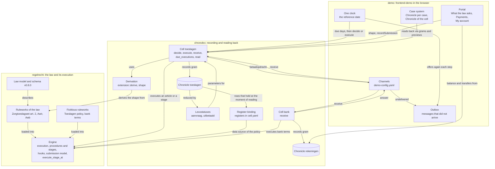
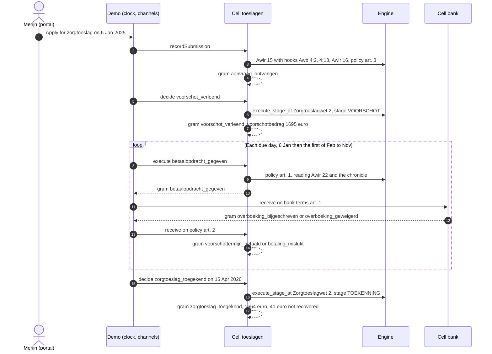

The demo follows one zorgtoeslag case from the application to the final settlement, and records every legal fact on the way in a chronicle (*kroniek*), as the chronolexography position paper describes it and [RFC-022](/rfcs/rfc-022) maps it onto RegelRecht. This page explains how that works: which components take part, where the law in the law format ends and the recording begins, how the configuration files depend on each other, and what happens in Merijn's case step by step.

The [Demo](/components/demo) page describes the screens. This page describes the machinery behind the Chronicle on a case, the payments on the portal and "My account".

## Scope and status

This is a proof of concept, built in three pull requests: PR #1679 (the application as a fact in a chronicle, with a compact cell), PR #1683 (the application and the decision in the portal and the case system) and PR #1689 (the whole process: voorschot, installments, a bank, and the settlement). The design note `packages/cel/ONTWERP-proces-zorgtoeslag.md` records the decisions and where each one comes from.

Keep its limits in mind.

- **It is not the law in force as Toeslagen executes it.** The Algemene wet inkomensafhankelijke regelingen (Awir) is modeled for the articles the process needs (8, 14, 15, 16, 19, 22, 24 and 26a in the demo corpus), and each of those leaves parts out; the comments in the rulework say which. The zorgtoeslag is an annual amount; Zorgtoeslagwet article 2 lid 5 (entitlement per calendar month) is not modeled.
- **Some ruleworks are fictitious.** No published policy of the Dienst Toeslagen says how high an installment is or how Toeslagen reads its own chronicle, and the bank is made up. These ruleworks say so in their name and in every article text (`FICTIEF`), and the policy that reads the chronicle is marked as an assumption (*aanname*) made on behalf of the Dienst Toeslagen.
- **The cell is the compact core of the chronolex work on the branch poc/chronolex.** It has no forms, no HTTP and no transport of its own. The RFCs on that branch that this work leans on (the moment that counts, reduction as policy of the holder, submissions, origin) are not on this site; where this page refers to them, it says what they decide instead of linking.

## Components and their boundaries

Three zones take part. **regelrecht** is the law in the law format and the engine that executes it. **chronolex** is the cell: it decides which facts arise, records them as grams, and reads them back. **demo** is the browser application around both: one clock, a portal, a case system, and the transport between cells.



Both cells and the engine run in the browser as one WebAssembly module, `regelrecht_cel`: the crate `packages/cel` built with its `wasm` feature, which exports the engine (`WasmEngine`) next to the cell (`WasmCell`). The page keeps the grams in `localStorage` and hands them back to `WasmCell` when it starts.

What each zone does, in the order a fact passes through them:

- The **engine** executes. It knows procedures and their stages (RFC-008), fires hooks (RFC-007), builds the model of a submission (which articles take part in an application and what each asks), and runs a single stage of a procedure on a fresh state with `execute_stage_at`. It records nothing and keeps no state between calls.
- The **cell** decides what is recorded. It derives the shape of every gram from the law (`extension::derive` and `shape` in `packages/cel/src`), executes the article or the stage through the engine, checks the guards (references, `until`, `once_per`, the order of time), and appends the gram to its chronicle. It reads back with a lexostatus or with an article in the policy of the holder, which the engine executes over the chronicle as a data source. `Cell::lexostatuses` describes both kinds and `Cell::read_lexostatus` reads either by name, with the grams the values came from; the "Lexostatuses" view in the case system shows them.
- The **demo** decides when. It holds the clock, asks the cell which days an installment is due, takes a decision when its moment has come, and carries a gram from one cell to the other along the configured channels. It knows no event, field or article by name; those come from the configuration and the law.

## Where regelrecht stops and chronolex begins

The law says, in its own words, what arises. The cell decides how that is recorded. A rulework of the law contains no chronolex vocabulary: no event names, no gram types, no `extensions.chronolex` block. The cell reads the following keys and derives the recording from them.

| The law says (key in the rulework) | Where in the zorgtoeslag process | What the cell derives |
|---|---|---|
| `produces.submission: {kind: AANVRAAG}` | Awir 15: the belanghebbende applies for a tegemoetkoming | A gram of type `submission`, subtype `aanvraag`, stage `AANVRAAG`. Its fields are the parameters with origin `BELANGHEBBENDE` or `KANAAL` |
| A hook with `applies_to.submission`, narrowed with `decided_by` or `established_by` | Awb 4:2 and 4:13 on every application for a beschikking; Awir 16 and the fictitious policy article 3 on the application of Awir 15 | The hook extends the application: what it asks of the applicant becomes a field of the same gram |
| `produces.moment` | Awb 4:13 lid 1: the decision period runs from receipt | `effective_at` of the application is the moment of receipt, with Awb 4:13 lid 1 as its legal basis |
| `produces.legal_character: BESCHIKKING` with `decides_on` and `procedure_id` | Zorgtoeslagwet 2 decides on the application of Awir 15, in the procedure `tegemoetkoming` of the Awir | One decretogram per stage that `is: BESLUIT` (VOORSCHOT and TOEKENNING), each referring to the application as `on_application`, its fields the outputs of the article and of the hooks at that stage |
| A stage's `requires` with exactly one date | `dagtekening_voorschot`, `dagtekening_toekenning` | `dated_by`: the cell fills that parameter with the day the decision is taken |
| `origin` with `rol: TIJDVAK` | `aangevraagd_berekeningsjaar` (Awir 15 lid 1) | The `period` of the decision. A period of `unit: year` means the version of the law in force on 1 January of that year |
| `specifies` on a parameter | Not used here; the NAPP corpus uses it for a lex specialis of Awb 4:2 | One field with two legal bases |

The engine's law model (`packages/law-model/src/model.rs`) reads `moment` and `specifies`. Schema v0.8.0 accepts them but does not describe them yet; a proposal for the schema is still to be written.

The test for a key, from the design discussion of 7 October 2026: can you explain it to a jurist without the words gram, chronicle (*kroniek*), cell (*cel*) or chronolex? If you can, it is law and may stand in the rulework. If you cannot, it is implementation and belongs in the stream, in the policy of the holder, or in the code. `produces.submission` passes: "here an application arises". An event name such as `aanvraag_ontvangen` does not, so it lives in the stream.

Two places still carry recording vocabulary, both outside the law itself.

- **The fictitious executing policies** (`fictief_beleid_termijnbedrag_voorschot` articles 1 and 2, `fictieve_bankvoorwaarden` article 1) carry an explicit `produces.extensions.chronolex` block. A payment is neither an application nor a decision, and the law format has no word yet for "an execution arises here" (open in the design note). The block says what the derivation cannot: `type: executogram`, `executed_on` (the parameter for the day, `once_per: month`, `day: 1`), `record_when` (the boolean output that says whether a gram arises), `until` (the stage that ends it), `refers_to` (by stage or by article), `identified_by` (the parameter that identifies a received message, such as the bank's betaalkenmerk) and `fields`. An explicit block always wins over the derivation. The cell refuses a receipt (`record_when` without `executed_on`) that has neither a required `refers_to` nor `identified_by`, because it could not recognise a message delivered twice. `identified_by` names a parameter with `required: true`, not an output of the article, and a message without that value is refused.
- **The lexostatus language** in `corpus/demo/cells/toeslagen/lexostatuses.yaml` still reduces the application (`aanvraag`) and what was paid (`uitbetaald`). The owner decided on 6 and 7 October 2026 that reduction belongs in an article of the holder's policy, in the same rule language as the law. The voorschot already reads back that way (see the next section); these two follow in a later step.

The engine has one point of contact with the chronicle, and it is an ordinary one: a register. `fictief_beleid_kroniek_toeslagen` has an input `grams` with `source: {}`, like any input from a register. Only `registers:` in the cell configuration says that this input is the chronicle `toeslagen`; the policy names no system.

## How the configuration fits together

The demo reads everything below from `corpus/demo`. The main corpus has its own versions of the Awir and the Zorgtoeslagwet (`wet_op_de_zorgtoeslag`), which the cell's own tests in `packages/cel/tests/zorgtoeslag.rs` use; `packages/cel/tests/demo_corpus.rs` runs the same process on the demo corpus.

| File or section | What it says | Who reads it | What changes when you edit it |
|---|---|---|---|
| `corpus/demo/regulation/nl/zorgtoeslagwet/TOESLAGEN-2025-01-01.yaml`, article 2 | The amount, and that it is a beschikking on the application of Awir 15 in the procedure `tegemoetkoming` | Engine; the cell derives the decisions from it | The fields of both decisions, and whether the process exists at all. The 2024 version has no `decides_on` and no procedure, so it does not take part |
| `corpus/demo/regulation/nl/algemene_wet_inkomensafhankelijke_regelingen/` (2025 and 2026) | The procedure `tegemoetkoming` with its stages (AANVRAAG, VOORSCHOT, VOORSCHOT_BEKENDMAKING, TOEKENNING, TOEKENNING_BEKENDMAKING); articles 8, 14, 15, 16, 19, 22, 24 and 26a | Engine; the cell for the shape of the application and the stages | The fields of the application, which stages are decisions, the dates a decision is dated by, the months with an installment, the settlement |
| `corpus/demo/regulation/nl/algemene_wet_bestuursrecht/artikel_1_1_bestuursorgaan/AWB-1994-01-01.yaml` | Awb 3:46, 4:2, 4:13, 6:7 and 6:8 as hooks | Engine | What every application asks (4:2), the moment of receipt (4:13), and the objection period on each decision |
| `fictief_beleid_termijnbedrag_voorschot` (Dienst Toeslagen, fictitious) | Article 1: the amount of an installment and the payment order. Article 2: the bank's answer. Article 3: the account number on the application | Engine and cell (explicit chronolex block) | When and how much is ordered, what counts as paid, and the account field on the application form |
| `fictief_beleid_kroniek_toeslagen` (Dienst Toeslagen, fictitious, *aanname*) | Article 1: the voorschot that holds. Article 2: the account from the application. Article 3: what is still outstanding after a refusal | Engine, over the chronicle as a register | What a payment order reads from the chronicle |
| `fictieve_bankvoorwaarden` (fictitious bank) | A transfer is credited on the execution date unless the account is unknown or blocked | Engine and the bank cell | Whether the bank credits or refuses |
| `corpus/demo/cells/toeslagen/cell.yaml` | The recording actor (`belastingdienst_toeslagen`, Awir 14 lid 1), its streams, its lexostatuses, and `registers` | Cell | Which chronicle the policy reads as `grams` |
| `corpus/demo/cells/toeslagen/streams/` | Per event its name, the article that establishes it, the `stage` where an article decides twice, and `reads` | Cell | Event names in the chronicle, and where a decision or an execution gets its parameters |
| `corpus/demo/cells/toeslagen/lexostatuses.yaml` | `aanvraag` (the application by its root) and `uitbetaald` (the sum of `betaald_bedrag`) | Cell | The parameters of both decisions; "Received so far" on the portal |
| `corpus/demo/cells/bank/` | Cell `bank`, actor `fictieve_bank`, chronicle `rekeningen`, two events on bank terms article 1 | Cell | The bank's chronicle |
| `corpus/demo/bindings.yaml`, `fictieve_bankvoorwaarden` | `rekening_geblokkeerd` comes from the BANK table `rekeningen`; no row means null | Demo (materializer), then engine | Whether the bank knows the account |
| `demo-config.yaml`, `profiles.merijn.application` | What Merijn fills in, per field the law asks; `$bsn`, `$reference_date` and `$reference_year` are filled in by the demo | Demo | The application. A field the law does not ask is refused by the cell |
| `demo-config.yaml`, `dossier` | Parameters with origin `DOSSIER` the cell does not read from its chronicle, in the shape of a binding: the date of the tax assessment for Awir 19 | Demo | When the toekenning can be taken |
| `demo-config.yaml`, `received` | Per cell the lexostatus that says what was paid on a case (`toeslagen: uitbetaald`) | Demo | "Received so far" on the portal; the demo adds nothing up itself |
| `demo-config.yaml`, `channels` | Which gram of which cell goes to which article of which cell, which field fills which parameter, and which reference the answer gets | Demo | The transport between Toeslagen and the bank |
| `demo-config.yaml`, `account` | Which cell, table and fields make up "My account" | Demo | The statement on the portal |
| `profiles.yaml`, Merijn's `BANK` and `BELASTINGDIENST` | The account `NL00TEST0123456789` with its opening balance and `geblokkeerd`; the assessment dates per year; box 1 income | Demo, through `bindings.yaml` and `dossier` | Income at the toekenning, the assessment date, a blocked account |

Two dependencies are easy to miss. The policy that reads the chronicle is valid from 1 January 2024, so that an installment paid in December before the year can read the voorschot (own choice). The installment policy is valid from 2025 and applies the law of the year the voorschot concerns, so installments exist for 2025 and later.

## Merijn's case, step by step

Merijn is the default persona: a self-employed home carer, single, with two young children. The case below starts with the reference date set to 6 January 2025 under Demo in the menu, with the default settings (applications are not reviewed by hand, decisions are announced straight away). The amounts come from running the demo cells on the demo corpus with Merijn's data; the demo shows the same.

### One case over time



Every gram in the chronicle `toeslagen` of this case, apart from the bank's grams in `rekeningen`:

| Moment | Gram (event) | Type and stage | Established by | Refers to | Key fields |
|---|---|---|---|---|---|
| 6 Jan 2025 | `aanvraag_ontvangen` | submission (`aanvraag`), AANVRAAG | Awir 15 | | BSN, berekeningsjaar 2025, expected income € 22.000, account, requested decision Zorgtoeslagwet 2 |
| 6 Jan 2025 | `voorschot_verleend` | decretogram, VOORSCHOT | Zorgtoeslagwet 2 | `on_application` | voorschotbedrag € 1.695, toetsingsinkomen € 22.000, objection period 6 weeks |
| 6 Jan, 1 Feb to 1 Nov 2025 | `betaalopdracht_gegeven` (11×) | executogram | policy art. 1 | `voorschot` | € 154,09; the eleventh € 154,10 |
| same moments | `voorschottermijn_betaald` (11×) | executogram | policy art. 2 | `betaalopdracht` | `betaald_bedrag` |
| 15 Apr 2026 | `zorgtoeslag_toegekend` | decretogram, TOEKENNING | Zorgtoeslagwet 2 | `on_application` | toegekend € 1.654, nog uit te betalen € 0, terug te vorderen € 0 (€ 41 after settlement) |

#### The application

On "My government", the zorgtoeslag tile opens the application panel. Under "What the law asks" it lists the fields of the application with the article that asks each one: the cell executes Awir 15 with an empty application, and the engine fires the hooks that apply to it and yields with the model of the submission (`WasmCell.shape`). Awb 4:2 asks the name, address, date and signature, and the decision requested; the cell fills in the requested decision itself (Zorgtoeslagwet 2, origin role `GEVRAAGD_BESLUIT`). Awir 15 asks the BSN and the berekeningsjaar. Awir 16 asks the income Merijn expects. The fictitious policy article 3 asks the account. The values come from `profiles.merijn.application` in `demo-config.yaml`.

On submission the cell records `aanvraag_ontvangen` (`recordSubmission`). Its `effective_at` is the moment of receipt, with Awb 4:13 lid 1 as legal basis; its `legal_basis` lists every provision a field rests on.

#### The voorschot

Because applications are not reviewed by hand, the demo decides at once. The case lifecycle moves through the procedure of the Awir with the engine's `execute_stage`, which carries outputs from stage to stage; the cell takes the decision with `execute_stage_at`, which runs exactly the stage VOORSCHOT on a fresh state. The event `voorschot_verleend` reads the lexostatus `aanvraag` for its parameters. The stage requires `dagtekening_voorschot`, which the cell fills with the day. At this stage Awir 16 fires twice: before the article it replaces the toetsingsinkomen with the expected € 22.000, after it the voorschotbedrag is the tegemoetkoming rounded to whole euros by Awir 14 (€ 1.694,88 becomes € 1.695). Awb 3:46 and 6:7 fire as well, because VOORSCHOT `is: BESLUIT`.

The decision concerns 2025 (the parameter with role `TIJDVAK`), so the cell applies the versions in force on 1 January 2025, whatever the day it decides. The demo then announces the decision (stage VOORSCHOT_BEKENDMAKING, Awb 6:8), which gives this decision its own objection period.

#### The installments and the bank

Awir 22 is a rule per month: given the dagtekening of the voorschot and a month, it says whether an installment falls in that month and whether it is the first or the last. A voorschot dated in January is paid in installments from the month of dagtekening through November, eleven in all. Article 22 says nothing about the amount. The fictitious policy article 1 does: the voorschot in equal parts, rounded down to whole cents, with the remainder in the last installment (€ 154,09 ten times, € 154,10 once). A voorschot dated later in the year also pays the months already passed in one amount with the first installment (Awir 22 lid 4).

Which days to ask, the cell says with `due_executions`: per month the day the policy gives (`day: 1`), or the first day an installment may arise if that is later. For Merijn the first is 6 January, the day of the voorschot. On each day the cell executes policy article 1 (`execute`). That article reads what it needs through `fictief_beleid_kroniek_toeslagen`: the voorschot that holds (article 1), the account (article 2) and what is still outstanding (article 3). The policy picks the latest voorschot as the highest `sequence`, because the law format has no LAST. A gram arises only when `opdracht_wordt_gegeven` is true; in December there is none.

The payment order goes to the bank over the first channel. The bank cell executes its terms with the order's fields (`WasmCell.receive`) and records `overboeking_bijgeschreven` or `overboeking_geweigerd`. The answer goes back over the second channel to policy article 2, and Toeslagen records `voorschottermijn_betaald` or `betaling_mislukt`, referring to the order. Only what the bank credited counts as paid: the lexostatus `uitbetaald` sums `betaald_bedrag`.

A message holds from the moment of the gram it carries. When the clock passes several months in one step, the bank's answer to an order of a skipped month therefore lies before the order of the next month, and that order reads the answer. A message that does not arrive goes into the outbox in the demo state, with its error on the case. The demo offers it again on every clock step and on load; a message delivered that way holds from the moment it arrives. The case shows the error for as long as the message is in the outbox. Each cell records one answer per message, so offering it again cannot credit or record anything twice: Toeslagen refuses a second answer to the same order (the reference `betaalopdracht`), and the bank a second transfer with the same betaalkenmerk (`identified_by` in its terms). Both refusals carry the error kind `answered`, which the outbox counts as delivered. Channels that loop are an error in the configuration, not in the delivery: the message that started the loop stays in the outbox, marked as a loop, and is not offered again while the channels stay the same, so the case keeps showing the error. Once the channels change, it is offered again, or dropped when its channel is gone.

With `geblokkeerd: true` in Merijn's `BANK` data, the bank refuses every transfer ("rekening geblokkeerd"). The refused amount stays open and goes along with the next payment order (`meegenomen_achterstand`), also in a month without an installment, until the toekenning. An account the bank does not know is refused as "rekening onbekend".

On the portal, the application shows "Received so far" from the lexostatus `uitbetaald`, and "My account" shows the balance (opening balance plus what the bank credited) and the transfers from the chronicle `rekeningen`.

#### The toekenning and the settlement

The toekenning waits for the tax assessment over 2025. Awir 19 asks `datum_vaststelling_aanslag` with origin `DOSSIER`; the demo finds it through `dossier` in `demo-config.yaml`, in Merijn's Belastingdienst data: 15 April 2026. On that day the demo decides by law. The event `zorgtoeslag_toegekend` reads `aanvraag` and `uitbetaald`; the stage TOEKENNING runs without Awir 16, so the toetsingsinkomen comes from Awir 8: the € 24.150 the Belastingdienst knows over the year (`box1` in Merijn's data).

At this stage the hooks of the Awir do the settlement:

- Awir 19 gives the latest date of the toekenning: six months after the assessment, 15 October 2026.
- Awir 24 sets off what was paid (€ 1.695) against the toegekende tegemoetkoming (€ 1.654). Payment and recovery are two outcomes: nothing left to pay, € 41 to recover after settlement. The latest payment date is four weeks after the dagtekening, 13 May 2026.
- Awir 26a leaves an amount of at most € 118 (the 2025 text) unrecovered: `terug_te_vorderen` is € 0.

After the toekenning no installment arises: the payment order has `until: {stage: TOEKENNING}`, and the cell refuses with the error kind `ended`.

## Time

### One clock, forward only

The demo has one clock, the reference date (`referenceDate` in the demo state). Submission, decision, announcement and grams are all recorded on that day. When one step of the clock passes several days, the installment of a skipped day holds from that day and reads the case as it held then. The clock moves forward only. A chronicle refuses a gram recorded before its last one, and the demo refuses an earlier reference date once there are cases or grams ("Reference date" under Demo in the menu); the way back is resetting the demo. Moving forward goes through every moment on the way, so a case whose decision falls earlier gets it on that day.

### Previews and facts

What has yet to happen is no fact. The Chronicle on a case shows, below the grams, "What the law gives as the next moment": the cell executes the law without recording (`previewExecution`, `previewDecision`) and the demo takes the dates that come out.

- The next day on which an installment arises, from `dueExecutions` and a preview of each day.
- The end of the period the decision concerns.
- A date from the file that the next decision waits for (the assessment of Awir 19).
- Dates the law gives a decision, such as the latest toekenning date (Awir 19) or payment date (Awir 24). Of a decision still to come, only the dates that do not move with the decision day count. The demo finds those by comparing two previews in different calendar months; that is a heuristic of the demo, not a rule of the law.

"To the next moment" sets the reference date to the earliest of these and lets the cell record what arises in every open case. The demo has no calendar of its own; the code in `frontend-demo/src/data/clock.js` and `frontend-demo/src/data/moments.js` only orders dates the cell returns.

### Guards against doing things twice

| Guard | Where | What it prevents |
|---|---|---|
| `once_per: month` | the cell, from the explicit block of policy article 1 | A second payment order in the same case in the same month, also after a revised voorschot |
| `until: {stage: TOEKENNING}` | the cell | Any installment once the case has a toekenning (error kind `ended`) |
| A required reference | the cell | An installment without a voorschot, or a bank answer without an order |
| One answer per message | the cell (error kind `answered`): by the reference for Toeslagen, by `identified_by` (the betaalkenmerk) for the bank | A second answer to the same order, or a second transfer of it, when a message is offered again |
| The moment of a received message | the cell (`receive_at`) | A message that holds after the moment of recording, or before the gram it refers to |
| Recording order | the chronicle | A gram recorded before the chronicle's last one |
| `on` not after `now` | the cell | Executing a day that has not come yet |
| A decision already in the case | the demo (`decisionGrams`) | Recording the same decision twice |
| `executedThrough` | the demo, per case and event | Asking the cell the same day again; a convenience of the demo, the cell's own guards hold without it |
| The outbox | the demo | Losing a message that did not arrive; it stays until the receiving cell records it or says it was already answered, and a loop in the channels stays until the channels change |

## Own choices, fictions and assumptions

The design note marks each choice by its source: the law, an RFC, the earlier chronolex proof of concept, or an own choice. The ones a reader of the demo meets:

- **The procedure `tegemoetkoming`** with its five stages is a modeling choice. The Awir regulates the voorschot (article 16) and the toekenning (articles 14 and 19) as two beschikkingen on one application, but gives no list of stages. Each decision has its own announcement stage, after Awb 3:40 and 3:41.
- **The Awir as "Awb of the toeslagen"** (decided 7 October 2026): Zorgtoeslagwet 2 takes the decision, and Awir 16, 19, 24 and 26a hook onto it in their stage. The Awir names no toeslag.
- **The expected income is a field of the application** (Awir 16, origin `BELANGHEBBENDE`). The law does not say how the expected amount is determined.
- **No voorschot after 1 April of the following year** gives a voorschotbedrag of € 0, and the policy pays no installment on € 0.
- **The amount of an installment**, the payment day (the first of the month, or the day of the voorschot), the retry of a refused amount and "no installment after the toekenning" are choices of the fictitious policy, marked in its articles.
- **Paid, not granted, voorschotten are set off** (Awir 24 lid 2, read as an own choice).
- **The policy that reads the chronicle** is written on behalf of the Dienst Toeslagen and marked as *aanname* in its name, its comment and every article: "the dagtekening is the day of the decision" and "a revision replaces the earlier voorschot".
- **The bank and its terms are fictitious.** The schema has no layer for rules of a private party, so the bank's terms are recorded as UITVOERINGSBELEID with that marking.
- **The fixed dates of a decision still to come** are found by a heuristic of the demo.
- **The demo's berekeningsjaar** is the year of the reference date. A voorschot before the year (twelve installments from December, Awir 22 lid 1) cannot be reached from the portal; the cell's tests cover it.

Where the design note and the code differ, the code is what the demo does. The note's process table gives the 2026 threshold of € 121 for Awir 26a; the demo runs the 2025 text, with € 118. Its section 5 still mentions a lexostatus `betaald_voorschot` and its section 4 a single cell; the code has the lexostatus `uitbetaald` and a separate bank cell.

### Open questions

From the design note and the code comments:

- The amount of an installment: equal parts with the remainder in the last, as a marked choice until there is policy of Toeslagen.
- The word in the law format for a fact that is neither an application nor a decision (a payment, an announcement), so that executogrammen need no explicit block.
- Moving the lexostatuses `aanvraag` and `uitbetaald` into the holder's policy, like the voorschot.
- A proposal for the schema that describes `produces.moment` and `specifies`.
- An account the bank does not know at all gives an unknown value in the engine (an error) unless the data says null explicitly.
- A message that arrives only when the outbox offers it again holds from its arrival, not from the moment of the order it is about. Whether a late answer should hold from the order instead is open.
- Deferred on purpose: entitlement per calendar month, revision of the voorschot after a change (Awir 16 lid 5, 17) and of the toekenning (20, 21, 21a), interest and collection (27 to 29), setting off across regulations (30), the *zienswijze* before recovery (26b), and channels outside the demo.

## Running it

```bash
just demo          # builds the engine and the cell to WASM, starts Vite on :7400
just demo-check    # laws, scenarios, frontend tests, WASM and build
```

The cell's own tests run with `cargo test` in `packages/cel`.

To follow Merijn's case:

1. Open the demo with Merijn (the default persona) and, before anything is recorded, set the reference date to a day in 2025 or later under Demo, "Reference date".
2. Apply for zorgtoeslag on "My government". "What the law asks" shows the fields with their articles.
3. Open the case in the case system and its Chronicle: the application, the voorschot and the first payment order with the bank's answer.
4. Press "To the next moment" to move through the installments, the end of the year and the assessment, until the toekenning.
5. "Chronicle" next to "Cases" on the board shows every gram the cell stores; "See how the cell stores this" on a case filters it. "Lexostatuses" next to it shows `aanvraag`, `uitbetaald` and `fictief_beleid_kroniek_toeslagen`, how each reduces the chronicle, and what each gives for the case now, with links to the grams it read. "My account" on the portal shows the bank's side.

## Further reading

- [Demo](/components/demo): the screens, including the chronicle and the time controls
- [RFC-022](/rfcs/rfc-022): chronolexogram types and the cell model
- [RFC-008](/rfcs/rfc-008): procedures and stages, and [Hooks and Reactive Execution](/concepts/hooks-and-reactive-execution)
- [Execution Engine](/components/engine)
- `packages/cel/ONTWERP-proces-zorgtoeslag.md`: the design note, in Dutch, with every decision and its source
- `packages/cel/tests/demo_corpus.rs`: the process on the demo corpus as tests
