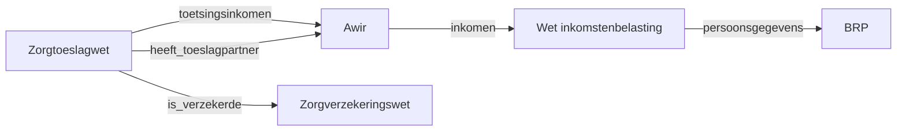

Dutch laws reference each other constantly. The Healthcare Allowance Act (*Zorgtoeslagwet*) needs your income, which is defined by the Awir. It needs your insurance status, which comes from the Zorgverzekeringswet. It needs to know whether you have an allowance partner, which the Awir determines.

Rather than duplicating these definitions, each law declares what it needs from other laws. The engine follows these references automatically.

## How it works

An article declares its inputs. When an input has a `source` block pointing to another law, the engine loads that law, executes it with the specified parameters, and feeds the result back.

```yaml
# Zorgtoeslagwet, article 2 - needs income from the Awir
input:
  - name: toetsingsinkomen
    type: amount
    source:
      regulation: algemene_wet_inkomensafhankelijke_regelingen
      output: toetsingsinkomen
      parameters:
        bsn: $bsn
```

The engine loads `algemene_wet_inkomensafhankelijke_regelingen`, executes it for the given BSN, gets the `toetsingsinkomen` output, and uses that value in the healthcare allowance calculation.

## Chains of references

References can chain. The Zorgtoeslagwet references the Awir, which might reference the Wet inkomstenbelasting, which references the BRP. The engine resolves the full chain, loading and executing each law as needed.



Results are cached: if two laws both need the same value from the BRP, it is computed once.

## A real example

The Zorgtoeslagwet article 2 declares these cross-law inputs:

```yaml
input:
  - name: is_verzekerde
    type: boolean
    source:
      regulation: zorgverzekeringswet
      output: is_verzekerd
      parameters:
        bsn: $bsn

  - name: heeft_toeslagpartner
    type: boolean
    source:
      regulation: algemene_wet_inkomensafhankelijke_regelingen
      output: heeft_toeslagpartner
      parameters:
        bsn: $bsn

  - name: toetsingsinkomen
    type: amount
    source:
      regulation: algemene_wet_inkomensafhankelijke_regelingen
      output: toetsingsinkomen
      parameters:
        bsn: $bsn
```

Each `source` block says: load this other law, pass it these parameters, and give me the named output.

## Same-law references

Articles within the same law can also reference each other. When `source` has an `output` but no `regulation`, the engine looks within the current law:

```yaml
# Zorgtoeslagwet, article 2 referencing article 4 (same law)
input:
  - name: standaardpremie
    type: amount
    source:
      output: standaardpremie
```

## Circular reference detection

The engine detects circular references (law A needs law B which needs law A) and raises an error. A `MAX_CROSS_LAW_DEPTH` limit of 20 prevents runaway chains.

## Further reading

- [Law Format](./law-format) - full structure of a law YAML file
- [Inversion of Control](./inversion-of-control) - a different pattern for cross-law values: delegation
- [Temporal Validity and Dates](./temporal-and-dates) - what happens when a reference points at a law that has ended
- [Traceability](./traceability) - a real cross-law chain shown in an execution trace
- [RFC-007: Cross-Law Execution](/rfcs/rfc-007) - the full design specification
- [Rules as Executed, section 5.1](/research/rules-as-executed#sec:depgraphs) - the position paper's dependency graph behind a single zorgtoeslag decision
