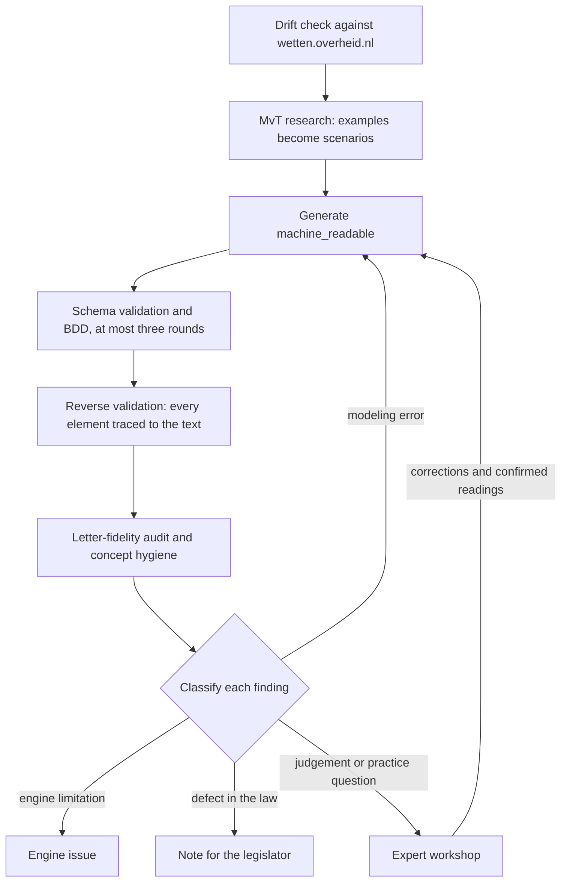

RegelRecht validates a machine-readable interpretation by running it. A model is written first, executed against scenarios, and then checked element by element against the text of the law. This page describes that practice as it runs now. The argument behind it, and how it relates to Wetsanalyse, is on [From Analysis-First to Execution-First](./validation-methodology).

The steps below are carried out by skills in the repository (`.claude/skills/`). A skill is a written procedure that a person or a language model follows; the enrich worker in the [pipeline](/components/pipeline#enrich-worker) uses `law-generate` and `law-reverse-validate` when it enriches a law without a person at the keyboard.

## One law: the interpretation loop

`law-interpret` makes a single law executable by running three skills in order.

1. **`law-mvt-research`** searches the parliamentary papers for worked examples and writes them as Gherkin scenarios next to the law.
2. **`law-generate`** writes the `machine_readable` sections, validates them against the schema, and runs the scenarios. It repairs and reruns at most three times.
3. **`law-reverse-validate`** traces every input, output and operation back to the article it came from. An element with no basis in the article is removed; one the logic needs but the text does not give is reported as an assumption.

The rule that governs all three: **the model describes what the text says, not what the legislature meant.** The explanatory memorandum is a source of examples, not of norms. It also explains the bill as introduced, and a nota van wijziging can have changed the provision it describes, so an example from it is checked against the law as it entered into force before it becomes a scenario.

## Checks before an outcome is trusted

A passing scenario proves the model computes what the scenario expects. It does not prove the model follows the law. Four further skills look for the failures a green run hides.

- **`law-version-drift-check`** compares each `text:` field with the version on wetten.overheid.nl at the file's `valid_from`. It runs before any edit, because a model built on a stale text is faithful to the wrong law.
- **`law-letter-fidelity-audit`** reads the model against the letter, one lid at a time. It looks for criteria taken from the toelichting rather than the text, dropped qualifiers such as a *tenzij*, and an output anchored to the wrong article.
- **`reference-and-concept-hygiene`** checks that a value bound across laws means the same thing on both sides. The same word can name two concepts in two laws (a register-based residence against a factual one), and a binding between them is wrong even when it resolves.
- **`regelrecht-scenario-traces`** asserts the intermediate steps of a chain of laws, not only the final amount, so an error in the middle cannot hide behind a correct result.

## A corpus: desk review and workshops

Across a set of related laws, `regelrecht-stelselanalyse` runs the desk cycle: harvest, model, validate with several independent reviewers, classify, fix, document. Every finding gets one of four labels, and the label decides where it goes. A modeling error is fixed in the YAML. An engine limitation becomes an engine issue. A defect in the law itself is written up for the people who maintain it. An interpretation or practice question goes to experts.

`regelrecht-dossier` is the entry point that routes between the two layers. The short form of its rule: factual defects stay at the desk, questions of judgement go to a workshop.

Two skills prepare the workshops.

- **`regelrecht-audit-products`** builds the material for a session in which legal experts validate a model: a scope analysis, a checklist per article, test scenarios and a report. A validating session is only held once the schema validates, the scenarios pass and the known modeling errors are fixed, so experts spend their time on judgement rather than on our mistakes. An exploratory session can be held earlier.
- **`regelrecht-uitvoeringstoets`** turns a validated corpus into a service prototype and uses it with people from implementation practice, to see what the law asks of a citizen and where human judgement is needed.

## Two kinds of scenario

Scenarios serve two purposes, described in [Testing](/guide/testing#two-buckets-one-language) and [Scenarios](./scenarios).

- **Law validation** (`corpus/regulation/**/scenarios/`): a failure means the law changed or the scenario is out of date, and a person decides which. CI does not block on these.
- **Engine conformance** (`bdd/conformance/`): synthetic laws that prove an engine speaks the whole language. CI blocks on these, and on the demo corpus, whose data is synthetic and whose failures are therefore always real.

## What has been done with experts

The procedure above is in use at the desk. The expert side is further behind. The repository records a legal expert's written corrections to three early RFCs ([RFC-002](/rfcs/rfc-002), [RFC-008](/rfcs/rfc-008), [RFC-009](/rfcs/rfc-009)), eleven in all, which now seed the curated legal memo of the enrichment design ([RFC-027](/rfcs/rfc-027)), and a session with OCW and DUO for which the repayment regimes in one proof of concept were worked out (`pocs/registry.yaml`). No validating workshop in the sense of `regelrecht-audit-products` has been reported here yet. Until one has, the workshop design is a plan with its tooling in place.

## Further reading

- [From Analysis-First to Execution-First](./validation-methodology): the argument for this method and its relation to Wetsanalyse
- [Markings](./markings): where a model records what it could not translate
- [Rules as Executed, section 5.3](/research/rules-as-executed#sec:translation): the position paper on translating law at scale, with language models doing the labor and people doing the review
