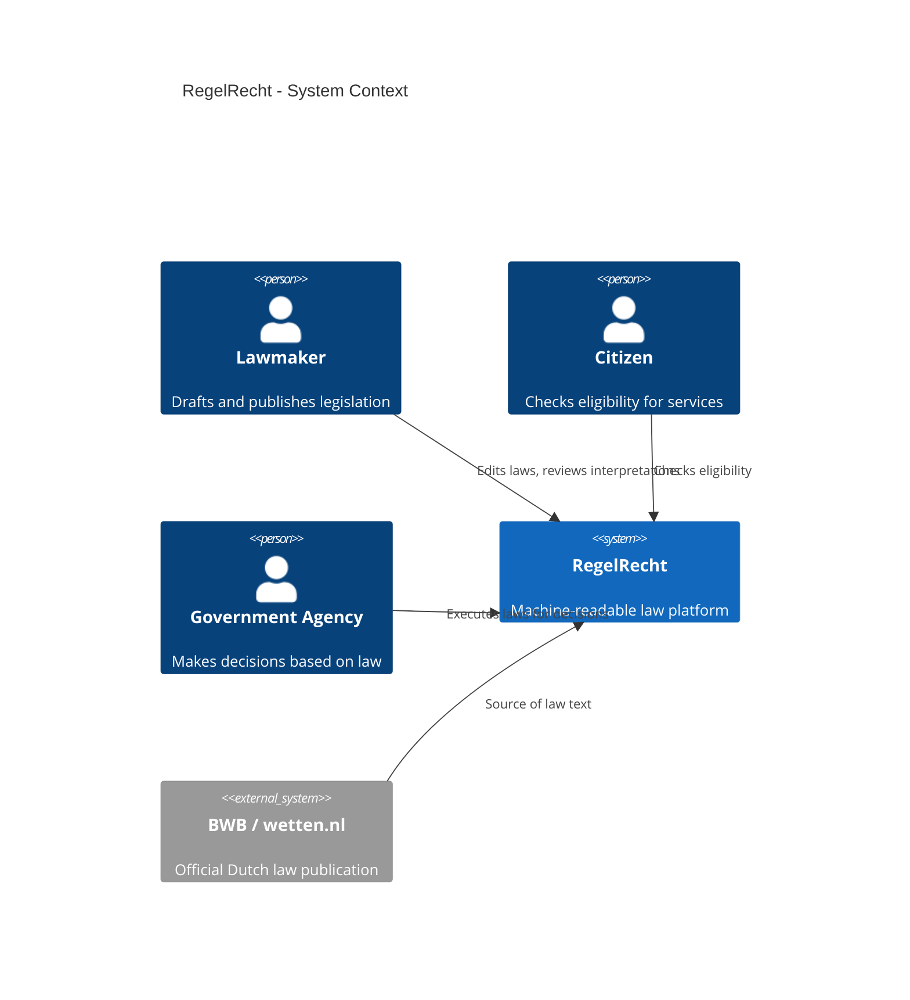
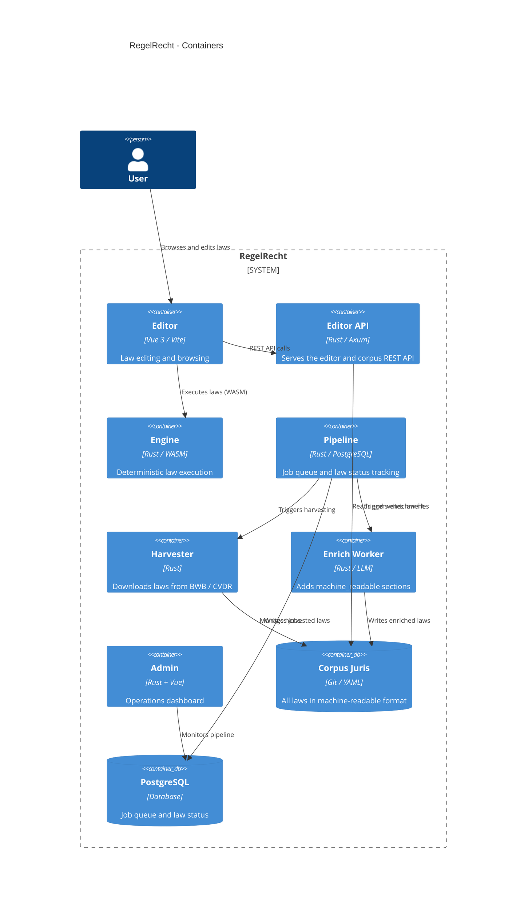

RegelRecht is built on two pillars: the **Corpus Juris** (a git-versioned body of all Dutch law) and the **Execution Engine** (a runtime that evaluates laws deterministically).

## System Context

## Container Diagram

The editor, TUI, lawmaking visualization, Grafana, and the engine's WASM/CLI builds are additional surfaces over the same engine and corpus; they are omitted here to keep the container view readable. See the [component docs](/components/engine) for each.

## Data Flow

1. **Harvesting**: The harvester downloads laws from BWB (wetten.nl) and converts XML to YAML
2. **Enrichment**: Laws are enriched with machine-readable interpretations (currently manual + AI-assisted)
3. **Storage**: All laws live in the Corpus Juris (git repository) as versioned YAML files
4. **Execution**: The engine loads laws from the corpus and evaluates them given inputs
5. **Cross-references**: When a law references another, the engine resolves the dependency chain automatically

## Design Principles

The YAML format stays close to the original legal text structure. Same inputs always produce the same outputs. Every computed value traces back to a specific article and paragraph. Text interpretation is separate from execution. And all laws, tooling, and decisions are publicly auditable.

## Further Reading

- [Methodology](/concepts/methodology) - the execution-first validation approach
- [Engine](../components/engine) - execution engine architecture
- [RFC Index](../rfcs/) - all design decisions
