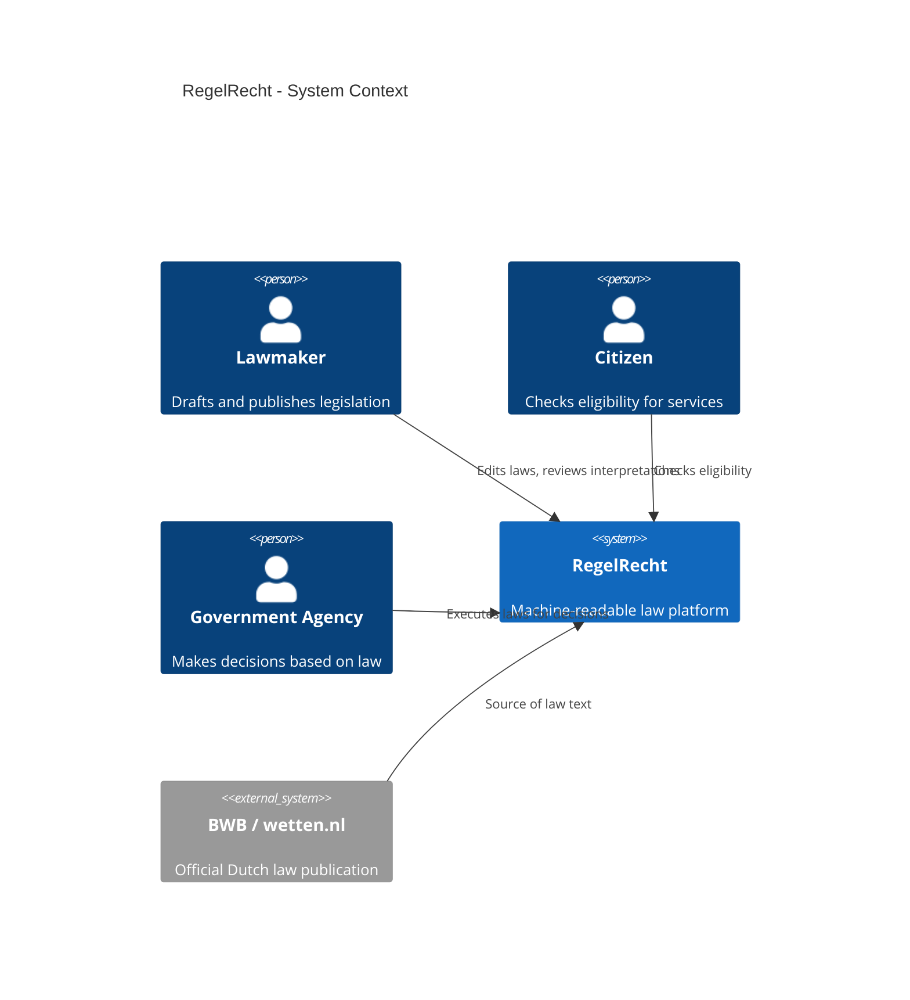
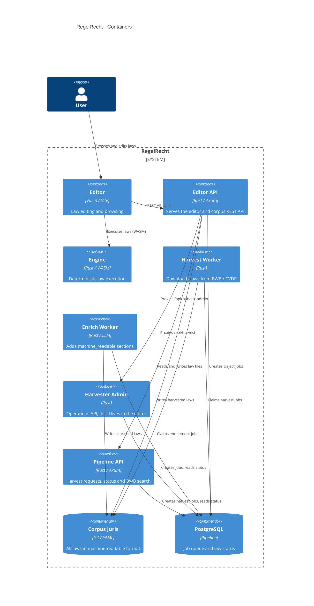

RegelRecht has two parts: the **Corpus Juris** (a git-versioned body of all Dutch law) and the **Execution Engine** (a runtime that evaluates laws deterministically). Everything else on this page either feeds the corpus or puts the engine in front of someone. The ideas the engine implements, such as cross-law references and delegation, are explained in [How RegelRecht Works](/concepts/how-it-works).

## System context


```mermaid
C4Context
    title RegelRecht - System Context

    Person(lawmaker, "Lawmaker", "Drafts and publishes legislation")
    Person(citizen, "Citizen", "Checks eligibility for services")
    Person(agency, "Government Agency", "Makes decisions based on law")

    System(regelrecht, "RegelRecht", "Machine-readable law platform")
    System_Ext(bwb, "BWB / wetten.nl", "Official Dutch law publication")

    Rel(lawmaker, regelrecht, "Edits laws, reviews interpretations")
    Rel(citizen, regelrecht, "Checks eligibility")
    Rel(agency, regelrecht, "Executes laws for decisions")
    Rel(bwb, regelrecht, "Source of law text")
```

## Container diagram


```mermaid
C4Container
    title RegelRecht - Containers

    Person(user, "User")

    System_Boundary(rr, "RegelRecht") {
        Container(editor, "Editor", "Vue 3 / Vite", "Law editing and browsing")
        Container(editorapi, "Editor API", "Rust / Axum", "Serves the editor and corpus REST API")
        Container(engine, "Engine", "Rust / WASM", "Deterministic law execution")
        Container(harvester, "Harvest Worker", "Rust", "Downloads laws from BWB / CVDR")
        Container(enrich, "Enrich Worker", "Rust / LLM", "Adds machine_readable sections")
        Container(admin, "Harvester Admin", "Rust", "Operations API; its UI lives in the editor")
        Container(pipelineapi, "Pipeline API", "Rust / Axum", "Harvest requests, status and BWB search")
        ContainerDb(corpus, "Corpus Juris", "Git / YAML", "All laws in machine-readable format")
        ContainerDb(db, "PostgreSQL", "Pipeline", "Job queue and law status")
    }

    Rel(user, editor, "Browses and edits laws")
    Rel(editor, editorapi, "REST API calls")
    Rel(editor, engine, "Executes laws (WASM)")
    Rel(editorapi, corpus, "Reads and writes law files")
    Rel(editorapi, admin, "Proxies /api/harvest-admin")
    Rel(editorapi, pipelineapi, "Proxies /api/harvest")
    Rel(editorapi, db, "Creates traject jobs")
    Rel(admin, db, "Creates jobs, reads status")
    Rel(pipelineapi, db, "Creates harvest jobs, reads status")
    Rel(harvester, db, "Claims harvest jobs")
    Rel(enrich, db, "Claims enrichment jobs")
    Rel(harvester, corpus, "Writes harvested laws")
    Rel(enrich, corpus, "Writes enriched laws")
```

The pipeline is mostly not a service of its own: it is the job queue in PostgreSQL plus the Rust library (`packages/pipeline`) that the workers, the admin API and the editor API link against to use it. The one HTTP service it ships is the small Pipeline API, which takes harvest requests and answers status and BWB search queries; the editor API reaches it through `/api/harvest`. Workers pull jobs from the queue; nothing pushes work to them. See [Pipeline](/components/pipeline) for the job lifecycle.

The TUI, the lawmaking visualization, the demo, Grafana, and the engine's CLI build are additional surfaces over the same engine and corpus; they are omitted here to keep the container view readable. See the [component docs](/components/engine) for each.

## Data flow

1. **Harvesting**: the harvest worker downloads laws from BWB (wetten.nl) and converts the XML to YAML
2. **Enrichment**: laws are enriched with machine-readable interpretations, by hand or through the LLM-backed enrich worker, and then validated (see [Execution-First Validation](/concepts/methodology))
3. **Storage**: all laws live in the Corpus Juris (a git repository) as versioned YAML files
4. **Execution**: the engine loads laws from the corpus and evaluates them given inputs, resolving references into other laws as it goes

## Where the code lives

```
regelrecht/
├── packages/
│   ├── engine/           # Execution engine (native, WASM, CLI)
│   ├── law-model/        # Rust implementation of the schema contract
│   ├── corpus/           # Library for reading regulation YAML
│   ├── harvester/        # BWB / CVDR download and conversion
│   ├── pipeline/         # Job queue, harvest and enrich workers
│   ├── editor-api/       # Backend for the law editor
│   ├── admin/            # Harvester-admin API
│   ├── tui/              # Terminal dashboard
│   ├── shared/           # Types and helpers used across crates
│   ├── auth/             # OIDC login and role middleware
│   ├── github/           # GitHub REST client
│   ├── frontend-shared/  # Code shared by the Vue frontends
│   ├── poc-portal/       # Password-gated portal for the PoCs
│   ├── poc-napp/         # Backend of the napp PoC
│   ├── poc-assistent/    # Policy assistant for the PoCs
│   ├── cel/              # Chronolex cell runtime of the aanvraag-cel PoC (RFC-022)
│   ├── arch-extract/     # Architecture explorer (developer tool)
│   └── grafana/          # Provisioned dashboards
├── frontend/             # Law editor (Vue 3 + Vite)
├── frontend-lawmaking/   # Law-making process visualization
├── frontend-demo/        # The demo, engine as WASM in the browser
├── frontend-poc-*/       # The proof-of-concepts behind the portal
├── frontend-cel/         # Portal and case screens on top of the cell runtime
├── corpus-poc/           # Case corpora of the PoCs, not law in force
├── pocs/                 # The PoC register
├── corpus/               # Machine-readable laws (YAML), plus the demo corpus
├── bdd/                  # Canonical BDD grammar + conformance features
├── schema/               # Law format JSON schema, one directory per version
└── docs/                 # Documentation site (Astro) + RFCs
```

## Further reading

- [How RegelRecht Works](/concepts/how-it-works) - the concepts behind the engine
- [Engine](/components/engine) - execution engine architecture
- [RFC Index](../rfcs/) - all design decisions
