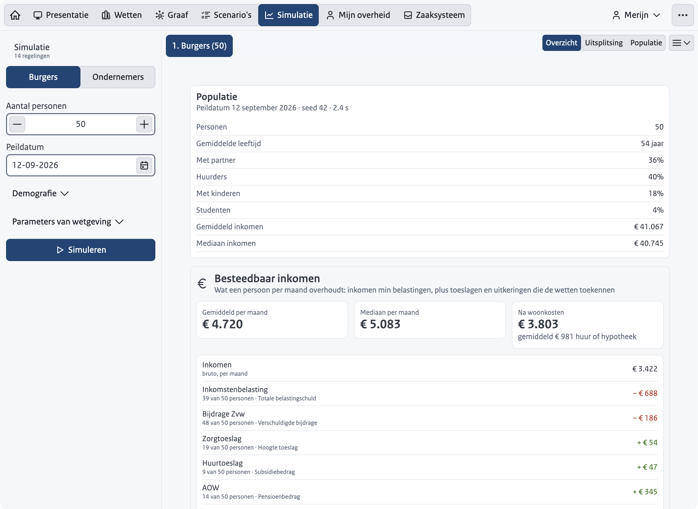

This guide is for someone who presents the demo at `demo.regelrecht.rijks.app` to an audience. It covers what to click and in which order. How the demo is built, and what each tab computes, is on the component page [Demo](/components/demo).

The demo runs entirely in your browser, on fictitious people. Nothing you do reaches a server, and applications, corrections and settings are kept in the browser between page loads. That also means a case you create exists only in the browser where you made it.

## The tabs

The tab bar runs in the order of the story. The labels are the Dutch ones; the English interface translates them.

| Tab | Address | What you show with it |
|-----|---------|-----------------------|
| Home (the house icon) | `/` | Short introduction, a QR code to the demo for the audience, "Start de presentatie" and "Zelf rondkijken" |
| "Presentatie" | `/presentatie` | The slide deck, and the list of slides to start from |
| "Wetten" | `/wetten` | A law as machine-readable YAML, next to its articles |
| "Graaf" | `/graaf` | Which law uses which other law, with the persona's values on the lines |
| "Scenario's" | `/scenarios` | Test cases from the explanatory memoranda, run live |
| "Simulatie" | `/simulatie` | One or more laws over a generated population |
| "Mijn overheid" | `/portaal` | The portal of the active persona. For Claudia the tab is called "Mijn onderneming" |
| "Zaaksysteem" | `/zaaksysteem` | The case handler's side of the same applications |

On a narrow screen the tabs move into the "…" menu under "Ga naar".

## Before you present

1. Open the demo in the browser you will present from. Loading the laws and the engine takes a few seconds the first time ("Wetten en engine laden…").
2. Reset it, so no applications from an earlier session are left: open the "…" menu, choose "Demo resetten…" under "Demo", and confirm with "Resetten".
3. Pick the language (see below).
4. Go to "Presentatie" and choose under "Hoe wordt er gepresenteerd?":
   - "In de zaal" (the default): slides fill the screen, and a slide that opens the demo gets out of the way so the demo has the whole screen.
   - "Zelfstandig": the slides stay on the left next to the demo, for someone who clicks through alone.
5. Optionally type your name in "Naam presentator" on the title slide.
6. Press `f` for full screen, or choose "Volledig scherm" in the "…" menu.

## Keys during the presentation

| Key | Effect |
|-----|--------|
| Right arrow, Space, Page Down | Next slide. On the last slide this closes the deck |
| Left arrow, Page Up | Previous slide |
| Home / End | First / last slide |
| `f` | Full screen on or off |
| Esc | Close the slides. The demo stays where it is |
| Shift+P | Open the slides again at the slide you were on, from any tab. Pressed while the slides are open, it closes them |

The keys do nothing while the cursor is in an input field, so typing an amount does not turn the page. Space also does nothing while a button has focus. If you click to a different tab than the one the slide opened, the slides let go of the keyboard; Esc still works, and Shift+P brings you back into the story.

## The slides

"Start de presentatie" on Home or on "Presentatie" starts at the first slide. Clicking a slide in the "Dia's" list on "Presentatie" starts there instead. There are fourteen slides:

1. Title: RegelRecht, van wet naar digitale werking.
2. Statement: the current situation.
3. Statement: its consequence.
4. Statement: "Wat als".
5. Section slide: Demo RegelRecht.
6. "De wet, machine-leesbaar" opens "Wetten".
7. "Wetten hangen samen" opens "Graaf".
8. "De wet getoetst, in gewone taal" opens "Scenario's".
9. A slide about scale opens "Simulatie".
10. "Eén burger, Merijn" switches to Merijn and opens his portal.
11. "Alleen vragen wat de overheid niet weet" stays on the portal. Point at the "Aanvullen" button on a tile yourself; the slide's own highlight does not currently find it.
12. "Hetzelfde recht, andere kant van de balie" opens "Zaaksysteem".
13. "Een ondernemer, Claudia" switches to Claudia and opens her portal.
14. Closing slide with the link to regelrecht.rijks.app.

A slide that switches persona does so going backwards as well, so jumping around in the deck keeps the right persona on screen.

Slide 9 speaks of fifty thousand people. The simulation starts at 50 and goes up to 2,000 per run, so say what you actually run.

## A ten-minute run

Follow the slides and let them drive; do not leave the story.

1. Slides 1 to 5, briskly.
2. Slide 6: point at the YAML tree and at one `source.regulation` reference. Do not click through.
3. Slide 7: name the colors (one per organization). Skip the details.
4. Skip slides 8 and 9 with the right arrow, or say one sentence on each.
5. Slide 10: Merijn's portal. Open "Gebruikte gegevens" on one tile to show where a value comes from.
6. Slide 11: click "Aanvullen" on a tile, answer the one question, and submit with "Aanvraag indienen".
7. Slide 12: show that application in "Te beoordelen" on "Zaaksysteem".
8. Slide 14 to close.

## A thirty-minute run

The same order, with time to click through each tab. Press Esc when you leave the slides, and Shift+P to come back.

1. Slides 1 to 5 (3 minutes).
2. "Wetten" (4 minutes): open a law, follow a `source.regulation` reference, and come back with "Terug naar …". Use "Alles openvouwen" and "Standaardweergave" to show the whole tree and back.
3. "Graaf" (4 minutes): switch between "Verhaal", the persona's name and "Alles". Click a law to see what it reads and what reads it; double-click to open it in "Wetten".
4. "Scenario's" (4 minutes): "Uitvoeren" on one scenario, then "Trace" to show the engine's execution step by step. "Wettekst" jumps to the article.
5. "Simulatie" (5 minutes): choose "Burgers", set "Aantal personen" (up to 2,000), click "Simuleren". Then open "Parameters van wetgeving", change one threshold, run again, and open the "Vergelijking" tab that appears next to the two runs.
6. "Mijn overheid" as Merijn (5 minutes): "Gebruikte gegevens", correct one value, and apply for a regulation with "Aanvullen".
7. "Zaaksysteem" (4 minutes): open the application, compare the recalculation with what was applied for, "Toekennen", then "Bekendmaken". Point out that the objection date only exists after the announcement.
8. Claudia's portal and the closing slide (1 minute).

## Switch persona

The persona button in the toolbar shows the active name. Click it and choose:

- **Merijn**: a self-employed care worker on a low income, a single parent with two young children.
- **Claudia**: owner of a coffee bar in Rotterdam West.

Switching persona changes the portal, the default law on "Wetten", the default scenario, the story preset on "Graaf" and the organization "Zaaksysteem" starts in. The slides switch persona on their own at slides 10 and 13. While the slides are on screen the persona button is hidden.

When "Machtigingen" is on (it is for Claudia), a "Namens wie" button appears next to it. It offers "Mezelf" and the people or businesses the persona may act for under the law.

## Switch features

The "…" menu has a group "Features" with switches. Each persona starts with its own settings; your switches override them.

| Switch | Effect |
|--------|--------|
| "Machtigingen" | Show the "Namens wie" button for acting on someone's behalf |
| "Wijziging doorgeven" | Show a button on the portal for reporting a change (citizens only) |
| "Harmonisatie" | Add a harmonization view to "Simulatie" |
| "Correcties direct goedkeuren" | A citizen's correction takes effect without a case handler |
| "Alle aanvragen handmatig beoordelen" | Every application goes to "Te beoordelen" on "Zaaksysteem" |

"Terug naar het profiel" appears once you have changed a switch, and puts all of them back to the persona's settings.

## Switch language

Choose "Nederlands", "English" or "Frysk" under "Taal" in the "…" menu. The page stays where it is and keeps what is open. The address changes with it (`/wetten` becomes `/en/laws`).

The law texts stay Dutch in every language, because a translation of the text in force has no legal standing. In English and Frisian a banner above the law says so and links to the published text. A few small labels also stay Dutch, among them the key hints at the bottom of the slides. The Frisian translation has not yet been reviewed by a Frisian speaker.

## Reset

"Demo resetten…" in the "…" menu, confirmed with "Resetten", returns to Home with a clean state. The dialog mentions applications and corrections, but the reset clears more: the persona goes back to Merijn, the feature switches to the persona's settings, the presentation mode to "In de zaal", and the presenter name is cleared. The language and the color scheme ("Weergave") are kept. The laws and personas themselves are never affected.

## Deep links

Every tab has its own address, so you can bookmark a starting point or send one along.

| Target | Dutch | English |
|--------|-------|---------|
| Start the slides | `/presentatie` | `/en/presentation` |
| A law, by its id | `/wetten/zorgtoeslagwet` | `/en/laws/zorgtoeslagwet` |
| A scenario file | `/scenarios/zorgtoeslagwet/scenarios/<file>.feature` | `/en/scenarios/…` |
| A case | `/zaaksysteem/<case id>` | `/en/cases/<case id>` |
| Portal, graph, simulation | `/portaal`, `/graaf`, `/simulatie` | `/en/portal`, `/en/graph`, `/en/simulation` |

Frisian addresses start with `/fy/`. A case link only works in the browser that created the case, since cases live in that browser. The persona and the feature switches cannot be set through the address.
