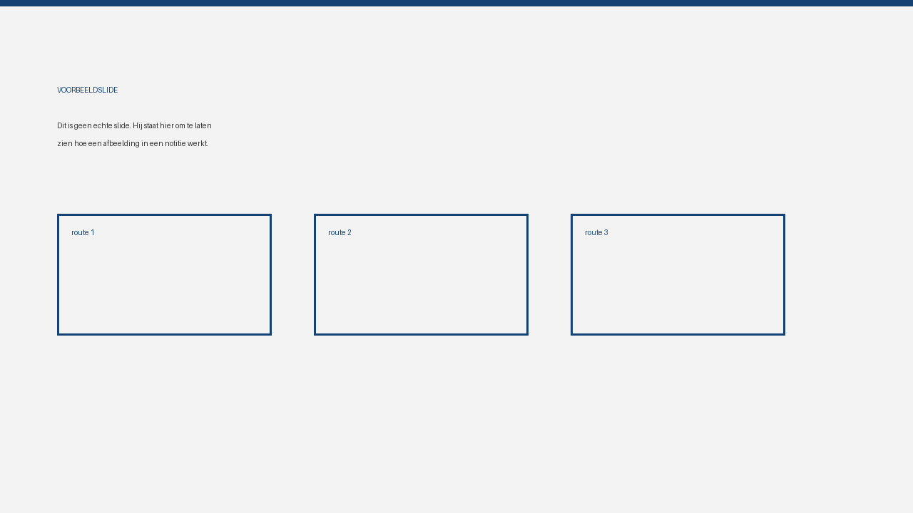

Deze notitie bestaat om te laten zien hoe een notitie eruitziet. De inhoud is
verzonnen. Wie de eerste echte schrijft, mag dit bestand weggooien.

Ik schrijf hier in de ik-vorm, omdat een notitie van iemand komt en niet van een
organisatie. Dat maakt ook makkelijker om iets te zeggen waar je nog niet
helemaal uit bent.

## Eén idee per notitie

Deze notitie gaat over één ding: hoe zo'n notitie is opgebouwd. Alles wat daar
niet bij hoort, hoort in een andere. Dat scheelt de lezer werk en het scheelt de
schrijver een structuur bedenken.

De opmaak is gewone markdown. Koppen beginnen op niveau twee, want de titel uit
de frontmatter is al de `h1` van de pagina. Verder is er niets verplicht: geen
vaste secties, geen sjabloon om in te vullen.

## Wat de frontmatter doet

De velden bovenaan dit bestand sturen vier dingen aan:

- `title`, `date` en `summary` vullen het overzicht.
- `authors` levert de regel onder de titel. De tweede auteur hierboven heeft
  geen naam — een rol alleen mag ook.
- `tags` staan onderaan. Er zijn geen tagpagina's; het is beschrijving, geen
  navigatie.
- `regulations` verwijst naar regelingen in het corpus. Deze notitie noemt de
  [Wet op de zorgtoeslag](https://wetten.overheid.nl/BWBR0018451), en onderaan
  staat automatisch een link naar diezelfde regeling in de leesomgeving.

## Slides en afbeeldingen

Een afbeelding staat naast de notitie en verwijs je er relatief naartoe. Astro
verkleint hem bij het bouwen, dus zet er gerust een export van een slide in:

De alt-tekst is niet optioneel. Zonder valt de toegankelijkheidspoort in de CI
erover, en terecht: "slide 4" zegt niemand iets, "de drie routes naast elkaar"
wel.

Een hele presentatie hoort niet in de notitie. Zet de twee of drie slides die
het punt dragen in de tekst, en link de rest als PDF:
[het hele deck](/notes/voorbeelddeck.pdf) (PDF). Die bestanden staan in
`docs/public/notes/`.

Voor een schema is een [mermaid](https://mermaid.js.org/)-blok beter dan een
screenshot: dat blijft leesbaar, kleurt mee met licht en donker, en is
doorzoekbaar.

De bestandsnaam bepaalt de URL. Dit bestand heet
`2026-09-10-voorbeeldnotitie.md` en staat dus op
`/notes/2026/09/voorbeeldnotitie`. Die URL verandert niet meer, ook niet als de
titel later wordt bijgeschaafd.
