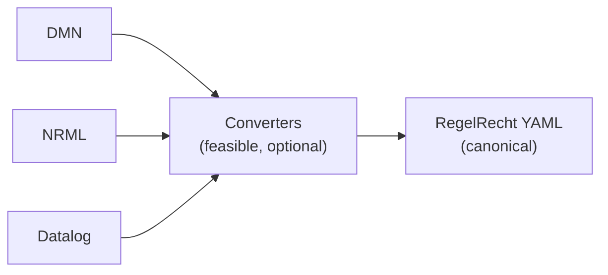

**Status:** Accepted
**Date:** 2026-05-29
**Authors:** regelrecht team
**Short title:** Rules Language

## Context

RegelRecht needs a rules language to represent Dutch legislation in machine-readable form. Several already exist (DMN with FEEL, Datalog, NRML, and others), varying in expressive power and in how widely they are adopted. The choice sets the ceiling on what the system can express and how maintainable it stays over time.

During the proof-of-concept we built and tested a custom YAML-based language. That language now backs the corpus (`corpus/regulation/nl/`), which holds machine-readable implementations of over 30 Dutch laws, including the *Wet op de zorgtoeslag*, the *Algemene Ouderdomswet*, and the *Participatiewet*. The POC validated that the approach can model real legislation.

This RFC ratifies that choice. The custom YAML language is already in production: [RFC-001](./rfc-001) through [RFC-010](./rfc-010) build on it, and the corpus runs on it today. This RFC does not reopen the decision; it records why we made it and how conversion from other formats fits in, so the rationale lives somewhere durable rather than implied across a dozen downstream RFCs.

This is a different question from [RFC-006](./rfc-006) (*Language Choice for Law Execution Engine*), which chose the engine's *implementation* language (Rust). The question here is the *rules* language in which legislation itself is expressed (RegelRecht YAML), an orthogonal concern.

> **Note on provenance:** This RFC originates as RFC-001 in `MinBZK/poc-machine-law`. It is renumbered to RFC-011 here to avoid colliding with [RFC-001](./rfc-001) (*YAML Schema Design Decisions*), and retranslated into this repo's house style. The substance of the decision is unchanged.

## Decision

**Continue with and formalize the custom YAML-based rules language ("RegelRecht YAML"), with conversion from existing rules languages as an optional, stakeholder-driven future capability.**

The language:

- uses YAML for structure and human readability
- defines domain-specific constructs tailored to Dutch legislation
- has been validated through POC implementations of actual laws
- provides precise semantics matching our computational requirements

## Why

The decision comes down to fit between what a language can express and what this project needs. After evaluating the alternatives, the central trade-off is this:

**Existing rules languages** offer varying degrees of market adoption, ecosystem, tooling, and cross-organization compatibility. Market-driven standards bring interoperability; NRML brings Dutch government domain alignment.

**Custom YAML** offers freedom and ownership: full control over semantics, versioning, and evolution, with no external dependencies. We can keep the feature set to exactly what we need, without external models arriving with expectations of feature support we don't provide, and without pressure to absorb breaking changes from upstream.

For work this novel, a language that fits our requirements exactly pays off. Custom YAML addresses four specific needs:

1. **Novel combination of concerns.** One system that has to handle temporal versioning, complex calculations, multi-law interaction, service references between laws, and explanation generation at once.
2. **Evolving understanding.** As a research-oriented project, requirements keep clarifying through implementation. A custom language can adapt without external constraints.
3. **Precise semantics.** Government decisions demand unambiguous interpretation, which a custom language can guarantee without inheriting vendor-specific ambiguity.
4. **Proven viability.** A POC with 30+ laws demonstrates that the YAML approach successfully models real legislation.

### Benefits

- We own the language outright: how it is versioned and how it evolves are ours to decide
- No external governance forcing breaking changes or unwanted features
- An intentionally minimal feature set: only what the mission requires
- One canonical representation, with semantics precise enough for government decisions
- Validated against 30+ real Dutch laws

### Tradeoffs

- We build and maintain the language infrastructure ourselves
- We write the documentation and examples
- Users must learn a new syntax, or we build tooling to ease that
- Risk of bugs or design oversights unique to a homegrown language

Mitigations:

- Start with a minimal feature set; expand only on proven need
- Borrow design patterns from existing languages
- Keep a comprehensive test suite
- Document design decisions via RFCs
- Support conversion from other formats to reuse existing work, when stakeholders need it

### Conversion strategy

Conversion from established formats into RegelRecht YAML is technically feasible for features that fall within our YAML's scope. The evaluated formats (DMN, NRML, Datalog) share the core decision-modeling concepts (inputs, rules, outputs, conditions, temporal aspects) that map onto our constructs. Features outside our intentionally limited scope are simply not converted.



When stakeholders need it, conversion would let practitioners familiar with other formats contribute, would allow evaluation of existing law models, and would provide a migration path from legacy systems, all while keeping clear internal semantics through the canonical YAML.

**Implementation decision:** converters are built when stakeholders demonstrate need, not preemptively.

### Alternatives Considered

The alternatives split into two categories, assessed with different criteria. **Market-driven standards** (DMN, Datalog, Prolog, OWL/RDF, Catala) are judged on worldwide adoption, ecosystem maturity, cross-organization compatibility, and vendor support. The **Dutch government-specific initiative** (NRML) is judged on fit with Dutch legislation and its relationship to this project. Adoption levels (Low/Medium/High) below indicate worldwide usage and ecosystem maturity.

**DMN with FEEL** (Adoption: High). The most widely adopted decision-modeling standard, with strong vendor support and a decision-table paradigm that suits eligibility rules. In practice ~80-90% of DMN usage is decision tables; FEEL expressions are used far less because of perceived complexity, and FEEL tool support is uneven outside Camunda/Trisotech. Decision tables handle simple eligibility checks well, but complex calculations (benefit amounts, tax formulas) need extensive FEEL. Temporal versioning is not native, service references between laws would need custom extensions, and external governance of the standard may conflict with our requirements.

**NRML** (Nederlandse Regelgeving Markup Language). Developed within the same MinBZK effort as this project, not a market-driven standard, and currently with no external adoption beyond its development team. Purpose-built for Dutch regulation with domain-specific constructs, and a natural candidate for knowledge sharing since both efforts come from MinBZK's law-as-code work. Strong domain alignment, but a broader feature set than we need risks extra complexity, and its service-reference patterns would need validation against our use case.

**Datalog** (Adoption: Low, growing). Declarative rules that read close to legal text, strong for legal reasoning and "why not eligible?" explanations, with temporal extensions, guaranteed termination (safer than Prolog), and predictable bottom-up evaluation. Open-source engines include Soufflé (C++), Flix (JVM), PyDatalog (Python), and Logica (compiles to SQL). A natural fit for legal rule representation, but less accessible to non-technical stakeholders without tooling, and it would need an extra layer for law metadata and service references.

```
% Temporal versioning built in
income_limit("single", 35000, "2024-01-01", "2024-12-31").
income_limit("single", 37000, "2025-01-01", "2025-12-31").

% Reason tracking for explanations
ineligible_reason(Person, "te jong") :-
    person(Person), age(Person, Age), Age < 18.
```

**Prolog** (Adoption: Medium). Powerful logical inference and backtracking, established in legal expert systems, with natural querying that finds all solutions automatically. But it has maintenance challenges at scale, less predictable performance than Datalog, and accessibility challenges for non-technical reviewers.

**OWL/RDF with SHACL** (Adoption: High in semantic web). Excellent for knowledge representation, ontologies, semantic reasoning, and linked-data interoperability, with SHACL for constraint validation and SPARQL for queries. Strong for representing law structures and relationships, but calculations and procedural logic are awkward to express, and it is complex for non-technical users. Better as a complement than as the primary language; service references could map to linked-data patterns.

**Catala** (Adoption: Low). A programming language designed specifically for law, with strong formal foundations, proof capabilities, and direct code generation from legal text. New (2020), with French pilot projects but limited production use. Theoretically appealing, but early-stage maturity, limited tooling, and significant adoption cost outweigh its formal-verification benefits for our immediate needs.

**Regelspraak / RuleSpeak** (Adoption: Low). A controlled-natural-language approach: rules in structured Dutch/English sentences that legal experts can read and validate, lowering the barrier to review. Strong for documentation and stakeholder communication, but it needs a translation layer to executable code and has less precise semantics than a formal language. Complementary, and could inform human-readable documentation alongside the YAML, rather than serve as the execution language.

**Other logic-programming options.** Answer Set Programming (Low) handles the non-monotonic reasoning common in legal rules but is mostly research-focused. Production rules engines such as Drools and JENA (High) are established in enterprise but more procedural than declarative. LegalRuleML (Low) is an OASIS standard for legal rules, more expressive than DMN but with limited production use.

## References

- [RFC-001: YAML Schema Design Decisions](./rfc-001)
- [RFC-003: Inversion of Control for Delegated Legislation](./rfc-003)
- [RFC-006: Language Choice for Law Execution Engine](./rfc-006)
- [DMN Specification](https://www.omg.org/spec/DMN/): Decision Model and Notation standard
- [NRML](https://github.com/MinBZK/NRML): Nederlandse Regelgeving Markup Language
- [Datalog](https://en.wikipedia.org/wiki/Datalog): declarative logic programming
- [Catala](https://catala-lang.org/): programming language for law
- [Soufflé](https://souffle-lang.github.io/): high-performance Datalog engine
- [PyDatalog](https://github.com/pcarbonn/pyDatalog): Python Datalog implementation
- [RuleSpeak](http://www.rulespeak.com/): controlled natural language for business rules
- [SBVR](https://www.omg.org/spec/SBVR/): Semantics of Business Vocabulary and Rules
- [Glossary of Dutch Legal Terms](/reference/glossary)
