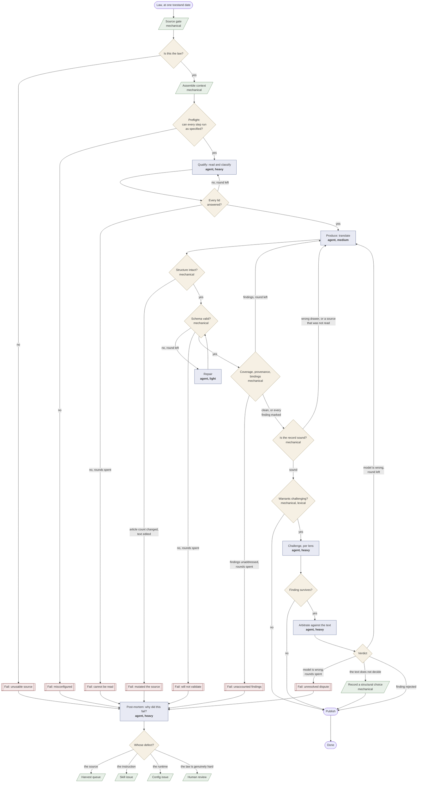
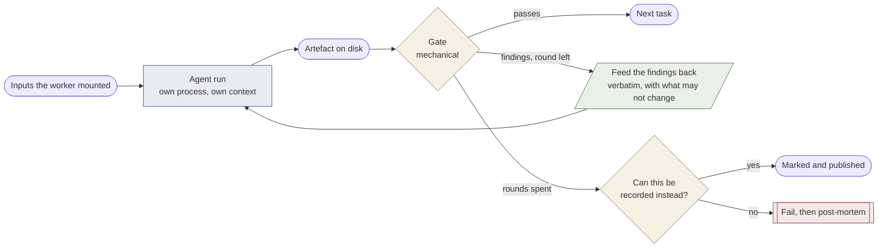

## This RFC in the series

Four RFCs describe layers of the same machine, from the outside in.

**RFC-026, Werkvoorraad.** Which articles must be enriched and in what order. It
produces tasks.

**RFC-027, Enrichment Quality.** The roles, the gates and the failure classes
that decide whether a single article is enriched well. It consumes tasks.

**RFC-028, Steps and Runtimes.** How a single step in that chain runs.

**RFC-029, Test Fixtures.** The yardstick for the whole.

This RFC is the second layer.

## Context

Enrichment turns the text of a Dutch statute into the `machine_readable` sections of the corpus. An agent reads an article and writes the logic that executes it. The corpus is large enough that nobody reads it, so whatever the agent gets wrong stays wrong.

The difficulty is not that legal translation is hard, although it is. The difficulty is that a wrong translation reads correctly. A duty modelled as a power, an establishing article carrying a competence that a later article confers, a deadline treated as fixed where the statute states a conditional outer bound, an article cited because its words matched rather than because its regime applied: each of these produces YAML that is well-formed, schema-valid, executable, and wrong in a way that only a legal expert notices.

This RFC decides what the enrichment process must do so that its output is checkable. Mechanically where the statutory text settles the matter, and by a legal expert where it does not. Checkable is the goal rather than correct, because correctness at corpus scale cannot be established by reading and can only be approached by making the places that need reading few and findable.

Issue #1036 records how enrichment works at the time of writing and where that falls short, with the measurements. That record belongs in an issue rather than here: it dates, and this document should not.

## Requirements

Seven properties any enrichment process must have. Each answers a failure mode that has been observed, and together they are what the design below implements.

**The text must be the law before a translation is judged against it.** A translation is checked word for word against the statutory text it was given. When that text is stale, truncated, paraphrased or carries an article the statute does not have, every judgement about the translation is void, including the favourable ones.

**The document structure must survive harvesting.** Chapter, division and paragraph headings are condensed legal classification written by the legislator, and they decide questions the article text alone cannot answer. Whether Awb 3:9 applies to a supplying administrative body turns on its sitting in the division on advice, where the adviseur definition of 3:5 lid 1 scopes it. A pipeline that drops the containers makes that error unavoidable rather than likely.

**The agent must be given what it needs rather than expected to fetch it.** An instruction the runtime cannot execute is worse than no instruction: it reads as a control that exists. Whatever the reading requires, sibling articles, definitions, delegation bases, explanatory memoranda, is assembled by the worker and placed in front of the agent.

**The reading must precede the writing, and be written down.** Classification is where this error class originates, so it has to be a separate answer rather than a by-product of producing YAML. The agent that classifies must not know what the model looks like, because knowing it classifies towards what is easy to model.

**The reviewer must not share the producer's context.** Every error in this class is a plausible reading of the actual words, so the context that produced the reading also defends it. Review inside the same session is rereading. Independence has to be a process boundary.

**Doubt must leave a trace.** A structural choice the text does not dictate is cheap to record and expensive to guess silently. A gap in the corpus, a gap in the engine's language and a gap in the text are three different things with three different owners, and they need three different channels or they collapse into one list nobody works.

**Quality must be measurable without a legal expert in the loop.** Most of what goes wrong is detectable from the text and the model alone. Expert time is the scarcest input and must be spent on what only expertise can settle.

## Failure classes

The classes below are what a translation gets wrong. They are stated here because the design is judged by whether it addresses them; frequencies from a measured sample are in #1036.

**Condition or lid silently dropped.** The model takes the main rule and loses leden, "tenzij", "voor zover", "behoudens" and ranges, without recording that it did.

**Omission that runs one way.** The provisions that protect the administration are translated and the ones that bound it are not. Measured on the Awir in round 3: the five-year limitation periods were modelled, and the € 24 rounding floor, the € 121 threshold, the revision limitation period and the hardship clause were all passed over without a word. The cause was not the model. The generation skill instructed it to skip procedural provisions, delegations and transitional law, which named those articles in all but their numbers. A class that an instruction produces is not a class a gate can catch, and looking for it in the output is looking in the wrong place.

**Silence where a marking belongs.** An article passed over without a word cannot be told apart from an article nobody read. Round 3 carries no untranslatable anywhere in the Awir's penalty chapter, which is about intent, gross negligence and proportionality. That channel existed only in the schema: `open_terms` appeared nowhere in the skills, so the drawer an open norm belongs in was not one the agent had. Given one drawer labelled "the engine cannot express this", it wrote nothing rather than the wrong thing.

Round 4 shows the other half of the same defect. There the agent had a drawer for an open norm, in the shape of the `norm_gaps` field that schema v0.6.0 briefly carried, and it filled that drawer 101 times while leaving `open_terms` empty. A channel nothing reads collects the entries, because writing to it costs nothing and no gate answers back. RFC-031 consolidates the four fields into two for that reason.

**A restriction that restricts nothing.** The model produces an output expressing a condition, and no article reads it. Round 3 produced both the age test and the asset test of the zorgtoeslag and consumed neither, so the model grants the allowance to a sixteen-year-old and to a millionaire while every article in isolation reads correctly. Scope discipline as stated punishes pulling a condition in and says nothing about failing to connect one, which is half a rule.

**A displacement that never fires.** An override names the article number the statute cites while the corpus splits below article level, so the key never matches. Four of five overrides in the round 3 zorgtoeslag are inert, including the asset test and the halving in article 2, fifth lid. The engine returns both the displaced and the displacing value without complaint. The same agent resolves `requires` correctly in 72 of 72 cases, so it knows the fragment numbering; nothing had ever told it this key differs.

**A unit that changes at the law boundary.** Within an article the engine checks units; across a law boundary it checks nothing. The zorgtoeslag counts in eurocent and the Awir in euro, each internally consistent, and the same person on the same income comes out at € 827,63 or € 1.550,46 depending on which file wins.

**Time period absent.** The statute names a peildatum, a berekeningsjaar, a kalendermaand or a tijdvak, and the model computes without one. A source binding carries no period at all, so a value established over one period silently answers a question about another.

**Wrong reference or concept swap.** Two laws use one name for two concepts, or a model binds to an output whose name matches and whose meaning does not.

**Establishment or task confused with attribution.** An article that says an organ exists, or assigns it a task, is read as conferring competence. Identification of who an organ is gets pasted onto attribution of what it may do.

**Wrong modality.** An obligation becomes a state, a power with a threshold becomes a mandatory rule, a conditional sanction becomes a constant.

**Exception or precedence wrong.** A ranking flattens into a set, a derogation stated as "in afwijking van" disappears, an exclusivity rule is ignored.

**Granularity and hardcoding.** "Ten hoogste twee weken" becomes exactly two weeks; an amount loses the periodicity the text gives it; a delegation to a lower regulation becomes a fixed number instead of an open term.

**Definition ignored.** A term defined in the same law is modelled as a loose fact, or a definition is applied outside the scope it declares.

**Invented value domains and dead structure.** An enumerated domain appears that no text fragment supports; outputs are declared that nothing consumes; a binding names no source at all. Alongside these sit defects that no per-article review can see, such as name collisions within one regulation and a concept swapped across a chain of laws.

The first two classes are the largest and both are mechanically detectable. That matters for sequencing: the cheapest checks address the most.

One qualification on the binding check, which follows from RFC-026. An unfulfilled binding is only a finding once the closure of the request is empty. While the article it points at is itself still queued for enrichment, it is an open task and not a defect. Measured on round 2 of the enricher archive, six of the seven binding findings on the zorgtoeslag were of that kind: artefacts of starting at the top rather than errors in the law that was translated.

## The chain

Enrichment is a chain of tasks. Every task ends at a gate, and a gate either
lets the work through or hands it back with what it found. That handing back is
the point: a finding the producer never sees changes nothing, and a finding
that fails a job without being shown teaches nobody.

Half the boxes need no model at all. That matters for cost and for trust: a
mechanical step gives the same answer every time and can be argued with, and
the model is spent where judgement is genuinely required.



Green needs no model. Blue is an agent run in its own process, with the weight
it needs: heavy where the work is a legal judgement, light where the input is a
list of errors and the output is the same file with those errors gone. Amber is
a gate. Red ends the chain without publishing.

### Failing is the normal outcome for a defect

Seven ways to fail, and they are deliberately many. A chain that can only
succeed produces a translation for every law it is handed, including the laws
whose source is stale, whose configuration cannot run, and whose disputes it
never settled. Publishing those is worse than publishing nothing, because a
published translation is indistinguishable from a checked one.

The seven, and what each protects:

- **Unusable source.** The text is not the law. Everything downstream would be
  measured against the wrong thing.
- **Misconfigured.** A step needs a capability the runtime cannot give, or a
  model whose context cannot hold what the step must read. Known before a
  single token is spent.
- **Cannot be read.** The qualifier could not answer for every lid. A partial
  reading produces a partial translation that looks whole.
- **Mutated the source.** The article count changed or statutory text was
  edited. The one thing a translator may never do.
- **Will not validate.** Schema errors survived the repair round.
- **Unaccounted findings.** A mechanical check raised something and it was
  neither fixed nor recorded. Silence is the failure mode this whole design
  exists to remove.
- **Unresolved dispute.** The arbiter and the producer did not converge. That
  is a question for a person.

### Every failure is evidence about the enricher

A failed job that only produces a log line is a wasted measurement. The goal is
a better enricher, and a failure says more about the enricher than a success
does: a success can be luck, a failure has a cause.

So a failure is followed by one more agent run whose only job is to say whose
defect it was. It reads the instruction the step was given, the artefacts it
produced, the gate findings, and the statutory text, and it routes:

**The source.** The harvest is stale, truncated or malformed. Goes back to the
harvest queue with what it found, and no instruction change would have helped.

**The instruction.** The step was told to do something impossible, something
contradictory, or something it had no way of knowing. This is the diagnosis
that improves the enricher, and it becomes an issue against the skill with the
concrete case attached.

**The runtime.** A capability, a context window, a timeout. Configuration, and
the same law would succeed elsewhere.

**The law itself.** Genuinely hard: a construct the language cannot express, a
norm nothing in the corpus fills, a provision two readings fit. Goes to a
person, and it is the only one of the four that is not a defect.

The value is in the aggregate. One post-mortem explains one job. A hundred of
them, grouped by verdict, say which of the four is the bottleneck, and that is
the number that decides what to work on next.

### What a task with a gate looks like

Every agent task has the same shape, and the shape is what makes the chain
improvable: the gate is mechanical, its findings are quotable, and the number
of rounds is bounded so a disagreement cannot spin.



Two kinds of gate, and the difference decides what a failure means.

A **hard gate** states a fact about the artefact that must hold: the YAML
validates, the article count did not change, every reference resolves. A
failure here is not open to interpretation and the only answers are repair or
stop.

A **soft gate** asks a question the text raises: this lid says "in afwijking
van" and the model has no branch; this article computes over a berekeningsjaar
and no binding carries a period. The answer may be a change to the model, and
it may equally be a marking that says why not. A soft gate that only accepts
changes turns every open norm into a defect and pushes the translator into
inventing something.

A third kind asks about the **record** rather than the translation, and it
comes last because the gates before it are what produce the record.

Two things go wrong there and neither is visible in the model itself. A marking
lands in the wrong drawer: a norm filled by a regulation that has not been
harvested, recorded as something the engine cannot express, goes to a queue
where nobody will ever work it, because the answer to it is a harvest and not
an operation. Schema v0.6.0 makes that check cheap, because the two claims now
sit in two fields with one question each: `markings` says the format cannot
express this, `open_terms` says the content sits elsewhere. RFC-031 has the
argument. And a source gets named that nobody read. An agent with no
network recalls a document number and a link, and a recalled citation is
indistinguishable from a read one to whoever comes after. A source that was not
provided may be named as a lead in prose, without a number and without a link:
a lead invites someone to look, a citation claims someone already did.

This gate is soft on purpose. A misfiled marking is still better than silence,
and failing on it would punish exactly the behaviour the design wants.

### Where the rounds are bounded

A round costs an agent run, so the bound is not a detail. One repair round per
gate, and a disagreement that survives it is recorded rather than fought out.
The reason is that a second disagreement is rarely a slip: it is either
something the text genuinely leaves open, which is what the marking channels
are for, or a defect in the instruction, which no amount of retrying inside one
law will fix. The post-mortem is what catches the second case, and it catches
it across laws rather than within one.

## Design

Three numbered things appear below and they are not the same thing. The seven **stages** are the design of the chain, ordered by cost. The **tiers** 0 to 2 inside stage 3 are how much context an agent gets. And the quality ladder in stage 7 measures how far a translation has come. A stage, a tier and a rung sharing a digit mean nothing to each other.

Seven layers. They are ordered by cost, and each one is useful without the ones after it.

### 1. Source integrity gate

No article is enriched while its source text fails a check. The reason is not that harvesting is unreliable; it is that a translation is judged word for word against the text it was given, so that text has to be the law before the judgement means anything. The gate also recovers the document structure the harvest drops, which is the second reason to run it.

The strongest check is a comparison against the official BWB toestand, which the harvester already knows how to fetch. Presentation has to be normalised first: the harvester turns cross-references into markdown reference links and numbers a lid `1 ` where the source writes `1. `, and neither is a difference in the law. The remaining checks are mechanical:

- the toestand date in the file matches the BWB toestand it claims;
- the `text` of an article matches the statutory text at that toestand, compared against raw HTML from the official source and not through a summarising fetch;
- no article text ends in a bare enumeration letter, contains a line break inside a word, or is shorter than a threshold relative to the source;
- two consecutive versions of the same law are not byte-identical in their article texts when the BWB records a material change;
- formulas and tables present in the source are present in the file.

A failing file goes to a repair queue and is not enriched. This is the cheapest layer and it is upstream of everything: without it, every quality figure in this RFC is unmeasurable.

### 2. Structure preservation

An article records its placement: the numbers and the headings of the chapter, title, division and paragraph that contain it. This is a schema extension, an extension of the harvester's XML walk (the splitter currently starts at `artikel` and never sees the containers), and a re-harvest. It is not cheap, and it pays for itself on every later run.

Until that exists, an assembly step can fetch the toestand XML again and build the tree outside the corpus. That works and it creates a second source of truth beside the corpus, so it should be treated as a bridge.

The fragmentation of leden into separate articles is a separate decision that this RFC does not settle. As long as it stands, reassembly to a whole article remains permanently necessary.

### 3. Context assembly

Three layers per law and per article.

**Tier 0, once per law, cached, roughly 5 to 10k tokens.** Identity (`bwb_id`, toestand date, citation title). The structure tree with all headings. The definition provisions in full, each recorded with its scope: "in deze wet", "in dit hoofdstuk" or "in deze afdeling". The preamble. The delegation bases from the WTI file valid on the toestand date, and inversely the regulations based on this law. A small curated legal memo (see stage 4).

The WTI file contains `<grondslagen>` with a `bwb-id` and a validity window per basis. The delegation basis of a ministerial regulation is therefore data. The agent does not have to read a competence out of the preamble at all, which settles one of the eleven corrections by retrieval.

**Tier 1, per article, roughly 2 to 6k tokens.** The target article reassembled in full, with all leden and sub-items and their chapeau, never a loose corpus fragment. Its structural path with headings. The sibling articles within the same paragraph in full, capped, falling back to heading lines for the rest of the division. Marked hits: which terms in this article are defined elsewhere, and whether the article contains a residual or derogation pattern, which triggers tier 2.

**Tier 2, retrievable, not in the window.** Any article of the same law by number. The target text of an external reference in another law, fetched per path from the corpus repository and never by cloning. The article-level explanatory memorandum fragment, selected as described under Time correctness. The diff against the previous toestand of this article.

Earlier versions of the same article are deliberately not in the window. None of the eleven errors was a version error, and `law-version-drift-check` covers that ground.

### 4. Reading procedure

Nothing is written until the reading is written down. The output of this phase is a short reading note per article, and the translation is made from the note.

**Per law.** Build the definition register with scopes. Build the organ map, recording separately where each organ is established ("Er is een ..."), where its tasks are assigned ("is belast met", "heeft tot taak", "draagt zorg voor") and where its powers are conferred ("kan", "is bevoegd"). These are usually three different articles. Build the delegation map, where the preamble is a pointer to verify and never itself the source of a power.

**Per lid, in this order.**

*Q1. What kind of provision is this?* One class per lid: establishment, task or duty, power (attribution), obligation, entitlement, definition, procedure or deadline, delegation basis, transitional or scope. The class constrains what follows. An establishment provision produces no executable logic and confers nothing. For a task or duty the word "bevoegd" may not appear in an output name or description.

*Q2. Who is the actor, in two separate operations?* Identification: which concrete organ does the text mean, resolved through the law's own definition provision. Attribution: which article makes that actor competent for this act. Identification never implies attribution. Where the attributing article cannot be found, the result is a marker and never a filled field. Before treating a competent authority as context-dependent, read whether the law designates it itself, as Participatiewet art. 40 and Omgevingswet paragraph 5.1.2 do.

*Q3. Where does every deadline and number come from?* Three sub-questions. Is this the term, or a fallback that applies only when another source is silent. Is there an escape that suspends or replaces it, scanning this article and its neighbours for mededeling, verlenging and opschorting. Are the conditions cumulative or alternative, reading "noch", "en" and "dan wel" as operators. A fixed deadline may be modelled only when all three answers permit it.

*Q4. Is this term defined elsewhere, and does that definition reach here?* Every legally loaded term is checked against the definition register including scope. A term from a qualified regime applies only where the regime applies. That the everyday word fits is not sufficient.

*Q5. Which leden are the main rule and which are exceptions?* Mark each lid as main rule, exception ("tenzij", "behoudens", "in afwijking van") or counter-exception. Read the chapeau for an explicit precedence rule. The model structure mirrors the marking and leden are never merged.

*Q6. What is the time period of every external value?* Per source binding, state the period the source value covers and the period this article needs. Where they differ or cannot be determined, the result is a marker naming both.

The curated legal memo carries what cannot be derived from any text: that mandate never appears in a statute, so an organ deciding in mandate exercises the mandans's power and the law knows only the mandans; that the Awb uses "delegatie" more widely (art. 10:13, the power to take decisions) than the Aanwijzingen voor de regelgeving do; that supervision in the sense of Awb chapter 5 requires designation as a supervisor. This memo is maintained by a legal expert. The eleven corrections are its seed.

### 5. Role separation

The roles are separate subprocess runs, never phases of one session. The firewalls are the point.

**Qualifier.** Performs the reading of layer 4 and writes the reading note. Receives the full statutory text, the definition provisions, the preamble, the parent-law basis and the legal memo. Does not receive the schema or `law-generate`. A qualifier who knows what the model looks like classifies towards what is easy to model.

**Producer.** Translates, bound by the classification. Where the classification says duty, no power may come out. Departure is possible only through a marked structural choice.

**Adversary.** A separate run whose instruction is to bring the translation down, not to improve it. Per lens, find the strongest reading under which this model is legally wrong, with a citation, or state explicitly that no tenable counter-reading exists on that lens. Four lenses: competence, deadlines, definitions and references, time period. One binding rule under the reference lens: read every article that the target article itself cites, because 4:13 names 4:14 and whoever does not read 4:14 cannot check 4:13.

The adversary receives the verbatim statutory text and the produced YAML. It does not receive the reading note, so that it re-derives the classification independently and therefore also catches qualifier errors. It does not receive the producer's reasoning, and it does not receive the MvT scenarios with expected outcomes, because whoever knows which outcome is supposed to come out reasons towards it.

**Arbiter.** Reads each finding against the verbatim text and decides: repair instruction, marking, or rejection of the finding. Judges on the text and not on who argues better.

At most one repair round. A persistent disagreement is recorded as an open question for a legal expert and the pipeline moves on, because a recorded disagreement is a usable output. Agents never talk to each other; everything moves through artefacts.

**Where the expensive treatment applies.** Routing is lexical and runs before the costly step. High risk, meaning the full adversary on all lenses: articles with organ and competence vocabulary ("is bevoegd", "draagt zorg voor", "wordt belast met", "houdt toezicht", "Onze Minister", "bevoegd gezag", "Er is een"). Targeted risk, one lens: deadline words and residual provisions to the deadline lens, article references to the reference lens, cross-law bindings on time-indexed data (income, assets, premium) to the time-period lens. Low risk, no adversary: pure calculation articles with local definitions, where the BDD loop already covers arithmetic. Estimated 20 to 40% of articles receive the expensive treatment.

### 6. Mandatory marking

A marking says the format cannot express this. An open term says the law leaves the content open and something else fills it. A structural choice says the text did not determine which legal structure is right, and the agent chose. Three claims, three reviewers, so the third is a separate list rather than an extra category in RFC-012.

Schema v0.6.0 carries the first two and not the third. `structural_choices` was written into an earlier draft of that version, was read in one check and written by nothing, and was removed with the consolidation of RFC-031. A structural choice therefore rides in the enrichment sidecar next to the law, which is where the reading note and the gate results already sit; open decision 3 below is settled that way for as long as the field is absent from the schema. The shape it takes there is unchanged:

```yaml
enrichment:
  structural_choices:
    - question: "Is the term in article X a fixed deadline or a conditional outer bound?"
      chosen: "conditional outer bound; lapses on a mededeling under 4:14 lid 3"
      alternatives:
        - "fixed deadline of eight weeks"
      basis: "lid 2 states 'noch' conditions; 4:14 lid 3 provides the escape"
      affects: [beslistermijn_verstreken]
      legal_text_excerpt: "…binnen acht weken … noch een mededeling als bedoeld in 4:14, derde lid…"
      reviewed: false
```

`question`, `chosen` and `basis` are required. `chosen` states what the YAML actually implements, and `affects` lists the outputs a reviewer must recheck if the choice is overturned. Moving it into `machine_readable` later needs a schema change, because that object is `additionalProperties: false`.

Marking is cheap and a silent wrong guess is expensive, so the instruction is to mark when in doubt. It is never a way to avoid reading.

### Displacement, and states the data model does not have

Two readings that a faithful translation has to get right, both measured on the zorgtoeslag in round 4.

**"In afwijking van X" names the rule departed from, not the thing displaced.** Article 3 reads "In afwijking van artikel 7, derde lid, van de Awir, bestaat geen aanspraak op een zorgtoeslag". The agent placed the override on Awir 7.3, which is what the sentence cites. What is displaced is the entitlement that article 2 of this same law establishes, which the sentence names in its subject. The override therefore never fired, and the engine returned both the entitlement and the exclusion without complaint. Reading the sentence literally gives the wrong answer here, which is why this belongs in an instruction rather than in a hope that the text carries itself.

**"Bestaat geen aanspraak" is not an entitlement of zero.** With an entitlement of zero there is a decision, legal remedies and a ground for recovery; with none there is neither. Article 2 says "aanspraak **ter grootte van** dat verschil", so the amount is a property of the entitlement and not a fact beside it. Where the entitlement does not arise there is nothing to size.

The data model had no way to say that. An output carries a value, and absence was indistinguishable from "nobody asked". Schema v0.6.0 therefore lets an override state that the output does not arise:

```yaml
overrides:
  - article: "2.1"
    output: aanspraak_op_zorgtoeslag
    voids: true
    legal_text_excerpt: bestaat geen aanspraak op een zorgtoeslag
```

The split between the two fields is deliberate. `voids` is behaviour and the engine acts on it alone, needing no knowledge of administrative law. `legal_text_excerpt` is the ground, quoted from this article, and it can grow as new cases appear without the engine learning anything.

A closed vocabulary was considered for the ground and rejected. A category would force the agent to translate the statute into a classification, which is the interpretive step this whole format exists to avoid, and an engine reading such a category would need a table saying which values void. A quotation only has to be copied, and a check can hold it against the article's own text in the same way the provenance check already holds every amount.

What a consumer asking for a voided output gets is an explicit failure rather than a number. That is intended: an amount the law does not recognise must not travel on quietly.

### Four outcomes, and silence is not one

Every article gets exactly one of four outcomes, and a soft gate reports the ones that got none.

Executable logic. An `open_term`, where the norm is real and its content is settled somewhere other than this article. A `marking`, where the norm is clear and the format cannot express it. Or a `declares`, where the article fixes a document property rather than computing anything.

The axis dividing the middle two is what has to change before the article is fully translated, and it decides whose queue the entry lands in. An open term is closed by a harvest or by a competent authority answering the individual case. A marking is closed by building the operation (`resolution: engine`) or by giving the format a shape it lacks (`resolution: model`). Schema v0.6.0 states this axis; earlier versions offered a `kind` on each of two fields, sorting by what kind of thing the gap was and leaving the owner implicit. That is the correction RFC-031 records, and it is a case of the schema catching up with this RFC rather than the other way around.

The fourth needs the argument, because the obvious fourth outcome would have been "nothing to execute" and that turns out to be almost empty. Going through the Awir and the zorgtoeslag article by article, every candidate for an empty article was a provision of a kind nobody had looked for. A definition by reference is a cross-law binding. A naming provision belongs to an output another article computes. "De hoogte van de zorgtoeslag is afhankelijk van de draagkracht op basis van het inkomen en het vermogen" is a property the model must have, and in round 3 it was exactly the property the model broke. Awir article 51, the citation title, fixes what every execution trace calls this law.

A `declares` entry therefore names a top-level property together with the value the article gives it, and a check holds the two against each other. When they disagree the article decides and the header is a stale copy. That leaves perhaps one article in a hundred, and finding nothing to write is a sign that the kind of provision has not been identified rather than that the article is empty.

The gate on this is soft, because a marking is a legitimate answer. Its purpose is to make the difference visible between an article that was read and left alone and an article nobody opened, which the corpus cannot currently express.

Alongside the structural choice sits a stricter obligation that the measurement makes necessary. **Per lid, the model accounts for its coverage.** Every lid and every connective ("tenzij", "voor zover", "behoudens", "in afwijking van", "ten minste", "ten hoogste", "dan wel", "noch") is either represented in the model or carries an explicit statement of why it is not.

A word list is the weak form of this, and its weakness is measurable. Awir article 45, first lid, forbids alienation, pledge and seizure with two exceptions; round 3 modelled the two exceptions and lost the prohibition, and the coverage check passed because it counts a `conditions` list as a branch whatever operation sits under it. Whatever the list catches is caught and the rest does not exist, and nobody knows how large the rest is. #1069 proposes replacing it with an explicit mapping from text to model, where unclaimed text is a gap by construction and no vocabulary is involved. The 85% silence sits precisely in the gap between "I could not express this", which is marked, and "I did not model this", which is currently invisible.

### 7. Measurement

**The gold set.** The unit is the claim, not the file. Each record holds the source (BWB id, article, lid, validity date), the error we made, the correct reading, the reviewer's reason verbatim, and a machine-checkable assertion over the generated YAML.

```yaml
id: goud-0002
bron: {bwb: BWBR0035917, artikel: "6.1.1", geldig_op: "2025-01-01"}
claim_type: bevoegdheid_verankering
fout: "power anchored on the establishing provision 6.1.1"
correct: "6.1.1 establishes the CAK; tasks and powers come from 6.1.2"
reden: "<verbatim annotation>"
toets:
  - path_absent: "articles['6.1.1'].machine_readable.competent_authority"
  - path_present: "articles['6.1.2'].machine_readable.competent_authority"
herkomst: {reviewer: mariettelokin, pr: 776, commit: 6ce3c15}
```

Of the eleven cases, only the Awb 4:13 one manifests in an execution outcome, so it belongs in `bdd/` as a Gherkin scenario using the existing grammar. The other ten are claims about the shape of the model. Extending `bdd/grammar.yaml` with model assertions would pollute the engine conformance language with skill QA that concerns no engine. They also do not belong in bucket A, where a failure means the law changed; here a failure means the skill regressed. Different semantics, separate bucket.

**What good YAML means, as a ladder.**

- tier 0 schema valid. Exists as `just validate`.
- tier 1 internal consistency: every `$variable` defined, every intra-law reference resolves, every `source.regulation` plus `output` exists in the corpus, every `open_terms` and `implements` pair closes, units consistent. Fully deterministic.
- tier 2 coverage: every lid has machine-readable logic, a marking or an open term, plus the lexical trigger scan over the connectives. This single cheap check, with no model involved, would have caught the Awb 4:13 case.
- tier 3 anchoring: every legal basis points at an existing article and lid, and the norm type fits the text of that lid. A power anchored on a lid containing only establishing language is a flag. Plus the scope check on definitions: a term from a division-scoped definition may not ground outside that division.
- tier 4 classification consistency: every article classified, with cross-checks. Duty language may not yield a power. A power requires establishment or attribution elsewhere.
- tier 5 legal correctness: legal expert and gold set only.

tier 1 through tier 4 run without a legal expert over the whole corpus and produce per-file metrics. The daily yardstick is that those do not regress.

**Scarce expert time.** Never present YAML. The RFC review worked because it was prose about statutory text, which is the reviewer's own medium. The unit is a decision point presented as one screen: the article fragment, the reading as a legal sentence, the doubt, and three answers. Decision points are ranked on the corpus frequency of the underlying pattern, so that one answer generalises across thousands of files. Second channel: disagreement sampling, where two independent generations of the same article are compared and only the differences are presented. Third: stratification over the claim-type taxonomy so every error class keeps attention. Each answer is itself a gold record, because the formats are deliberately the same.

**Growing the gold set.** The repository history is nearly exhausted; the three PRs are all there is. External sources: the Aanwijzingen voor de regelgeving, which is an expert-validated catalogue of drafting patterns and states the delegation terminology difference explicitly; case law, where a judgment interpreting a provision supplies the correct reading and the losing reading in one document, findable per article through LiDO; article-level explanatory memoranda, extending `law-mvt-research` beyond calculation examples; published uitvoeringstoetsen, where the divergence between administrative practice and statutory text is a standing theme; and the review sessions themselves.

**The regression runner.** It measures the skill, so the checked-in corpus is irrelevant and every run generates fresh. Per gold record only the articles involved are regenerated with the candidate skill. Three assertion layers: the deterministic checks, the gold Gherkin scenarios against the fresh model, and a model judge with a fixed rubric for prose claims. Generation is not deterministic, so each record runs three times and scores worst of three; a skill must be robust rather than lucky.

Side effects are measured on a fixed panel of around 25 regulations, stratified over statute, order in council and ministerial regulation and over domains, regenerated on every skill change and diffed against the last approved output. Any diff outside the intended cases is a report line, and the tier 1 to tier 4 metrics on the panel may not fall.

Three guards against overfitting. A held-out split, where part of the records is not visible to whoever writes the skill and new records land in held-out first. A memorisation lint that fails when the skill text contains gold set article numbers, because naming them means the case was memorised rather than the pattern. And the rule that a skill change must address a claim type rather than an individual record.

The judge is itself unproven, so part of each review session goes to replaying judge verdicts, which calibrates the yardstick.

## Time correctness

The requirement is version matching. When translating the 1996 version of a statute, the explanatory memorandum of 2026 does not belong in the context. The toelichting that belongs to a version is the one accompanying the amendment that gave the article its redaction at that moment.

That is not the same as a blanket cutoff on publication date. A memorandum from 2024 accompanying the amending act that produced the current wording is the relevant toelichting for the 2025 toestand, and a temporal filter keyed on the original enactment date would discard exactly that document. The correct selection is causal: the parliamentary papers belonging to the Staatsblad changes that constitute this toestand. The WTI file holds the amendment history per article with its Staatsblad references, so the chain can be built.

Where this is free it is enforced: statutory text is bound to its toestand, WTI delegation bases are filtered on the toestand date, and parliamentary papers are selected causally.

Two limits apply. Case law establishes ex tunc what the law always was, so a 2023 judgment about a 2015 provision is not anachronistic and excluding it makes the translation worse. And the model carries training knowledge from after every statutory date, which cannot be removed. Strict time correctness is enforceable at the source level and not at the model level.

The measurement supports treating this as a version fidelity requirement rather than as a fix for the errors in this RFC: none of the eleven was caused by anachronistic knowledge. It remains worth enforcing, because a corpus that claims to hold the 1996 law should hold the 1996 law and the Zorgverzekeringswet file shows that it does not always.

## What this does not solve

**Mandate against delegation.** Mandate never appears in a statute, and that the Awb and the Aanwijzingen use "delegatie" differently is not derivable from any statutory text. This is a knowledge corpus question. The mitigation is the curated memo plus the marking channel: the vocabulary discipline forbids writing "mandaat" where the letter does not contain it, which converts the error into a marked choice.

**The practice half of the timeliness case.** That administration uses an available figure where the law takes current income as the basis is knowledge of administrative practice. The missing time period on a source is text-internal and detectable; the divergence between law and practice is not.

**The positive characterisation in the Zorginstituut case.** That "toezicht" is unsupported by Wlz 5.1.1 is detectable, because the word is not there. That the right characterisation is a regulator determining the insured package comes from outside.

The general rule this yields: the text always suffices to see that a choice is unsupported, and it does not always suffice to know what should stand instead. Detection is encodable, correction is not always. The measurement supports the marking route, because marked choices in the sample were almost never wrong and silent choices frequently were.

**Chain-level defects are not reviewable per file.** Name collisions within a regulation, dead outputs, a concept swap across a chain, and an undelivered year dimension are properties of the corpus. Beside the marked-choice diff, a legal expert needs corpus-wide mechanical checks that sieve this class out before there is anything to review.

## Coverage of the known errors

| # | Correction | Caught by | How |
|---|---|---|---|
| 1 | Awb 4:13 deadline | 3, 4, 5, 7 | Sibling window puts 4:14 in view; Q3 forces the fallback, escape and connective questions; the deadline lens reads every cited article; tier 2 flags "noch" against a constant |
| 2 | Wlz 6.1.1 against 6.1.2 | 3, 4 | Organ map separates establishment from task assignment; Q1 forbids a competence on an establishing provision; sibling window holds 6.1.2 |
| 3 | Wlz 4.2.1 duty as power | 4 | Q1 classifies "draagt zorg voor" as a duty and bars "bevoegd" from output names in that class |
| 4 | Wlz 5.1.1 supervision | 2, 4 | Chapter heading in the path plus the memo on Awb chapter 5; unsupported use is detectable because "toezicht" is absent |
| 5 | Awb 3:9 against 3:2 | 2, 3, 4, 5 | Structural path shows "Afdeling 3.3 Advisering"; definition register carries the scope of 3:5 lid 1; Q4 forbids grounding outside the regime; the reference lens reads the division heading |
| 6 | Preamble as basis | 3, 4 | WTI delegation bases in layer 0 make the basis data; the preamble is a pointer to verify |
| 7 | "Onze Minister" | 4 | Q2 splits identification from attribution; a missing attributing article yields a marker, never a filled field |
| 8 | Mandate against delegation | Partially, 4 and 6 | The memo carries the convention; the vocabulary rule converts the error into a marked choice. Not encodable as procedure |
| 9 | `type: CATEGORY` | 4, 5 | The designation check in Q2 reads whether the law names the instance before any resolution mechanism is assumed |
| 10 | Competent authority designated in the law | 2, 4, 5 | Structure tree makes a paragraph headed "bevoegd gezag" findable before metadata is invented |
| 11 | Timeliness | 4, 6, 7 | Q6 forces a period answer per source binding; tier 2 triggers on "peildatum" and "berekeningsjaar"; the fix needs the schema change in #1031. The practice half escapes |

Eight to ten are fully caught depending on how strictly one reads case 4, one is partial, and one escapes as procedure and survives only as a marking.

How each failure class above is addressed, by name rather than by letter, because a letter sends the reader to a list where the letters were never assigned.

*Condition or lid silently dropped* by the coverage obligation in stage 6 and the tier 2 trigger scan. *Time period absent* by Q6 and the tier 2 time triggers, with #1031 required for the structural fix. *Wrong reference or concept swap* by the concept glossary check in tier 3 and the reference lens. *Establishment or task confused with attribution* by the organ map and Q1. *Wrong modality* by Q1. *Exception or precedence wrong* by Q5 and the tier 2 connectives. *Granularity and hardcoding* by the tier 2 range check and the delegation trigger. *Definition ignored* by Q4 and the tier 1 definition match. *Invented value domains* by the tier 3 requirement that every enum value and constant point at a text fragment, which is what `law-reverse-validate` already promises and does not enforce, and the chain defects beside them by the corpus-wide checks in tier 1.

Five classes have no line here, and that is the point of listing them by name. *Omission that runs one way* is not caught by any gate in this design, because its cause sits in the instruction rather than in the output. The other four have a deterministic gate each, built after this text was first written: *a displacement that never fires*, *a unit that changes at the law boundary*, *silence where a marking belongs* and *a restriction that restricts nothing*.

## Sequencing

The layers are ordered by what they cost against what they address, and each is useful without the ones after it.

1. **Schema validation with one repair round, inside the worker.** Validate the produced YAML in process, feed the errors back in a repair prompt, revalidate. This does in Rust what the skill instructs the agent to do with a shell it does not have, so it needs no shell, no network and no image change. It is the largest quality gain per unit of work.
2. **A way to run the loop locally.** Enrichment against one law on a developer machine, without a database and without git. Nothing below can be tried without it.
3. **The mechanical checks**, including the connective and time-word scans. No model involved, runs corpus-wide, and addresses the two largest failure classes.
4. **The source integrity gate.** Upstream of every quality figure, and the step that also recovers the document structure.
5. **Separate runs instead of one session.** Independent reverse validation, before any new roles exist.
6. **Context assembly, layers 0 and 1.**
7. **The reading procedure and the marking obligation**, together, because a reading procedure without a marking channel converts doubt back into silence.
8. **Structure preservation in the schema.** The most expensive item, because the harvester has to learn to walk the containers first and the corpus has to be re-harvested.
9. **The gold set and regression runner.** Needed before any skill change can be judged, and the layer that makes everything above measurable rather than plausible.
10. **The adversary and the arbiter**, with lexical routing.

Throughput constrains this harder than model spend does, so auditing happens at harvest time and not as a recurring corpus sweep: qualification, production and audit run once per statutory version and are redone only when the source hash drifts. When the method changes, only the adversary reruns, and only on files produced by an older prompt. No step may be designed that has to rerun corpus-wide on every finding.

The roles are separate agent runs inside one job rather than separate job types. Three job types would clone the same law three times, hit the per-provider rate cap three times for one law, and collide with the uniqueness constraint on the job queue. The firewall is the process boundary rather than the job type, and running several prompts with different rights inside one job is a pattern the pipeline already supports.

## Open decisions

1. **Schema: article placement.** Add chapter, title, division and paragraph numbers with their headings to an article. Requires a schema version and a re-harvest.
2. **Corpus: lid fragmentation.** Whether a lid remains a separate "article". As long as it does, reassembly is permanently required and every per-article approach carries that cost.
3. **Schema: `structural_choices`.** Settled for now by the sidecar, because schema v0.6.0 removed the field it had briefly carried. Whether it returns to `machine_readable` is open, and it costs a schema version because that object is `additionalProperties: false`. The sidecar keeps the law YAML schema-conformant and separates the marking from the diff it belongs to.
4. **Schema: time period on `source`.** Issue #1031.
5. **Schema: a classification field.** Whether the reading note's classification is recorded in the YAML, which would make tier 4 deterministic, or stays in a sidecar.
6. **The reading note as sidecar or schema.** The same argument as `.enrichment-result.yaml`: process metadata rides alongside, the law YAML stays clean.
7. **A write path for `accepted`.** The admin API exposes `GET /api/untranslatables` and no PATCH, in admin or in editor-api, and `replace_untranslatables` rewrites the table from the YAML per `(law_id, provider)` on every run; the endpoint and the table still carry the pre-v0.6.0 name. `accepted: true` can therefore only be reached by editing the law file, which is the route actually being walked. Whether a write path is built is a separate decision from anything in this RFC.

## References

- Issue #1036 records how enrichment works at the time of writing, with the measurements that motivate the requirements above
- Issue #1034 on the engine's inability to ask for missing input, and the taxonomy of who can answer what
- Issues #1029 (`type: CATEGORY` without instance designation), #1030 (identification against attribution), #1031 (time period on a source)
- RFC-026 on the work queue, which decides which articles reach this chain and in what order
- RFC-029 on test fixtures, which decides what a translation may be measured against
- RFC-031 on markings and open terms, which consolidates the four marking fields into two
- PRs #776, #990, #991, the review that supplies the worked examples in the coverage table
