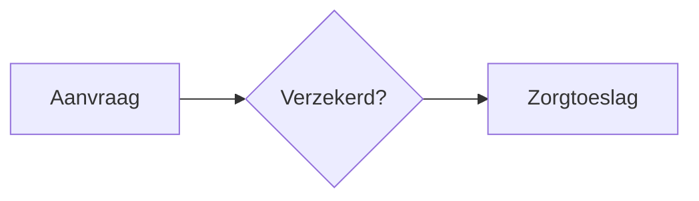

# Presenter

Een lichte presentatie-editor bovenop een map met markdown-bestanden. De typografie is die van `/presentatie` in de demo (RijksoverheidSerif voor titels, RijksSans voor de rest, dezelfde ladder en kleuren). Wat je in de presentatie bewerkt, komt terug in de bestanden.

```bash
npm install                               # in de root van de repo
npm run dev -w regelrecht-frontend-presenter
# → http://localhost:5180
```

De app draait alleen als dev-server: de Vite-server leest en schrijft de bestanden (`server/presenterApi.js`). Een statische build is er niet, want die heeft geen schijf om naar terug te schrijven.

## Een deck is een map

```
decks/<naam>/
  deck.yaml       optioneel: title, presenter, affiliation, date
  01-titel.md     één bestand per dia, op volgorde van bestandsnaam
  02-waarom.md
```

Eigen decks horen niet in deze public repo. Zet ze in een eigen map en start met `PRESENTER_DECKS=/pad/naar/decks npm run dev -w regelrecht-frontend-presenter`. `decks/` negeert alles behalve `voorbeeld/`.

## Een dia

```md
---
kind: content        # title | statement | section | closing | content (standaard)
overline: Hoe het werkt
note: Spreektekst of voetnoot onderaan
---

# Titel

Gewone **markdown**: alinea's, lijsten, tabellen, citaten.
```

- `title`: de eerste alinea onder de titel is de ondertitel. Het naam-veld schrijft naar `presenter` in `deck.yaml`.
- `statement`: elke alinea wordt een grote regel.
- `section` / `closing`: een grote titel met losse regels.

### Wet-fragment

````md
```wet
law: wet_op_de_zorgtoeslag      # $id, de mapnaam in de corpus
article: '2'
date: 2025-01-01                # optioneel; nieuwste versie op of vóór deze datum
```
````

Zonder meer toont het blok de artikeltekst. Welk deel van het artikel in beeld komt, kies je met ankers. Dat zijn namen die al in de YAML staan en geen paden als `actions[2]`, zodat een anker blijft kloppen als er iets bij komt:

| Anker | Toont |
| --- | --- |
| `uitvoer: hoogte_zorgtoeslag` | alleen de regels voor deze uitvoer (één naam of een lijst) |
| `invoer: [toetsingsinkomen, bsn]` | alleen deze invoervelden en parameters |
| `definities: [percentage_toetsingsinkomen]` | alleen deze vaste waarden |
| `leden: [1, 2]` | alleen deze leden van de wettekst |
| `markeer: [standaardpremie]` | licht deze namen op, in tabellen en in de regels waar ze in staan |
| `show: [tekst, definities, invoer, uitvoer, regels]` | precies deze onderdelen, ook naast ankers |

Zonder `show` neemt een anker zijn eigen onderdeel mee: `uitvoer` de regels, `invoer` de invoertabel, `leden` de tekst. Een naam die het artikel niet heeft, staat als melding op de dia, zodat een typefout opvalt.

Een wet die niet in de corpus staat, zoals een variant of een wetsvoorstel, zet je als YAML in de deck-map en haal je op met `bestand:` in plaats van `law:`:

````md
```wet
bestand: zorgtoeslag-variant.yaml
article: '2'
uitvoer: hoogte_zorgtoeslag
```
````

Gezocht wordt in `corpus/regulation` en `corpus-poc`. Extra mappen geef je mee met `PRESENTER_CORPUS=/pad:/ander/pad`. De labels van de operaties en de opmaak van waarden komen uit de editor (`frontend/src/utils/`), zodat een regel hier hetzelfde leest als daar.

### Stroomschema

````md

````

Mermaid wordt pas geladen op een dia die een diagram heeft.

## Toetsen

| Toets | Doet |
| --- | --- |
| ← → Spatie | bladeren |
| E | bewerkmodus aan/uit |
| N | nieuwe dia na deze (in de bewerkmodus) |
| F | volledig scherm |
| Esc | stop bewerken, of terug naar het overzicht |

In de bewerkmodus klik je op een blok om de markdown ervan te bewerken. Blur of ⌘/Ctrl+Enter slaat op, Esc annuleert. Een leeg blok verdwijnt. Er wordt alleen dat stuk van het bestand vervangen, dus de git-diff bevat precies wat je veranderde. Is het bestand intussen op schijf gewijzigd, dan weigert de server de wijziging en herlaadt de dia. Een wijziging in je editor verschijnt direct in de browser.

## Eigen CSS

Het design system heeft geen presentatiecomponent, dus de dia's zijn eigen CSS (`src/deck.css`), net als in `frontend-demo`. De kleuren zijn design-system-tokens. Knoppen, toetsen en de decklijst zijn `nldd-*`-componenten.
