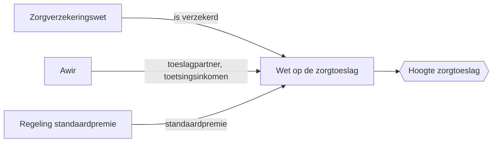

# Waar komt de invoer vandaan?

```mermaid
flowchart LR
  ZVW[Zorgverzekeringswet] -->|is verzekerd| ZT[Wet op de zorgtoeslag]
  AWIR[Awir] -->|toeslagpartner, toetsingsinkomen| ZT
  RSP[Regeling standaardpremie] -->|standaardpremie| ZT
  ZT --> H{{Hoogte zorgtoeslag}}
```
