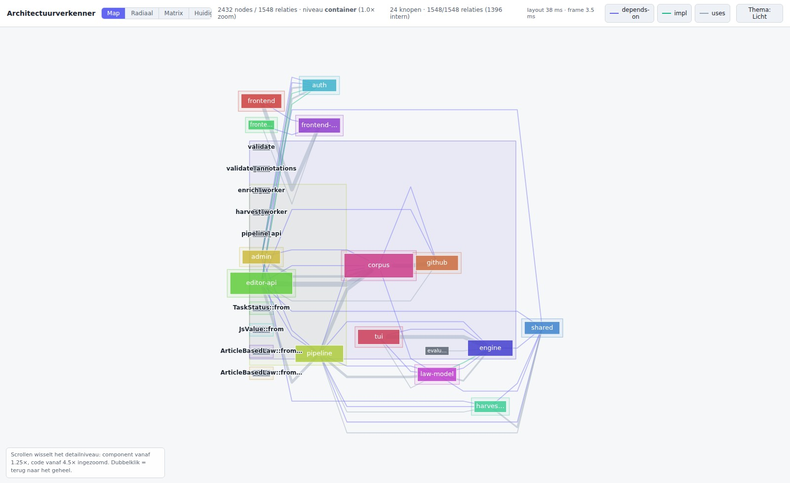
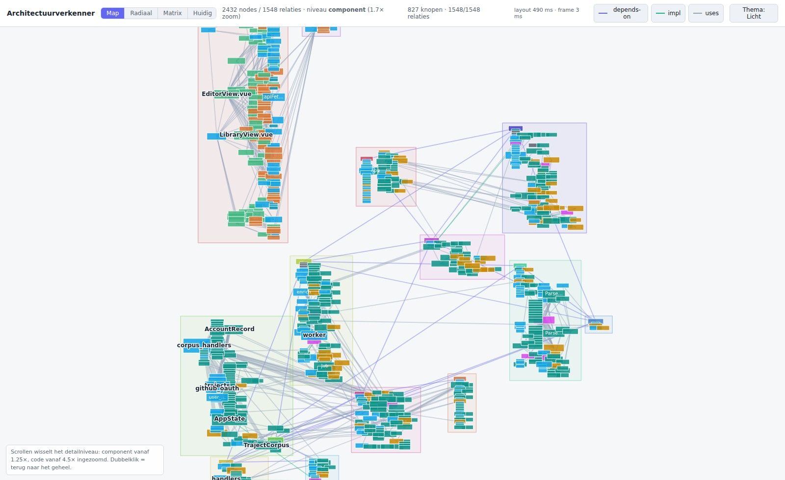
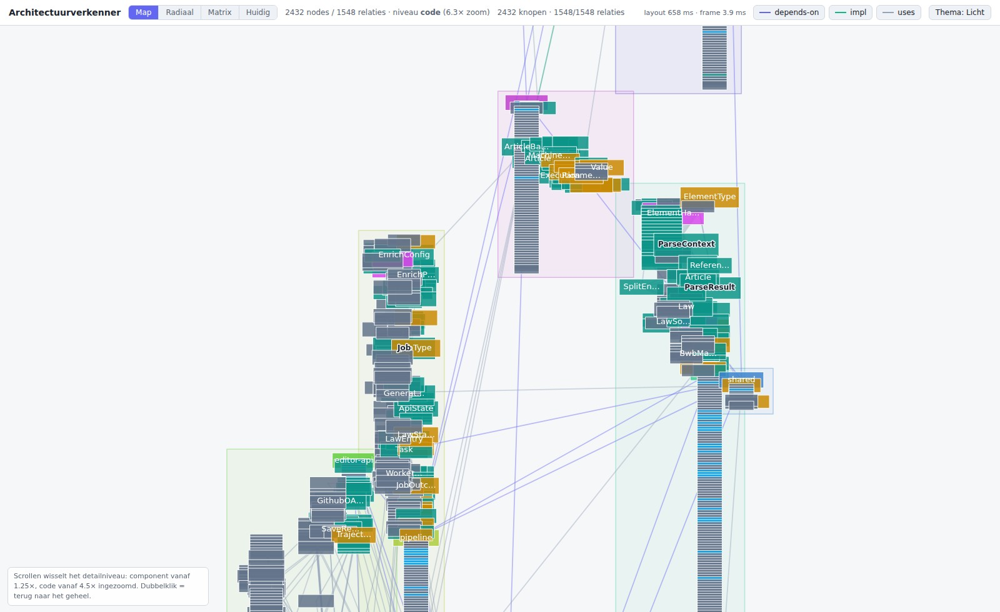
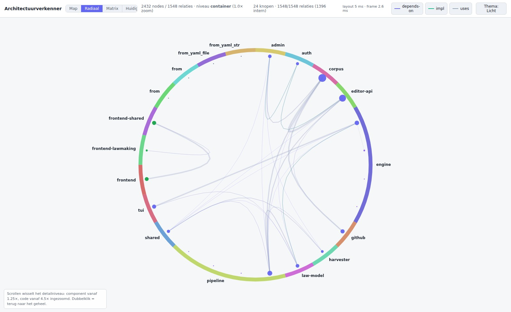
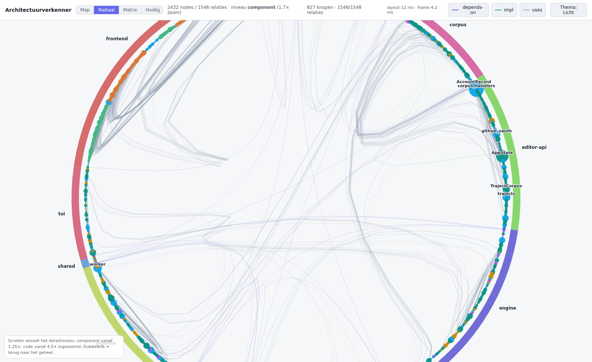
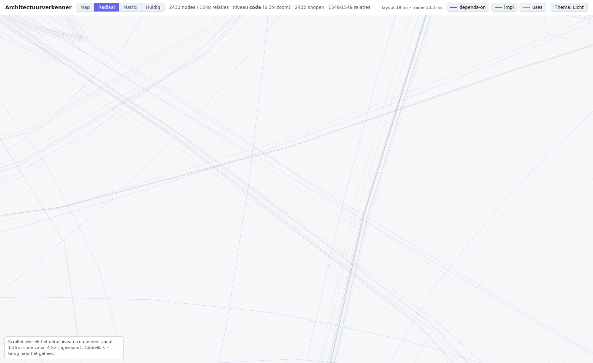
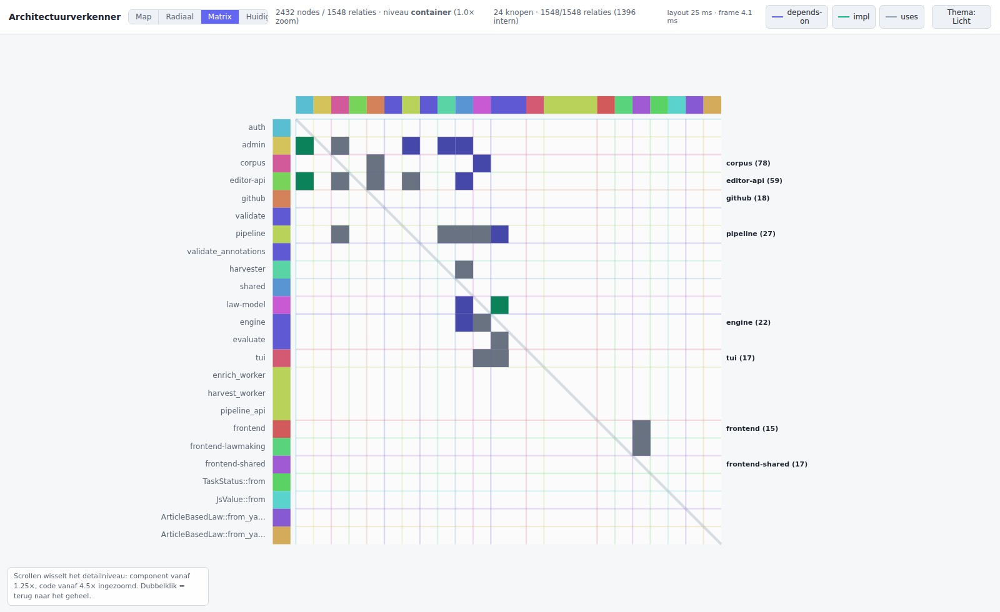
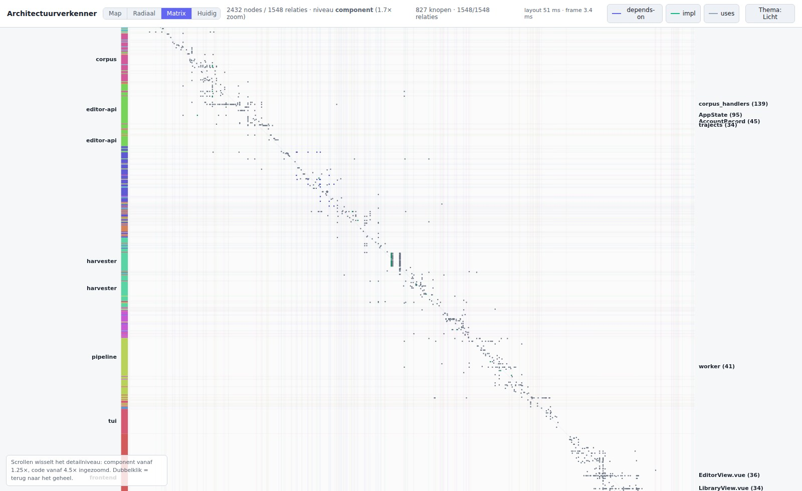
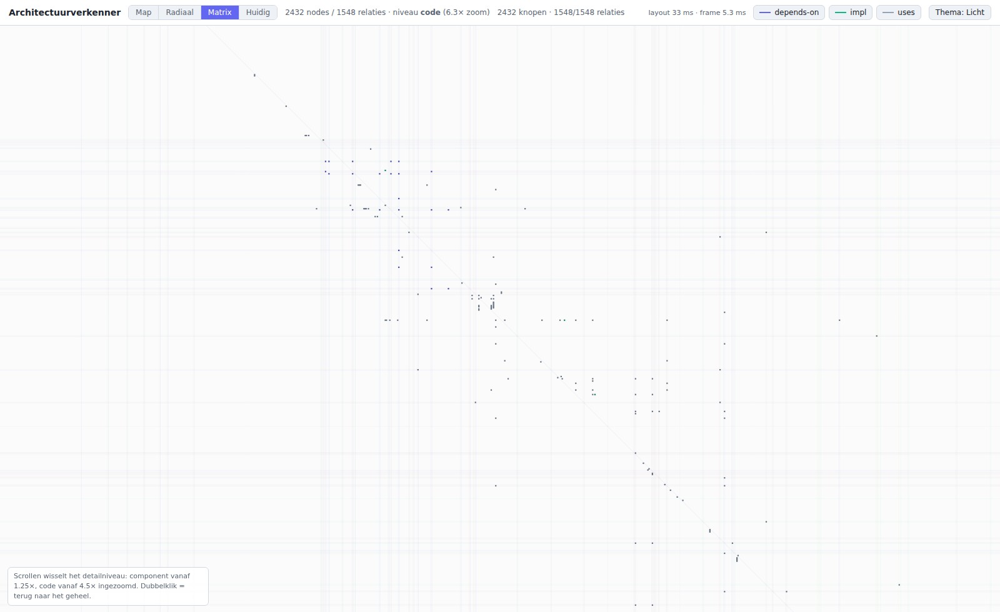
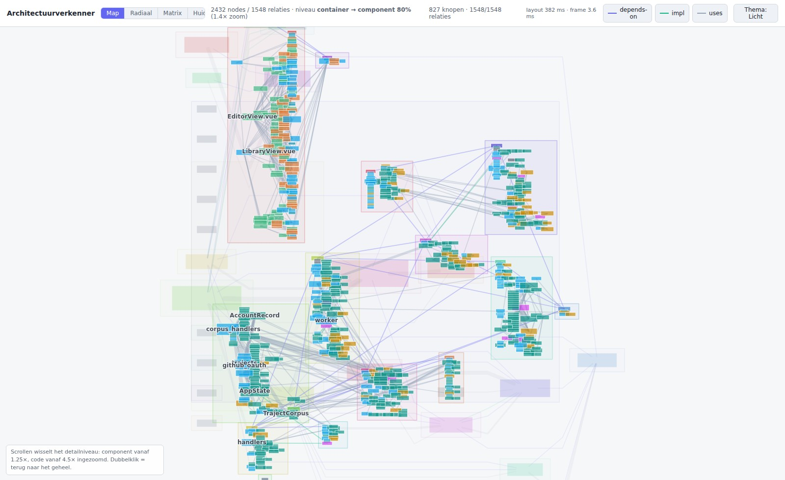

# Evaluatie: drie schematechnieken voor de architectuurverkenner

De verkenner gaf wél detail en géén overzicht. Dat kwam niet door een ontbrekende
knop maar door de **schematechniek**: klikken om uit te klappen, met een
handgeschreven grid dat niets van de verbindingen weet. Dit document is de
uitkomst van drie kandidaten die naast elkaar op het echte model gebouwd zijn,
zodat de keuze op wat je ziet gebaseerd is en niet op wat we ervan hoopten.

De drie prototypes staan in de verkenner zelf, achter de schakelaar in de
toolbar (**Map · Radiaal · Matrix · Huidig**). Dit is een **tijdelijke
vergelijkingsopstelling**: het vervolgticket werkt de winnaar uit en haalt de
rest — inclusief de huidige weergave — weg.

## Wat ze delen

Alles behalve de plaatsing. Alle drie draaien op het **volledige model** uit
`GET /api/model` (2432 nodes, 1548 relaties), gebruiken dezelfde rollup
(`src/lib/archRollup.js`, de edge-lifting die al in de huidige weergave zat),
dezelfde wereldbox en dezelfde zoom→niveau-afbeelding
(`src/composables/useSemanticZoom.js`). Elk verschil dat je hieronder ziet is
dus de techniek, niet een ander model.

Scrollen is de enige manier om van niveau te wisselen; er wordt niets meer
opengeklikt. De drempels staan als benoemde constanten bij elkaar
(`LEVEL_ZOOM_THRESHOLDS`): **component vanaf 1,25×** en **code vanaf 4,5×**
ingezoomd, met een overvloeiband van ±25% eromheen. Bij zoom = 1 vult het model
~78% van het venster, zodat je het component-niveau nog in z'n geheel kunt zien
voordat het beeld kantelt.

### Hoeveel er per niveau te zien is

| niveau | knopen | relaties zichtbaar | waarvan interne teller |
|---|---|---|---|
| `container` | 24 | 1548/1548 | **1396** |
| `component` | 827 | 1548/1548 | 0 |
| `code` | 2432 | 1548/1548 | 0 |

De aantallen hierboven en in de rest van dit document zijn een momentopname: het
model wordt op aanvraag uit de working tree gegenereerd, dus het schuift mee met
de code. Wat niet schuift is de verhouding, en die is de bevinding.

De eerste rij is meteen de belangrijkste bevinding van het hele ticket: **90%
van alle relaties (1396 van 1548) zit binnen één crate/app.** Op containerniveau
blijven er dus maar 152 relaties over om als echte lijn te tekenen — samengevat
in 46 lijnen, want gelijksoortige relaties tussen twee containers rollen op tot
één. Elke techniek die alleen containerniveau laat zien, laat 90% van het
verkeer als getal achter.

De 24 knopen op containerniveau zijn de 20 containers plus vier `fn`-nodes
(`TaskStatus::from`, `JsValue::from`, twee `ArticleBasedLaw::from_yaml_*`) waarvan
de extractor een `parent` opgeeft die niet in het model bestaat. De rollup laat
ze liever als losse knoop staan dan hun relaties te laten verdwijnen; ze zijn in
alle drie de weergaven te herkennen aan hun dubbele naam. Dat is een
extractie-gaatje, buiten scope hier, maar de spike maakt het wel zichtbaar.

## Meting

Gemeten in headless Chrome, 1600×980, in de dev-container (geen GPU). "layout"
is de rekentijd van de pure layoutfunctie voor dat niveau, éénmalig en gecached;
"frame" is de mediane tekentijd per frame tijdens scrollen. De verkenner toont
beide getallen live in de toolbar.

| | container | component | code |
|---|---|---|---|
| **Map** — layout | 38 ms | **375 ms** | **563 ms** |
| **Map** — frame | 0,8 ms | 2,4 ms | 2,4 ms |
| **Radiaal** — layout | 4 ms | 25 ms | 26 ms |
| **Radiaal** — frame | 0,6 ms | 2,3 ms | 4,6 ms |
| **Matrix** — layout | 4 ms | 10 ms | 23 ms |
| **Matrix** — frame | 0,8 ms | 1,7 ms | 2,3 ms |

Alle drie blijven ruim binnen een 60 Hz-frame (16,7 ms) tijdens scrollen; het
tekenen is nergens het probleem. Dat is de opbrengst van canvas in plaats van
DOM: 2432 Vue Flow-nodes halen dit niet, 2432 `fillRect`-aanroepen wel.

De layoutkosten lopen wél sterk uiteen. Map betaalt twee dagre-runs (zie hieronder)
en is daarmee 15–25× duurder dan de andere twee. Dat merk je niet tijdens het
scrollen, omdat elk niveau vlak na de eerste render alvast in de achtergrond
wordt uitgerekend (`usePrototypeView.warm()`) en daarna gecached is — maar het
betekent wel dat Map de enige is die een merkbare stilte zou geven als je die
warming weghaalt.

---

## Prototype 1 — Map

Blokjes en lijnen, geplaatst door een echte layout-engine (**dagre**) in plaats
van door het grid. Onder containerniveau in twee trappen: elke container krijgt
zijn eigen dagre-run (een *wijk*), en de wijken worden daarna tegen elkaar
uitgelegd op hun geaggregeerde afhankelijkheden. Dat was geen luxe: één platte
run over 827 componenten geeft een correcte maar onbruikbare sliert, omdat de
afhankelijkheidsgraaf ondiep is en bijna alles in een handvol rangen belandt —
het resultaat was honderden keren hoger dan breed.

Blokgrootte = aantal opgerolde relaties. Horizontale positie = rang in de
afhankelijkheidsvolgorde. De getinte vlakken zijn de containers, ná de layout
eromheen getekend.

*Map op containerniveau: 24 knopen, 46 lijnen voor 152 relaties. `corpus` (78) en `editor-api` (59) zijn de dikste blokken; de zes binaries en de vier losse `fn`-knopen hebben geen enkele relatie en zijn daarom niet meer dan een chip met een naam.*

*Map op componentniveau (1,7×): wijken met interne structuur. `corpus_handlers`, `AppState`, `AccountRecord`, `worker`, `EditorView.vue`, `LibraryView.vue` en `TrajectCorpus` krijgen automatisch een label omdat ze bij de tien grootste horen.*

**Wie is een hub.** Ja, zonder tellen of klikken. `corpus_handlers` (139) en
`AppState` (95) zijn zichtbaar de grootste blokken in hun wijk en dragen als
enige een label; de rest van hun wijk is naamloze massa. Het werkt omdat twee
kanalen samenvallen: grootte én het feit dat alleen de top-10 een naam krijgt.
De grootte moet daarvoor wel de inzoom overleven — een blok krijgt zijn maat uit
het aantal relaties, en alle blokken worden met één gedeelde factor opgeschaald
in plaats van elk apart op een minimum gezet, want dat laatste geeft op het
codeniveau iedereen exact dezelfde maat.

**Waar gaan de verbindingen heen.** Binnen een wijk: goed — dagre routeert de
lijnen en je kunt er één met je oog volgen. Tússen wijken: matig. Kruiswijk-
relaties zijn rechte koorden over het hele canvas, en met ~150 daarvan op
componentniveau is het een spinnenweb waarin je een individuele lijn kwijtraakt.
Hoveren over een blok lost dat op — alles behalve de aangrenzende relaties dooft
— maar dat is een interactie, geen eigenschap van het beeld.

**Richting en lagen.** Het beste van de drie. `rankdir: LR` legt afhankelijkheden
van links naar rechts, dus je leest de lagen letterlijk als kolommen af:
`editor-api`, `admin` en de frontends helemaal links, `pipeline`/`auth` daarna,
`corpus`/`tui` in het midden, dan `github`/`law-model`, en `engine`, `harvester`
en `shared` rechts. Een lijn die naar links terugloopt is een laagdoorbreking, en
op containerniveau zijn dat er precies twee — allebei van `engine` naar
`law-model`, terwijl `law-model` een `impl` terug heeft naar `engine`. Dat is een
echte cyclus, en hij is zonder tellen aanwijsbaar. Op componentniveau geldt dit
binnen een wijk nog steeds; tussen wijken niet meer, want de koorden negeren de
wijkvolgorde.

**Clusters en grenzen.** Half. De wijken *zijn* de mappenstructuur — je ziet dus
per definitie wat de mappen zeggen, niet wat de code zegt. Wat je wél ziet is
waar een wijk uit elkaar getrokken wordt en welke wijken tegen elkaar aan
gedrukt worden. `corpus` en `github` staan op containerniveau naast elkaar en
`editor-api` hangt er met de dikste lijn van de tekening (45 relaties) aan vast;
dat leest als één subsysteem.

*Map op codeniveau (6,3×): de sliert komt terug binnen de grote wijken. `engine` (450 code-knopen) en `editor-api` (382) verdelen zich over weinig rangen; je kijkt naar een kolom.*

**Op codeniveau valt Map om.** De tweetraps-truc helpt niet meer als één wijk
zelf 450 knopen heeft: binnen `engine` is de aspectverhouding weer 1:5 en zie je
een kolom in plaats van een kaart.

---

## Prototype 2 — Radiaal

Alle knopen op één ring, geordend langs de bevattingsboom, zodat elke container
een aaneengesloten boog krijgt. De relaties zijn **hierarchical edge bundling**
(Holten): een relatie volgt de boom — omhoog naar de laagste gemeenschappelijke
voorouder en weer omlaag — en het resulterende controlepolygoon wordt met β =
0,85 rechtgetrokken. Relaties met dezelfde route bundelen tot een touw.

*Radiaal op containerniveau: de gekleurde band buiten de ring is de container, de stip erbinnen het knooppunt zelf.*

*Radiaal op componentniveau (1,7×): 827 stippen op de ring. De dikke touwen tussen `corpus`, `editor-api` en `engine` zijn er meteen uit; `AppState`, `AccountRecord` en `corpus_handlers` zijn de dikste stippen.*

**Wie is een hub.** Ja, maar minder direct dan bij Map. `corpus_handlers`,
`AccountRecord` en `AppState` zijn duidelijk dikkere stippen dan hun buren, en
ze liggen alle drie in dezelfde hoek van de ring. Waar het beeld beter in is dan
Map: je ziet *waar op de ring* de dikte zit — de hele rechterhelft (`corpus`, `editor-api`, `engine`) is dik en
de linkerhelft (de frontends, `tui`, `shared`) is dun. Dat is een uitspraak over
het systeem die Map niet doet.

**Waar gaan de verbindingen heen.** Nee, en dat is de kernkost van bundeling.
Een touw vertelt je dat er veel verkeer tussen twee bogen loopt, maar welke
stip in dat touw zit, kun je niet zien: precies waar het interessant wordt —
bij de hub — liggen twintig curves op elkaar. Hoveren lost het op (de rest dooft
tot 5%), maar zonder hoveren kun je geen enkele individuele relatie volgen.
Bij Map kan dat binnen een wijk wél.

**Richting en lagen.** Nee. Een ring heeft geen boven en onder, en de bundels
hebben geen pijlpunten (die zouden bij 1180 curves alleen maar ruis zijn). Je
ziet dát twee delen verkeer hebben, niet wie wie gebruikt. Cykels en
laagdoorbrekingen zijn onzichtbaar. Dit is de duidelijkste zwakte van Radiaal
tegenover Map.

**Clusters en grenzen.** Het sterkste antwoord van de drie op de *grenzen*-helft
van de vraag. Omdat de ring op de hiërarchie geordend is en de bundels de
hiërarchie volgen, is elk touw dat diep naar het midden duikt een
containergrens die overgestoken wordt, en elk touw dat langs de rand kruipt
blijft binnen. Die leesregel staat of valt met de routering: een relatie van een
knoop naar zijn eigen container ontmoet de boom bij die container en hoort dus
langs de rand te blijven — op componentniveau gaat dat om 155 van de 1180
lijnen, ruim genoeg om het beeld te kantelen als ze naar het midden zouden
duiken. Je leest in één oogopslag af dat `frontend`↔`frontend-shared` een
strak lokaal bundeltje is en dat `editor-api`↔`corpus` een dik touw door het
midden is. Wat je *niet* ziet, is een cluster dat de mappenstructuur níet volgt:
de ringvolgorde is de mappenstructuur, dus die kan zichzelf niet tegenspreken.

*Radiaal op codeniveau (6,3×, uitgepand naar de rand): 2432 stippen. De ring is dan 6× het venster, dus je kunt hem alleen nog stukje bij beetje aflopen.*

**Radiaal verliest zijn eigen kracht zodra je inzoomt.** De hele waarde zit in
het geheel op één scherm; zodra het detailniveau kantelt zit je binnen de ring
en zie je alleen strengen. Dat is niet te repareren met een drempel — het is
inherent aan het combineren van "detail volgt zoom" met een techniek waarvan het
beeld de hele wereld is.

---

## Prototype 3 — Matrix (DSM)

Rijen en kolommen zijn de knopen van het niveau; een cel (r, k) betekent "r
gebruikt k". De ordening begint bij de bevattingsvolgorde en wordt daarna
globaal verfijnd met herhaalde barycentrum-sortering: knopen die veel met elkaar
praten schuiven naar elkaar toe. De verfijning is **niet** binnen containers
opgesloten — een blok dat over twee containers heen ligt is juist de bevinding.

Alleen de ~1500 gevulde cellen worden getekend, nooit het n²-raster; daarom kost
het codeniveau (2432² ≈ 5,9 miljoen cellen) net zoveel als de rest.

*Matrix op containerniveau: 24×24. De strip langs de assen is de container-kleur; de tellingen rechts zijn de hubs.*

*Matrix op componentniveau (1,7×): 827×827 met 1180 gevulde cellen. De klontering op de diagonaal is echt; de gefragmenteerde kleurstrip links is dat ook.*

**Wie is een hub.** Ja, en het eerlijkst van de drie: een hub is een volle rij én
een volle kolom, en de labels rechts noemen de acht grootste met hun aantal —
`corpus_handlers (139)`, `AppState (95)`, `AccountRecord (45)`. Waar Map en
Radiaal je een dikte laten *schatten*, geeft de Matrix je het getal. Maar het is
ook het minst *visuele* antwoord: zonder die labels zou je op componentniveau
een volle rij van 139 cellen tussen 827 rijen niet zomaar aanwijzen, omdat één
cel maar twee pixels is.

**Waar gaan de verbindingen heen.** Ja, maar alleen via de as, niet met je oog
over de tekening. Je leest een rij af en kijkt welke kolommen gevuld zijn; om te
weten *wat* die kolom is moet je de as terug omhoog volgen. Bij 827 rijen is dat
een vinger-op-het-scherm-oefening. De kruisdraad bij hoveren is hier geen
comfort maar noodzaak.

**Richting en lagen.** Nee. Dit was de verwachting vooraf — in een
*topologisch* geordende DSM is alles onder de diagonaal een terugrelatie en
springen cykels eruit — maar dat gaat hier niet op, en dat is een echte
bevinding: clusteren en topologisch ordenen zijn twee verschillende doelen voor
dezelfde as. Op componentniveau ligt **565 van de 1180** relaties onder de
diagonaal; dat zijn geen 565 cykels, dat is ruis van een ordening die op
klontering optimaliseert. Wie richting uit deze matrix wil lezen, moet een
tweede, topologische ordening toevoegen — en verliest dan de blokken.

**Clusters en grenzen.** Het beste antwoord op de *clusters*-helft, en het enige
dat de mappenstructuur echt kan tegenspreken. Op componentniveau vallen de 18
containers uiteen in **182 aaneengesloten stukken** langs de as: de
connectiviteitsclusters volgen de mappen dus maar zeer ten dele. De gekleurde
strip laat dat direct zien — waar hij een lang egaal blok is, zijn map en code
het eens; waar hij fijngestreept is, niet. Geen van beide andere technieken kan
dit laten zien, want bij beide *is* de plaatsing de mappenstructuur.

*Matrix op codeniveau (6,3×): 2432×2432 met 1548 gevulde cellen — 0,03% dichtheid. Je kijkt naar een sterrenhemel.*

**Op codeniveau wordt de matrix te leeg.** 1548 cellen in 5,9 miljoen posities
is te ijl om nog blokken in te zien; de dichtheid, niet de rekentijd, is de
begrenzing.

---

## De overgang tussen niveaus

*Map halverwege de overgang (1,4× zoom, 80% component): het grovere niveau vervaagt terwijl het fijnere ingroeit. De toolbar noemt de stand.*

De overgang is voor alle drie hetzelfde geregeld en werkt: in een band van ±25%
rond de drempel worden beide niveaus getekend, het grovere op alpha 1−t en het
fijnere op t, en het fijnere groeit tegelijk van 75% naar 100% van zijn maat.
Er is geen frame waarin het beeld verspringt.

Het punt onder de cursor blijft staan, ook dwars door een niveauwissel heen.
Dat komt niet van een correctie achteraf maar van de opzet: elke layout wordt in
dezelfde wereldbox genormaliseerd (`src/lib/normalize.js`), zodat een
niveauwissel de transformatie helemaal niet aanraakt. Het is als invariant
vastgelegd in `src/composables/usePanZoom.test.js`.

---

## Aanbeveling

**Map.** Werk die uit.

De reden is de derde vraag. Van de vier vragen is "richting en lagen" de enige
die Radiaal en Matrix *helemaal* niet beantwoorden, en het is de vraag waar de
verkenner voor bedoeld is: klopt de laagindeling, en waar wordt hij doorbroken.
Map beantwoordt hem gratis, omdat de horizontale as bij dagre de
afhankelijkheidsvolgorde ís. Op de andere drie vragen scoort Map niet het
hoogst, maar wel overal voldoende: hubs springen eruit door blokgrootte,
verbindingen zijn binnen een wijk te volgen, en de wijken laten zien welke
subsystemen tegen elkaar aan liggen.

Daar komt bij dat Map de enige is die *dezelfde manier van kijken* houdt als je
inzoomt. Radiaal en Matrix zijn overzichtstechnieken: hun waarde zit erin dat
het hele beeld op één scherm past, en die waarde verdampt precies op het moment
dat semantische zoom hem opeist. Map is een kaart, en op een kaart inzoomen is
normaal.

**Wat Map slechter doet dan de andere twee — expliciet:**

1. **Kruiswijk-relaties.** Radiaal is hier duidelijk beter. Waar Radiaal ~150
   containeroverstijgende relaties tot een handvol leesbare touwen bundelt,
   tekent Map ze als rechte koorden over het canvas en wordt het een spinnenweb.
   Dit is de belangrijkste openstaande zwakte van de aanbeveling; het
   vervolgticket zou moeten kijken of de koorden gerouteerd of gebundeld kunnen
   worden (bijvoorbeeld via de wijkgrenzen), zonder de rangvolgorde op te geven.
2. **Clusters die de mappenstructuur tegenspreken.** Matrix is hier duidelijk
   beter en Map kan het principieel niet: Map plaatst per container, dus de
   mappenstructuur is een aanname van de tekening in plaats van iets dat getoetst
   wordt. De 182-stukken-bevinding uit de Matrix zou Map nooit hebben opgeleverd.
3. **Rekentijd.** 375 ms en 563 ms tegenover 10–26 ms. Nu opgevangen door de
   layouts vooraf uit te rekenen, maar Map is de enige die dat écht nodig heeft,
   en de enige die bij een groeiend model als eerste tegen een grens loopt.
4. **Het codeniveau.** Alle drie zijn daar zwak, maar Map het minst overtuigend:
   binnen een grote wijk komt de sliert terug. Overweeg voor het vervolg of het
   codeniveau überhaupt in het volle beeld hoort, of alleen binnen de wijk
   waarop je inzoomt.

Als het zwaartepunt van de verkenner alsnog zou verschuiven van "klopt de
laagindeling" naar "waar liggen de echte subsystemen", is Matrix de betere
keuze — die vraag beantwoordt hij als enige.
